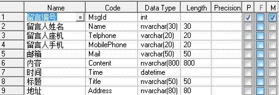
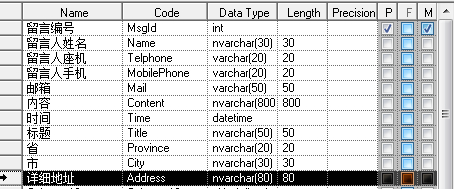
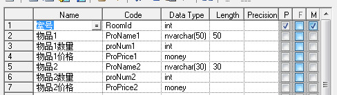
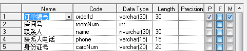
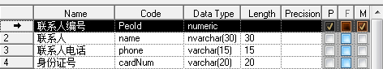

[数据库设计三大范式](https://www.cnblogs.com/knowledgesea/p/3667395.html)
=========================================================================

什么是范式：简言之就是，数据库设计对数据的存储性能，还有开发人员对数据的操作都有莫大的关系。所以建立科学的，规范的的数据库是需要满足一些

规范的来优化数据数据存储方式。在关系型数据库中这些规范就可以称为范式。

什么是三大范式：

第一范式：当关系模式R的所有属性都不能在分解为更基本的数据单位时，称R是满足第一范式的，简记为1NF。满足第一范式是关系模式规范化的最低要

求，否则，将有很多基本操作在这样的关系模式中实现不了。

第二范式：如果关系模式R满足第一范式，并且R得所有非主属性都完全依赖于R的每一个候选关键属性，称R满足第二范式，简记为2NF。

第三范式：设R是一个满足第一范式条件的关系模式，X是R的任意属性集，如果X非传递依赖于R的任意一个候选关键字，称R满足第三范式，简记为3NF.

**注：**关系实质上是一张二维表，其中每一行是一个元组，每一列是一个属性

**第一范式**

   1、每一列属性都是不可再分的属性值，确保每一列的原子性

   2、两列的属性相近或相似或一样，尽量合并属性一样的列，确保不产生冗余数据。 

如果需求知道那个省那个市并按其分类，那么显然第一个表格是不容易满足需求的，也不符合第一范式。

 

显然第一个表结构不但不能满足足够多物品的要求，还会在物品少时产生冗余。也是不符合第一范式的。 

**第二范式**

每一行的数据只能与其中一列相关，即一行数据只做一件事。只要数据列中出现数据重复，就要把表拆分开来。

一个人同时订几个房间，就会出来一个订单号多条数据，这样子联系人都是重复的，就会造成数据冗余。我们应该把他拆开来。

这样便实现啦一条数据做一件事，不掺杂复杂的关系逻辑。同时对表数据的更新维护也更易操作。

**第三范式**

 数据不能存在传递关系，即没个属性都跟主键有直接关系而不是间接关系。像：a--\>b--\>c
 属性之间含有这样的关系，是不符合第三范式的。

比如Student表（学号，姓名，年龄，性别，所在院校，院校地址，院校电话）

这样一个表结构，就存在上述关系。 学号--\> 所在院校 --\> (院校地址，院校电话)

这样的表结构，我们应该拆开来，如下。

（学号，姓名，年龄，性别，所在院校）--（所在院校，院校地址，院校电话）

**最后：**

三大范式只是一般设计数据库的基本理念，可以建立冗余较小、结构合理的数据库。如果有特殊情况，当然要特殊对待，数据库设计最重要的是看需求跟性能，需求\>性能\>表结构。所以不能一味的去追求范式建立数据库。
