Http协议和Tomcat服务器

一、Http协议
============

### 1．什么是Http协议

HTTP，超文本传输协议（HyperText Transfer Protocol)是互联网上应用最为广泛的
一种网络协议。所有的WWW文件都必须遵守这个标准。设计HTTP最初的目的是为
了提供一种发布和接收HTML页面的方法

### 2．Http协议的组成

Http协议由Http请求和Http响应组成，当在浏览器中输入网址访问某个网站时，
你的浏览器会将你的请求封装成一个Http请求发送给服务器站点，服务器接收到请
求后会组织响应数据封装成一个Http响应返回给浏览器。即没有请求就没有响应。

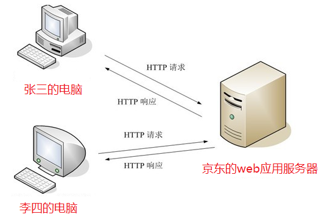

### 3．Http请求

编辑一个form.html的表单页面，如下：

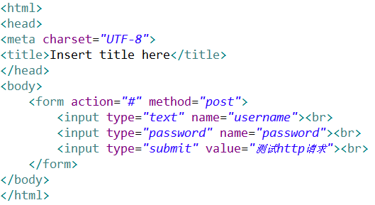

点击提交按钮，抓包如下：

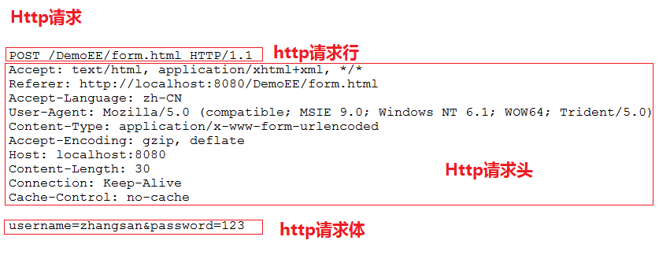

1.  请求行

请求方式：POST、GET

请求的资源：/DemoEE/form.html

协议版本：HTTP/1.1

HTTP/1.0，发送请求，创建一次连接，获得一个web资源，连接断开。

HTTP/1.1，发送请求，创建一次连接，获得多个web资源，保持连接。

1.  请求头

请求头是客户端发送给服务器端的一些信息，使用键值对表示key：value

| 常见请求头            | 描述 （红色掌握，其他了解）                                                                                                                                                  |
|-----------------------|------------------------------------------------------------------------------------------------------------------------------------------------------------------------------|
| **Referer**           | 浏览器通知服务器，当前请求来自何处。如果是直接访问，则不会有这个头。常用于：防盗链                                                                                           |
| **If-Modified-Since** | 浏览器通知服务器，本地缓存的最后变更时间。与另一个响应头组合控制浏览器页面的缓存。                                                                                           |
| **Cookie**            | 与会话有关技术，用于存放浏览器缓存的cookie信息。                                                                                                                             |
| **User-Agent**        | 浏览器通知服务器，客户端浏览器与操作系统相关信息                                                                                                                             |
| Connection            | 保持连接状态。Keep-Alive 连接中，close 已关闭                                                                                                                                |
| Host                  | 请求的服务器主机名                                                                                                                                                           |
| Content-Length        | 请求体的长度                                                                                                                                                                 |
| Content-Type          | 如果是POST请求，会有这个头，默认值为application/x-www-form-urlencoded，表示请求体内容使用url编码                                                                             |
| Accept：              | 浏览器可支持的MIME类型。文件类型的一种描述方式。 MIME格式：大类型/小类型[;参数] 例如： text/html ，html文件 text/css，css文件 text/javascript，js文件 image/\*，所有图片文件 |
| Accept-Encoding       | 浏览器通知服务器，浏览器支持的数据压缩格式。如：GZIP压缩                                                                                                                     |
| Accept-Language       | 浏览器通知服务器，浏览器支持的语言。各国语言（国际化i18n）                                                                                                                   |

1.  请求体

当请求方式是post的时，请求体会有请求的参数，格式如下：

username=zhangsan&password=123

如果请求方式为get，那么请求参数不会出现在请求体中，会拼接在url地址后面

`http://localhost:8080/path?username=zhangsan&password=123`

### 4．Http响应

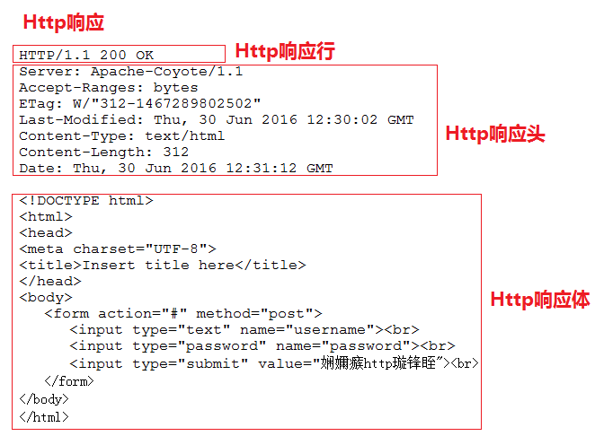

1.  响应行

Http协议

状态码：

常用的状态码如下：

200 ：请求成功。

302 ：请求重定向。

304 ：请求资源没有改变，访问本地缓存。

404 ：请求资源不存在。通常是用户路径编写错误，也可能是服务器资源已删除。

500 ：服务器内部错误。通常程序抛异常。

状态信息：状态信息是根据状态码变化而变化的

1.  响应头

响应也都是键值对形式，服务器端将信息以键值对的形式返回给客户端

| 常见请求头              | 描述                                                                                                                           |
|-------------------------|--------------------------------------------------------------------------------------------------------------------------------|
| **Location**            | 指定响应的路径，需要与状态码302配合使用，完成跳转。                                                                            |
| **Content-Type**        | 响应正文的类型（MIME类型） 取值：text/html;charset=UTF-8                                                                       |
| **Content-Disposition** | 通过浏览器以下载方式解析正文 取值：attachment;filename=xx.zip                                                                  |
| **Set-Cookie**          | 与会话相关技术。服务器向浏览器写入cookie                                                                                       |
| Content-Encoding        | 服务器使用的压缩格式 取值：gzip                                                                                                |
| Content-length          | 响应正文的长度                                                                                                                 |
| Refresh                 | 定时刷新，格式：秒数;url=路径。url可省略，默认值为当前页。 取值：3;url=[www.pp.cn](http://www.pp.cn) //三秒刷新页面到www.pp.cn |
| Server                  | 指的是服务器名称，默认值：Apache-Coyote/1.1。可以通过conf/server.xml配置进行修改。\<Connector port="8080" ... server="pp"/\>   |
| Last-Modified           | 服务器通知浏览器，文件的最后修改时间。与If-Modified-Since一起使用。                                                            |

1.  响应体

响应体是服务器回写给客户端的页面正文，浏览器将正文加载到内存，然后解析渲染
显示页面内容

二、Tomcat服务器 
=================

### 1．Web开发中的常见概念

#### B/S系统和C/S系统

Brower/Server：浏览器 服务器 系统 ----- 网站

Client/Server：客户端 服务器 系统 ----- QQ、飞秋、大型游戏

#### web应用服务器

供向外部发布web资源的服务器软件

#### web资源

存在于web应用服务器可供外界访问的资源就是web资源

例如：存在于web应用服务器内部的Html、Css、js、图片、视频等

1）静态资源：指web页面中供人们浏览的数据始终是不变。比如：HTML、CSS、
JS、图片、多媒体。

2）动态资源：指web页面中供人们浏览的数据是由程序产生的，不同时间点访问
web页面看到的内容各不相同。比如：JSP/Servlet、ASP、PHP

javaWEB领域：动态资源认为通过java代码去动态生成html

#### 请求和响应

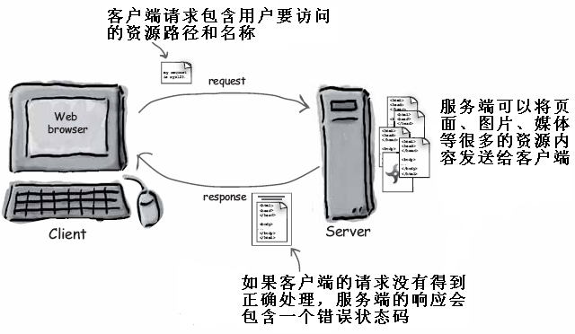

#### 请求的URL地址

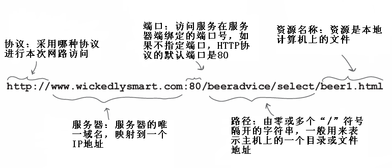

### 2．Web开发中常用的web应用服务器

1.  weblogic：oracle公司的大型收费web服务器 支持全部javaEE规范

2.  websphere：IBM公司的大型收费web服务器 支持全部的javaEE规范

3.  Tomcat：Apache开源组织下的 开源免费的中小型的web应用服务器 支持 javaEE 中的
    servlet 和 jsp规范

### 3．Tomcat的下载与安装

#### 下载Tomcat

官网地址：<http://tomcat.apache.org/whichversion.html>

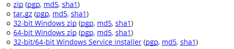

#### 安装Tomcat

Tomcat有安装版和解压版（绿色版）

安装版以.exe形式的安装包，双击安装到我们的电脑上，用的比较少

解压版，即绿色版，解压后直接使用，用的比较多

### 4．Tomcat的目录结构

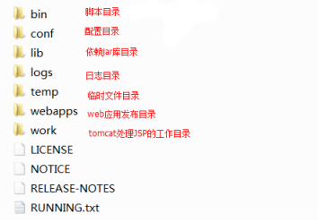

bin：脚本目录

启动脚本：startup.bat

停止脚本：shutdown.bat

conf：配置文件目录 (config /configuration)

核心配置文件：server.xml

用户权限配置文件：tomcat-users.xml

所有web项目默认配置文件：web.xml

lib：依赖库，tomcat和web项目中需要使用的jar包

logs：日志文件.

localhost_access_log.\*.txt tomcat记录用户访问信息，星\*表示时间。

例如：localhost_access_log.2016-02-28.txt

temp：临时文件目录，文件夹内内容可以任意删除。

webapps：默认情况下发布WEB项目所存放的目录。

work：tomcat处理JSP的工作目录。

### 5．Tomcate的启动与运行

双击Tomcat下的bin下的startup.bat启动Tomcat

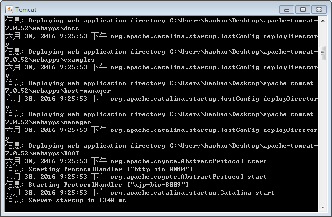

在浏览器的地址栏中输入[http://localhost:8080](http://localhost:8080)，看到如下页面证明启动成功

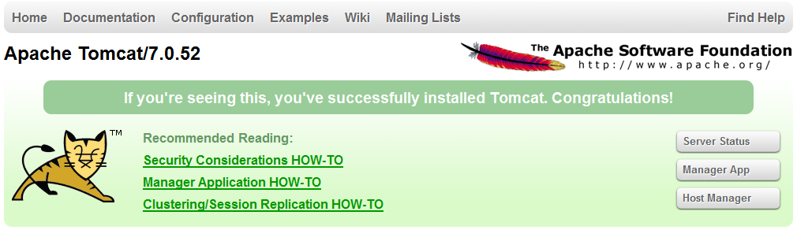

Tomcat启动不成功的原因分析：

1.  如果没有配置JAVA_HOME环境变量，在双击“startup.bat”文件运行tomcat
    时，将一闪立即关闭。且必须配置正确，及JAVA_HOME指向JDK的安装目录

2.  端口冲突

java.net.BindException: Address already in use: JVM_Bind \<null\>:8080

修改Tomcat/conf/server.xml

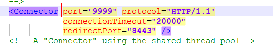

### 6．Web应用的目录结构

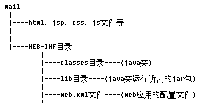

注意：WEB-INF目录是受保护的，外界不能直接访问

### 7．使用Eclipse绑定Tomcat并发布应用

 步骤1：获得服务器运行环境配置，Window/Preferences/Server/Runtime Environmen

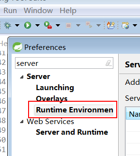

步骤2：添加服务器

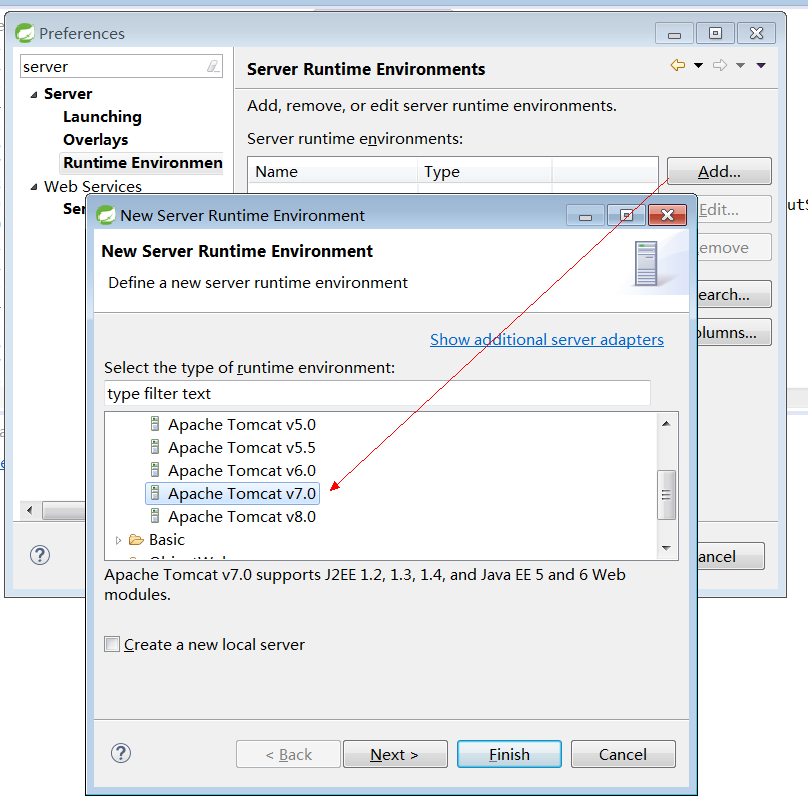

步骤3：选择服务器在硬盘的地址，然后所有的都是确定/Next/Finish

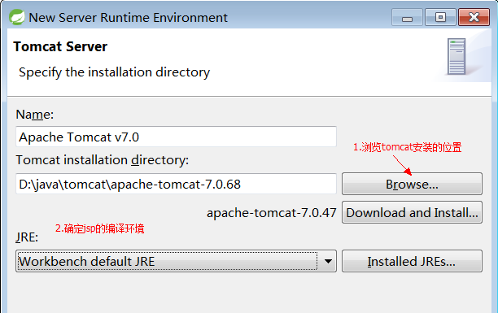

 步骤4：完成成功

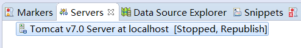

步骤5：设置发布位置

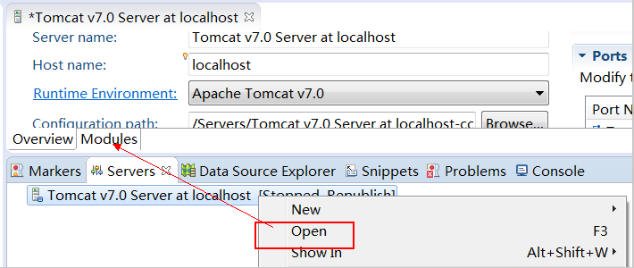

修改tomcat发布的位置

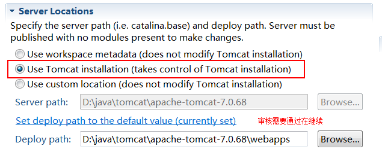

步骤6：项目右键/Run As/Run on Server

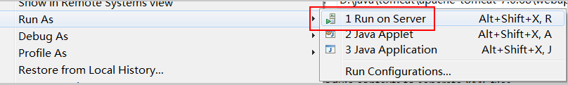
