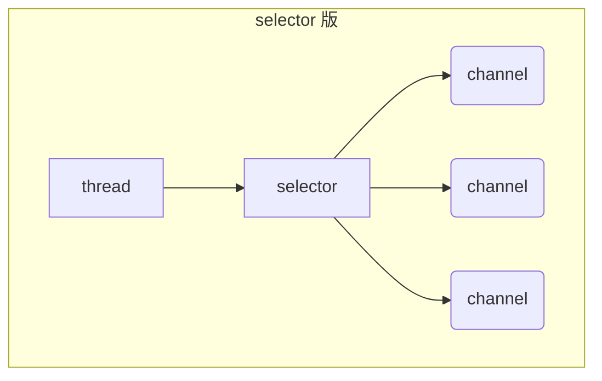
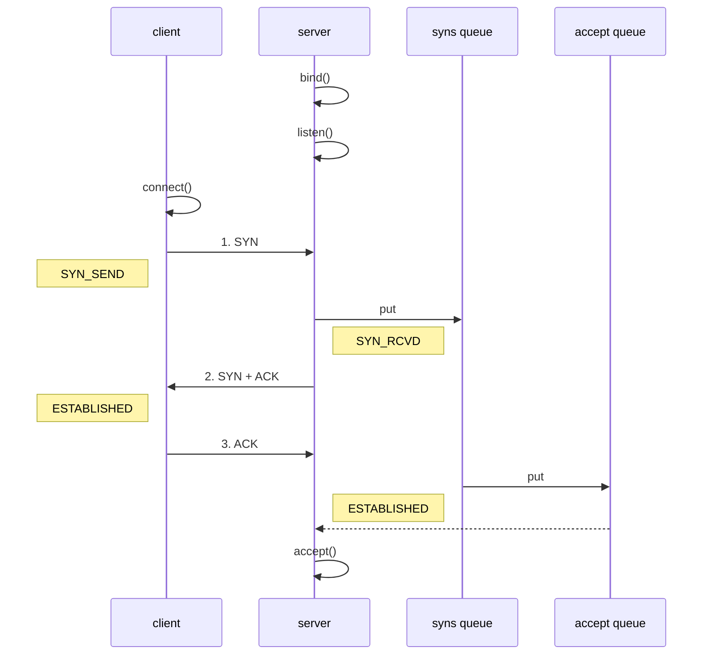

# 1. NIO 基础

non-blocking io 非阻塞 IO

## 1. 三大组件

### 1.1 Channel & Buffer

channel 有一点类似于 stream，它就是读写数据的**双向通道**，可以从 channel 将数据读入 buffer，也可以将 buffer 的数据写入 channel，而之前的 stream 要么是输入，要么是输出，channel 比 stream 更为底层


### 1.2 Selector

### 多线程设计


#### 多线程设计缺点:

* 内存占用高
* 线程上下文切换成本高
* 只适合连接数少的场景

### 线程池版本设计


#### 线程池版本的缺点:

* 阻塞模式下，线程仅能处理一个 socket 连接
* 仅适合短连接场景

### selector 版设计

selector 的作用就是配合一个线程来管理多个 channel，获取这些 channel 上发生的事件，这些 channel 工作在非阻塞模式下，不会让线程吊死在一个 channel 上。适合连接数特别多，但流量低的场景


## 2. ByteBuffer

```java
@Slf4j
public class ChannelDemo1 {
    public static void main(String[] args) {
        try (RandomAccessFile file = new RandomAccessFile("helloword/data.txt", "rw")) {
            FileChannel channel = file.getChannel();
            ByteBuffer buffer = ByteBuffer.allocate(10);
            do {
                // 向 buffer 写入
                int len = channel.read(buffer);
                log.debug("读到字节数：{}", len);
                if (len == -1) {
                    break;
                }
                // 切换 buffer 读模式
                buffer.flip();
                while(buffer.hasRemaining()) {
                    log.debug("{}", (char)buffer.get());
                }
                // 切换 buffer 写模式
                buffer.clear();
            } while (true);
        } catch (IOException e) {
            e.printStackTrace();
        }
    }
}
```

### 2.1  ByteBuffer 正确使用姿势

1. 向 buffer 写入数据，例如调用 channel.read(buffer)
2. 调用 flip() 切换至**读模式**
3. 从 buffer 读取数据，例如调用 buffer.get()
4. 调用 clear() 或 compact() 切换至**写模式**
5. 重复 1~4 步骤


### 2.2 ByteBuffer 结构

ByteBuffer 有以下重要属性

* capacity
* position
* limit

一开始


写模式下，position 是写入位置，limit 等于容量，下图表示写入了 4 个字节后的状态


flip 动作发生后，position 切换为读取位置，limit 切换为读取限制


读取 4 个字节后，状态


clear 动作发生后，状态


compact 方法，是把未读完的部分向前压缩，然后切换至写模式


### 2.3 ByteBuffer常用的方法

#### 向buffer写入数据

- 调用channel的read方法
- 调用buffer的put方法

#### 从buffer读取数据

- 调用channel的write方法
- 调用buffer的get方法

get方法会让postion读指针向后走如果想读取重复数据

- 调用rewind方法将postion重新置为0
- 调用get(int i) 方法获取内容

#### mark和reset

mark读取的时候做一个标记 即使postion改变了 调用reset就能返回到mark位置

#### rewind

从头开始读取数据


## 3. 文件编程

### 3.1 FileChannel

####  FileChannel 工作模式

> FileChannel 只能工作在阻塞模式下

#### 获取

不能直接打开 FileChannel，必须通过 FileInputStream、FileOutputStream 或者 RandomAccessFile 来获取 FileChannel，它们都有 getChannel 方法

* 通过 FileInputStream 获取的 channel 只能读
* 通过 FileOutputStream 获取的 channel 只能写
* 通过 RandomAccessFile 是否能读写根据构造 RandomAccessFile 时的读写模式决定


## 4. 网络编程

### 4.1 非阻塞 vs 阻塞

#### 阻塞

* 阻塞模式下，相关方法都会导致线程暂停
  * ServerSocketChannel.accept 会在没有连接建立时让线程暂停
  * SocketChannel.read 会在没有数据可读时让线程暂停
  * 阻塞的表现其实就是线程暂停了，暂停期间不会占用 cpu，但线程相当于闲置
* 单线程下，阻塞方法之间相互影响，几乎不能正常工作，需要多线程支持
* 但多线程下，有新的问题，体现在以下方面
  * 32 位 jvm 一个线程 320k，64 位 jvm 一个线程 1024k，如果连接数过多，必然导致 OOM，并且线程太多，反而会因为频繁上下文切换导致性能降低
  * 可以采用线程池技术来减少线程数和线程上下文切换，但治标不治本，如果有很多连接建立，但长时间 inactive，会阻塞线程池中所有线程，因此不适合长连接，只适合短连接


服务器端

```java
// 使用 nio 来理解阻塞模式, 单线程
// 0. ByteBuffer
ByteBuffer buffer = ByteBuffer.allocate(16);
// 1. 创建了服务器
ServerSocketChannel ssc = ServerSocketChannel.open();

// 2. 绑定监听端口
ssc.bind(new InetSocketAddress(8080));

// 3. 连接集合
List<SocketChannel> channels = new ArrayList<>();
while (true) {
    // 4. accept 建立与客户端连接， SocketChannel 用来与客户端之间通信
    log.debug("connecting...");
    SocketChannel sc = ssc.accept(); // 阻塞方法，线程停止运行
    log.debug("connected... {}", sc);
    channels.add(sc);
    for (SocketChannel channel : channels) {
        // 5. 接收客户端发送的数据
        log.debug("before read... {}", channel);
        channel.read(buffer); // 阻塞方法，线程停止运行
        buffer.flip();
        debugRead(buffer);
        buffer.clear();
        log.debug("after read...{}", channel);
    }
}
```

客户端

```java
SocketChannel sc = SocketChannel.open();
sc.connect(new InetSocketAddress("localhost", 8080));
System.out.println("waiting...");
```


#### 非阻塞

* 非阻塞模式下，相关方法都会不会让线程暂停
  * 在 ServerSocketChannel.accept 在没有连接建立时，会返回 null，继续运行
  * SocketChannel.read 在没有数据可读时，会返回 0，但线程不必阻塞，可以去执行其它 SocketChannel 的 read 或是去执行 ServerSocketChannel.accept 
  * 写数据时，线程只是等待数据写入 Channel 即可，无需等 Channel 通过网络把数据发送出去
* 但非阻塞模式下，即使没有连接建立，和可读数据，线程仍然在不断运行，白白浪费了 cpu
* 数据复制过程中，线程实际还是阻塞的（AIO 改进的地方）


服务器端，客户端代码不变

```java
// 使用 nio 来理解非阻塞模式, 单线程
// 0. ByteBuffer
ByteBuffer buffer = ByteBuffer.allocate(16);
// 1. 创建了服务器
ServerSocketChannel ssc = ServerSocketChannel.open();
ssc.configureBlocking(false); // 非阻塞模式
// 2. 绑定监听端口
ssc.bind(new InetSocketAddress(8080));
// 3. 连接集合
List<SocketChannel> channels = new ArrayList<>();
while (true) {
    // 4. accept 建立与客户端连接， SocketChannel 用来与客户端之间通信
    SocketChannel sc = ssc.accept(); // 非阻塞，线程还会继续运行，如果没有连接建立，但sc是null
    if (sc != null) {
        log.debug("connected... {}", sc);
        sc.configureBlocking(false); // 非阻塞模式
        channels.add(sc);
    }
    for (SocketChannel channel : channels) {
        // 5. 接收客户端发送的数据
        int read = channel.read(buffer);// 非阻塞，线程仍然会继续运行，如果没有读到数据，read 返回 0
        if (read > 0) {
            buffer.flip();
            debugRead(buffer);
            buffer.clear();
            log.debug("after read...{}", channel);
        }
    }
}
```


#### 多路复用

单线程可以配合 Selector 完成对多个 Channel 可读写事件的监控，这称之为多路复用

* 多路复用仅针对网络 IO、普通文件 IO 没法利用多路复用
* 如果不用 Selector 的非阻塞模式，线程大部分时间都在做无用功，而 Selector 能够保证
  * 有可连接事件时才去连接
  * 有可读事件才去读取
  * 有可写事件才去写入
    * 限于网络传输能力，Channel 未必时时可写，一旦 Channel 可写，会触发 Selector 的可写事件


### 4.2 Selector




好处

* 一个线程配合 selector 就可以监控多个 channel 的事件，事件发生线程才去处理。避免非阻塞模式下所做无用功
* 让这个线程能够被充分利用
* 节约了线程的数量
* 减少了线程上下文切换


#### 创建

```java
Selector selector = Selector.open();
```


#### 绑定 Channel 事件

也称之为注册事件，绑定的事件 selector 才会关心 

```java
channel.configureBlocking(false);
SelectionKey key = channel.register(selector, 绑定事件);
```

* channel 必须工作在非阻塞模式
* FileChannel 没有非阻塞模式，因此不能配合 selector 一起使用
* 绑定的事件类型可以有
  * connect - 客户端连接成功时触发
  * accept - 服务器端成功接受连接时触发
  * read - 数据可读入时触发，有因为接收能力弱，数据暂不能读入的情况
  * write - 数据可写出时触发，有因为发送能力弱，数据暂不能写出的情况


#### 监听 Channel 事件

可以通过下面三种方法来监听是否有事件发生，方法的返回值代表有多少 channel 发生了事件

方法1，阻塞直到绑定事件发生

```java
int count = selector.select();
```


方法2，阻塞直到绑定事件发生，或是超时（时间单位为 ms）

```java
int count = selector.select(long timeout);
```


方法3，不会阻塞，也就是不管有没有事件，立刻返回，自己根据返回值检查是否有事件

```java
int count = selector.selectNow();
```


#### 💡 select 何时不阻塞

> * 事件发生时
>   * 客户端发起连接请求，会触发 accept 事件
>   * 客户端发送数据过来，客户端正常、异常关闭时，都会触发 read 事件，另外如果发送的数据大于 buffer 缓冲区，会触发多次读取事件
>   * channel 可写，会触发 write 事件
>   * 在 linux 下 nio bug 发生时
> * 调用 selector.wakeup()
> * 调用 selector.close()
> * selector 所在线程 interrupt


### 4.3 处理 accept 事件

客户端代码为

```java
public class Client {
    public static void main(String[] args) {
        try (Socket socket = new Socket("localhost", 8080)) {
            System.out.println(socket);
            socket.getOutputStream().write("world".getBytes());
            System.in.read();
        } catch (IOException e) {
            e.printStackTrace();
        }
    }
}
```


服务器端代码为

```java
@Slf4j
public class ChannelDemo6 {
    public static void main(String[] args) {
        try (ServerSocketChannel channel = ServerSocketChannel.open()) {
            channel.bind(new InetSocketAddress(8080));
            System.out.println(channel);
            Selector selector = Selector.open();
            channel.configureBlocking(false);
            channel.register(selector, SelectionKey.OP_ACCEPT);

            while (true) {
                int count = selector.select();
//                int count = selector.selectNow();
                log.debug("select count: {}", count);
//                if(count <= 0) {
//                    continue;
//                }

                // 获取所有事件
                Set<SelectionKey> keys = selector.selectedKeys();

                // 遍历所有事件，逐一处理
                Iterator<SelectionKey> iter = keys.iterator();
                while (iter.hasNext()) {
                    SelectionKey key = iter.next();
                    // 判断事件类型
                    if (key.isAcceptable()) {
                        ServerSocketChannel c = (ServerSocketChannel) key.channel();
                        // 必须处理
                        SocketChannel sc = c.accept();
                        log.debug("{}", sc);
                    }
                    // 处理完毕，必须将事件移除
                    iter.remove();
                }
            }
        } catch (IOException e) {
            e.printStackTrace();
        }
    }
}
```


#### 事件发生后能否不处理

> 事件发生后，要么处理，要么取消（cancel），不能什么都不做，否则下次该事件仍会触发，这是因为 nio 底层使用的是水平触发


### 4.4 处理 read 事件

```java
@Slf4j
public class ChannelDemo6 {
    public static void main(String[] args) {
        try (ServerSocketChannel channel = ServerSocketChannel.open()) {
            channel.bind(new InetSocketAddress(8080));
            System.out.println(channel);
            Selector selector = Selector.open();
            channel.configureBlocking(false);
            channel.register(selector, SelectionKey.OP_ACCEPT);

            while (true) {
                int count = selector.select();
//                int count = selector.selectNow();
                log.debug("select count: {}", count);
//                if(count <= 0) {
//                    continue;
//                }

                // 获取所有事件
                Set<SelectionKey> keys = selector.selectedKeys();

                // 遍历所有事件，逐一处理
                Iterator<SelectionKey> iter = keys.iterator();
                while (iter.hasNext()) {
                    SelectionKey key = iter.next();
                    // 判断事件类型
                    if (key.isAcceptable()) {
                        ServerSocketChannel c = (ServerSocketChannel) key.channel();
                        // 必须处理
                        SocketChannel sc = c.accept();
                        sc.configureBlocking(false);
                        sc.register(selector, SelectionKey.OP_READ);
                        log.debug("连接已建立: {}", sc);
                    } else if (key.isReadable()) {
                        SocketChannel sc = (SocketChannel) key.channel();
                        ByteBuffer buffer = ByteBuffer.allocate(128);
                        int read = sc.read(buffer);
                        if(read == -1) {
                            key.cancel();
                            sc.close();
                        } else {
                            buffer.flip();
                            debug(buffer);
                        }
                    }
                    // 处理完毕，必须将事件移除
                    iter.remove();
                }
            }
        } catch (IOException e) {
            e.printStackTrace();
        }
    }
}
```

开启两个客户端，修改一下发送文字，输出

####  为何要 iter.remove()

> 因为 select 在事件发生后，就会将相关的 key 放入 selectedKeys 集合，但不会在处理完后从 selectedKeys 集合中移除，需要我们自己编码删除。例如
>
> * 第一次触发了 ssckey 上的 accept 事件，没有移除 ssckey 
> * 第二次触发了 sckey 上的 read 事件，但这时 selectedKeys 中还有上次的 ssckey ，在处理时因为没有真正的 serverSocket 连上了，就会导致空指针异常


####  cancel 的作用

> cancel 会取消注册在 selector 上的 channel，并从 keys 集合中删除 key 后续不会再监听事件

### 4.5 处理 write 事件


#### 一次无法写完例子

* 非阻塞模式下，无法保证把 buffer 中所有数据都写入 channel，因此需要追踪 write 方法的返回值（代表实际写入字节数）
* 用 selector 监听所有 channel 的可写事件，每个 channel 都需要一个 key 来跟踪 buffer，但这样又会导致占用内存过多，就有两阶段策略
  * 当消息处理器第一次写入消息时，才将 channel 注册到 selector 上
  * selector 检查 channel 上的可写事件，如果所有的数据写完了，就取消 channel 的注册
  * 如果不取消，会每次可写均会触发 write 事件


```java
public class WriteServer {

    public static void main(String[] args) throws IOException {
        ServerSocketChannel ssc = ServerSocketChannel.open();
        ssc.configureBlocking(false);
        ssc.bind(new InetSocketAddress(8080));

        Selector selector = Selector.open();
        ssc.register(selector, SelectionKey.OP_ACCEPT);

        while(true) {
            selector.select();

            Iterator<SelectionKey> iter = selector.selectedKeys().iterator();
            while (iter.hasNext()) {
                SelectionKey key = iter.next();
                iter.remove();
                if (key.isAcceptable()) {
                    SocketChannel sc = ssc.accept();
                    sc.configureBlocking(false);
                    SelectionKey sckey = sc.register(selector, SelectionKey.OP_READ);
                    // 1. 向客户端发送内容
                    StringBuilder sb = new StringBuilder();
                    for (int i = 0; i < 3000000; i++) {
                        sb.append("a");
                    }
                    ByteBuffer buffer = Charset.defaultCharset().encode(sb.toString());
                    int write = sc.write(buffer);
                    // 3. write 表示实际写了多少字节
                    System.out.println("实际写入字节:" + write);
                    // 4. 如果有剩余未读字节，才需要关注写事件
                    if (buffer.hasRemaining()) {
                        // read 1  write 4
                        // 在原有关注事件的基础上，多关注 写事件
                        sckey.interestOps(sckey.interestOps() + SelectionKey.OP_WRITE);
                        // 把 buffer 作为附件加入 sckey
                        sckey.attach(buffer);
                    }
                } else if (key.isWritable()) {
                    ByteBuffer buffer = (ByteBuffer) key.attachment();
                    SocketChannel sc = (SocketChannel) key.channel();
                    int write = sc.write(buffer);
                    System.out.println("实际写入字节:" + write);
                    if (!buffer.hasRemaining()) { // 写完了
                        key.interestOps(key.interestOps() - SelectionKey.OP_WRITE);
                        key.attach(null);
                    }
                }
            }
        }
    }
}
```

客户端

```java
public class WriteClient {
    public static void main(String[] args) throws IOException {
        Selector selector = Selector.open();
        SocketChannel sc = SocketChannel.open();
        sc.configureBlocking(false);
        sc.register(selector, SelectionKey.OP_CONNECT | SelectionKey.OP_READ);
        sc.connect(new InetSocketAddress("localhost", 8080));
        int count = 0;
        while (true) {
            selector.select();
            Iterator<SelectionKey> iter = selector.selectedKeys().iterator();
            while (iter.hasNext()) {
                SelectionKey key = iter.next();
                iter.remove();
                if (key.isConnectable()) {
                    System.out.println(sc.finishConnect());
                } else if (key.isReadable()) {
                    ByteBuffer buffer = ByteBuffer.allocate(1024 * 1024);
                    count += sc.read(buffer);
                    buffer.clear();
                    System.out.println(count);
                }
            }
        }
    }
}
```


####  write 为何要取消

只要向 channel 发送数据时，socket 缓冲可写，这个事件会频繁触发，因此应当只在 socket 缓冲区写不下时再关注可写事件，数据写完之后再取消关注


掌握了NIO的基本用法

### 4.6.NIO写一个网络编程群聊系统

1. 非阻塞的服务端和客户端通信

2. 多人群聊

3. 可以监测用户上线 下线 离线 消息转发

4. 客户端:通过channel可以无阻塞的把消息发送给其他的用户,可以接收其他用户发送的消息  (服务器转发)

   

  


## 5. 零拷贝

#### 传统 IO 问题

传统的 IO 将一个文件通过 socket 写出

```java
File f = new File("helloword/data.txt");
RandomAccessFile file = new RandomAccessFile(file, "r");

byte[] buf = new byte[(int)f.length()];
file.read(buf);

Socket socket = ...;
socket.getOutputStream().write(buf);
```

内部工作流程是这样的：

   

1. java 本身并不具备 IO 读写能力，因此 read 方法调用后，要从 java 程序的**用户态**切换至**内核态**，去调用操作系统（Kernel）的读能力，将数据读入**内核缓冲区**。这期间用户线程阻塞，操作系统使用 DMA（Direct Memory Access）来实现文件读，其间也不会使用 cpu

   > DMA 也可以理解为硬件单元，用来解放 cpu 完成文件 IO

2. 从**内核态**切换回**用户态**，将数据从**内核缓冲区**读入**用户缓冲区**（即 byte[] buf），这期间 cpu 会参与拷贝，无法利用 DMA

3. 调用 write 方法，这时将数据从**用户缓冲区**（byte[] buf）写入 **socket 缓冲区**，cpu 会参与拷贝

4. 接下来要向网卡写数据，这项能力 java 又不具备，因此又得从**用户态**切换至**内核态**，调用操作系统的写能力，使用 DMA 将 **socket 缓冲区**的数据写入网卡，不会使用 cpu


可以看到中间环节较多，java 的 IO 实际不是物理设备级别的读写，而是缓存的复制，底层的真正读写是操作系统来完成的

* 用户态与内核态的切换发生了 3 次，这个操作比较重量级
* 数据拷贝了共 4 次


#### NIO 优化

通过 DirectByteBuf 

* ByteBuffer.allocate(10)  HeapByteBuffer 使用的还是 java 内存
* ByteBuffer.allocateDirect(10)  DirectByteBuffer 使用的是操作系统内存


 

大部分步骤与优化前相同，不再赘述。唯有一点：java 可以使用 DirectByteBuf 将堆外内存映射到 jvm 内存中来直接访问使用

* 这块内存不受 jvm 垃圾回收的影响，因此内存地址固定，有助于 IO 读写
* java 中的 DirectByteBuf 对象仅维护了此内存的虚引用，内存回收分成两步
  * DirectByteBuf 对象被垃圾回收，将虚引用加入引用队列
  * 通过专门线程访问引用队列，根据虚引用释放堆外内存
* 减少了一次数据拷贝，用户态与内核态的切换次数没有减少


进一步优化（底层采用了 linux 2.1 后提供的 sendFile 方法），java 中对应着两个 channel 调用 transferTo/transferFrom 方法拷贝数据

 

1. java 调用 transferTo 方法后，要从 java 程序的**用户态**切换至**内核态**，使用 DMA将数据读入**内核缓冲区**，不会使用 cpu
2. 数据从**内核缓冲区**传输到 **socket 缓冲区**，cpu 会参与拷贝
3. 最后使用 DMA 将 **socket 缓冲区**的数据写入网卡，不会使用 cpu

可以看到

* 只发生了一次用户态与内核态的切换
* 数据拷贝了 3 次


进一步优化（linux 2.4）

  

1. java 调用 transferTo 方法后，要从 java 程序的**用户态**切换至**内核态**，使用 DMA将数据读入**内核缓冲区**，不会使用 cpu
2. 只会将一些 offset 和 length 信息拷入 **socket 缓冲区**，几乎无消耗
3. 使用 DMA 将 **内核缓冲区**的数据写入网卡，不会使用 cpu

整个过程仅只发生了一次用户态与内核态的切换，数据拷贝了 2 次。所谓的【零拷贝】，并不是真正无拷贝，而是在不会拷贝重复数据到 jvm 内存中，零拷贝的优点有

* 更少的用户态与内核态的切换
* 不利用 cpu 计算，减少 cpu 缓存伪共享
* 零拷贝适合小文件传输


# 2.Netty 概述

## 原生 NIO 存在的问题

1. `NIO` 的类库和 `API` 繁杂，使用麻烦：需要熟练掌握 `Selector`、`ServerSocketChannel`、`SocketChannel`、`ByteBuffer`等。
2. 需要具备其他的额外技能：要熟悉 `Java` 多线程编程，因为 `NIO` 编程涉及到 `Reactor` 模式，你必须对多线程和网络编程非常熟悉，才能编写出高质量的 `NIO` 程序。
3. 开发工作量和难度都非常大：例如客户端面临断连重连、网络闪断、半包读写、失败缓存、网络拥塞和异常流的处理等等。
4. `JDK NIO` 的 `Bug`：例如臭名昭著的 `Epoll Bug`，它会导致 `Selector` 空轮询，最终导致 `CPU100%`。直到 `JDK1.7` 版本该问题仍旧存在，没有被根本解决。

## Netty 官网说明

官网：https://netty.io/

Netty is an asynchronous event-driven network application framework for rapid development of maintainable high performance protocol servers & clients.

[](https://unpkg.zhimg.com/youthlql@1.0.0/netty/introduction/chapter_002/0001.png)

## Netty 的优点

`Netty` 对 `JDK` 自带的 `NIO` 的 `API` 进行了封装，解决了上述问题。

1. 设计优雅：适用于各种传输类型的统一 `API` 阻塞和非阻塞 `Socket`；基于灵活且可扩展的事件模型，可以清晰地分离关注点；高度可定制的线程模型-单线程，一个或多个线程池。
2. 使用方便：详细记录的 `Javadoc`，用户指南和示例；没有其他依赖项，`JDK5（Netty3.x）`或 `6（Netty4.x）`就足够了。
3. 高性能、吞吐量更高：延迟更低；减少资源消耗；最小化不必要的内存复制。
4. 安全：完整的 `SSL/TLS` 和 `StartTLS` 支持。
5. 社区活跃、不断更新：社区活跃，版本迭代周期短，发现的 `Bug` 可以被及时修复，同时，更多的新功能会被加入。  物联网 公司  游戏  im

## Netty 版本说明

1. `Netty` 版本分为 `Netty 3.x` 和 `Netty 4.x`、`Netty 5.x`
2. 因为 `Netty 5` 出现重大 `bug`，已经被官网废弃了，目前推荐使用的是 `Netty 4.x`的稳定版本
3. 目前在官网可下载的版本 `Netty 3.x`、`Netty 4.0.x` 和 `Netty 4.1.x`
4. 在本套课程中，我们讲解 `Netty4.1.x` 版本
5. `Netty` 下载地址：https://bintray.com/netty/downloads/netty/

# 3.Netty 高性能架构设计

## 线程模型基本介绍

1. 不同的线程模式，对程序的性能有很大影响，为了搞清 `Netty` 线程模式，我们来系统的讲解下各个线程模式，最后看看 `Netty` 线程模型有什么优越性。
2. 目前存在的线程模型有：传统阻塞 `I/O` 服务模型 和`Reactor` 模式
3. 根据Reactor的数量和处理资源池线程的数量不同，有3种典型的实现
   - 单 `Reactor` 单线程；
   - 单 `Reactor`多线程；
   - 主从 `Reactor`多线程
4. `Netty` 线程模式（`Netty` 主要基于主从 `Reactor` 多线程模型做了一定的改进，其中主从 `Reactor` 多线程模型有多个 `Reactor`）

## 传统阻塞 I/O 服务模型

### 工作原理图

1. 黄色的框表示对象，蓝色的框表示线程
2. 白色的框表示方法（`API`）

### 模型特点

1. 采用阻塞 `IO` 模式获取输入的数据
2. 每个连接都需要独立的线程完成数据的输入，业务处理，数据返回

### 问题分析

1. 当并发数很大，就会创建大量的线程，占用很大系统资源
2. 连接创建后，如果当前线程暂时没有数据可读，该线程会阻塞在 Handler对象中的`read` 操作，导致上面的处理线程资源浪费


## Reactor 模式

### 针对传统阻塞 I/O 服务模型的 2 个缺点，解决方案：


`Reactor` 在不同书中的叫法：

- 反应器模式

- 分发者模式（Dispatcher）

- 通知者模式（notifier）

1. 基于线程池复用线程资源：不必再为每个连接创建线程，将连接完成后的业务处理任务分配给线程进行处理，一个线程可以处理多个连接的业务。（解决了当并发数很大时，会创建大量线程，占用很大系统资源）

2.  基于 `I/O` 复用模型：多个客户端进行连接，先把连接请求给`ServiceHandler`。多个连接共用一个阻塞对象`ServiceHandler`。假设，当C1连接没有数据要处理时，C1客户端只需要阻塞于`ServiceHandler`，C1之前的处理线程便可以处理其他有数据的连接，不会造成线程资源的浪费。当C1连接再次有数据时，`ServiceHandler`根据线程池的空闲状态，将请求分发给空闲的线程来处理C1连接的任务。（解决了线程资源浪费的那个问题）


   

### I/O 复用结合线程池，就是 Reactor 模式基本设计思想，如图


对上图说明：

1. `Reactor` 模式，通过一个或多个输入同时传递给服务处理器（ServiceHandler）的模式（基于事件驱动）
2. 服务器端程序处理传入的多个请求,并将它们同步分派到相应的处理线程，因此 `Reactor` 模式也叫 `Dispatcher` 模式
3. `Reactor` 模式使用 `IO` 复用监听事件，收到事件后，分发给某个线程（进程），这点就是网络服务器高并发处理关键

> 原先有多个Handler阻塞，现在只用一个ServiceHandler阻塞

### Reactor 模式中核心组成

1. `Reactor（也就是那个ServiceHandler）`：`Reactor` 在一个单独的线程中运行，负责监听和分发事件，分发给适当的处理线程来对 `IO` 事件做出反应。它就像公司的电话接线员，它接听来自客户的电话并将线路转移到适当的联系人；
2. `Handlers（处理线程EventHandler）`：处理线程执行 `I/O` 事件要完成的实际事件，类似于客户想要与之交谈的公司中的实际官员。`Reactor` 通过调度适当的处理线程来响应 `I/O` 事件，处理程序执行非阻塞操作。

### Reactor 模式分类

根据 `Reactor` 的数量和处理资源池线程的数量不同，有 `3` 种典型的实现

1. 单 `Reactor` 单线程
2. 单 `Reactor` 多线程
3. 主从 `Reactor` 多线程

## 单 Reactor 单线程

原理图，并使用 `NIO` 群聊系统验证


### 方案说明

1. `Select` 是前面 `I/O` 复用模型介绍的标准网络编程 `API`，可以实现应用程序通过一个阻塞对象监听多路连接请求
2. `Reactor` 对象通过 `Select` 监控客户端请求事件，收到事件后通过 `Dispatch` 进行分发
3. 如果是建立连接请求事件，则由 `Acceptor` 通过 `Accept` 处理连接请求，然后创建一个 `Handler` 对象处理连接完成后的后续业务处理
4. 如果不是建立连接事件，则 `Reactor` 会分发调用连接对应的 `Handler` 来响应
5. `Handler` 会完成 `Read` → 业务处理 → `Send` 的完整业务流程

结合实例：服务器端用一个线程通过多路复用搞定所有的 `IO` 操作（包括连接，读、写等），编码简单，清晰明了，但是如果客户端连接数量较多，将无法支撑，前面的 `NIO` 案例就属于这种模型。

### 方案优缺点分析

1. 优点：模型简单，没有多线程、进程通信、竞争的问题，全部都在一个线程中完成
2. 缺点：性能问题，只有一个线程，无法完全发挥多核 `CPU` 的性能。`Handler`在处理某个连接上的业务时，整个进程无法处理其他连接事件，很容易导致性能瓶颈
3. 缺点：可靠性问题，线程意外终止，或者进入死循环，会导致整个系统通信模块不可用，不能接收和处理外部消息，造成节点故障
4. 使用场景：客户端的数量有限，业务处理非常快速，比如 `Redis` 在业务处理的时间复杂度 `O(1)` 的情况

## 单 Reactor 多线程

### 方案说明


1. `Reactor` 对象通过 `Select` 监控客户端请求事件，收到事件后，通过 `Dispatch` 进行分发
2. 如果是建立连接请求，则由 `Acceptor` 通过 `accept` 处理连接请求，然后创建一个 `Handler` 对象处理完成连接后的各种事件
3. 如果不是连接请求，则由 `Reactor` 分发调用连接对应的 `handler` 来处理（也就是说连接已经建立，后续客户端再来请求，那基本就是数据请求了，直接调用之前为这个连接创建好的handler来处理）
4. `handler` 只负责响应事件，不做具体的业务处理（这样不会使handler阻塞太久），通过 `read` 读取数据后，会分发给后面的 `worker` 线程池的某个线程处理业务。【业务处理是最费时的，所以将业务处理交给线程池去执行】
5. `worker` 线程池会分配独立线程完成真正的业务，并将结果返回给 `handler`
6. `handler` 收到响应后，通过 `send` 将结果返回给 `client`

### 方案优缺点分析

1. 优点：可以充分的利用多核 `cpu` 的处理能力
2. 缺点：多线程数据共享和访问比较复杂。`Reactor` 承担所有的事件的监听和响应，它是单线程运行，在高并发场景容易出现性能瓶颈。也就是说`Reactor`主线程承担了过多的事

## 主从 Reactor 多线程

### 工作原理图

针对单 `Reactor` 多线程模型中，`Reactor` 在单线程中运行，高并发场景下容易成为性能瓶颈，可以让 `Reactor` 在多线程中运行


> SubReactor是可以有多个的，如果只有一个SubReactor的话那和`单 Reactor 多线程`就没什么区别了。

1. `Reactor` 主线程 `MainReactor` 对象通过 `select` 监听连接事件，收到事件后，通过 `Acceptor` 处理连接事件
2. 当 `Acceptor` 处理连接事件后，`MainReactor` 将连接分配给 `SubReactor`
3. `subreactor` 将连接加入到连接队列进行监听，并创建 `handler` 进行各种事件处理
4. 当有新事件发生时，`subreactor` 就会调用对应的 `handler` 处理
5. `handler` 通过 `read` 读取数据，分发给后面的 `worker` 线程处理
6. `worker` 线程池分配独立的 `worker` 线程进行业务处理，并返回结果
7. `handler` 收到响应的结果后，再通过 `send` 将结果返回给 `client`
8. `Reactor` 主线程可以对应多个 `Reactor` 子线程，即 `MainRecator` 可以关联多个 `SubReactor`

### Scalable IO in Java 对 Multiple Reactors 的原理图解


### 方案优缺点说明

1. 优点：父线程与子线程的数据交互简单职责明确，父线程只需要接收新连接，子线程完成后续的业务处理。
2. 优点：父线程与子线程的数据交互简单，`Reactor` 主线程只需要把新连接传给子线程，子线程无需返回数据。
3. 缺点：编程复杂度较高

结合实例：这种模型在许多项目中广泛使用，包括 `Nginx` 主从 `Reactor` 多进程模型，`Memcached` 主从多线程，`Netty` 主从多线程模型的支持

## Reactor 模式小结

### 3 种模式用生活案例来理解

1. 单 `Reactor` 单线程，前台接待员和服务员是同一个人，全程为顾客服
2. 单 `Reactor` 多线程，`1` 个前台接待员，多个服务员，接待员只负责接待
3. 主从 `Reactor` 多线程，多个前台接待员，多个服务生

### Reactor 模式具有如下的优点

1. 响应快，不必为单个同步时间所阻塞，虽然 `Reactor` 本身依然是同步的（比如你第一个SubReactor阻塞了，我可以调下一个 SubReactor为客户端服务）
2. 可以最大程度的避免复杂的多线程及同步问题，并且避免了多线程/进程的切换开销
3. 扩展性好，可以方便的通过增加 `Reactor` 实例个数来充分利用 `CPU` 资源
4. 复用性好，`Reactor` 模型本身与具体事件处理逻辑无关，具有很高的复用性

## Netty 模型

> 讲解netty的时候采用的是先写代码体验一下，再细讲里面的原理。前面看不懂的可以先不用纠结，先往后面看，后面基本都会讲清楚

### 工作原理示意图1 - 简单版

```
Netty` 主要基于主从 `Reactors` 多线程模型（如图）做了一定的改进，其中主从 `Reactor` 多线程模型有多个 `Reactor
```


**对上图说明**

1. `BossGroup` 线程维护 `Selector`，只关注 `Accecpt`
2. 当接收到 `Accept` 事件，获取到对应的 `SocketChannel`，封装成 `NIOScoketChannel` 并注册到 `Worker` 线程（事件循环），并进行维护
3. 当 `Worker` 线程监听到 `Selector` 中通道发生自己感兴趣的事件后，就进行处理（就由 `handler`），注意 `handler` 已经加入到通道

### 工作原理示意图2 - 进阶版


`BossGroup`有点像主`Reactor` 可以有多个，`WorkerGroup`则像`SubReactor`一样可以有多个。

### 工作原理示意图3 - 详细版


1. `Netty` 抽象出两组线程池 ，`BossGroup` 专门负责接收客户端的连接，`WorkerGroup` 专门负责网络的读写
2. `BossGroup` 和 `WorkerGroup` 类型都是 `NioEventLoopGroup`
3. `NioEventLoopGroup` 相当于一个事件循环组，这个组中含有多个事件循环，每一个事件循环是 `NioEventLoop`
4. `NioEventLoop` 表示一个不断循环的执行处理任务的线程，每个 `NioEventLoop` 都有一个 `Selector`，用于监听绑定在其上的 `socket` 的网络通讯
5. `NioEventLoopGroup` 可以有多个线程，即可以含有多个 `NioEventLoop`
6. 每个BossGroup下面的NioEventLoop循环执行的步骤有3步
   - 轮询 `accept` 事件
   - 处理 `accept` 事件，与 `client` 建立连接，生成 `NioScocketChannel`，并将其注册到某个 `workerGroup` `NIOEventLoop` 上的 `Selector`
   - 继续处理任务队列的任务，即 `runAllTasks`
7. 每个WorkerGroup  NIOEventLoop 循环执行的步骤
   - 轮询 `read`，`write` 事件
   - 处理 `I/O` 事件，即 `read`，`write` 事件，在对应 `NioScocketChannel` 处理
   - 处理任务队列的任务，即 `runAllTasks`
8. 每个 `Worker` `NIOEventLoop` 处理业务时，会使用 `pipeline`（管道），`pipeline` 中包含了 `channel（通道）`，即通过 `pipeline` 可以获取到对应通道，管道中维护了很多的处理器。（这个点目前只是简单的讲，后面重点说）


### 事件循环组

EventLoop本质上一个单线程执行器 维护了一个selector 里面的run方法处理channel上的 源源不断的io事件

NioEventLoopGroup是一组 EventLoop  channel会调用 EventLoopGroup中的register方法绑定其中的EventLoop   后续这个channel上的io事件都由此EventLoop   来处理这样就保证了线程安全


### Channel

channel 的主要作用

* close() 可以用来关闭 channel
* closeFuture() 用来处理 channel 的关闭
  * sync 方法作用是同步等待 channel 关闭
  * 而 addListener 方法是异步等待 channel 关闭
* pipeline() 方法添加处理器
* write() 方法将数据写入
* writeAndFlush() 方法将数据写入并刷出


```java
  ChannelFuture channelFuture = new Bootstrap()
                .group(new NioEventLoopGroup())
                .channel(NioSocketChannel.class)
                .handler(new ChannelInitializer<NioSocketChannel>() {
                    @Override
                    protected void initChannel(NioSocketChannel ch) throws Exception {
                        System.out.println("init");
                        ch.pipeline().addLast(new LoggingHandler(LogLevel.DEBUG));


                    }
                })
                .connect("localhost", 9999);  //1
        //1 返回的是ChannelFuture对象  可以利用channel获取到channel对象   connect方法是异步的
        // 意味着我们的连接不等建立好 方法执行就返回来
        //ChannelFuture对象不能立刻获得正确的channel对象
        //channelFuture.sync().channel().writeAndFlush(ByteBufAllocator.DEFAULT.buffer().writeBytes("zhansan".getBytes()));
        System.out.println(channelFuture.channel());  //连接并没有建立  [id: 0x5ad98091]
//        channelFuture.sync();// 同步等待建立连接
//
//        System.out.println(channelFuture.channel()); //连接就建立了  [id: 0x5ad98091, L:/127.0.0.1:9077 - R:localhost/127.0.0.1:9999]
       channelFuture.addListener((ChannelFutureListener)future->{


           System.out.println(future.channel());
       });
```

### 3.3 Future & Promise

在异步处理时，经常用到这两个接口

首先要说明 netty 中的 Future 与 jdk 中的 Future 同名，但是是两个接口，netty 的 Future 继承自 jdk 的 Future，而 Promise 又对 netty Future 进行了扩展

* jdk Future 只能同步等待任务结束（或成功、或失败）才能得到结果
* netty Future 可以同步等待任务结束得到结果，也可以异步方式得到结果，但都是要等任务结束
* netty Promise 不仅有 netty Future 的功能，而且脱离了任务独立存在，只作为两个线程间传递结果的容器

| 功能/名称    | jdk Future                     | netty Future                                                 | Promise      |
| ------------ | ------------------------------ | ------------------------------------------------------------ | ------------ |
| cancel       | 取消任务                       | -                                                            | -            |
| isCanceled   | 任务是否取消                   | -                                                            | -            |
| isDone       | 任务是否完成，不能区分成功失败 | -                                                            | -            |
| get          | 获取任务结果，阻塞等待         | -                                                            | -            |
| getNow       | -                              | 获取任务结果，非阻塞，还未产生结果时返回 null                | -            |
| await        | -                              | 等待任务结束，如果任务失败，不会抛异常，而是通过 isSuccess 判断 | -            |
| sync         | -                              | 等待任务结束，如果任务失败，抛出异常                         | -            |
| isSuccess    | -                              | 判断任务是否成功                                             | -            |
| cause        | -                              | 获取失败信息，非阻塞，如果没有失败，返回null                 | -            |
| addLinstener | -                              | 添加回调，异步接收结果                                       | -            |
| setSuccess   | -                              | -                                                            | 设置成功结果 |
| setFailure   | -                              | -                                                            | 设置失败结果 |


#### 例1

同步处理任务成功

```java
DefaultEventLoop eventExecutors = new DefaultEventLoop();
DefaultPromise<Integer> promise = new DefaultPromise<>(eventExecutors);

eventExecutors.execute(()->{
    try {
        Thread.sleep(1000);
    } catch (InterruptedException e) {
        e.printStackTrace();
    }
    log.debug("set success, {}",10);
    promise.setSuccess(10);
});

log.debug("start...");
log.debug("{}",promise.getNow()); // 还没有结果
log.debug("{}",promise.get());
```


#### 例2

异步处理任务成功

```java
DefaultEventLoop eventExecutors = new DefaultEventLoop();
DefaultPromise<Integer> promise = new DefaultPromise<>(eventExecutors);

// 设置回调，异步接收结果
promise.addListener(future -> {
    // 这里的 future 就是上面的 promise
    log.debug("{}",future.getNow());
});

// 等待 1000 后设置成功结果
eventExecutors.execute(()->{
    try {
        Thread.sleep(1000);
    } catch (InterruptedException e) {
        e.printStackTrace();
    }
    log.debug("set success, {}",10);
    promise.setSuccess(10);
});

log.debug("start...");
```


#### 例3

同步处理任务失败 - sync & get

```java
DefaultEventLoop eventExecutors = new DefaultEventLoop();
        DefaultPromise<Integer> promise = new DefaultPromise<>(eventExecutors);

        eventExecutors.execute(() -> {
            try {
                Thread.sleep(1000);
            } catch (InterruptedException e) {
                e.printStackTrace();
            }
            RuntimeException e = new RuntimeException("error...");
            log.debug("set failure, {}", e.toString());
            promise.setFailure(e);
        });

        log.debug("start...");
        log.debug("{}", promise.getNow());
        promise.get(); // sync() 也会出现异常，只是 get 会再用 ExecutionException 包一层异常
```


#### 例4

同步处理任务失败 - await

```java
DefaultEventLoop eventExecutors = new DefaultEventLoop();
DefaultPromise<Integer> promise = new DefaultPromise<>(eventExecutors);

eventExecutors.execute(() -> {
    try {
        Thread.sleep(1000);
    } catch (InterruptedException e) {
        e.printStackTrace();
    }
    RuntimeException e = new RuntimeException("error...");
    log.debug("set failure, {}", e.toString());
    promise.setFailure(e);
});

log.debug("start...");
log.debug("{}", promise.getNow());
promise.await(); // 与 sync 和 get 区别在于，不会抛异常
log.debug("result {}", (promise.isSuccess() ? promise.getNow() : promise.cause()).toString());
```

#### 例5

异步处理任务失败

```java
DefaultEventLoop eventExecutors = new DefaultEventLoop();
DefaultPromise<Integer> promise = new DefaultPromise<>(eventExecutors);

promise.addListener(future -> {
    log.debug("result {}", (promise.isSuccess() ? promise.getNow() : promise.cause()).toString());
});

eventExecutors.execute(() -> {
    try {
        Thread.sleep(1000);
    } catch (InterruptedException e) {
        e.printStackTrace();
    }
    RuntimeException e = new RuntimeException("error...");
    log.debug("set failure, {}", e.toString());
    promise.setFailure(e);
});

log.debug("start...");
```


#### 例6

await 死锁检查

```java
DefaultEventLoop eventExecutors = new DefaultEventLoop();
DefaultPromise<Integer> promise = new DefaultPromise<>(eventExecutors);

eventExecutors.submit(()->{
    System.out.println("1");
    try {
        promise.await();
        // 注意不能仅捕获 InterruptedException 异常
        // 否则 死锁检查抛出的 BlockingOperationException 会继续向上传播
        // 而提交的任务会被包装为 PromiseTask，它的 run 方法中会 catch 所有异常然后设置为 Promise 的失败结果而不会抛出
    } catch (Exception e) { 
        e.printStackTrace();
    }
    System.out.println("2");
});
eventExecutors.submit(()->{
    System.out.println("3");
    try {
        promise.await();
    } catch (Exception e) {
        e.printStackTrace();
    }
    System.out.println("4");
});
```


### 3.4 Handler & Pipeline

ChannelHandler 用来处理 Channel 上的各种事件，分为入站、出站两种。所有 ChannelHandler 被连成一串，就是 Pipeline

* 入站处理器通常是 ChannelInboundHandlerAdapter 的子类，主要用来读取客户端数据，写回结果
* 出站处理器通常是 ChannelOutboundHandlerAdapter 的子类，主要对写回结果进行加工

打个比喻，每个 Channel 是一个产品的加工车间，Pipeline 是车间中的流水线，ChannelHandler 就是流水线上的各道工序，而后面要讲的 ByteBuf 是原材料，经过很多工序的加工：先经过一道道入站工序，再经过一道道出站工序最终变成产品


先搞清楚顺序，服务端

```java
new ServerBootstrap()
    .group(new NioEventLoopGroup())
    .channel(NioServerSocketChannel.class)
    .childHandler(new ChannelInitializer<NioSocketChannel>() {
        protected void initChannel(NioSocketChannel ch) {
            ch.pipeline().addLast(new ChannelInboundHandlerAdapter(){
                @Override
                public void channelRead(ChannelHandlerContext ctx, Object msg) {
                    System.out.println(1);
                    ctx.fireChannelRead(msg); // 1
                }
            });
            ch.pipeline().addLast(new ChannelInboundHandlerAdapter(){
                @Override
                public void channelRead(ChannelHandlerContext ctx, Object msg) {
                    System.out.println(2);
                    ctx.fireChannelRead(msg); // 2
                }
            });
            ch.pipeline().addLast(new ChannelInboundHandlerAdapter(){
                @Override
                public void channelRead(ChannelHandlerContext ctx, Object msg) {
                    System.out.println(3);
                    ctx.channel().write(msg); // 3
                }
            });
            ch.pipeline().addLast(new ChannelOutboundHandlerAdapter(){
                @Override
                public void write(ChannelHandlerContext ctx, Object msg, 
                                  ChannelPromise promise) {
                    System.out.println(4);
                    ctx.write(msg, promise); // 4
                }
            });
            ch.pipeline().addLast(new ChannelOutboundHandlerAdapter(){
                @Override
                public void write(ChannelHandlerContext ctx, Object msg, 
                                  ChannelPromise promise) {
                    System.out.println(5);
                    ctx.write(msg, promise); // 5
                }
            });
            ch.pipeline().addLast(new ChannelOutboundHandlerAdapter(){
                @Override
                public void write(ChannelHandlerContext ctx, Object msg, 
                                  ChannelPromise promise) {
                    System.out.println(6);
                    ctx.write(msg, promise); // 6
                }
            });
        }
    })
    .bind(8080);
```

客户端

```java
new Bootstrap()
    .group(new NioEventLoopGroup())
    .channel(NioSocketChannel.class)
    .handler(new ChannelInitializer<Channel>() {
        @Override
        protected void initChannel(Channel ch) {
            ch.pipeline().addLast(new StringEncoder());
        }
    })
    .connect("127.0.0.1", 8080)
    .addListener((ChannelFutureListener) future -> {
        future.channel().writeAndFlush("hello,world");
    });
```

服务器端打印：

```
1
2
3
6
5
4
```

可以看到，ChannelInboundHandlerAdapter 是按照 addLast 的顺序执行的，而 ChannelOutboundHandlerAdapter 是按照 addLast 的逆序执行的。ChannelPipeline 的实现是一个 ChannelHandlerContext（包装了 ChannelHandler） 组成的双向链表

* 入站处理器中，ctx.fireChannelRead(msg) 是 **调用下一个入站处理器**
  * 如果注释掉 1 处代码，则仅会打印 1
  * 如果注释掉 2 处代码，则仅会打印 1 2
* 3 处的 ctx.channel().write(msg) 会 **从尾部开始触发** 后续出站处理器的执行
  * 如果注释掉 3 处代码，则仅会打印 1 2 3
* 类似的，出站处理器中，ctx.write(msg, promise) 的调用也会 **触发上一个出站处理器**
  * 如果注释掉 6 处代码，则仅会打印 1 2 3 6
* ctx.channel().write(msg) vs ctx.write(msg)
  * 都是触发出站处理器的执行
  * ctx.channel().write(msg) 从尾部开始查找出站处理器
  * ctx.write(msg) 是从当前节点找上一个出站处理器
  * 3 处的 ctx.channel().write(msg) 如果改为 ctx.write(msg) 仅会打印 1 2 3，因为节点3 之前没有其它出站处理器了
  * 6 处的 ctx.write(msg, promise) 如果改为 ctx.channel().write(msg) 会打印 1 2 3 6 6 6... 因为 ctx.channel().write() 是从尾部开始查找，结果又是节点6 自己


### 3.5 ByteBuf

是对字节数据的封装

#### 1）创建

```java
ByteBuf buffer = ByteBufAllocator.DEFAULT.buffer(10);
log(buffer);
```

上面代码创建了一个默认的 ByteBuf（池化基于直接内存的 ByteBuf），初始容量是 10

输出

```
read index:0 write index:0 capacity:10
```

其中 log 方法参考如下

```java
private static void log(ByteBuf buffer) {
    int length = buffer.readableBytes();
    int rows = length / 16 + (length % 15 == 0 ? 0 : 1) + 4;
    StringBuilder buf = new StringBuilder(rows * 80 * 2)
        .append("read index:").append(buffer.readerIndex())
        .append(" write index:").append(buffer.writerIndex())
        .append(" capacity:").append(buffer.capacity())
        .append(NEWLINE);
    appendPrettyHexDump(buf, buffer);
    System.out.println(buf.toString());
}
```


#### 2）直接内存 vs 堆内存

可以使用下面的代码来创建池化基于堆的 ByteBuf

```java
ByteBuf buffer = ByteBufAllocator.DEFAULT.heapBuffer(10);
```

也可以使用下面的代码来创建池化基于直接内存的 ByteBuf

```java
ByteBuf buffer = ByteBufAllocator.DEFAULT.directBuffer(10);
```

* 直接内存创建和销毁的代价昂贵，但读写性能高（少一次内存复制），适合配合池化功能一起用
* 直接内存对 GC 压力小，因为这部分内存不受 JVM 垃圾回收的管理，但也要注意及时主动释放


#### 3）池化 vs 非池化

池化的最大意义在于可以重用 ByteBuf，优点有

* 没有池化，则每次都得创建新的 ByteBuf 实例，这个操作对直接内存代价昂贵，就算是堆内存，也会增加 GC 压力
* 有了池化，则可以重用池中 ByteBuf 实例，并且采用了与 jemalloc 类似的内存分配算法提升分配效率
* 高并发时，池化功能更节约内存，减少内存溢出的可能

池化功能是否开启，可以通过下面的系统环境变量来设置

```java
-Dio.netty.allocator.type={unpooled|pooled}
```

* 4.1 以后，非 Android 平台默认启用池化实现，Android 平台启用非池化实现
* 4.1 之前，池化功能还不成熟，默认是非池化实现


#### 4）组成

ByteBuf 由四部分组成


最开始读写指针都在 0 位置


#### 5）写入

方法列表，省略一些不重要的方法

| 方法签名                                                     | 含义                   | 备注                                        |
| ------------------------------------------------------------ | ---------------------- | ------------------------------------------- |
| writeBoolean(boolean value)                                  | 写入 boolean 值        | 用一字节 01\|00 代表 true\|false            |
| writeByte(int value)                                         | 写入 byte 值           |                                             |
| writeShort(int value)                                        | 写入 short 值          |                                             |
| writeInt(int value)                                          | 写入 int 值            | Big Endian，即 0x250，写入后 00 00 02 50    |
| writeIntLE(int value)                                        | 写入 int 值            | Little Endian，即 0x250，写入后 50 02 00 00 |
| writeLong(long value)                                        | 写入 long 值           |                                             |
| writeChar(int value)                                         | 写入 char 值           |                                             |
| writeFloat(float value)                                      | 写入 float 值          |                                             |
| writeDouble(double value)                                    | 写入 double 值         |                                             |
| writeBytes(ByteBuf src)                                      | 写入 netty 的 ByteBuf  |                                             |
| writeBytes(byte[] src)                                       | 写入 byte[]            |                                             |
| writeBytes(ByteBuffer src)                                   | 写入 nio 的 ByteBuffer |                                             |
| int writeCharSequence(CharSequence sequence, Charset charset) | 写入字符串             |                                             |

> 注意
>
> * 这些方法的未指明返回值的，其返回值都是 ByteBuf，意味着可以链式调用
> * 网络传输，默认习惯是 Big Endian


先写入 4 个字节

```java
buffer.writeBytes(new byte[]{1, 2, 3, 4});
log(buffer);
```

结果是

```
read index:0 write index:4 capacity:10
         +-------------------------------------------------+
         |  0  1  2  3  4  5  6  7  8  9  a  b  c  d  e  f |
+--------+-------------------------------------------------+----------------+
|00000000| 01 02 03 04                                     |....            |
+--------+-------------------------------------------------+----------------+
```

再写入一个 int 整数，也是 4 个字节

```java
buffer.writeInt(5);
log(buffer);
```

结果是

```
read index:0 write index:8 capacity:10
         +-------------------------------------------------+
         |  0  1  2  3  4  5  6  7  8  9  a  b  c  d  e  f |
+--------+-------------------------------------------------+----------------+
|00000000| 01 02 03 04 00 00 00 05                         |........        |
+--------+-------------------------------------------------+----------------+
```


还有一类方法是 set 开头的一系列方法，也可以写入数据，但不会改变写指针位置


#### 6）扩容

再写入一个 int 整数时，容量不够了（初始容量是 10），这时会引发扩容

```java
buffer.writeInt(6);
log(buffer);
```

扩容规则是

* 如何写入后数据大小未超过 512，则选择下一个 16 的整数倍，例如写入后大小为 12 ，则扩容后 capacity 是 16
* 如果写入后数据大小超过 512，则选择下一个 2^n，例如写入后大小为 513，则扩容后 capacity 是 2^10=1024（2^9=512 已经不够了）
* 扩容不能超过 max capacity 会报错

结果是

```
read index:0 write index:12 capacity:16
         +-------------------------------------------------+
         |  0  1  2  3  4  5  6  7  8  9  a  b  c  d  e  f |
+--------+-------------------------------------------------+----------------+
|00000000| 01 02 03 04 00 00 00 05 00 00 00 06             |............    |
+--------+-------------------------------------------------+----------------+
```


#### 7）读取

例如读了 4 次，每次一个字节

```java
System.out.println(buffer.readByte());
System.out.println(buffer.readByte());
System.out.println(buffer.readByte());
System.out.println(buffer.readByte());
log(buffer);
```

读过的内容，就属于废弃部分了，再读只能读那些尚未读取的部分

```
1
2
3
4
read index:4 write index:12 capacity:16
         +-------------------------------------------------+
         |  0  1  2  3  4  5  6  7  8  9  a  b  c  d  e  f |
+--------+-------------------------------------------------+----------------+
|00000000| 00 00 00 05 00 00 00 06                         |........        |
+--------+-------------------------------------------------+----------------+
```

如果需要重复读取 int 整数 5，怎么办？

可以在 read 前先做个标记 mark

```java
buffer.markReaderIndex();
System.out.println(buffer.readInt());
log(buffer);
```

结果

```
5
read index:8 write index:12 capacity:16
         +-------------------------------------------------+
         |  0  1  2  3  4  5  6  7  8  9  a  b  c  d  e  f |
+--------+-------------------------------------------------+----------------+
|00000000| 00 00 00 06                                     |....            |
+--------+-------------------------------------------------+----------------+
```

这时要重复读取的话，重置到标记位置 reset

```java
buffer.resetReaderIndex();
log(buffer);
```

这时

```
read index:4 write index:12 capacity:16
         +-------------------------------------------------+
         |  0  1  2  3  4  5  6  7  8  9  a  b  c  d  e  f |
+--------+-------------------------------------------------+----------------+
|00000000| 00 00 00 05 00 00 00 06                         |........        |
+--------+-------------------------------------------------+----------------+
```

还有种办法是采用 get 开头的一系列方法，这些方法不会改变 read index


#### 8）retain & release

由于 Netty 中有堆外内存的 ByteBuf 实现，堆外内存最好是手动来释放，而不是等 GC 垃圾回收。

* UnpooledHeapByteBuf 使用的是 JVM 内存，只需等 GC 回收内存即可
* UnpooledDirectByteBuf 使用的就是直接内存了，需要特殊的方法来回收内存
* PooledByteBuf 和它的子类使用了池化机制，需要更复杂的规则来回收内存


> 回收内存的源码实现，请关注下面方法的不同实现
>
> `protected abstract void deallocate()`


Netty 这里采用了引用计数法来控制回收内存，每个 ByteBuf 都实现了 ReferenceCounted 接口

* 每个 ByteBuf 对象的初始计数为 1
* 调用 release 方法计数减 1，如果计数为 0，ByteBuf 内存被回收
* 调用 retain 方法计数加 1，表示调用者没用完之前，其它 handler 即使调用了 release 也不会造成回收
* 当计数为 0 时，底层内存会被回收，这时即使 ByteBuf 对象还在，其各个方法均无法正常使用


谁来负责 release 呢？

不是我们想象的（一般情况下）

```java
ByteBuf buf = ...
try {
    ...
} finally {
    buf.release();
}
```

请思考，因为 pipeline 的存在，一般需要将 ByteBuf 传递给下一个 ChannelHandler，如果在 finally 中 release 了，就失去了传递性（当然，如果在这个 ChannelHandler 内这个 ByteBuf 已完成了它的使命，那么便无须再传递）

基本规则是，**谁是最后使用者，谁负责 release**，详细分析如下

* 起点，对于 NIO 实现来讲，在 io.netty.channel.nio.AbstractNioByteChannel.NioByteUnsafe#read 方法中首次创建 ByteBuf 放入 pipeline（line 163 pipeline.fireChannelRead(byteBuf)）
* 入站 ByteBuf 处理原则
  * 对原始 ByteBuf 不做处理，调用 ctx.fireChannelRead(msg) 向后传递，这时无须 release
  * 将原始 ByteBuf 转换为其它类型的 Java 对象，这时 ByteBuf 就没用了，必须 release
  * 如果不调用 ctx.fireChannelRead(msg) 向后传递，那么也必须 release
  * 注意各种异常，如果 ByteBuf 没有成功传递到下一个 ChannelHandler，必须 release
  * 假设消息一直向后传，那么 TailContext 会负责释放未处理消息（原始的 ByteBuf）
* 出站 ByteBuf 处理原则
  * 出站消息最终都会转为 ByteBuf 输出，一直向前传，由 HeadContext flush 后 release
* 异常处理原则
  * 有时候不清楚 ByteBuf 被引用了多少次，但又必须彻底释放，可以循环调用 release 直到返回 true


TailContext 释放未处理消息逻辑

```java
// io.netty.channel.DefaultChannelPipeline#onUnhandledInboundMessage(java.lang.Object)
protected void onUnhandledInboundMessage(Object msg) {
    try {
        logger.debug(
            "Discarded inbound message {} that reached at the tail of the pipeline. " +
            "Please check your pipeline configuration.", msg);
    } finally {
        ReferenceCountUtil.release(msg);
    }
}
```

具体代码

```java
// io.netty.util.ReferenceCountUtil#release(java.lang.Object)
public static boolean release(Object msg) {
    if (msg instanceof ReferenceCounted) {
        return ((ReferenceCounted) msg).release();
    }
    return false;
}
```


#### 9）slice

【零拷贝】的体现之一，对原始 ByteBuf 进行切片成多个 ByteBuf，切片后的 ByteBuf 并没有发生内存复制，还是使用原始 ByteBuf 的内存，切片后的 ByteBuf 维护独立的 read，write 指针


例，原始 ByteBuf 进行一些初始操作

```java
ByteBuf origin = ByteBufAllocator.DEFAULT.buffer(10);
origin.writeBytes(new byte[]{1, 2, 3, 4});
origin.readByte();
System.out.println(ByteBufUtil.prettyHexDump(origin));
```

输出

```
         +-------------------------------------------------+
         |  0  1  2  3  4  5  6  7  8  9  a  b  c  d  e  f |
+--------+-------------------------------------------------+----------------+
|00000000| 02 03 04                                        |...             |
+--------+-------------------------------------------------+----------------+
```

这时调用 slice 进行切片，无参 slice 是从原始 ByteBuf 的 read index 到 write index 之间的内容进行切片，切片后的 max capacity 被固定为这个区间的大小，因此不能追加 write

```java
ByteBuf slice = origin.slice();
System.out.println(ByteBufUtil.prettyHexDump(slice));
// slice.writeByte(5); 如果执行，会报 IndexOutOfBoundsException 异常
```

输出

```
         +-------------------------------------------------+
         |  0  1  2  3  4  5  6  7  8  9  a  b  c  d  e  f |
+--------+-------------------------------------------------+----------------+
|00000000| 02 03 04                                        |...             |
+--------+-------------------------------------------------+----------------+
```

如果原始 ByteBuf 再次读操作（又读了一个字节）

```java
origin.readByte();
System.out.println(ByteBufUtil.prettyHexDump(origin));
```

输出

```
         +-------------------------------------------------+
         |  0  1  2  3  4  5  6  7  8  9  a  b  c  d  e  f |
+--------+-------------------------------------------------+----------------+
|00000000| 03 04                                           |..              |
+--------+-------------------------------------------------+----------------+
```

这时的 slice 不受影响，因为它有独立的读写指针

```java
System.out.println(ByteBufUtil.prettyHexDump(slice));
```

输出

```
         +-------------------------------------------------+
         |  0  1  2  3  4  5  6  7  8  9  a  b  c  d  e  f |
+--------+-------------------------------------------------+----------------+
|00000000| 02 03 04                                        |...             |
+--------+-------------------------------------------------+----------------+
```

如果 slice 的内容发生了更改

```java
slice.setByte(2, 5);
System.out.println(ByteBufUtil.prettyHexDump(slice));
```

输出

```
         +-------------------------------------------------+
         |  0  1  2  3  4  5  6  7  8  9  a  b  c  d  e  f |
+--------+-------------------------------------------------+----------------+
|00000000| 02 03 05                                        |...             |
+--------+-------------------------------------------------+----------------+
```

这时，原始 ByteBuf 也会受影响，因为底层都是同一块内存

```
System.out.println(ByteBufUtil.prettyHexDump(origin));
```

输出

```
         +-------------------------------------------------+
         |  0  1  2  3  4  5  6  7  8  9  a  b  c  d  e  f |
+--------+-------------------------------------------------+----------------+
|00000000| 03 05                                           |..              |
+--------+-------------------------------------------------+----------------+
```


#### 10）duplicate

【零拷贝】的体现之一，就好比截取了原始 ByteBuf 所有内容，并且没有 max capacity 的限制，也是与原始 ByteBuf 使用同一块底层内存，只是读写指针是独立的


#### 11）copy

会将底层内存数据进行深拷贝，因此无论读写，都与原始 ByteBuf 无关


#### 12）CompositeByteBuf

【零拷贝】的体现之一，可以将多个 ByteBuf 合并为一个逻辑上的 ByteBuf，避免拷贝

有两个 ByteBuf 如下

```java
ByteBuf buf1 = ByteBufAllocator.DEFAULT.buffer(5);
buf1.writeBytes(new byte[]{1, 2, 3, 4, 5});
ByteBuf buf2 = ByteBufAllocator.DEFAULT.buffer(5);
buf2.writeBytes(new byte[]{6, 7, 8, 9, 10});
System.out.println(ByteBufUtil.prettyHexDump(buf1));
System.out.println(ByteBufUtil.prettyHexDump(buf2));
```

输出

```
         +-------------------------------------------------+
         |  0  1  2  3  4  5  6  7  8  9  a  b  c  d  e  f |
+--------+-------------------------------------------------+----------------+
|00000000| 01 02 03 04 05                                  |.....           |
+--------+-------------------------------------------------+----------------+
         +-------------------------------------------------+
         |  0  1  2  3  4  5  6  7  8  9  a  b  c  d  e  f |
+--------+-------------------------------------------------+----------------+
|00000000| 06 07 08 09 0a                                  |.....           |
+--------+-------------------------------------------------+----------------+
```

现在需要一个新的 ByteBuf，内容来自于刚才的 buf1 和 buf2，如何实现？

方法1：

```java
ByteBuf buf3 = ByteBufAllocator.DEFAULT
    .buffer(buf1.readableBytes()+buf2.readableBytes());
buf3.writeBytes(buf1);
buf3.writeBytes(buf2);
System.out.println(ByteBufUtil.prettyHexDump(buf3));
```

结果

```
         +-------------------------------------------------+
         |  0  1  2  3  4  5  6  7  8  9  a  b  c  d  e  f |
+--------+-------------------------------------------------+----------------+
|00000000| 01 02 03 04 05 06 07 08 09 0a                   |..........      |
+--------+-------------------------------------------------+----------------+
```

这种方法好不好？回答是不太好，因为进行了数据的内存复制操作


方法2：

```java
CompositeByteBuf buf3 = ByteBufAllocator.DEFAULT.compositeBuffer();
// true 表示增加新的 ByteBuf 自动递增 write index, 否则 write index 会始终为 0
buf3.addComponents(true, buf1, buf2);
```

结果是一样的

```
         +-------------------------------------------------+
         |  0  1  2  3  4  5  6  7  8  9  a  b  c  d  e  f |
+--------+-------------------------------------------------+----------------+
|00000000| 01 02 03 04 05 06 07 08 09 0a                   |..........      |
+--------+-------------------------------------------------+----------------+
```

CompositeByteBuf 是一个组合的 ByteBuf，它内部维护了一个 Component 数组，每个 Component 管理一个 ByteBuf，记录了这个 ByteBuf 相对于整体偏移量等信息，代表着整体中某一段的数据。

* 优点，对外是一个虚拟视图，组合这些 ByteBuf 不会产生内存复制
* 缺点，复杂了很多，多次操作会带来性能的损耗


#### 13）Unpooled

Unpooled 是一个工具类，类如其名，提供了非池化的 ByteBuf 创建、组合、复制等操作

这里仅介绍其跟【零拷贝】相关的 wrappedBuffer 方法，可以用来包装 ByteBuf

```java
ByteBuf buf1 = ByteBufAllocator.DEFAULT.buffer(5);
buf1.writeBytes(new byte[]{1, 2, 3, 4, 5});
ByteBuf buf2 = ByteBufAllocator.DEFAULT.buffer(5);
buf2.writeBytes(new byte[]{6, 7, 8, 9, 10});

// 当包装 ByteBuf 个数超过一个时, 底层使用了 CompositeByteBuf
ByteBuf buf3 = Unpooled.wrappedBuffer(buf1, buf2);
System.out.println(ByteBufUtil.prettyHexDump(buf3));
```

输出

```
         +-------------------------------------------------+
         |  0  1  2  3  4  5  6  7  8  9  a  b  c  d  e  f |
+--------+-------------------------------------------------+----------------+
|00000000| 01 02 03 04 05 06 07 08 09 0a                   |..........      |
+--------+-------------------------------------------------+----------------+
```

也可以用来包装普通字节数组，底层也不会有拷贝操作

```java
ByteBuf buf4 = Unpooled.wrappedBuffer(new byte[]{1, 2, 3}, new byte[]{4, 5, 6});
System.out.println(buf4.getClass());
System.out.println(ByteBufUtil.prettyHexDump(buf4));
```

输出

```
class io.netty.buffer.CompositeByteBuf
         +-------------------------------------------------+
         |  0  1  2  3  4  5  6  7  8  9  a  b  c  d  e  f |
+--------+-------------------------------------------------+----------------+
|00000000| 01 02 03 04 05 06                               |......          |
+--------+-------------------------------------------------+----------------+
```


#### 💡 ByteBuf 优势

* 池化 - 可以重用池中 ByteBuf 实例，更节约内存，减少内存溢出的可能
* 读写指针分离，不需要像 ByteBuffer 一样切换读写模式
* 可以自动扩容
* 支持链式调用，使用更流畅
* 很多地方体现零拷贝，例如 slice、duplicate、CompositeByteBuf


# 4.Netty 编解码器和 Handler 调用机制

## 基本说明

1. `Netty` 的组件设计：`Netty` 的主要组件有 `Channel`、`EventLoop`、`ChannelFuture`、`ChannelHandler`、`ChannelPipe` 等
2. `ChannelHandler` 充当了处理入站和出站数据的应用程序逻辑的容器。例如，实现 `ChannelInboundHandler` 接口（或 `ChannelInboundHandlerAdapter`），你就可以接收入站事件和数据，这些数据会被业务逻辑处理。当要给客户端发送响应时，也可以从 `ChannelInboundHandler` 冲刷数据。业务逻辑通常写在一个或者多个 `ChannelInboundHandler` 中。`ChannelOutboundHandler` 原理一样，只不过它是用来处理出站数据的
3. `ChannelPipeline` 提供了 `ChannelHandler` 链的容器。


> 出站，入站如果搞不清楚，看下面的**Netty的handler链的调用机制**，通过一个例子和图讲清楚

## 编码解码器

1. 当 `Netty` 发送或者接受一个消息的时候，就将会发生一次数据转换。入站消息会被解码：从字节转换为另一种格式（比如 `java` 对象）；如果是出站消息，它会被编码成字节。
2. `Netty` 提供一系列实用的编解码器，他们都实现了 `ChannelInboundHadnler` 或者 `ChannelOutboundHandler` 接口。在这些类中，`channelRead` 方法已经被重写了。以入站为例，对于每个从入站 `Channel` 读取的消息，这个方法会被调用。随后，它将调用由解码器所提供的 `decode()` 方法进行解码，并将已经解码的字节转发给 `ChannelPipeline` 中的下一个 `ChannelInboundHandler`。

## 解码器 - ByteToMessageDecoder

1. 关系继承图


1. 由于不可能知道远程节点是否会一次性发送一个完整的信息，`tcp` 有可能出现粘包拆包的问题，这个类会对入站数据进行缓冲，直到它准备好被处理.【后面有说TCP的粘包和拆包问题】
2. 一个关于 `ByteToMessageDecoder` 实例分析


## Netty的handler链的调用机制

实例要求:

1. 使用自定义的编码器和解码器来说明 `Netty` 的 `handler` 调用机制 客户端发送 `long` -> 服务器 服务端发送 `long` -> 客户端

> 读者可以看下这个图，带着这个图去看下面的例子。


### MyServer

```java

import io.netty.bootstrap.ServerBootstrap;
import io.netty.channel.ChannelFuture;
import io.netty.channel.EventLoopGroup;
import io.netty.channel.nio.NioEventLoopGroup;
import io.netty.channel.socket.nio.NioServerSocketChannel;

public class MyServer {
    public static void main(String[] args) throws Exception{

        EventLoopGroup bossGroup = new NioEventLoopGroup(1);
        EventLoopGroup workerGroup = new NioEventLoopGroup();

        try {

            ServerBootstrap serverBootstrap = new ServerBootstrap();
            serverBootstrap.group(bossGroup,workerGroup).channel(NioServerSocketChannel.class).childHandler(new MyServerInitializer()); //自定义一个初始化类


            ChannelFuture channelFuture = serverBootstrap.bind(7000).sync();
            channelFuture.channel().closeFuture().sync();

        }finally {
            bossGroup.shutdownGracefully();
            workerGroup.shutdownGracefully();
        }

    }
}
Copy to clipboardErrorCopied
```

### MyServerInitializer

```java

import io.netty.channel.ChannelInitializer;
import io.netty.channel.ChannelPipeline;
import io.netty.channel.socket.SocketChannel;


public class MyServerInitializer extends ChannelInitializer<SocketChannel> {

    @Override
    protected void initChannel(SocketChannel ch) throws Exception {
        ChannelPipeline pipeline = ch.pipeline();//一会下断点

        //入站的handler进行解码 MyByteToLongDecoder
        pipeline.addLast(new MyByteToLongDecoder());
        //出站的handler进行编码
        pipeline.addLast(new MyLongToByteEncoder());
        //自定义的handler 处理业务逻辑
        pipeline.addLast(new MyServerHandler());
        System.out.println("xx");
    }
}
Copy to clipboardErrorCopied
```

### MyServerHandler

```java

import io.netty.channel.ChannelHandlerContext;
import io.netty.channel.SimpleChannelInboundHandler;

public class MyServerHandler extends SimpleChannelInboundHandler<Long> {
    @Override
    protected void channelRead0(ChannelHandlerContext ctx, Long msg) throws Exception {

        System.out.println("从客户端" + ctx.channel().remoteAddress() + " 读取到long " + msg);

        //给客户端发送一个long
        ctx.writeAndFlush(98765L);
    }

    @Override
    public void exceptionCaught(ChannelHandlerContext ctx, Throwable cause) throws Exception {
        cause.printStackTrace();
        ctx.close();
    }
}
Copy to clipboardErrorCopied
```

### MyClient

```java

import io.netty.bootstrap.Bootstrap;
import io.netty.channel.ChannelFuture;
import io.netty.channel.EventLoopGroup;
import io.netty.channel.nio.NioEventLoopGroup;
import io.netty.channel.socket.nio.NioSocketChannel;

public class MyClient {
    public static void main(String[] args)  throws  Exception{

        EventLoopGroup group = new NioEventLoopGroup();

        try {

            Bootstrap bootstrap = new Bootstrap();
            bootstrap.group(group).channel(NioSocketChannel.class)
                    .handler(new MyClientInitializer()); //自定义一个初始化类

            ChannelFuture channelFuture = bootstrap.connect("localhost", 7000).sync();

            channelFuture.channel().closeFuture().sync();

        }finally {
            group.shutdownGracefully();
        }
    }
}
Copy to clipboardErrorCopied
```

### MyClientInitializer

```java

import io.netty.channel.ChannelInitializer;
import io.netty.channel.ChannelPipeline;
import io.netty.channel.socket.SocketChannel;


public class MyClientInitializer extends ChannelInitializer<SocketChannel> {
    @Override
    protected void initChannel(SocketChannel ch) throws Exception {

        ChannelPipeline pipeline = ch.pipeline();

        //加入一个出站的handler 对数据进行一个编码
        pipeline.addLast(new MyLongToByteEncoder());

        //这时一个入站的解码器(入站handler )
        pipeline.addLast(new MyByteToLongDecoder());
        //加入一个自定义的handler ， 处理业务
        pipeline.addLast(new MyClientHandler());


    }
}
Copy to clipboardErrorCopied
```

### MyClientHandler

```java

import io.netty.buffer.Unpooled;
import io.netty.channel.ChannelHandlerContext;
import io.netty.channel.SimpleChannelInboundHandler;
import io.netty.util.CharsetUtil;

import java.nio.charset.Charset;

public class MyClientHandler  extends SimpleChannelInboundHandler<Long> {
    @Override
    protected void channelRead0(ChannelHandlerContext ctx, Long msg) throws Exception {

        System.out.println("服务器的ip=" + ctx.channel().remoteAddress());
        System.out.println("收到服务器消息=" + msg);

    }

    //重写channelActive 发送数据

    @Override
    public void channelActive(ChannelHandlerContext ctx) throws Exception {
        System.out.println("MyClientHandler 发送数据");
        //ctx.writeAndFlush(Unpooled.copiedBuffer(""))
        ctx.writeAndFlush(123456L); //发送的是一个long
    }
}
Copy to clipboardErrorCopied
```

### MyByteToLongDecoder

```java

import io.netty.buffer.ByteBuf;
import io.netty.channel.ChannelHandlerContext;
import io.netty.handler.codec.ByteToMessageDecoder;

import java.util.List;

public class MyByteToLongDecoder extends ByteToMessageDecoder {
    /**
     *
     * decode 会根据接收的数据，被调用多次, 直到确定没有新的元素被添加到list
     * , 或者是ByteBuf 没有更多的可读字节为止
     * 如果list out 不为空，就会将list的内容传递给下一个 channelinboundhandler处理,
     * 该处理器的方法也会被调用多次
     *
     * @param ctx 上下文对象
     * @param in 入站的 ByteBuf
     * @param out List 集合，将解码后的数据传给下一个handler
     * @throws Exception
     */
    @Override
    protected void decode(ChannelHandlerContext ctx, ByteBuf in, List<Object> out) throws Exception {

        System.out.println("MyByteToLongDecoder 被调用");
        //因为 long 8个字节, 需要判断有8个字节，才能读取一个long
        if(in.readableBytes() >= 8) {
            out.add(in.readLong());
        }
    }
}
Copy to clipboardErrorCopied
```

### MyLongToByteEncoder

```java

import io.netty.buffer.ByteBuf;
import io.netty.channel.ChannelHandlerContext;
import io.netty.handler.codec.MessageToByteEncoder;

public class MyLongToByteEncoder extends MessageToByteEncoder<Long> {
    //编码方法
    @Override
    protected void encode(ChannelHandlerContext ctx, Long msg, ByteBuf out) throws Exception {

        System.out.println("MyLongToByteEncoder encode 被调用");
        System.out.println("msg=" + msg);
        out.writeLong(msg);

    }
}
Copy to clipboardErrorCopied
```


### 出站入站

关于出站入站，很多人可能有点迷糊 1）客户端有出站入站，服务端也有出站入站 2）以客户端为例，如果有服务端传送的数据到达客户端，那么对于客户端来说就是入站； 如果客户端传送数据到服务端，那么对于客户端来说就是出站； 同理，对于服务端来说，也是一样的，有数据来就是入站，有数据输出就是出站 3）为什么服务端和客户端的Serverhandler都是继承`SimpleChannelInboundHandler`，而没有`ChannelOutboundHandler`出站类？ 实际上当我们在handler中调用ctx.writeAndFlush()方法后，就会将数据交给ChannelOutboundHandler进行出站处理，只是我们没有去定义出站类而已，若有需求可以自己去实现ChannelOutboundHandler出站类 4）总结就是客户端和服务端都有出站和入站的操作 **服务端发数据给客户端：**服务端--->出站--->Socket通道--->入站--->客户端

 **客户端发数据给服务端：**客户端--->出站--->Socket通道--->入站--->服务端


## ByteToMessageDecoder的小细节

```java

import io.netty.buffer.Unpooled;
import io.netty.channel.ChannelHandlerContext;
import io.netty.channel.SimpleChannelInboundHandler;
import io.netty.util.CharsetUtil;

import java.nio.charset.Charset;

public class MyClientHandler  extends SimpleChannelInboundHandler<Long> {
    @Override
    protected void channelRead0(ChannelHandlerContext ctx, Long msg) throws Exception {

        System.out.println("服务器的ip=" + ctx.channel().remoteAddress());
        System.out.println("收到服务器消息=" + msg);

    }

    //重写channelActive 发送数据

    @Override
    public void channelActive(ChannelHandlerContext ctx) throws Exception {
        System.out.println("MyClientHandler 发送数据");

        //分析
        //1. "abcdabcdabcdabcd" 是 16个字节
        ctx.writeAndFlush(Unpooled.copiedBuffer("abcdabcdabcdabcd",CharsetUtil.UTF_8));

    }
}
Copy to clipboardErrorCopied

import io.netty.buffer.ByteBuf;
import io.netty.channel.ChannelHandlerContext;
import io.netty.handler.codec.ByteToMessageDecoder;

import java.util.List;

public class MyByteToLongDecoder extends ByteToMessageDecoder {
    /**
     *
     * decode 会根据接收的数据，被调用多次, 直到确定没有新的元素被添加到list
     * , 或者是ByteBuf 没有更多的可读字节为止
     * 如果list out 不为空，就会将list的内容传递给下一个 channelinboundhandler处理,
     * 该处理器的方法也会被调用多次
     *
     * @param ctx 上下文对象
     * @param in 入站的 ByteBuf
     * @param out List 集合，将解码后的数据传给下一个handler
     * @throws Exception
     */
    @Override
    protected void decode(ChannelHandlerContext ctx, ByteBuf in, List<Object> out) throws Exception {

        System.out.println("MyByteToLongDecoder 被调用");
        //因为 long 8个字节, 需要判断有8个字节，才能读取一个long
        if(in.readableBytes() >= 8) {
            out.add(in.readLong());
        }
    }
}Copy to clipboardErrorCopied
```

1. 由于发送的字符串是16字节，根据上面注释说的内容，decode会被调用两次

如下图验证结果：


1. 同时又引出了一个小问题

   

   当我们`MyClientHandler`传一个Long时，会调用我们的`MyLongToByteEncoder`的编码器。那么控制台就会打印这样一句话：**MyLongToByteEncoder encode 被调用**。但是这里并没有调用编码器，这是为什么呢？

   1. `MyClientHandler`这个处理器的后一个处理器是`MyLongToByteEncoder`
   2. `MyLongToByteEncoder`的父类是`MessageToByteEncoder`，在`MessageToByteEncoder`中有下面的一个方法

```java
@Override
    public void write(ChannelHandlerContext ctx, Object msg, ChannelPromise promise) throws Exception {
        ByteBuf buf = null;
        try {
            //这里会判断当前msg 是不是应该处理的类型，如果是就处理，不是就跳过encode
            if (acceptOutboundMessage(msg)) {
                @SuppressWarnings("unchecked")
                I cast = (I) msg;
                buf = allocateBuffer(ctx, cast, preferDirect);
                try {
                    encode(ctx, cast, buf);
                } finally {
                    ReferenceCountUtil.release(cast);
                }

                if (buf.isReadable()) {
                    ctx.write(buf, promise);
                } else {
                    buf.release();
                    ctx.write(Unpooled.EMPTY_BUFFER, promise);
                }
                buf = null;
            } else {
                ctx.write(msg, promise);
            }
        } catch (EncoderException e) {
            throw e;
        } catch (Throwable e) {
            throw new EncoderException(e);
        } finally {
            if (buf != null) {
                buf.release();
            }
        }
    }Copy to clipboardErrorCopied
```


1. 当我们以这样的形式发送数据

```java
ctx.writeAndFlush(Unpooled.copiedBuffer("abcdabcdabcdabcd",CharsetUtil.UTF_8));Copy to clipboardErrorCopied
```


这两个类型并不匹配，也就不会走编码器。因此我们编写 Encoder 是要注意传入的数据类型和处理的数据类型一致

**结论：**

- 不论解码器 `handler` 还是编码器 `handler` 即接收的消息类型必须与待处理的消息类型一致，否则该 `handler` 不会被执行
- 在解码器进行数据解码时，需要判断缓存区（`ByteBuf`）的数据是否足够，否则接收到的结果会期望结果可能不一致。


## 其它编解码器


1. `LineBasedFrameDecoder`：这个类在 `Netty` 内部也有使用，它使用行尾控制字符（\n或者\r\n）作为分隔符来解析数据。
2. `DelimiterBasedFrameDecoder`：使用自定义的特殊字符作为消息的分隔符。
3. `HttpObjectDecoder`：一个 `HTTP` 数据的解码器
4. `LengthFieldBasedFrameDecoder`：通过指定长度来标识整包消息，这样就可以自动的处理黏包和半包消息。     //物联网 im

 mqtt   emq实际开发项目  公司自己做项目  netty就可以优化

```
int maxFrameLength,   //最大长度
int lengthFieldOffset, //长度的偏移
int lengthFieldLength,//长度占用的字节
int lengthAdjustment, //长度的调整
int initialBytesToStrip //剥离的字节数
```


# 5.TCP 粘包和拆包及解决方案

## TCP 粘包和拆包基本介绍

1. `TCP` 是面向连接的，面向流的，提供高可靠性服务。收发两端（客户端和服务器端）都要有一一成对的 `socket`，因此，发送端为了将多个发给接收端的包，更有效的发给对方，使用了优化方法（`Nagle` 算法），将多次间隔较小且数据量小的数据，合并成一个大的数据块，然后进行封包。这样做虽然提高了效率，但是接收端就难于分辨出完整的数据包了，因为面向流的通信是无消息保护边界的
2. 由于 `TCP` 无消息保护边界,需要在接收端处理消息边界问题，也就是我们所说的粘包、拆包问题,看一张图
3. `TCP` 粘包、拆包图解


假设客户端分别发送了两个数据包 `D1` 和 `D2` 给服务端，由于服务端一次读取到字节数是不确定的，故可能存在以下四种情况：

1. 服务端分两次读取到了两个独立的数据包，分别是 `D1` 和 `D2`，没有粘包和拆包
2. 服务端一次接受到了两个数据包，`D1` 和 `D2` 粘合在一起，称之为 `TCP` 粘包
3. 服务端分两次读取到了数据包，第一次读取到了完整的 `D1` 包和 `D2` 包的部分内容，第二次读取到了 `D2` 包的剩余内容，这称之为 `TCP` 拆包
4. 服务端分两次读取到了数据包，第一次读取到了 `D1` 包的部分内容 `D1_1`，第二次读取到了 `D1` 包的剩余部分内容 `D1_2` 和完整的 `D2` 包。

## TCP 粘包和拆包现象实例

在编写 `Netty` 程序时，如果没有做处理，就会发生粘包和拆包的问题

看一个具体的实例：

### MyServer

```java


import io.netty.bootstrap.ServerBootstrap;
import io.netty.channel.ChannelFuture;
import io.netty.channel.EventLoopGroup;
import io.netty.channel.nio.NioEventLoopGroup;
import io.netty.channel.socket.nio.NioServerSocketChannel;

public class MyServer {
    public static void main(String[] args) throws Exception{

        EventLoopGroup bossGroup = new NioEventLoopGroup(1);
        EventLoopGroup workerGroup = new NioEventLoopGroup();

        try {

            ServerBootstrap serverBootstrap = new ServerBootstrap();
            serverBootstrap.group(bossGroup,workerGroup).channel(NioServerSocketChannel.class).childHandler(new MyServerInitializer()); //自定义一个初始化类


            ChannelFuture channelFuture = serverBootstrap.bind(7000).sync();
            channelFuture.channel().closeFuture().sync();

        }finally {
            bossGroup.shutdownGracefully();
            workerGroup.shutdownGracefully();
        }

    }
}
Copy to clipboardErrorCopied
```

### MyServerInitializer

```java


import io.netty.channel.ChannelInitializer;
import io.netty.channel.ChannelPipeline;
import io.netty.channel.socket.SocketChannel;


public class MyServerInitializer extends ChannelInitializer<SocketChannel> {

    @Override
    protected void initChannel(SocketChannel ch) throws Exception {
        ChannelPipeline pipeline = ch.pipeline();

        pipeline.addLast(new MyServerHandler());
    }
}
Copy to clipboardErrorCopied
```

### MyServerHandler

```java

import io.netty.buffer.ByteBuf;
import io.netty.buffer.Unpooled;
import io.netty.channel.ChannelHandlerContext;
import io.netty.channel.SimpleChannelInboundHandler;

import java.nio.charset.Charset;
import java.util.UUID;

public class MyServerHandler extends SimpleChannelInboundHandler<ByteBuf>{
    private int count;

    @Override
    public void exceptionCaught(ChannelHandlerContext ctx, Throwable cause) throws Exception {
        //cause.printStackTrace();
        ctx.close();
    }

    @Override
    protected void channelRead0(ChannelHandlerContext ctx, ByteBuf msg) throws Exception {

        byte[] buffer = new byte[msg.readableBytes()];
        msg.readBytes(buffer);

        //将buffer转成字符串
        String message = new String(buffer, Charset.forName("utf-8"));

        System.out.println("服务器接收到数据 " + message);
        System.out.println("服务器接收到消息量=" + (++this.count));

        //服务器回送数据给客户端, 回送一个随机id ,
        ByteBuf responseByteBuf = Unpooled.copiedBuffer(UUID.randomUUID().toString() + " ", Charset.forName("utf-8"));
        ctx.writeAndFlush(responseByteBuf);

    }
}
Copy to clipboardErrorCopied
```

### MyClient

```java


import io.netty.bootstrap.Bootstrap;
import io.netty.channel.ChannelFuture;
import io.netty.channel.EventLoopGroup;
import io.netty.channel.nio.NioEventLoopGroup;
import io.netty.channel.socket.nio.NioSocketChannel;

public class MyClient {
    public static void main(String[] args)  throws  Exception{

        EventLoopGroup group = new NioEventLoopGroup();

        try {

            Bootstrap bootstrap = new Bootstrap();
            bootstrap.group(group).channel(NioSocketChannel.class)
                    .handler(new MyClientInitializer()); //自定义一个初始化类

            ChannelFuture channelFuture = bootstrap.connect("localhost", 7000).sync();

            channelFuture.channel().closeFuture().sync();

        }finally {
            group.shutdownGracefully();
        }
    }
}
Copy to clipboardErrorCopied
```

### MyClientInitializer

```java

import io.netty.channel.ChannelInitializer;
import io.netty.channel.ChannelPipeline;
import io.netty.channel.socket.SocketChannel;


public class MyClientInitializer extends ChannelInitializer<SocketChannel> {
    @Override
    protected void initChannel(SocketChannel ch) throws Exception {

        ChannelPipeline pipeline = ch.pipeline();
        pipeline.addLast(new MyClientHandler());
    }
}
Copy to clipboardErrorCopied
```

### MyClientHandler

```java

import io.netty.buffer.ByteBuf;
import io.netty.buffer.Unpooled;
import io.netty.channel.ChannelHandlerContext;
import io.netty.channel.SimpleChannelInboundHandler;

import java.nio.charset.Charset;

public class MyClientHandler extends SimpleChannelInboundHandler<ByteBuf> {

    private int count;
    @Override
    public void channelActive(ChannelHandlerContext ctx) throws Exception {
        //使用客户端发送10条数据 hello,server 编号
        for(int i= 0; i< 10; ++i) {
            ByteBuf buffer = Unpooled.copiedBuffer("hello,server " + i, Charset.forName("utf-8"));
            ctx.writeAndFlush(buffer);
        }
    }

    @Override
    protected void channelRead0(ChannelHandlerContext ctx, ByteBuf msg) throws Exception {
        byte[] buffer = new byte[msg.readableBytes()];
        msg.readBytes(buffer);

        String message = new String(buffer, Charset.forName("utf-8"));
        System.out.println("客户端接收到消息=" + message);
        System.out.println("客户端接收消息数量=" + (++this.count));

    }

    @Override
    public void exceptionCaught(ChannelHandlerContext ctx, Throwable cause) throws Exception {
        cause.printStackTrace();
        ctx.close();
    }
}
Copy to clipboardErrorCopied
```

### 效果


可以看到第一次运行时，服务器一次性将10个数据都接收了，第二次运行时分5次接收的，这就很形象的看出了TCP的粘包现象。

## TCP 粘包和拆包解决方案

1. 常用方案：使用自定义协议+编解码器来解决
2. 关键就是要解决服务器端每次读取数据长度的问题，这个问题解决，就不会出现服务器多读或少读数据的问题，从而避免的 `TCP` 粘包、拆包。

**看一个具体的实例**

1. 要求客户端发送 `5` 个 `Message` 对象，客户端每次发送一个 `Message` 对象
2. 服务器端每次接收一个 `Message`，分 `5` 次进行解码，每读取到一个 `Message`，会回复一个 `Message` 对象给客户端。


### MessageProtocol

```java


//协议包
public class MessageProtocol {
    private int len; //关键
    private byte[] content;

    public int getLen() {
        return len;
    }

    public void setLen(int len) {
        this.len = len;
    }

    public byte[] getContent() {
        return content;
    }

    public void setContent(byte[] content) {
        this.content = content;
    }
}
Copy to clipboardErrorCopied
```

### MyServer

```java


import io.netty.bootstrap.ServerBootstrap;
import io.netty.channel.ChannelFuture;
import io.netty.channel.EventLoopGroup;
import io.netty.channel.nio.NioEventLoopGroup;
import io.netty.channel.socket.nio.NioServerSocketChannel;

public class MyServer {
    public static void main(String[] args) throws Exception{

        EventLoopGroup bossGroup = new NioEventLoopGroup(1);
        EventLoopGroup workerGroup = new NioEventLoopGroup();

        try {

            ServerBootstrap serverBootstrap = new ServerBootstrap();
            serverBootstrap.group(bossGroup,workerGroup).channel(NioServerSocketChannel.class).childHandler(new MyServerInitializer()); //自定义一个初始化类


            ChannelFuture channelFuture = serverBootstrap.bind(7000).sync();
            channelFuture.channel().closeFuture().sync();

        }finally {
            bossGroup.shutdownGracefully();
            workerGroup.shutdownGracefully();
        }

    }
}
Copy to clipboardErrorCopied
```

### MyServerInitializer

```java


import io.netty.channel.ChannelInitializer;
import io.netty.channel.ChannelPipeline;
import io.netty.channel.socket.SocketChannel;


public class MyServerInitializer extends ChannelInitializer<SocketChannel> {

    @Override
    protected void initChannel(SocketChannel ch) throws Exception {
        ChannelPipeline pipeline = ch.pipeline();

        pipeline.addLast(new MyMessageDecoder());//解码器
        pipeline.addLast(new MyMessageEncoder());//编码器
        pipeline.addLast(new MyServerHandler());
    }
}
Copy to clipboardErrorCopied
```

### MyServerHandler

```java

import io.netty.buffer.ByteBuf;
import io.netty.buffer.Unpooled;
import io.netty.channel.ChannelHandlerContext;
import io.netty.channel.SimpleChannelInboundHandler;

import java.nio.charset.Charset;
import java.util.UUID;


//处理业务的handler
public class MyServerHandler extends SimpleChannelInboundHandler<MessageProtocol>{
    private int count;

    @Override
    public void exceptionCaught(ChannelHandlerContext ctx, Throwable cause) throws Exception {
        //cause.printStackTrace();
        ctx.close();
    }

    @Override
    protected void channelRead0(ChannelHandlerContext ctx, MessageProtocol msg) throws Exception {

        //接收到数据，并处理
        int len = msg.getLen();
        byte[] content = msg.getContent();

        System.out.println("服务器接收到信息如下");
        System.out.println("长度=" + len);
        System.out.println("内容=" + new String(content, Charset.forName("utf-8")));

        System.out.println("服务器接收到消息包数量=" + (++this.count));

        //回复消息
        System.out.println("服务端开始回复消息------");
        String responseContent = UUID.randomUUID().toString();
        int responseLen = responseContent.getBytes("utf-8").length;
        byte[]  responseContent2 = responseContent.getBytes("utf-8");
        //构建一个协议包
        MessageProtocol messageProtocol = new MessageProtocol();
        messageProtocol.setLen(responseLen);
        messageProtocol.setContent(responseContent2);

        ctx.writeAndFlush(messageProtocol);


    }
}
Copy to clipboardErrorCopied
```

### MyClient

```java


import io.netty.bootstrap.Bootstrap;
import io.netty.channel.ChannelFuture;
import io.netty.channel.EventLoopGroup;
import io.netty.channel.nio.NioEventLoopGroup;
import io.netty.channel.socket.nio.NioSocketChannel;

public class MyClient {
    public static void main(String[] args)  throws  Exception{

        EventLoopGroup group = new NioEventLoopGroup();

        try {

            Bootstrap bootstrap = new Bootstrap();
            bootstrap.group(group).channel(NioSocketChannel.class)
                    .handler(new MyClientInitializer()); //自定义一个初始化类

            ChannelFuture channelFuture = bootstrap.connect("localhost", 7000).sync();

            channelFuture.channel().closeFuture().sync();

        }finally {
            group.shutdownGracefully();
        }
    }
}
Copy to clipboardErrorCopied
```

### MyClientInitializer

```java

import io.netty.channel.ChannelInitializer;
import io.netty.channel.ChannelPipeline;
import io.netty.channel.socket.SocketChannel;


public class MyClientInitializer extends ChannelInitializer<SocketChannel> {
    @Override
    protected void initChannel(SocketChannel ch) throws Exception {

        ChannelPipeline pipeline = ch.pipeline();
        pipeline.addLast(new MyMessageEncoder()); //加入编码器
        pipeline.addLast(new MyMessageDecoder()); //加入解码器
        pipeline.addLast(new MyClientHandler());
    }
}
Copy to clipboardErrorCopied
```

### MyClientHandler

```java

import io.netty.buffer.ByteBuf;
import io.netty.buffer.Unpooled;
import io.netty.channel.ChannelHandlerContext;
import io.netty.channel.SimpleChannelInboundHandler;

import java.nio.charset.Charset;

public class MyClientHandler extends SimpleChannelInboundHandler<MessageProtocol> {

    private int count;
    @Override
    public void channelActive(ChannelHandlerContext ctx) throws Exception {
        //使用客户端发送10条数据 "今天天气冷，吃火锅" 编号

        for(int i = 0; i< 5; i++) {
            String mes = "今天天气冷，吃火锅";
            byte[] content = mes.getBytes(Charset.forName("utf-8"));
            int length = mes.getBytes(Charset.forName("utf-8")).length;

            //创建协议包对象
            MessageProtocol messageProtocol = new MessageProtocol();
            messageProtocol.setLen(length);
            messageProtocol.setContent(content);
            ctx.writeAndFlush(messageProtocol);

        }

    }

//    @Override
    protected void channelRead0(ChannelHandlerContext ctx, MessageProtocol msg) throws Exception {

        int len = msg.getLen();
        byte[] content = msg.getContent();

        System.out.println("客户端接收到消息如下");
        System.out.println("长度=" + len);
        System.out.println("内容=" + new String(content, Charset.forName("utf-8")));

        System.out.println("客户端接收消息数量=" + (++this.count));

    }

    @Override
    public void exceptionCaught(ChannelHandlerContext ctx, Throwable cause) throws Exception {
        System.out.println("异常消息=" + cause.getMessage());
        ctx.close();
    }
}
Copy to clipboardErrorCopied
```

### MyMessageDecoder

```java

import io.netty.buffer.ByteBuf;
import io.netty.channel.ChannelHandlerContext;
import io.netty.handler.codec.ReplayingDecoder;

import java.util.List;

public class MyMessageDecoder extends ReplayingDecoder<Void> {
    @Override
    protected void decode(ChannelHandlerContext ctx, ByteBuf in, List<Object> out) throws Exception {
        System.out.println();
        System.out.println();
        System.out.println("MyMessageDecoder decode 被调用");
        //需要将得到二进制字节码-> MessageProtocol 数据包(对象)
        int length = in.readInt();

        byte[] content = new byte[length];
        in.readBytes(content);

        //封装成 MessageProtocol 对象，放入 out， 传递下一个handler业务处理
        MessageProtocol messageProtocol = new MessageProtocol();
        messageProtocol.setLen(length);
        messageProtocol.setContent(content);

        //放入out传给下一个hanlder进行处理
        out.add(messageProtocol);

    }
}
Copy to clipboardErrorCopied
```

### MyMessageEncoder

```java

import io.netty.buffer.ByteBuf;
import io.netty.channel.ChannelHandlerContext;
import io.netty.handler.codec.MessageToByteEncoder;

public class MyMessageEncoder extends MessageToByteEncoder<MessageProtocol> {
    @Override
    protected void encode(ChannelHandlerContext ctx, MessageProtocol msg, ByteBuf out) throws Exception {
        System.out.println("MyMessageEncoder encode 方法被调用");
        out.writeInt(msg.getLen());
        out.writeBytes(msg.getContent());
    }
}
Copy to clipboardErrorCopied
```

### 效果

无论运行几次，Server都是分5次接收的，这样就解决了TCP粘包问题。

# 6.用 Netty 自己实现简单的RPC

## RPC 基本介绍

1. `RPC（Remote Procedure Call）`—远程过程调用，是一个计算机通信协议。该协议允许运行于一台计算机的程序调用另一台计算机的子程序，而程序员无需额外地为这个交互作用编程
2. 两个或多个应用程序都分布在不同的服务器上，它们之间的调用都像是本地方法调用一样(


常见的 `RPC` 框架有：比较知名的如阿里的 `Dubbo`、`Google` 的 `gRPC`、`Go` 语言的 `rpcx`、`Apache` 的 `thrift`，`Spring` 旗下的 `SpringCloud`。


## [我们的RPC 调用流程图](https://youthlql.gitee.io/javayouth/#/docs/netty/Netty入门-第三话?id=我们的rpc-调用流程图)


**RPC 调用流程说明**

1. 服务消费方（`client`）以本地调用方式调用服务
2. `client stub` 接收到调用后负责将方法、参数等封装成能够进行网络传输的消息体
3. `client stub` 将消息进行编码并发送到服务端
4. `server stub` 收到消息后进行解码
5. `server stub` 根据解码结果调用本地的服务
6. 本地服务执行并将结果返回给 `server stub`
7. `server stub` 将返回导入结果进行编码并发送至消费方
8. `client stub` 接收到消息并进行解码
9. 服务消费方（`client`）得到结果

小结：`RPC` 的目标就是将 `2 - 8` 这些步骤都封装起来，用户无需关心这些细节，可以像调用本地方法一样即可完成远程服务调用

## 己实现 Dubbo RPC（基于 Netty）

### 需求说明`Dubbo` 底层使用了 `Netty` 作为网络通讯框架，要求用 `Netty` 实现一个简单的 `RPC` 框架

1. 模仿 `Dubbo`，消费者和提供者约定接口和协议，消费者远程调用提供者的服务，提供者返回一个字符串，消费者打印提供者返回的数据。底层网络通信使用 `Netty 4.1.19`

### 设计说明

1. 创建一个接口，定义抽象方法。用于消费者和提供者之间的约定。

2. 创建一个提供者，该类需要监听消费者的请求，并按照约定返回数据。

3. 创建一个消费者，该类需要透明的调用自己不存在的方法，内部需要使用 `Netty` 请求提供者返回数据

   

### 代码

> 可以把这块代码理解成封装的dubbo

##### NettyServer

```java
 

import io.netty.bootstrap.ServerBootstrap;
import io.netty.channel.ChannelFuture;
import io.netty.channel.ChannelInitializer;
import io.netty.channel.ChannelPipeline;
import io.netty.channel.EventLoopGroup;
import io.netty.channel.nio.NioEventLoopGroup;
import io.netty.channel.socket.SocketChannel;
import io.netty.channel.socket.nio.NioServerSocketChannel;
import io.netty.handler.codec.string.StringDecoder;
import io.netty.handler.codec.string.StringEncoder;

public class NettyServer {


    public static void startServer(String hostName, int port) {
        startServer0(hostName,port);
    }

    //编写一个方法，完成对NettyServer的初始化和启动

    private static void startServer0(String hostname, int port) {

        EventLoopGroup bossGroup = new NioEventLoopGroup(1);
        EventLoopGroup workerGroup = new NioEventLoopGroup();

        try {

            ServerBootstrap serverBootstrap = new ServerBootstrap();

            serverBootstrap.group(bossGroup,workerGroup)
                    .channel(NioServerSocketChannel.class)
                    .childHandler(new ChannelInitializer<SocketChannel>() {
                                      @Override
                                      protected void initChannel(SocketChannel ch) throws Exception {
                                          ChannelPipeline pipeline = ch.pipeline();
                                          pipeline.addLast(new StringDecoder());
                                          pipeline.addLast(new StringEncoder());
                                          pipeline.addLast(new NettyServerHandler()); //业务处理器

                                      }
                                  }

                    );

            ChannelFuture channelFuture = serverBootstrap.bind(hostname, port).sync();
            System.out.println("服务提供方开始提供服务~~");
            channelFuture.channel().closeFuture().sync();

        }catch (Exception e) {
            e.printStackTrace();
        }
        finally {
            bossGroup.shutdownGracefully();
            workerGroup.shutdownGracefully();
        }

    }
}
Copy to clipboardErrorCopied
```

##### NettyServerHandler

```java
import io.netty.channel.ChannelHandlerContext;
import io.netty.channel.ChannelInboundHandlerAdapter;

//服务器这边handler比较简单
public class NettyServerHandler extends ChannelInboundHandlerAdapter {

    @Override
    public void channelRead(ChannelHandlerContext ctx, Object msg) throws Exception {
        System.out.println("---服务端开始收到来自客户单的消息---");
        //获取客户端发送的消息，并调用服务
        System.out.println("原始消息：" + msg);

        /*
         1.客户端在调用服务器的api 时，我们需要定义一个协议，比如我们要求 每次发消息是都
         必须以某个字符串开头 "HelloService#hello#你好"
         2.Dubbo注册在Zookeeper里时，这种就是类的全路径字符串，你用IDEA的zookeeper插件
         就可以清楚地看到
         */
        if(msg.toString().startsWith(ClientBootstrap.providerName)) {

            String result = new HelloServiceImpl().hello(msg.toString().substring(msg.toString().lastIndexOf("#") + 1));
            ctx.writeAndFlush(result);
        }
    }

    @Override
    public void exceptionCaught(ChannelHandlerContext ctx, Throwable cause) throws Exception {
        ctx.close();
    }
}
Copy to clipboardErrorCopied
```

##### NettyClientHandler

```java
import io.netty.channel.ChannelHandlerContext;
import io.netty.channel.ChannelInboundHandlerAdapter;

import java.util.concurrent.Callable;

public class NettyClientHandler extends ChannelInboundHandlerAdapter implements Callable {

    private ChannelHandlerContext context;//上下文
    private String result; //返回的结果
    private String para; //客户端调用方法时，传入的参数


    //与服务器的连接创建后，就会被调用, 这个方法是第一个被调用(1)
    @Override
    public void channelActive(ChannelHandlerContext ctx) throws Exception {
        System.out.println(" channelActive 被调用  ");
        context = ctx; //因为我们在其它方法会使用到 ctx
    }

    //收到服务器的数据后，调用方法 (4)
    //
    @Override
    public synchronized void channelRead(ChannelHandlerContext ctx, Object msg) throws Exception {
        System.out.println(" channelRead 被调用  ");
        result = msg.toString();
        notify(); //唤醒等待的线程
    }

    @Override
    public void exceptionCaught(ChannelHandlerContext ctx, Throwable cause) throws Exception {
        ctx.close();
    }

    //被代理对象调用, 发送数据给服务器，-> wait -> 等待被唤醒(channelRead) -> 返回结果 (3)-》5
    @Override
    public synchronized Object call() throws Exception {
        System.out.println(" call1 被调用  ");
        context.writeAndFlush(para);
        //进行wait
        wait(); //等待channelRead 方法获取到服务器的结果后，唤醒
        System.out.println(" call2 被调用  ");
        return  result; //服务方返回的结果

    }
    //(2)
    void setPara(String para) {
        System.out.println(" setPara  ");
        this.para = para;
    }
}
Copy to clipboardErrorCopied
```

##### NettyClient

```java
import io.netty.bootstrap.Bootstrap;
import io.netty.channel.ChannelInitializer;
import io.netty.channel.ChannelOption;
import io.netty.channel.ChannelPipeline;
import io.netty.channel.nio.NioEventLoopGroup;
import io.netty.channel.socket.SocketChannel;
import io.netty.channel.socket.nio.NioSocketChannel;
import io.netty.handler.codec.string.StringDecoder;
import io.netty.handler.codec.string.StringEncoder;

import java.lang.reflect.Proxy;
import java.util.concurrent.Executor;
import java.util.concurrent.ExecutorService;
import java.util.concurrent.Executors;

public class NettyClient {

    //创建线程池
    private static ExecutorService executor = Executors.newFixedThreadPool(Runtime.getRuntime().availableProcessors());

    private static NettyClientHandler client;
    private int count = 0;

    //编写方法使用代理模式，获取一个代理对象

    public Object getBean(final Class<?> serivceClass, final String providerName) {

        return Proxy.newProxyInstance(Thread.currentThread().getContextClassLoader(),
                new Class<?>[]{serivceClass}, (proxy, method, args) -> {

                    System.out.println("(proxy, method, args) 进入...." + (++count) + " 次");
                    //{}  部分的代码，客户端每调用一次 hello, 就会进入到该代码
                    if (client == null) {
                        initClient();
                    }

                    //设置要发给服务器端的信息
                    //providerName：协议头，args[0]：就是客户端要发送给服务端的数据
                    client.setPara(providerName + args[0]);

                    //
                    return executor.submit(client).get();

                });
    }

    //初始化客户端
    private static void initClient() {
        client = new NettyClientHandler();
        //创建EventLoopGroup
        NioEventLoopGroup group = new NioEventLoopGroup();
        Bootstrap bootstrap = new Bootstrap();
        bootstrap.group(group)
                .channel(NioSocketChannel.class)
                .option(ChannelOption.TCP_NODELAY, true)
                .handler(
                        new ChannelInitializer<SocketChannel>() {
                            @Override
                            protected void initChannel(SocketChannel ch) throws Exception {
                                ChannelPipeline pipeline = ch.pipeline();
                                pipeline.addLast(new StringDecoder());
                                pipeline.addLast(new StringEncoder());
                                pipeline.addLast(client);
                            }
                        }
                );

        try {
            bootstrap.connect("127.0.0.1", 7000).sync();
        } catch (Exception e) {
            e.printStackTrace();
        }
    }
}
Copy to clipboardErrorCopied
```

#### 接口

```java

//这个是接口，是服务提供方和 服务消费方都需要
public interface HelloService {

    String hello(String mes);
}
Copy to clipboardErrorCopied
```

#### 服务端(provider)

##### HelloServiceImpl

```java
public class HelloServiceImpl implements HelloService{

    private static int count = 0;
    //当有消费方调用该方法时， 就返回一个结果
    @Override
    public String hello(String mes) {
        System.out.println("收到客户端消息=" + mes);
        System.out.println();
        //根据mes 返回不同的结果
        if(mes != null) {
            return "你好客户端, 我已经收到你的消息。消息为：[" + mes + "] ，第" + (++count) + " 次 \n";
        } else {
            return "你好客户端, 我已经收到你的消息 ";
        }
    }
}
Copy to clipboardErrorCopied
```

##### ServerBootstrap

```java
//ServerBootstrap 会启动一个服务提供者，就是 NettyServer
public class ServerBootstrap {
    public static void main(String[] args) {

        //代码代填..
        NettyServer.startServer("127.0.0.1", 7000);
    }
}
Copy to clipboardErrorCopied
```

#### 客户端(消费者)

```java
public class ClientBootstrap {


    //这里定义协议头
    public static final String providerName = "HelloService#hello#";

    public static void main(String[] args) throws  Exception{

        //创建一个消费者
        NettyClient customer = new NettyClient();

        //创建代理对象
        HelloService service = (HelloService) customer.getBean(HelloService.class, providerName);

        for (;; ) {
            Thread.sleep(2 * 1000);
            //通过代理对象调用服务提供者的方法(服务)
            String res = service.hello("你好 dubbo~");
            System.out.println("调用的结果 res= " + res);
        }
    }
}
Copy to clipboardErrorCopied
```

### 调用过程

1. `ClientBootstrap#main`发起调用
2. 走到下面这一行代码后

```java
 HelloService service = (HelloService) customer.getBean(HelloService.class, providerName);Copy to clipboardErrorCopied
```

1. 调用`NettyClient#getBean`，在此方法里与服务端建立链接。

2. 于是就执行`NettyClientHandler#channelActive`

3. 接着回到`NettyClient#getBean`调用`NettyClientHandler#setPara`，调用完之后再回到`NettyClient#getBean`，用线程池提交任务

4. 因为用线程池提交了任务，就准备执行`NettyClientHandler#call`线程任务

5. 在`NettyClientHandler#call`中发送数据给服务提供者

   ```java
   context.writeAndFlush(para);Copy to clipboardErrorCopied
   ```

   由于还没收到服务提供者的数据结果，所以wait住

6. 来到了服务提供者这边，从Socket通道中收到了数据，所以执行`NettyServerHandler#channelRead`，然后因为此方法中执行了

   ```java
   String result = new HelloServiceImpl().hello(msg.toString().substring(msg.toString().lastIndexOf("#") + 1));Copy to clipboardErrorCopied
   ```

7. 就去`HelloServiceImpl#hello`中执行业务逻辑，返回数据给`NettyServerHandler#channelRead`，`NettyServerHandler#channelRead`再把数据发给客户端

8. `NettyClientHandler#channelRead`收到服务提供者发来的数据，唤醒之前wait的线程

9. 所以之前wait的线程从`NettyClientHandler#call`苏醒，返回result给`NettyClient#getBean`

10. `NettyClient#getBean`get()到数据，`ClientBootstrap#main`中的此函数调用返回，得到服务端提供的数据。

    ```java
     String res = service.hello("你好 dubbo~");Copy to clipboardErrorCopied
    ```

13.至此，一次RPC调用结束。


# 7.Netty 应用实例-群聊系统

实例要求：

1. 编写一个 `Netty` 群聊系统，实现服务器端和客户端之间的数据简单通讯（非阻塞）
2. 实现多人群聊
3. 服务器端：可以监测用户上线，离线，并实现消息转发功能
4. 客户端：通过 `channel` 可以无阻塞发送消息给其它所有用户，同时可以接受其它用户发送的消息（有服务器转发得到）
5. 目的：进一步理解 `Netty` 非阻塞网络编程机制


代码如下：

### GroupChatServer

```java

import io.netty.bootstrap.ServerBootstrap;
import io.netty.channel.*;
import io.netty.channel.nio.NioEventLoopGroup;
import io.netty.channel.socket.SocketChannel;
import io.netty.channel.socket.nio.NioServerSocketChannel;
import io.netty.handler.codec.string.StringDecoder;
import io.netty.handler.codec.string.StringEncoder;

public class GroupChatServer {

    private int port; //监听端口


    public GroupChatServer(int port) {
        this.port = port;
    }

    //编写run方法，处理客户端的请求
    public void run() throws  Exception{

        //创建两个线程组
        EventLoopGroup bossGroup = new NioEventLoopGroup(1);
        EventLoopGroup workerGroup = new NioEventLoopGroup(); //8个NioEventLoop

        try {
            ServerBootstrap b = new ServerBootstrap();

            b.group(bossGroup, workerGroup)
                    .channel(NioServerSocketChannel.class)
                    .option(ChannelOption.SO_BACKLOG, 128)
                    .childOption(ChannelOption.SO_KEEPALIVE, true)
                    .childHandler(new ChannelInitializer<SocketChannel>() {

                        @Override
                        protected void initChannel(SocketChannel ch) throws Exception {

                            //获取到pipeline
                            ChannelPipeline pipeline = ch.pipeline();
                            //向pipeline加入解码器
                            pipeline.addLast("decoder", new StringDecoder());
                            //向pipeline加入编码器
                            pipeline.addLast("encoder", new StringEncoder());
                            //加入自己的业务处理handler
                            pipeline.addLast(new GroupChatServerHandler());

                        }
                    });

            System.out.println("netty 服务器启动");
            ChannelFuture channelFuture = b.bind(port).sync();

            //监听关闭
            channelFuture.channel().closeFuture().sync();
        }finally {
            bossGroup.shutdownGracefully();
            workerGroup.shutdownGracefully();
        }

    }

    public static void main(String[] args) throws Exception {

        new GroupChatServer(7000).run();
    }
}
Copy to clipboardErrorCopied
```

### GroupChatServerHandler

```java

import io.netty.channel.Channel;
import io.netty.channel.ChannelHandlerContext;
import io.netty.channel.SimpleChannelInboundHandler;
import io.netty.channel.group.ChannelGroup;
import io.netty.channel.group.DefaultChannelGroup;
import io.netty.util.concurrent.GlobalEventExecutor;

import java.text.SimpleDateFormat;
import java.util.ArrayList;
import java.util.HashMap;
import java.util.List;
import java.util.Map;

public class GroupChatServerHandler extends SimpleChannelInboundHandler<String> {

    //这样写还要自己遍历Channel
    //public static List<Channel> channels = new ArrayList<Channel>();

    //使用一个hashmap 管理私聊（私聊本案例并未实现，只是提供个思路）
    //public static Map<String, Channel> channels = new HashMap<String,Channel>();

    //定义一个channle 组，管理所有的channel
    //GlobalEventExecutor.INSTANCE) 是全局的事件执行器，是一个单例
    private static ChannelGroup  channelGroup = new DefaultChannelGroup(GlobalEventExecutor.INSTANCE);
    SimpleDateFormat sdf = new SimpleDateFormat("yyyy-MM-dd HH:mm:ss");


    //handlerAdded 表示连接建立，一旦连接，第一个被执行
    //将当前channel 加入到  channelGroup
    @Override
    public void handlerAdded(ChannelHandlerContext ctx) throws Exception {
        Channel channel = ctx.channel();
        //将该客户加入聊天的信息推送给其它在线的客户端

        //该方法会将 channelGroup 中所有的channel 遍历，并发送消息，我们不需要自己遍历

        channelGroup.writeAndFlush("[客户端]" + channel.remoteAddress() + " 加入聊天" + sdf.format(new java.util.Date()) + " \n");
        channelGroup.add(channel);

        //私聊如何实现
//         channels.put（"userid100",channel）;
        

    }

    //断开连接, 将xx客户离开信息推送给当前在线的客户
    @Override
    public void handlerRemoved(ChannelHandlerContext ctx) throws Exception {

        Channel channel = ctx.channel();
        channelGroup.writeAndFlush("[客户端]" + channel.remoteAddress() + " 离开了\n");
        System.out.println("channelGroup size" + channelGroup.size());

    }

    //表示channel 处于活动状态, 提示 xx上线
    @Override
    public void channelActive(ChannelHandlerContext ctx) throws Exception {
        //这个是给服务端看的，客户端上面已经提示xxx加入群聊了
        System.out.println(ctx.channel().remoteAddress() + " 上线了~");
    }

    //表示channel 处于不活动状态, 提示 xx离线了
    @Override
    public void channelInactive(ChannelHandlerContext ctx) throws Exception {

        System.out.println(ctx.channel().remoteAddress() + " 离线了~");
    }

    //读取数据，转发给在线的每一个客户端
    @Override
    protected void channelRead0(ChannelHandlerContext ctx, String msg) throws Exception {

        //获取到当前channel
        Channel channel = ctx.channel();
        //这时我们遍历channelGroup, 根据不同的情况，回送不同的消息

        channelGroup.forEach(ch -> {
            if(channel != ch) { //不是当前的channel,转发消息
                ch.writeAndFlush("[客户]" + channel.remoteAddress() + " 发送了消息" + msg + "\n");
            }else {//回显自己发送的消息给自己
                ch.writeAndFlush("[自己]发送了消息" + msg + "\n");
            }
        });
    }

    @Override
    public void exceptionCaught(ChannelHandlerContext ctx, Throwable cause) throws Exception {
        //关闭通道
        ctx.close();
    }
}
Copy to clipboardErrorCopied
```

### GroupChatClient

```java

import io.netty.bootstrap.Bootstrap;
import io.netty.channel.*;
import io.netty.channel.nio.NioEventLoopGroup;
import io.netty.channel.socket.SocketChannel;
import io.netty.channel.socket.nio.NioSocketChannel;
import io.netty.handler.codec.string.StringDecoder;
import io.netty.handler.codec.string.StringEncoder;

import java.util.Scanner;


public class GroupChatClient {

    //属性
    private final String host;
    private final int port;

    public GroupChatClient(String host, int port) {
        this.host = host;
        this.port = port;
    }

    public void run() throws Exception{
        EventLoopGroup group = new NioEventLoopGroup();

        try {


        Bootstrap bootstrap = new Bootstrap()
                .group(group)
                .channel(NioSocketChannel.class)
                .handler(new ChannelInitializer<SocketChannel>() {

                    @Override
                    protected void initChannel(SocketChannel ch) throws Exception {

                        //得到pipeline
                        ChannelPipeline pipeline = ch.pipeline();
                        //加入相关handler
                        pipeline.addLast("decoder", new StringDecoder());
                        pipeline.addLast("encoder", new StringEncoder());
                        //加入自定义的handler
                        pipeline.addLast(new GroupChatClientHandler());
                    }
                });

        ChannelFuture channelFuture = bootstrap.connect(host, port).sync();
        //得到channel
            Channel channel = channelFuture.channel();
            System.out.println("-------" + channel.localAddress()+ "--------");
            //客户端需要输入信息，创建一个扫描器
            Scanner scanner = new Scanner(System.in);
            while (scanner.hasNextLine()) {
                String msg = scanner.nextLine();
                //通过channel 发送到服务器端
                channel.writeAndFlush(msg + "\r\n");
            }
        }finally {
            group.shutdownGracefully();
        }
    }

    public static void main(String[] args) throws Exception {
        new GroupChatClient("127.0.0.1", 7000).run();
    }
}
Copy to clipboardErrorCopied
```

### GroupChatClientHandler

```java
package com.atguigu.netty.groupchat;

import io.netty.channel.ChannelHandlerContext;
import io.netty.channel.SimpleChannelInboundHandler;

public class GroupChatClientHandler extends SimpleChannelInboundHandler<String> {

    //从服务器拿到的数据
    @Override
    protected void channelRead0(ChannelHandlerContext ctx, String msg) throws Exception {
        System.out.println(msg.trim());
    }
}
Copy to clipboardErrorCopied
```

# 8.Netty 心跳检测机制案例

实例要求：

1. 编写一个 `Netty` 心跳检测机制案例,当服务器超过 `3` 秒没有读时，就提示读空闲
2. 当服务器超过 `5` 秒没有写操作时，就提示写空闲
3. 实现当服务器超过 `7` 秒没有读或者写操作时，就提示读写空闲
4. 代码如下：

### MyServer

```java

import io.netty.bootstrap.ServerBootstrap;
import io.netty.channel.ChannelFuture;
import io.netty.channel.ChannelInitializer;
import io.netty.channel.ChannelPipeline;
import io.netty.channel.EventLoopGroup;
import io.netty.channel.nio.NioEventLoopGroup;
import io.netty.channel.socket.SocketChannel;
import io.netty.channel.socket.nio.NioServerSocketChannel;
import io.netty.handler.logging.LogLevel;
import io.netty.handler.logging.LoggingHandler;
import io.netty.handler.timeout.IdleStateHandler;

import java.util.concurrent.TimeUnit;

public class MyServer {
    public static void main(String[] args) throws Exception{


        //创建两个线程组
        EventLoopGroup bossGroup = new NioEventLoopGroup(1);
        EventLoopGroup workerGroup = new NioEventLoopGroup(); //8个NioEventLoop
        try {

            ServerBootstrap serverBootstrap = new ServerBootstrap();

            serverBootstrap.group(bossGroup, workerGroup);
            serverBootstrap.channel(NioServerSocketChannel.class);
            //在bossGroup增加一个日志处理器
            serverBootstrap.handler(new LoggingHandler(LogLevel.INFO));
            serverBootstrap.childHandler(new ChannelInitializer<SocketChannel>() {

                @Override
                protected void initChannel(SocketChannel ch) throws Exception {
                    ChannelPipeline pipeline = ch.pipeline();
                    //加入一个netty 提供 IdleStateHandler
                    /*
                    说明
                    1. IdleStateHandler 是netty 提供的处理空闲状态的处理器
                    2. long readerIdleTime : 表示多长时间没有读, 就会发送一个心跳检测包检测是否连接
                    3. long writerIdleTime : 表示多长时间没有写, 就会发送一个心跳检测包检测是否连接
                    4. long allIdleTime : 表示多长时间没有读写, 就会发送一个心跳检测包检测是否连接

                    5. 文档说明
                    triggers an {@link IdleStateEvent} when a {@link Channel} has not performed
                   read, write, or both operation for a while.
                    6. 当 IdleStateEvent 触发后 , 就会传递给管道 的下一个handler去处理，通过调用(触发)
                   下一个handler 的 userEventTiggered , 在该方法中去处理 IdleStateEvent(读空闲，写空闲，读写空闲)
                    7.handlerRemoved有时候是无法感知连接断掉，所以还是需要心跳包的检测来判断连接是否还有效
                     */
                    pipeline.addLast(new IdleStateHandler(3,5,7, TimeUnit.SECONDS));
                    //加入一个对空闲检测进一步处理的handler(自定义)
                    pipeline.addLast(new MyServerHandler());
                }
            });

            //启动服务器
            ChannelFuture channelFuture = serverBootstrap.bind(7000).sync();
            channelFuture.channel().closeFuture().sync();

        }finally {
            bossGroup.shutdownGracefully();
            workerGroup.shutdownGracefully();
        }
    }
}
Copy to clipboardErrorCopied
```

### MyServerHandler

```java


import io.netty.channel.ChannelHandlerContext;
import io.netty.channel.ChannelInboundHandlerAdapter;
import io.netty.handler.timeout.IdleStateEvent;

public class MyServerHandler extends ChannelInboundHandlerAdapter {

    /**
     *
     * @param ctx 上下文
     * @param evt 事件
     * @throws Exception
     */
    @Override
    public void userEventTriggered(ChannelHandlerContext ctx, Object evt) throws Exception {

        if(evt instanceof IdleStateEvent) {

            //将  evt 向下转型 IdleStateEvent
            IdleStateEvent event = (IdleStateEvent) evt;
            String eventType = null;
            switch (event.state()) {
                case READER_IDLE:
                  eventType = "读空闲";
                  break;
                case WRITER_IDLE:
                    eventType = "写空闲";
                    break;
                case ALL_IDLE:
                    eventType = "读写空闲";
                    break;
            }
            System.out.println(ctx.channel().remoteAddress() + "--超时时间--" + eventType);
            System.out.println("服务器做相应处理..");

            //如果发生空闲，我们关闭通道
           // ctx.channel().close();
        }
    }
}
Copy to clipboardErrorCopied
```

# 9.Netty 通过 WebSocket 编程实现服务器和客户端长连接 

实例要求：

1. `Http` 协议是无状态的，浏览器和服务器间的请求响应一次，下一次会重新创建连接。
2. 要求：实现基于 `WebSocket` 的长连接的全双工的交互
3. 改变 `Http` 协议多次请求的约束，实现长连接了，服务器可以发送消息给浏览器
4. 客户端浏览器和服务器端会相互感知，比如服务器关闭了，浏览器会感知，同样浏览器关闭了，服务器会感知
5. 运行界面


### MyServer

```java

import io.netty.bootstrap.ServerBootstrap;
import io.netty.channel.ChannelFuture;
import io.netty.channel.ChannelInitializer;
import io.netty.channel.ChannelPipeline;
import io.netty.channel.EventLoopGroup;
import io.netty.channel.nio.NioEventLoopGroup;
import io.netty.channel.socket.SocketChannel;
import io.netty.channel.socket.nio.NioServerSocketChannel;
import io.netty.handler.codec.http.HttpObjectAggregator;
import io.netty.handler.codec.http.HttpServerCodec;
import io.netty.handler.codec.http.websocketx.WebSocketServerProtocolHandler;
import io.netty.handler.logging.LogLevel;
import io.netty.handler.logging.LoggingHandler;
import io.netty.handler.stream.ChunkedWriteHandler;
import io.netty.handler.timeout.IdleStateHandler;

import java.util.concurrent.TimeUnit;

public class MyServer {
    public static void main(String[] args) throws Exception{


        //创建两个线程组
        EventLoopGroup bossGroup = new NioEventLoopGroup(1);
        EventLoopGroup workerGroup = new NioEventLoopGroup(); //8个NioEventLoop
        try {

            ServerBootstrap serverBootstrap = new ServerBootstrap();

            serverBootstrap.group(bossGroup, workerGroup);
            serverBootstrap.channel(NioServerSocketChannel.class);
            serverBootstrap.handler(new LoggingHandler(LogLevel.INFO));
            serverBootstrap.childHandler(new ChannelInitializer<SocketChannel>() {

                @Override
                protected void initChannel(SocketChannel ch) throws Exception {
                    ChannelPipeline pipeline = ch.pipeline();

                    //因为基于http协议，使用http的编码和解码器
                    pipeline.addLast(new HttpServerCodec());
                    //http是以块方式写，添加ChunkedWriteHandler处理器
                    pipeline.addLast(new ChunkedWriteHandler());

                    /*
                    说明
                    1. http数据在传输过程中是分段, HttpObjectAggregator ，就是可以将多个段聚合
                    2. 这就就是为什么，当浏览器发送大量数据时，就会发出多次http请求
                     */
                    pipeline.addLast(new HttpObjectAggregator(8192));
                    /*
                    说明
                    1. 对应websocket ，它的数据是以 帧(frame) 形式传递
                    2. 可以看到WebSocketFrame 下面有六个子类
                    3. 浏览器请求时 ws://localhost:7000/hello 表示请求的uri
                    4. WebSocketServerProtocolHandler 核心功能是将 http协议升级为 ws协议 , 保持长连接
                    5. 是通过一个 状态码 101
                     */
                    pipeline.addLast(new WebSocketServerProtocolHandler("/hello"));

                    //自定义的handler ，处理业务逻辑
                    pipeline.addLast(new MyTextWebSocketFrameHandler());
                }
            });

            //启动服务器
            ChannelFuture channelFuture = serverBootstrap.bind(7000).sync();
            channelFuture.channel().closeFuture().sync();

        }finally {
            bossGroup.shutdownGracefully();
            workerGroup.shutdownGracefully();
        }
    }
}Copy to clipboardErrorCopied
```

### MyTextWebSocketFrameHandler

```java

import io.netty.channel.ChannelHandlerContext;
import io.netty.channel.SimpleChannelInboundHandler;
import io.netty.handler.codec.http.websocketx.TextWebSocketFrame;

import java.time.LocalDateTime;

//这里 TextWebSocketFrame 类型，表示一个文本帧(frame)
public class MyTextWebSocketFrameHandler extends SimpleChannelInboundHandler<TextWebSocketFrame>{
    @Override
    protected void channelRead0(ChannelHandlerContext ctx, TextWebSocketFrame msg) throws Exception {

        System.out.println("服务器收到消息 " + msg.text());

        //回复消息
        ctx.channel().writeAndFlush(new TextWebSocketFrame("服务器时间" + LocalDateTime.now() + " " + msg.text()));
    }

    //当web客户端连接后， 触发方法
    @Override
    public void handlerAdded(ChannelHandlerContext ctx) throws Exception {
        //id 表示唯一的值，LongText 是唯一的 ShortText 不是唯一
        System.out.println("handlerAdded 被调用" + ctx.channel().id().asLongText());
        System.out.println("handlerAdded 被调用" + ctx.channel().id().asShortText());
    }


    @Override
    public void handlerRemoved(ChannelHandlerContext ctx) throws Exception {

        System.out.println("handlerRemoved 被调用" + ctx.channel().id().asLongText());
    }

    @Override
    public void exceptionCaught(ChannelHandlerContext ctx, Throwable cause) throws Exception {
        System.out.println("异常发生 " + cause.getMessage());
        ctx.close(); //关闭连接
    }
}
Copy to clipboardErrorCopied
```

### hello.html

```html
<!DOCTYPE html>
<html lang="en">
<head>
    <meta charset="UTF-8">
    <title>Title</title>
</head>
<body>
<script>
    var socket;
    //判断当前浏览器是否支持websocket
    if(window.WebSocket) {
        //go on
        socket = new WebSocket("ws://localhost:7000/hello2");
        //相当于channelReado, ev 收到服务器端回送的消息
        socket.onmessage = function (ev) {
            var rt = document.getElementById("responseText");
            rt.value = rt.value + "\n" + ev.data;
        }

        //相当于连接开启(感知到连接开启)
        socket.onopen = function (ev) {
            var rt = document.getElementById("responseText");
            rt.value = "连接开启了.."
        }

        //相当于连接关闭(感知到连接关闭)
        socket.onclose = function (ev) {

            var rt = document.getElementById("responseText");
            rt.value = rt.value + "\n" + "连接关闭了.."
        }
    } else {
        alert("当前浏览器不支持websocket")
    }

    //发送消息到服务器
    function send(message) {
        if(!window.socket) { //先判断socket是否创建好
            return;
        }
        if(socket.readyState == WebSocket.OPEN) {
            //通过socket 发送消息
            socket.send(message)
        } else {
            alert("连接没有开启");
        }
    }
</script>
    <form onsubmit="return false">
        <textarea name="message" style="height: 300px; width: 300px"></textarea>
        <input type="button" value="发生消息" onclick="send(this.form.message.value)">
        <textarea id="responseText" style="height: 300px; width: 300px"></textarea>
        <input type="button" value="清空内容" onclick="document.getElementById('responseText').value=''">
    </form>
</body>
</html>Copy to clipboardErrorCopied
```

可以看到并不是发一次数据，连接就关闭了，而是可以继续发送。


#### 什么时候可以加 @Sharable

* 当 handler 不保存状态时，就可以安全地在多线程下被共享
* 但要注意对于编解码器类，不能继承 ByteToMessageCodec 或 CombinedChannelDuplexHandler 父类，他们的构造方法对 @Sharable 有限制
* 如果能确保编解码器不会保存状态，可以继承 MessageToMessageCodec 父类


# 10.Google Protobuf

## 编码和解码的基本介绍

1. 编写网络应用程序时，因为数据在网络中传输的都是二进制字节码数据，在发送数据时就需要编码，接收数据时就需要解码[示意图]
2. `codec`（编解码器）的组成部分有两个：`decoder`（解码器）和 `encoder`（编码器）。`encoder` 负责把业务数据转换成字节码数据，`decoder` 负责把字节码数据转换成业务数据


## Netty 本身的编码解码的机制和问题分析


```
Netty 自身提供了一些 codec(编解码器)
Netty 提供的编码器
StringEncoder：对字符串数据进行编码。
ObjectEncoder：对Java对象进行编码。
Netty 提供的解码器
StringDecoder,对字符串数据进行解码
ObjectDecoder，对 Java 对象进行解码
Netty 本身自带的 ObjectDecoder 和 ObjectEncoder 可以用来实现 POJO 对象或各种业务对象的编码和解码，底层使用的仍是Java序列化技术,而Java序列化技术本身效率就不高，存在如下问题
无法跨语言
序列化后的体积太大，是二进制编码的5倍多。
序列化性能太低
引出新的解决方案[Google 的 Protobuf]
```

  

## Protobuf`Protobuf` 基本介绍和使用示意图

1. `Protobuf` 是 `Google` 发布的开源项目，全称 `Google Protocol Buffers`，是一种轻便高效的结构化数据存储格式，可以用于结构化数据串行化，或者说序列化。它很适合做数据存储或 `RPC` [远程过程调用 `remote procedure call` ]数据交换格式。目前很多公司 从`http + json 转向tcp + protobuf`，效率会更高。

2. 参考文档：https://developers.google.com/protocol-buffers/docs/proto 语言指南

3. `Protobuf` 是以 `message` 的方式来管理数据的.

4. 支持跨平台、跨语言，即[客户端和服务器端可以是不同的语言编写的]（支持目前绝大多数语言，例如 `C++`、`C#`、`Java`、`python` 等）

5. 高性能，高可靠性

6. 使用 `protobuf` 编译器能自动生成代码，`Protobuf` 是将类的定义使用 `.proto` 文件进行描述。说明，在 `idea` 中编写 `.proto` 文件时，会自动提示是否下载 `.ptoto` 编写插件.可以让语法高亮。

7. 然后通过 `protoc.exe` 编译器根据 `.proto` 自动生成 `.java` 文件

   


## Protobuf 快速入门实例

编写程序，使用 `Protobuf` 完成如下功能

1. 客户端可以发送一个 `StudentPoJo` 对象到服务器(通过 `Protobuf` 编码)
2. 服务端能接收 `StudentPoJo` 对象，并显示信息(通过 `Protobuf` 解码)

```maven
        <dependency>
            <groupId>com.google.protobuf</groupId>
            <artifactId>protobuf-java</artifactId>
            <version>3.6.1</version>
        </dependency>Copy to clipboardErrorCopied
```

### Student.proto

```protobuf
syntax = "proto3"; //版本
option java_outer_classname = "StudentPOJO";//生成的外部类名，同时也是文件名
//protobuf 使用message 管理数据
message Student { //会在 StudentPOJO 外部类生成一个内部类 Student， 他是真正发送的POJO对象
    int32 id = 1; // Student 类中有 一个属性 名字为 id 类型为int32(protobuf类型) 1表示属性序号，不是值
    string name = 2;
}Copy to clipboardErrorCopied
```

编译 protoc.exe --java_out=.Student.proto 将生成的 StudentPOJO 放入到项目使用


## Protobuf 快速入门实例 2

1. 编写程序，使用 `Protobuf` 完成如下功能
2. 客户端可以随机发送 `StudentPoJo` / `WorkerPoJo` 对象到服务器(通过 `Protobuf` 编码)
3. 服务端能接收 `StudentPoJo` / `WorkerPoJo` 对象(需要判断是哪种类型)，并显示信息(通过 `Protobuf` 解码)

### proto

```protobuf
syntax = "proto3";
option optimize_for = SPEED; // 加快解析
option java_package="com.pp.protoc";   //指定生成到哪个包下
option java_outer_classname="MyDataInfo"; // 外部类名, 文件名


/*
1.protobuf 可以使用message 管理其他的message。最终决定使用哪一个message作为传输对象
2.假设你某个项目需要传输20个对象，你不可能新建20个proto文件吧。此时你就可以
在一个文件里定义20个message，最后再用一个总的message（比方说这里的MyMessage）
来决定在实际传输时真正需要传输哪一个对象
3.因为你实际传输的时候大部分情况传输的都是一个对象，所以下面用oneof进行了限制

 */
message MyMessage {

    //定义一个枚举类型,DataType如果是0则表示一个Student对象实例，DataType这个名称自定义
    enum DataType {
        StudentType = 0; //在proto3 要求enum的编号从0开始
        WorkerType = 1;
    }

    //用data_type 来标识传的是哪一个枚举类型，这里才真正开始定义MyMessage的数据类型
    DataType data_type = 1;  //所有后面的数字都只是编号而已

    /*
    1.oneof关键字 表示每次枚举类型进行传输时，限制最多只能传输一个对象。
    dataBody名称也是自定义的
    2.为什么这里的序号是2呢？因为上面DataType data_type = 1  占了第一个序号了
    3.MyMessage里真正出现的类型只有两个
      ①DataType类型
      ②Student类型或者Worker类型（这两个在真正传输的时候只会有一个出现）
    */
    oneof dataBody {
        Student student = 2;  //注意这后面的数字也都只是编号而已
        Worker worker = 3;
    }


}


message Student {
    int32 id = 1;//Student类的属性
    string name = 2; //
}
message Worker {
    string name=1;
    int32 age=2;
}
```

# 11.源码剖析


NioEventLoop

1.netty是如何对我们的selector进行优化

```
private Selector selector;
private Selector unwrappedSelector;
```

```
unwrappedSelector = provider.openSelector();  //创建原生jdk的selector
```

```
 PlatformDependent.putObject(
unwrappedSelector, selectedKeysFieldOffset, selectedKeySet);
 PlatformDependent.putObject(
unwrappedSelector, publicSelectedKeysFieldOffset, selectedKeySet);
```

上面的代码将 我们 原生jdk里面的selector里面的key的集合替换成我们netty优化后的 key的集合


//提交普通任务会不会唤醒我们的selector的阻塞


//解决Nio空轮询bug


accept流程

1. selector.select()阻塞直到事件发生
2. 遍历selectedKeys
3. 拿到key判断事件类型是否为accept
4. 创建socketchannel 注册到selector
5. 关注slectionkey的read事件

read流程

   

1. selector.select()阻塞直到事件发生
2. 遍历处理selectedkeys
3. 拿到Key判断事件类型是否为read
4. 读取操作

绑定流程

1. init  main

    创建NioServerSocketChannel  main

    添加NIoServerSockerChanel 初始化Handler  Main

    初始化handler等待调用

2.  register

    启动nio boss线程  main

    原生ssc注册到selector未关注事件 nio _th

    执行nioServerSocketChannel初始化 handler nio_th

  3.reffuture等待回调doBind0  nio _th

​     原生ServerSocketChannel绑定  nio _th

​     触发NioServerSocketChannel  active事件 nio _th


  ssc=ServerSocketChannel.open()

  selectionkey=ssc.register(seletor,0,attr)

  ssc.bind(new InetSocketAddress())

  selectionkey.interestOps(SelectionKey.OP_ACCEPT)

#  12.参数调优

#### CONNECT_TIMEOUT_MILLIS

* 属于 SocketChannal 参数
* 用在客户端建立连接时，如果在指定毫秒内无法连接，会抛出 timeout 异常


```java
@Slf4j
public class TestConnectionTimeout {
    public static void main(String[] args) {
        NioEventLoopGroup group = new NioEventLoopGroup();
        try {
            Bootstrap bootstrap = new Bootstrap()
                    .group(group)
                    .option(ChannelOption.CONNECT_TIMEOUT_MILLIS, 300)
                    .channel(NioSocketChannel.class)
                    .handler(new LoggingHandler());
            ChannelFuture future = bootstrap.connect("127.0.0.1", 8080);
            future.sync().channel().closeFuture().sync(); // 断点1
        } catch (Exception e) {
            e.printStackTrace();
            log.debug("timeout");
        } finally {
            group.shutdownGracefully();
        }
    }
}
```

另外源码部分 `io.netty.channel.nio.AbstractNioChannel.AbstractNioUnsafe#connect`

```java
@Override
public final void connect(
        final SocketAddress remoteAddress, final SocketAddress localAddress, final ChannelPromise promise) {
    // ...
    // Schedule connect timeout.
    int connectTimeoutMillis = config().getConnectTimeoutMillis();
    if (connectTimeoutMillis > 0) {
        connectTimeoutFuture = eventLoop().schedule(new Runnable() {
            @Override
            public void run() {                
                ChannelPromise connectPromise = AbstractNioChannel.this.connectPromise;
                ConnectTimeoutException cause =
                    new ConnectTimeoutException("connection timed out: " + remoteAddress); // 断点2
                if (connectPromise != null && connectPromise.tryFailure(cause)) {
                    close(voidPromise());
                }
            }
        }, connectTimeoutMillis, TimeUnit.MILLISECONDS);
    }
	// ...
}
```


#### SO_BACKLOG

* 属于 ServerSocketChannal 参数



1. 第一次握手，client 发送 SYN 到 server，状态修改为 SYN_SEND，server 收到，状态改变为 SYN_REVD，并将该请求放入 sync queue 队列
2. 第二次握手，server 回复 SYN + ACK 给 client，client 收到，状态改变为 ESTABLISHED，并发送 ACK 给 server
3. 第三次握手，server 收到 ACK，状态改变为 ESTABLISHED，将该请求从 sync queue 放入 accept queue

其中

* 在 linux 2.2 之前，backlog 大小包括了两个队列的大小，在 2.2 之后，分别用下面两个参数来控制

* sync queue - 半连接队列
  * 大小通过 /proc/sys/net/ipv4/tcp_max_syn_backlog 指定，在 `syncookies` 启用的情况下，逻辑上没有最大值限制，这个设置便被忽略
* accept queue - 全连接队列
  * 其大小通过 /proc/sys/net/core/somaxconn 指定，在使用 listen 函数时，内核会根据传入的 backlog 参数与系统参数，取二者的较小值
  * 如果 accpet queue 队列满了，server 将发送一个拒绝连接的错误信息到 client


netty 中

可以通过  option(ChannelOption.SO_BACKLOG, 值) 来设置大小


可以通过下面源码查看默认大小

```java
public class DefaultServerSocketChannelConfig extends DefaultChannelConfig
                                              implements ServerSocketChannelConfig {

    private volatile int backlog = NetUtil.SOMAXCONN;
    // ...
}
```


#### ulimit -n

突破局部文件句柄限制
使用ulimit -n命令可以查看一个jvm进程最多可以打开的文件个数，这个是局部文件句柄限制，默认是1024，我们可以修改这个值

```
vi /etc/security/limits.conf
```


增加如下两行

 ```
                 hard    nofile             1000000
                 soft    nofile             1000000
 ```

  


以上配置表示每个进程可以打开的最大文件数是一百万。

突破全局文件句柄限制
除了突破局部文件句柄数限制，还需要突破全局文件句柄数限制，修改如下配置文件

```
vi /proc/sys/fs/file-max
```


将这个数量修改为一百万

```
echo 1000000 > /proc/sys/fs/file-max
```


通过这种方式修改的配置在重启后失效，如果要使重启也生效，需要修改如下配置

```
vi /etc/sysctl.conf
```


在文件末尾加上

```
fs.file-max=1000000
```


服务端和客户端在调整完局部文件句柄限制和全局文件句柄限制后，再次启动服务端，待端口绑定完毕后，启动客户端。

查看服务端日志，可以看到，服务端单机连接数已经达到百万级别。

复制

```
.....
connections: 434703
connections: 438238
connections: 441195
connections: 444082
connections: 447596
.....
connections: 920435
connections: 920437
connections: 920439
connections: 920442
connections: 920443
connections: 920445
.....
```


-----------------------------------


#### TCP_NODELAY

* 属于 SocketChannal 参数

TCP/IP协议中针对TCP默认开启了[Nagle](https://link.zhihu.com/?target=https%3A//en.wikipedia.org/wiki/Nagle%27s_algorithm)算法。Nagle算法通过减少需要传输的数据包，来优化网络。在内核实现中，数据包的发送和接受会先做缓存，分别对应于写缓存和读缓存。

启动TCP_NODELAY，就意味着禁用了Nagle算法，允许小包的发送。对于延时敏感型，同时数据传输量比较小的应用，开启TCP_NODELAY选项无疑是一个正确的选择。比如，对于[SSH](https://so.csdn.net/so/search?q=SSH&spm=1001.2101.3001.7020)会话，用户在远程敲击键盘发出指令的速度相对于网络带宽能力来说，绝对不是在一个量级上的，所以数据传输非常少；而又要求用户的输入能够及时获得返回，有较低的延时。如果开启了Nagle算法，就很可能出现频繁的延时，导致用户体验极差。当然，你也可以选择在应用层进行buffer，比如使用java中的buffered stream，尽可能地将大包写入到内核的写缓存进行发送；vectored I/O（writev接口）也是个不错的选择。


对于关闭TCP_NODELAY，则是应用了Nagle算法。数据只有在写缓存中累积到一定量之后，才会被发送出去，这样明显提高了网络利用率（实际传输数据payload与协议头的比例大大提高）。但是这又不可避免地增加了延时；与TCP delayed ack这个特性结合，这个问题会更加显著，延时基本在40ms左右。当然这个问题只有在连续进行两次写操作的时候，才会暴露出来。

连续进行多次对小数据包的写操作，然后进行读操作，本身就不是一个好的网络编程模式；在应用层就应该进行优化。


对于既要求低延时，又有大量小数据传输，还同时想提高网络利用率的应用，大概只能用UDP自己在应用层来实现可靠性保证了。腾讯就是这么干的。

 

TCP/IP协议中，无论发送多少数据，总是要在数据前面加上协议头，同时，对方接收到数据，也需要发送ACK表示确认。为了尽可能的利用网络带宽，TCP总是希望尽可能的发送足够大的数据。（一个连接会设置MSS参数，因此，TCP/IP希望每次都能够以MSS尺寸的数据块来发送数据）。

Nagle算法就是为了尽可能发送大块数据，避免网络中充斥着许多小数据块。

Nagle算法的基本定义是***\*任意时刻，最多只能有一个未被确认的小段\**。** 所谓“小段”，指的是小于MSS尺寸的数据块，所谓“未被确认”，是指一个数据块发送出去后，没有收到对方发送的ACK确认该数据已收到。

举个例子，比如之前的blog中的实验，一开始client端调用socket的write操作将一个int型数据(称为A块)写入到网络中，由于此时连接是空闲的（也就是说还没有未被确认的小段），因此这个int型数据会被马上发送到server端，接着，client端又调用write操作写入‘/r/n’（简称B块），这个时候，A块的ACK没有返回，所以可以认为已经存在了一个未被确认的小段，所以B块没有立即被发送，一直等待A块的ACK收到（大概40ms之后），B块才被发送。整个过程如图所示：


这里还隐藏了一个问题，就是A块数据的ACK为什么40ms之后才收到？这是因为TCP/IP中不仅仅有nagle算法，还有一个**ACK延迟机制** 。当Server端收到数据之后，它并不会马上向client端发送ACK，而是会将ACK的发送延迟一段时间（假设为t），它希望在t时间内server端会向client端发送应答数据，这样ACK就能够和应答数据一起发送，就像是应答数据捎带着ACK过去。在我之前的时间中，t大概就是40ms。这就解释了为什么'/r/n'(B块)总是在A块之后40ms才发出。

如果你觉着nagle算法太捣乱了，那么可以通过**设置TCP_NODELAY将其禁用** 。当然，更合理的方案还是**应该使用一次大数据的写操作，而不是多次小数据的写操作。**


#### ALLOCATOR

* 属于 SocketChannal 参数
* 用来分配 ByteBuf， ctx.alloc()


#### RCVBUF_ALLOCATOR

* 属于 SocketChannal 参数
* 控制 netty 接收缓冲区大小
* 负责入站数据的分配，决定入站缓冲区的大小（并可动态调整），统一采用 direct 直接内存，具体池化还是非池化由 allocator 决定
