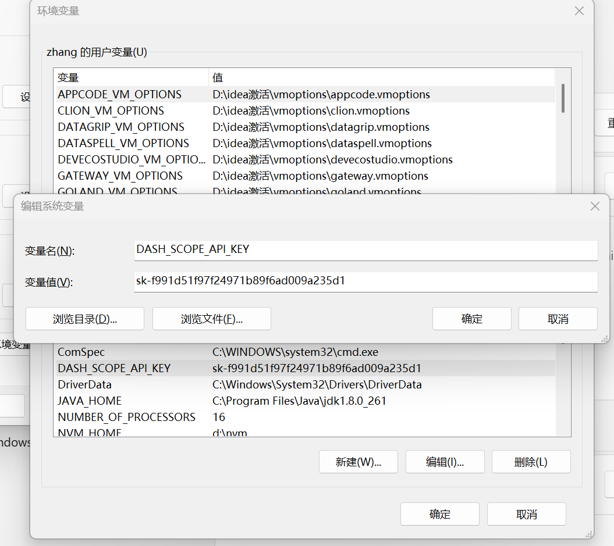
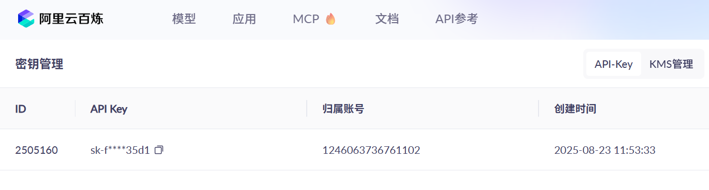
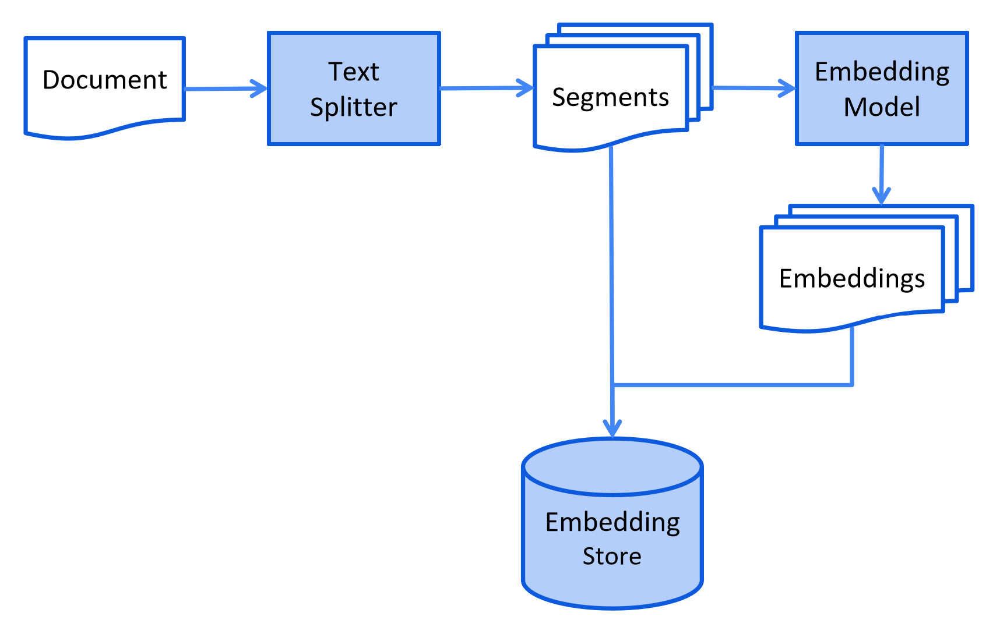
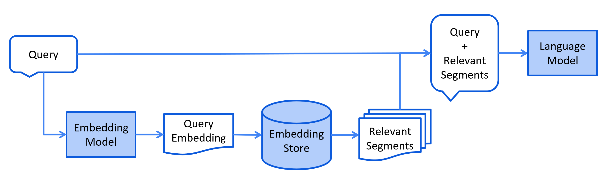

# langchain介绍

欢迎！

LangChain4j 的目标是简化 LLM 与 Java 应用程序的集成。

方法如下：

1. **统一的 API：** LLM 提供商（例如 OpenAI 或 Google Vertex AI）和嵌入（向量）存储（例如 Pinecone 或 Milvus）使用专有 API。LangChain4j 提供统一的 API，避免了为每种 API 学习和实现特定 API 的麻烦。为了尝试不同的 LLM 或嵌入存储，您可以轻松地在它们之间切换，而无需重写代码。LangChain4j 目前支持[15 多个流行的 LLM 提供商](https://docs.langchain4j.dev/integrations/language-models/) 和[20 多个嵌入存储](https://docs.langchain4j.dev/integrations/embedding-stores/)。
2. **全面的工具箱：** 自 2023 年初以来，社区一直在构建大量基于 LLM 的应用程序，识别常见的抽象、模式和技术。LangChain4j 已将这些工具精炼成一个即用型工具包。我们的工具箱涵盖了从低级提示模板、聊天内存管理和函数调用到高级模式（例如 Agents 和 RAG）的各种工具。对于每个抽象，我们都提供了一个接口以及基于常见技术的多个即用型实现。无论您是构建聊天机器人，还是开发具有从数据提取到检索的完整管道的 RAG，LangChain4j 都能提供丰富的选择。
3. **大量示例：** 这些[示例](https://github.com/langchain4j/langchain4j-examples)展示了如何开始创建各种 LLM 驱动的应用程序，提供灵感并使您能够快速开始构建。

LangChain4j 于 2023 年初在 ChatGPT 热潮中启动开发。我们注意到，众多 Python 和 JavaScript LLM 库和框架缺乏 Java 版本，因此我们必须解决这个问题！虽然我们的名字里有“LangChain”，但该项目融合了 LangChain、Haystack、LlamaIndex 以及更广泛社区的理念和概念，并融入了我们自己的创新元素。

我们积极关注社区发展，旨在快速整合新技术和集成，确保您始终保持最新状态。该库正在积极开发中。虽然部分功能仍在开发中，但核心功能已基本到位，让您可以立即开始构建基于 LLM 的应用程序！

## 一.创建java项目

#### 1.1、添加SpringBoot相关依赖

在pom.xml的 project 节点下填加如下依赖

```xml
<properties>
    <maven.compiler.source>17</maven.compiler.source>
    <maven.compiler.target>17</maven.compiler.target>
    <project.build.sourceEncoding>UTF-8</project.build.sourceEncoding>
    <spring-boot.version>3.2.6</spring-boot.version>
    <knife4j.version>4.3.0</knife4j.version>
    <langchain4j.version>1.0.0-beta3</langchain4j.version>
    <mybatis-plus.version>3.5.11</mybatis-plus.version>
</properties>


<dependencies>
    <!-- web应用程序核心依赖 -->
    <dependency>
        <groupId>org.springframework.boot</groupId>
        <artifactId>spring-boot-starter-web</artifactId>
    </dependency>
    <!-- 编写和运行测试用例 -->
    <dependency>
        <groupId>org.springframework.boot</groupId>
        <artifactId>spring-boot-starter-test</artifactId>
        <scope>test</scope>
    </dependency>
    <!-- 前后端分离中的后端接口测试工具 -->
    <dependency>
        <groupId>com.github.xiaoymin</groupId>
        <artifactId>knife4j-openapi3-jakarta-spring-boot-starter</artifactId>
        <version>${knife4j.version}</version>
    </dependency>
</dependencies>

<dependencyManagement>
    <dependencies>
        <!--引入SpringBoot依赖管理清单-->
        <dependency>
            <groupId>org.springframework.boot</groupId>
            <artifactId>spring-boot-dependencies</artifactId>
            <version>${spring-boot.version}</version>
            <type>pom</type>
            <scope>import</scope>
        </dependency>
    </dependencies>
</dependencyManagement>
```

#### 1.2、创建配置文件

在resources下创建配置文件application.properties

```properties
# web服务访问端口
server.port=8080
```

#### 1.3、创建启动类

```java
import org.springframework.boot.SpringApplication;
import org.springframework.boot.autoconfigure.SpringBootApplication;

@SpringBootApplication
public class codeAiApp {
    public static void main(String[] args) {
        SpringApplication.run(CodeAiApp.class, args);
    }
}
```

#### 1.4、启动启动类

访问 http://localhost:8080/doc.html 查看程序能否成功运行并显示如下页面


## 二、接入其他大模型

### 1、都有哪些大模型

- **大语言模型排行榜：**https://superclueai.com/

SuperCLUE 是由国内 CLUE 学术社区于 2023 年 5 月推出的中文通用大模型综合性评测基准。

- **LangChain4j支持接入的大模型**：https://docs.langchain4j.dev/integrations/language-models/

### 2、LangChain4j文档

- **参考文档： Get Started**https://docs.langchain4j.dev/get-started

#### 2.1、LangChain4j 库结构

LangChain4j 具有模块化设计，包括：

1. langchain4j-core 模块，它定义了核心抽象概念（如聊天语言模型和嵌入存储）及其 API。
2. 主 langchain4j 模块，包含有用的工具，如文档加载器、聊天记忆实现，以及诸如人工智能服务等高层功能。
3. 大量的 langchain4j-{集成} 模块，每个模块都将各种大语言模型提供商和嵌入存储集成到 LangChain4j 中。你可以独立使用 langchain4j-{集成} 模块。如需更多功能，只需导入主 langchain4j 依赖项即可。

## 三、接入阿里百炼平台

#### 配置apiKey

**申请apiKey：**https://bailian.console.aliyun.com/?apiKey=1&productCode=p_efm#/api-key



#### 添加依赖

**LangChain4j参考文档：**https://docs.langchain4j.dev/integrations/language-models/dashscope#plain-java

```xml
<dependencies>
    <!-- 接入阿里云百炼平台 -->
    <dependency>
        <groupId>dev.langchain4j</groupId>
        <artifactId>langchain4j-community-dashscope-spring-boot-starter</artifactId>
    </dependency>
</dependencies>


<dependencyManagement>
  <dependencies>
    <!--引入百炼依赖管理清单-->
    <dependency>
        <groupId>dev.langchain4j</groupId>
        <artifactId>langchain4j-community-bom</artifactId>
        <version>${langchain4j.version}</version>
        <type>pom</type>
        <scope>import</scope>
    </dependency>
 </dependencies>
</dependencyManagement>
```

#### 4.5、配置模型参数

```properties
#阿里百炼平台
langchain4j.community.dashscope.chat-model.api-key=${DASH_SCOPE_API_KEY}
langchain4j.community.dashscope.chat-model.model-name=qwen-max
```

#### 4.6、测试通义千问

```java
/**
 * 通义千问大模型
 */
@Autowired
private QwenChatModel qwenChatModel;
@Test
public void testDashScopeQwen() {
    //向模型提问
    String answer = qwenChatModel.chat("你好");
    //输出结果
    System.out.println(answer);
}
```

#### 4.6、测试通义万象

生成图片测试

```java
@Test
public void testDashScopeWanx(){
    WanxImageModel wanxImageModel = WanxImageModel.builder()
            .modelName("wanx2.1-t2i-plus")
            .apiKey(System.getenv("DASH_SCOPE_API_KEY"))
            .build();
    Response<Image> response = wanxImageModel.generate("在秦巴山脉夏天农民伯伯收割完麦子在溪水边休憩");
    System.out.println(response.content().url());
}
```

## 三、人工智能服务 AIService

### 1、什么是AIService

AIService使用面向接口和动态代理的方式完成程序的编写，更灵活的实现高级功能。

#### 1.1、链 Chain

链的概念源自 Python 中的 LangChain。其理念是针对每个常见的用例都设置一条链，比如聊天机器人、检索增强生成（RAG）等。链将多个底层组件组合起来，并协调它们之间的交互。链存在的主要问题是不灵活，我们不进行深入的研究。

#### 1.2、人工智能服务 AIService

在LangChain4j中我们使用AIService完成复杂操作。底层组件将由AIService进行组装。

**AIService可处理最常见的操作：**

- 为大语言模型格式化输入内容
- 解析大语言模型的输出结果

**它们还支持更高级的功能：**

- 聊天记忆 Chat memory
- 工具 Tools
- 检索增强生成 RAG


### 2、创建AIService

#### 2.1、引入依赖

```xml
<!--langchain4j高级功能-->
<dependency>
    <groupId>dev.langchain4j</groupId>
    <artifactId>langchain4j-spring-boot-starter</artifactId>
</dependency>
```

```xml
<dependencyManagement>
        <dependencies>
            <!--引入SpringBoot依赖管理清单-->
            <dependency>
                <groupId>org.springframework.boot</groupId>
                <artifactId>spring-boot-dependencies</artifactId>
                <version>${spring-boot.version}</version>
                <type>pom</type>
                <scope>import</scope>
            </dependency>
            <dependency>
                <groupId>dev.langchain4j</groupId>
                <artifactId>langchain4j-community-bom</artifactId>
                <version>${langchain4j.version}</version>
                <type>pom</type>
                <scope>import</scope>
            </dependency>
            <dependency>
                <groupId>dev.langchain4j</groupId>
                <artifactId>langchain4j-bom</artifactId>
                <version>1.0.0-beta3</version>
                <type>pom</type>
                <scope>import</scope>
            </dependency>

        </dependencies>
    </dependencyManagement>
```


#### 2.2、创建接口

```java
public interface Assistant {
    String chat(String userMessage);
}
```

#### 2.3、测试用例

```java
@SpringBootTest
public class AIServiceTest {

    @Autowired
    private QwenChatModel qwenChatModel;
    
    @Test
    public void testChat() {
        //创建AIService
        Assistant assistant = AiServices.create(Assistant.class, qwenChatModel);
        //调用service的接口
        String answer = assistant.chat("Hello");
        System.out.println(answer);
    }
}
```


#### 2.4、@AiService

也可以在`Assistant`接口上添加`@AiService`注解

```java
//因为我们在配置文件中同时配置了多个大语言模型，所以需要在这里明确指定（EXPLICIT）模型的beanName（qwenChatModel）
@AiService(wiringMode = EXPLICIT, chatModel = "qwenChatModel")
public interface Assistant {
    String chat(String userMessage);
}
```

测试用例中，我们可以直接注入Assistant对象

```java
@Autowired
private Assistant assistant;

@Test
public void testAssistant() {

    String answer = assistant.chat("Hello");
    System.out.println(answer);
}
```


#### 2.5、工作原理

AiServices会**组装Assistant接口以及其他组件**，并使用反射机制创建一个实现Assistant接口的**代理对象**。这个代理对象会处理输入和输出的所有转换工作。在这个例子中，chat方法的输入是一个字符串，但是大模型需要一个`UserMessage`对象。所以，代理对象将这个字符串转换为`UserMessage`，并调用聊天语言模型。chat方法的输出类型也是字符串，但是大模型返回的是 `AiMessage` 对象，代理对象会将其转换为字符串。

**简单理解就是：代理对象的作用是输入转换和输出转换**

## 四、聊天记忆 Chat memory

### 1、测试对话是否有记忆

```java
@SpringBootTest
public class ChatMemoryTest {

    @Autowired
    private Assistant assistant;

    @Test
    public void testChatMemory() {

        String answer1 = assistant.chat("我是张三");
        System.out.println(answer1);

        String answer2 = assistant.chat("我是谁");
        System.out.println(answer2);
    }
}
```

很显然，目前的接入方式，大模型是没有记忆的。


### 2、聊天记忆的简单实现

可以使用下面的方式实现对话记忆。

```java
@Autowired
private QwenChatModel qwenChatModel;
@Test
public void testChatMemory2() {

    //第一轮对话
    UserMessage userMessage1 = UserMessage.userMessage("我是张三");
    ChatResponse chatResponse1 = qwenChatModel.chat(userMessage1);
    AiMessage aiMessage1 = chatResponse1.aiMessage();
    //输出大语言模型的回复
    System.out.println(aiMessage1.text());

    //第二轮对话
    UserMessage userMessage2 = UserMessage.userMessage("你知道我是谁吗");
    ChatResponse chatResponse2 = qwenChatModel.chat(Arrays.asList(userMessage1, aiMessage1, userMessage2));
    AiMessage aiMessage2 = chatResponse2.aiMessage();
    //输出大语言模型的回复
    System.out.println(aiMessage2.text());
}
```

### 3、使用ChatMemory实现聊天记忆

使用AIService可以封装多轮对话的复杂性，使聊天记忆功能的实现变得简单

```java
@Test
public void testChatMemory3() {

    //创建chatMemory
    MessageWindowChatMemory chatMemory = MessageWindowChatMemory.withMaxMessages(10);

    //创建AIService
    Assistant assistant = AiServices
            .builder(Assistant.class)
            .chatLanguageModel(qwenChatModel)
            .chatMemory(chatMemory)
            .build();
    //调用service的接口
    String answer1 = assistant.chat("我是张三");
    System.out.println(answer1);
    String answer2 = assistant.chat("我是谁");
    System.out.println(answer2);
}
```


### 4、使用AIService实现聊天记忆

#### 4.1、创建记忆对话智能体

当AIService由多个组件（大模型，聊天记忆，等）组成的时候，我们就可以称他为`智能体`了

```java

@AiService(
    wiringMode = EXPLICIT,
    chatModel = "qwenChatModel",
    chatMemory = "chatMemory"
)
public interface MemoryChatAssistant {

    String chat(String message);
}
```

#### 4.2、配置ChatMemory

```java

@Configuration
public class MemoryChatAssistantConfig {

    @Bean
    ChatMemory chatMemory() {
        //设置聊天记忆记录的message数量
        return MessageWindowChatMemory.withMaxMessages(10);
    }
}

```

#### 4.3、测试

```java
@Autowired
private MemoryChatAssistant memoryChatAssistant;

@Test
public void testChatMemory4() {
    String answer1 = memoryChatAssistant.chat("我是张三");
    System.out.println(answer1);
    String answer2 = memoryChatAssistant.chat("我是谁");
    System.out.println(answer2);
}
```

### 5、隔离聊天记忆

为每个用户的新聊天或者不同的用户区分聊天记忆

#### 5.1、创建记忆隔离对话智能体

```java

@AiService(
    wiringMode = EXPLICIT, 
    chatMemory = "chatMemory",
    chatMemoryProvider = "chatMemoryProvider"
)
public interface SeparateChatAssistant {

    /**
     * 分离聊天记录
     * @param memoryId 聊天id
     * @param userMessage 用户消息
     * @return
     */
    String chat(@MemoryId int memoryId, @UserMessage String userMessage);
}
```

#### 5.2、配置ChatMemoryProvider

```java
@Configuration
public class SeparateChatAssistantConfig {

    @Bean
    ChatMemoryProvider chatMemoryProvider() {
        return memoryId -> MessageWindowChatMemory.builder()
                .id(memoryId)
            	.maxMessages(10)
                .build();
    }
}

```

#### 5.3、测试对话助手

用两个不同的memoryId测试聊天记忆的隔离效果

```java
@Autowired
private SeparateChatAssistant separateChatAssistant;

@Test
public void testChatMemory5() {
    String answer1 = separateChatAssistant.chat(1,"我是张三");
    System.out.println(answer1);
    String answer2 = separateChatAssistant.chat(1,"我是谁");
    System.out.println(answer2);
    String answer3 = separateChatAssistant.chat(2,"我是谁");
    System.out.println(answer3);
}
```

## 五、持久化聊天记忆 Persistence

默认情况下，聊天记忆存储在内存中。如果需要持久化存储，可以实现一个自定义的聊天记忆存储类，以便将聊天消息存储在你选择的任何持久化存储介质中。

#### 2.5、整合SpringBoot

引入MongoDB依赖：

```xml
<!-- Spring Boot Starter Data MongoDB -->
<dependency>
    <groupId>org.springframework.boot</groupId>
    <artifactId>spring-boot-starter-data-mongodb</artifactId>
</dependency>
```

添加远程连接配置：

```properties
#MongoDB连接配置
spring.data.mongodb.uri=mongodb://localhost:27017/memory_db
```


#### 2.6、CRUD测试

创建实体类：映射MongoDB中的文档（相当与MySQL的表）

```java
@Data
@AllArgsConstructor
@NoArgsConstructor
@Document("chat_messages")
public class ChatMessages {

    //唯一标识，映射到 MongoDB 文档的 _id 字段
    @Id
    private ObjectId messageId;
    //private Long messageId;
    
    private String content; //存储当前聊天记录列表的json字符串
}
```

创建测试类：

```java
@SpringBootTest
public class MongoCrudTest {

    @Autowired
    private MongoTemplate mongoTemplate;

    /**
     * 插入文档
     */
   /* @Test
    public void testInsert() {
        mongoTemplate.insert(new ChatMessages(1L, "聊天记录"));
    }*/

    /**
     * 插入文档
     */
    @Test
    public void testInsert2() {
        ChatMessages chatMessages = new ChatMessages();
        chatMessages.setContent("聊天记录列表");
        mongoTemplate.insert(chatMessages);
    }

    /**
     * 根据id查询文档
     */
    @Test
    public void testFindById() {
        ChatMessages chatMessages = mongoTemplate.findById("abc", ChatMessages.class);
        System.out.println(chatMessages);
    }

    /**
     * 修改文档
     */
    @Test
    public void testUpdate() {

        Criteria criteria = Criteria.where("_id").is("abc");
        Query query = new Query(criteria);
        Update update = new Update();
        update.set("content", "新的聊天记录列表");

        //修改或新增
        mongoTemplate.upsert(query, update, ChatMessages.class);
    }

    /**
     * 新增或修改文档
     */
    @Test
    public void testUpdate2() {

        Criteria criteria = Criteria.where("_id").is("100");
        Query query = new Query(criteria);
        Update update = new Update();
        update.set("content", "新的聊天记录列表");

        //修改或新增
        mongoTemplate.upsert(query, update, ChatMessages.class);
    }

    /**
     * 删除文档
     */
    @Test
    public void testDelete() {
        Criteria criteria = Criteria.where("_id").is("100");
        Query query = new Query(criteria);
        mongoTemplate.remove(query, ChatMessages.class);
    }
}
```

### 3、持久化聊天

#### 3.1、优化实体类

```java
@Data
@AllArgsConstructor
@NoArgsConstructor
@Document("chat_messages")
public class ChatMessages {

    //唯一标识，映射到 MongoDB 文档的 _id 字段
    @Id
    private ObjectId id;

    private int messageId;

    private String content; //存储当前聊天记录列表的json字符串
}
```

#### 3.2、创建持久化类

创建一个类实现ChatMemoryStore接口

```java
@Component
public class MongoChatMemoryStore implements ChatMemoryStore {

    @Autowired
    private MongoTemplate mongoTemplate;

    @Override
    public List<ChatMessage> getMessages(Object memoryId) {
        Criteria criteria = Criteria.where("memoryId").is(memoryId);
        Query query = new Query(criteria);
        ChatMessages chatMessages = mongoTemplate.findOne(query, ChatMessages.class);
        if(chatMessages == null) return new LinkedList<>();
        return ChatMessageDeserializer.messagesFromJson(chatMessages.getContent());
    }

    @Override
    public void updateMessages(Object memoryId, List<ChatMessage> messages) {

        Criteria criteria = Criteria.where("memoryId").is(memoryId);
        Query query = new Query(criteria);

        Update update = new Update();
        update.set("content", ChatMessageSerializer.messagesToJson(messages));

        //根据query条件能查询出文档，则修改文档；否则新增文档
        mongoTemplate.upsert(query, update, ChatMessages.class);
    }

    @Override
    public void deleteMessages(Object memoryId) {
        Criteria criteria = Criteria.where("memoryId").is(memoryId);
        Query query = new Query(criteria);
        mongoTemplate.remove(query, ChatMessages.class);
    }
}
```

在SeparateChatAssistantConfig中，添加MongoChatMemoryStore对象的配置

```java
@Configuration
public class SeparateChatAssistantConfig {

    //注入持久化对象
    @Autowired
    private MongoChatMemoryStore mongoChatMemoryStore;

    @Bean
    ChatMemoryProvider chatMemoryProvider() {
        return memoryId -> MessageWindowChatMemory.builder()
                .id(memoryId)
                .maxMessages(10)
                .chatMemoryStore(mongoChatMemoryStore)//配置持久化对象
                .build();
    }
}
```

### 4、测试

发现MongoDB中已经存储了会话记录

## 六、提示词 Prompt

### 1、系统提示词

**@SystemMessage** 设定角色，塑造AI助手的专业身份，明确助手的能力范围

#### 1.1、配置@SystemMessage

在SeparateChatAssistant类的chat方法上添加@SystemMessage注解

```java
@SystemMessage("你是我的好朋友，请用陕西话回答问题。")//系统消息提示词
String chat(@MemoryId int memoryId, @UserMessage String userMessage);
```

`@SystemMessage`的内容将在后台转换为 `SystemMessage`对象，并与 `UserMessage` 一起发送给大语言模型（LLM）。

SystemMessaged的内容只会发送给大模型一次。

如果你修改了SystemMessage的内容，新的SystemMessage会被发送给大模型，之前的聊天记忆会失效。


#### 1.2、测试

```java
@SpringBootTest
public class PromptTest {

    @Autowired
    private SeparateChatAssistant separateChatAssistant;

    @Test
    public void testSystemMessage() {
        String answer = separateChatAssistant.chat(3,"今天心情怎么样哈哈");
        System.out.println(answer);
    }
}
```

如果要显示今天的日期，我们需要在提示词中添加当前日期的占位符{{current_date}}

```java
@SystemMessage("你是我的好朋友，请用陕西话回答问题。今天是{{current_date}}")//系统消息提示词
String chat(@MemoryId int memoryId, @UserMessage String userMessage);
```


#### 1.3、从资源中加载提示模板

`@SystemMessage` 注解还可以从资源中加载提示模板：

```java
@SystemMessage(fromResource = "prompt-template.txt")
String chat(@MemoryId int memoryId, @UserMessage String userMessage);
```

prompt-template.txt

```txt
你是我的好朋友，请用陕西话回答问题，回答问题的时候适当添加表情符号。
```

{{current_date}}表示当前日期

```text
你是我的好朋友，请用陕西话回答问题，回答问题的时候适当添加表情符号。
今天是 {{current_date}}。
```


### 2、用户提示词模板

**@UserMessage：**获取用户输入

#### 2.1、配置@UserMessage

在`MemoryChatAssistant`的`chat`方法中添加注解

```java
@UserMessage("你是我的助手，请用陕西话回答问题，并且添加一些表情符号。 {{pp}}") //{{pp}}表示这里唯一的参数的占位符
String chat(String message);
```


#### 2.2、测试

```java
@Autowired
private MemoryChatAssistant memoryChatAssistant;

@Test
public void testUserMessage() {
    String answer = memoryChatAssistant.chat("我是张三");
    System.out.println(answer);
}
```


### 3、指定参数名称

#### 3.1、配置@V

**@V** 明确指定传递的参数名称

```java
@UserMessage("你是我的助手，请用陕西话回答问题。{{message}}")
String chat(@V("message") String userMessage);
```


#### 3.2、多个参数的情况

如果有两个或两个以上的参数，我们必须要用`@V`，在`SeparateChatAssistant`中定义方法`chat2`

```java
@UserMessage("你是我的助手，请用陕西话回答问题。{{message}}")
String chat2(@MemoryId int memoryId, @V("message") String userMessage);
```

测试：`@UserMessage`中的内容每次都会被和用户问题组织在一起发送给大模型

```java
@Test
public void testV() {
    String answer1 = separateChatAssistant.chat2(1, "我是张三");
    System.out.println(answer1);
    String answer2 = separateChatAssistant.chat2(1, "我是谁");
    System.out.println(answer2);
}
```


#### 3.3、@SystemMessage和@V

也可以将`@SystemMessage`和`@V`结合使用

在`SeparateChatAssistant`中添加方法chat3

```java
@SystemMessage(fromResource = "prompt-template3.txt")
String chat3(
    @MemoryId int memoryId, 
    @UserMessage String userMessage, 
    @V("username") String username, 
    @V("age") int age
);
```

创建提示词模板prompt-template3.txt，添加占位符

```txt
你是我的好朋友，我是{{username}}，我的年龄是{{age}}，请用陕西话回答问题，回答问题的时候适当添加表情符号。
```

测试：

```java
@Test
public void testUserInfo() {
    String answer = separateChatAssistant.chat3(1, "我是谁，我的十二生肖是", "张三", 22);
    System.out.println(answer);
}
```


## 七、检索增强生成 RAG


LLM 的知识仅限于它已经训练过的数据。 如果你想让 LLM 了解特定领域的知识或专有数据，你可以：

- 使用 RAG，我们将在本节中介绍
- 用你的数据微调 LLM
- [结合 RAG 和微调](https://gorilla.cs.berkeley.edu/blogs/9_raft.html)

### 什么是 RAG？

简单来说，RAG 是一种在发送给 LLM 之前，从你的数据中找到并注入相关信息片段到提示中的方法。 这样 LLM 将获得（希望是）相关信息，并能够使用这些信息回复， 这应该会降低产生幻觉的概率。

相关信息片段可以使用各种[信息检索](https://en.wikipedia.org/wiki/Information_retrieval)方法找到。 最流行的方法有：

- 全文（关键词）搜索。这种方法使用 TF-IDF 和 BM25 等技术， 通过匹配查询（例如，用户提问的内容）中的关键词与文档数据库进行搜索。 它根据每个文档中这些关键词的频率和相关性对结果进行排名。
- 向量搜索，也称为"语义搜索"。 文本文档使用嵌入模型转换为数字向量。 然后根据查询向量和文档向量之间的余弦相似度 或其他相似度/距离度量找到并排序文档， 从而捕捉更深层次的语义含义。
- 混合搜索。结合多种搜索方法（例如，全文 + 向量）通常可以提高搜索的有效性。

目前，本页主要关注向量搜索。 全文和混合搜索目前仅由 Azure AI Search 集成支持， 详情请参阅 `AzureAiSearchContentRetriever`。 我们计划在不久的将来扩展 RAG 工具箱，包括全文和混合搜索。

### RAG 阶段

RAG 过程分为两个不同的阶段：索引和检索。 LangChain4j 为这两个阶段提供了工具。

### 索引

在索引阶段，文档会被预处理，以便在检索阶段进行高效搜索。

这个过程可能因使用的信息检索方法而异。 对于向量搜索，这通常涉及清理文档、用额外数据和元数据丰富文档、 将文档分割成更小的片段（也称为分块）、嵌入这些片段，最后将它们存储在嵌入存储（也称为向量数据库）中。

索引阶段通常是离线进行的，这意味着最终用户不需要等待其完成。 例如，可以通过定时任务在周末每周重新索引一次公司内部文档来实现。 负责索引的代码也可以是一个单独的应用程序，只处理索引任务。

然而，在某些情况下，最终用户可能希望上传自己的自定义文档，使 LLM 能够访问这些文档。 在这种情况下，索引应该在线进行，并成为主应用程序的一部分。

以下是索引阶段的简化图表：

[](https://docs.langchain4j.info/tutorials/rag)

### 检索

检索阶段通常在线进行，当用户提交一个应该使用索引文档回答的问题时。

这个过程可能因使用的信息检索方法而异。 对于向量搜索，这通常涉及嵌入用户的查询（问题） 并在嵌入存储中执行相似度搜索。 然后将相关片段（原始文档的片段）注入到提示中并发送给 LLM。

以下是检索阶段的简化图表： [](https://docs.langchain4j.info/tutorials/rag)

### LangChain4j 中的 RAG 风格

LangChain4j 提供了三种 RAG 风格：

- [Easy RAG](https://docs.langchain4j.info/tutorials/rag/#easy-rag)：开始使用 RAG 的最简单方式
- [Naive RAG](https://docs.langchain4j.info/tutorials/rag/#naive-rag)：使用向量搜索的基本 RAG 实现
- [Advanced RAG](https://docs.langchain4j.info/tutorials/rag/#advanced-rag)：一个模块化的 RAG 框架，允许额外的步骤，如 查询转换、从多个来源检索和重新排序

### 1、文档加载器 Document Loader

#### 1.1、常见文档加载器

- `来自 langchain4j 模块的文件系统文档加载器（FileSystemDocumentLoader）`
- 来自 langchain4j 模块的类路径文档加载器（ClassPathDocumentLoader）
- 来自 langchain4j 模块的网址文档加载器（UrlDocumentLoader）
- 来自 langchain4j-document-loader-amazon-s3 模块的亚马逊 S3 文档加载器（AmazonS3DocumentLoader）
- 来自 langchain4j-document-loader-azure-storage-blob 模块的 Azure Blob 存储文档加载器（AzureBlobStorageDocumentLoader）
- 来自 langchain4j-document-loader-github 模块的 GitHub 文档加载器（GitHubDocumentLoader）
- 来自 langchain4j-document-loader-google-cloud-storage 模块的谷歌云存储文档加载器（GoogleCloudStorageDocumentLoader）
- 来自 langchain4j-document-loader-selenium 模块的 Selenium 文档加载器（SeleniumDocumentLoader）
- 来自 langchain4j-document-loader-tencent-cos 模块的腾讯云对象存储文档加载器（TencentCosDocumentLoader）

#### 1.2、测试文档加载

```java
@SpringBootTest
public class RAGTest {

    @Test
    public void testReadDocument() {
        //使用FileSystemDocumentLoader读取指定目录下的知识库文档
        //并使用默认的文档解析器TextDocumentParser对文档进行解析
        Document document = FileSystemDocumentLoader.loadDocument("D:/knowledge/测试.txt");
        System.out.println(document.text());
    }
}
```

其他加载文档的方式

```java
// 加载单个文档
Document document = FileSystemDocumentLoader.loadDocument("E:/knowledge/file.txt", new TextDocumentParser());

// 从一个目录中加载所有文档
List<Document> documents = FileSystemDocumentLoader.loadDocuments("E:/knowledge", new TextDocumentParser());

// 从一个目录中加载所有的.txt文档
PathMatcher pathMatcher = FileSystems.getDefault().getPathMatcher("glob:*.txt");
List<Document> documents = FileSystemDocumentLoader.loadDocuments("E:/knowledge", pathMatcher, new TextDocumentParser());

// 从一个目录及其子目录中加载所有文档
List<Document> documents = FileSystemDocumentLoader.loadDocumentsRecursively("E:/knowledge", new TextDocumentParser());
```


### 2、文档解析器 Document Parser 

#### 2.1、常见文档解析器

文档可以是各种格式的文件，比如 PDF、DOC、TXT 等等。为了解析这些不同格式的文件，有一个 “文档解析器”（DocumentParser）接口，并且我们的库中包含了该接口的几种实现方式：

- `来自 langchain4j 模块的文本文档解析器（TextDocumentParser），它能够解析纯文本格式的文件（例如 TXT、HTML、MD 等）。`
- 来自 langchain4j-document-parser-apache-pdfbox 模块的 Apache PDFBox 文档解析器（ApachePdfBoxDocumentParser），它可以解析 PDF 文件。
- 来自 langchain4j-document-parser-apache-poi 模块的 Apache POI 文档解析器（ApachePoiDocumentParser），它能够解析微软办公软件的文件格式（例如 DOC、DOCX、PPT、PPTX、XLS、XLSX 等）。
- 来自 langchain4j-document-parser-apache-tika 模块的 Apache Tika 文档解析器（ApacheTikaDocumentParser），它可以自动检测并解析几乎所有现有的文件格式。


假设如果我们想解析PDF文档，那么原有的`TextDocumentParser`就无法工作了，我们需要引入`langchain4j-document-parser-apache-pdfbox`

#### 2.2、添加依赖

```xml
<!--解析pdf文档-->
<dependency>
    <groupId>dev.langchain4j</groupId>
    <artifactId>langchain4j-document-parser-apache-pdfbox</artifactId>
</dependency>
```

#### 2.3、解析pdf文档

```java
 /**
     * 解析PDF
     */
@Test
public void testParsePDF() {
    Document document = FileSystemDocumentLoader.loadDocument(
            "E:/knowledge/课程信息.pdf",
            new ApachePdfBoxDocumentParser()
    );
    System.out.println(document);
}
```


### 3、文档分割器 Document Splitter

#### 3.1、常见文档分割器

LangChain4j 有一个 “文档分割器”（DocumentSplitter）接口，并且提供了几种开箱即用的实现方式：

`按段落文档分割器（DocumentByParagraphSplitter）`

按行文档分割器（DocumentByLineSplitter）

按句子文档分割器（DocumentBySentenceSplitter）

按单词文档分割器（DocumentByWordSplitter）

按字符文档分割器（DocumentByCharacterSplitter）

按正则表达式文档分割器（DocumentByRegexSplitter）

递归分割：DocumentSplitters.recursive (...)

默认情况下每个文本片段最多不能超过300个token

#### 3.2、测试向量转换和向量存储

Embedding (Vector) Stores 常见的意思是 “嵌入（向量）存储” 。在机器学习和自然语言处理领域，Embedding 指的是将数据（如文本、图像等）转换为低维稠密向量表示的过程，这些向量能够保留数据的关键特征。而 Stores 表示存储，即用于存储这些嵌入向量的系统或工具。它们可以高效地存储和检索向量数据，支持向量相似性搜索，在文本检索、推荐系统、图像识别等任务中发挥着重要作用。

**Langchain4j支持的向量存储：**https://docs.langchain4j.dev/integrations/embedding-stores/

添加依赖：

```xml
<!--简单的rag实现-->
<dependency>
    <groupId>dev.langchain4j</groupId>
    <artifactId>langchain4j-easy-rag</artifactId>
</dependency>
```

测试：

```java
/**
 * 加载文档并存入向量数据库
 */
@Test
public void testReadDocumentAndStore() {

    //使用FileSystemDocumentLoader读取指定目录下的知识库文档
    //并使用默认的文档解析器对文档进行解析(TextDocumentParser)
    Document document = FileSystemDocumentLoader.loadDocument("E:/knowledge/course.md");

    //为了简单起见，我们暂时使用基于内存的向量存储
    InMemoryEmbeddingStore<TextSegment> embeddingStore = new InMemoryEmbeddingStore<>();

    //ingest
    //1、分割文档：默认使用递归分割器，将文档分割为多个文本片段，每个片段包含不超过 300个token，并且有 30个token的重叠部分保证连贯性
    //DocumentByParagraphSplitter(DocumentByLineSplitter(DocumentBySentenceSplitter(DocumentByWordSplitter)))
    //2、文本向量化：使用一个LangChain4j内置的轻量化向量模型对每个文本片段进行向量化
    //3、将原始文本和向量存储到向量数据库中(InMemoryEmbeddingStore)
    EmbeddingStoreIngestor.ingest(document, embeddingStore);
    //查看向量数据库内容
    System.out.println(embeddingStore);
}
```


#### 3.3、测试文档分割

```java
/**
 * 文档分割
 */
@Test
public void testDocumentSplitter() {

    //使用FileSystemDocumentLoader读取指定目录下的知识库文档
    //并使用默认的文档解析器对文档进行解析(TextDocumentParser)
    Document document = FileSystemDocumentLoader.loadDocument("E:/knowledge/course.md");

    //为了简单起见，我们暂时使用基于内存的向量存储
    InMemoryEmbeddingStore<TextSegment> embeddingStore = new InMemoryEmbeddingStore<>();

    //自定义文档分割器
    //按段落分割文档：每个片段包含不超过 300个token，并且有 30个token的重叠部分保证连贯性
    //注意：当段落长度总和小于设定的最大长度时，就不会有重叠的必要。
    DocumentByParagraphSplitter documentSplitter = new DocumentByParagraphSplitter(
            300,
            30,
            //token分词器：按token计算
            new HuggingFaceTokenizer());
    //按字符计算
    //DocumentByParagraphSplitter documentSplitter = new DocumentByParagraphSplitter(300, 30);

    EmbeddingStoreIngestor
            .builder()
            .embeddingStore(embeddingStore)
            .documentSplitter(documentSplitter)
            .build()
            .ingest(document);
}
```

#### 3.4、token和token计算

DeepSeek：[Token 用量计算 | DeepSeek API Docs](https://api-docs.deepseek.com/zh-cn/quick_start/token_usage)

阿里百炼：[百炼控制台](https://bailian.console.aliyun.com/?spm=5176.29597918.J_SEsSjsNv72yRuRFS2VknO.2.18867ca0uXrEFa#/efm/model_experience_center)

LangChain4j：

```java
@Test
public void testTokenCount() {
    String text = "这是一个示例文本，用于测试 token 长度的计算。";
    UserMessage userMessage = UserMessage.userMessage(text);

    //计算 token 长度
    //QwenTokenizer tokenizer = new QwenTokenizer(System.getenv("DASH_SCOPE_API_KEY"), "qwen-max");
    HuggingFaceTokenizer tokenizer = new HuggingFaceTokenizer();
    int count = tokenizer.estimateTokenCountInMessage(userMessage);
    System.out.println("token长度：" + count);
}
```

#### 3.5、工作方式

1. 实例化一个 “文档分割器”（DocumentSplitter），指定所需的 “文本片段”（TextSegment）大小，并且可以选择指定characters 或token的重叠部分。
2. “文档分割器”（DocumentSplitter）将给定的文档（Document）分割成更小的单元，这些单元的性质因分割器而异。例如，“按段落分割文档器”（DocumentByParagraphSplitter）将文档分割成段落（由两个或更多连续的换行符定义），而 “按句子分割文档器”（DocumentBySentenceSplitter）使用 OpenNLP 库的句子检测器将文档分割成句子，依此类推。
3. 然后，“文档分割器”（DocumentSplitter）将这些较小的单元（段落、句子、单词等）组合成 “文本片段”（TextSegment），尝试在单个 “文本片段”（TextSegment）中包含尽可能多的单元，同时不超过第一步中设置的限制。如果某些单元仍然太大，无法放入一个 “文本片段”（TextSegment）中，它会调用一个子分割器。这是另一个 “文档分割器”（DocumentSplitter），能够将不适合的单元分割成更细粒度的单元。会向每个文本片段添加一个唯一的元数据条目 “index”。第一个 “文本片段”（TextSegment）将包含 `index=0`，第二个是 `index=1`，依此类推


`模型上下文窗口`可以通过模型参数列表查看：[阿里云百炼](https://bailian.console.aliyun.com/?tab=doc#/doc/?type=model&url=https%3A%2F%2Fhelp.aliyun.com%2Fdocument_detail%2F2840914.html)

**期望的文本片段最大大小**

1. **模型上下文窗口**：如果你使用的大语言模型（LLM）有特定的上下文窗口限制，这个值不能超过模型能够处理的最大 token 数。例如，某些模型可能最大只能处理 2048 个 token，那么设置的文本片段大小就需要远小于这个值，为后续的处理（如添加指令、其他输入等）留出空间。通常，在这种情况下，你可以设置为 1000 - 1500 左右，具体根据实际情况调整。
2. **数据特点**：如果你的文档内容较为复杂，每个段落包含的信息较多，那么可以适当提高这个值，比如设置为 500 - 800 个 token，以便在一个文本片段中包含相对完整的信息块。相反，如果文档段落较短且信息相对独立，设置为 200 - 400 个 token 可能就足够了。
3. **检索需求**：如果希望在检索时能够更精确地匹配到相关信息，较小的文本片段可能更合适，这样可以提高信息的粒度。例如设置为 200 - 300 个 token。但如果更注重获取完整的上下文信息，较大的文本片段（如 500 - 600 个 token）可能更有助于理解相关内容。

**重叠部分大小**

1. **上下文连贯性**：重叠部分的主要作用是提供上下文连贯性，避免因分割导致信息缺失。如果文档内容之间的逻辑联系紧密，建议设置较大的重叠部分，如 50 - 100 个 token，以确保相邻文本片段之间的过渡自然，模型在处理时能够更好地理解上下文。
2. **数据冗余**：然而，设置过大的重叠部分会增加数据的冗余度，可能导致处理时间增加和资源浪费。因此，需要在上下文连贯性和数据冗余之间进行平衡。一般来说，20 - 50 个 token 的重叠是比较常见的取值范围。
3. **模型处理能力**：如果使用的模型对输入的敏感性较高，较小的重叠部分（如 20 - 30 个 token）可能就足够了，因为过多的重叠可能会引入不必要的干扰信息。但如果模型对上下文依赖较大，适当增加重叠部分（如 40 - 60 个 token）可能会提高模型的性能。

例如，在处理一般性的文本资料，且使用的模型上下文窗口较大（如 4096 个 token）时，设置文本片段最大大小为 600 - 800 个 token，重叠部分为 30 - 50 个 token 可能是一个不错的选择。但最终的设置还需要通过实验和实际效果评估来确定，以找到最适合具体应用场景的参数值。

## 八、 Function Calling 函数调用 

`Function Calling 函数调用` 也叫  `Tools 工具`

### 1、入门案例

例如，大语言模型本身并不擅长数学运算。如果应用场景中偶尔会涉及到数学计算，我们可以为他提供一个 “数学工具”。当我们提出问题时，大语言模型会判断是否使用某个工具。

#### 1.1、创建工具类

用 `@Tool` 注解的方法：

- 既可以是静态的，也可以是非静态的；
- 可以具有任何可见性（公有、私有等）。

```java
@Component
public class CalculatorTools {
    
    @Tool
    double sum(double a, double b) {
        System.out.println("调用加法运算");
        return a + b;
    }

    @Tool
    double squareRoot(double x) {
         System.out.println("调用平方根运算");
        return Math.sqrt(x);
    }
}
```

#### 1.2、配值工具类

在SeparateChatAssistant中添加tools属性配置

```java
@AiService(
        wiringMode = EXPLICIT,
        chatModel = "qwenChatModel",
        chatMemoryProvider = "chatMemoryProvider",
        tools = "calculatorTools" //配置tools
)
```

#### 1.3、测试工具类

```java
@SpringBootTest
public class ToolsTest {

    @Autowired
    private SeparateChatAssistant separateChatAssistant;

    @Test
    public void testCalculatorTools() {

        String answer = separateChatAssistant.chat(1, "1+2等于几，888888的平方根是多少？");
        System.out.println(answer);
    }
}
```

测试后可以查看持久化存储中SYSTEM、USER、AI以及Tools的消息，分析tools的调用流程：

```
Request:
\- messages:
	\- SystemMessage:
		\- text: 系统定义AI的角色
    \- UserMessage:
        \- text: 用户提问
    \- AiMessage:
        \- toolExecutionRequests:
            \- ai获取提问信息组织参数调用工具方法
    \- ToolExecutionResultMessage:
        \- text: 工具方法执行

Response :
\- AiMessage:
    \- text: 根据工具方法的执行ai再次组织结果返回
```


### 2、@Tool 注解的可选字段

`@Tool` 注解有两个可选字段：

- **name（工具名称）**：工具的名称。如果未提供该字段，方法名会作为工具的名称。
- **value（工具描述）**：工具的描述信息。

根据工具的不同，即使没有任何描述，大语言模型可能也能很好地理解它（例如，`add(a, b)` 就很直观），但通常最好提供清晰且有意义的名称和描述。这样，大语言模型就能获得更多信息，以决定是否调用给定的工具以及如何调用。

### 3、@P 注解

方法参数可以选择使用 `@P` 注解进行标注。

`@P` 注解有两个字段：

- **value**：参数的描述信息，这是必填字段。
- **required**：表示该参数是否为必需项，默认值为 `true`，此为可选字段。

### 4、@ToolMemoryId

如果你的AIService方法中有一个参数使用 `@MemoryId` 注解，那么你也可以使用 `@ToolMemoryId` 注解 `@Tool` 方法中的一个参数。提供给AIService方法的值将自动传递给 `@Tool` 方法。如果你有多个用户，或每个用户有多个聊天记忆，并且希望在 `@Tool` 方法中对它们进行区分，那么这个功能会很有用。

```java
public class CalculatorTools {

    @Tool(name = "加法", value = "返回两个参数相加之和")
    double sum(
            @ToolMemoryId int memoryId,
            @P(value="加数1", required = true) double a,
            @P(value="加数2", required = true) double b) {
        System.out.println("调用加法运算 " + memoryId);
        return a + b;
    }

    @Tool(name = "平方根", value = "返回给定参数的平方根")
    double squareRoot(
            @ToolMemoryId int memoryId, double x) {

        System.out.println("调用平方根运算 " + memoryId);
        return Math.sqrt(x);
    }
}
```

## 九.配置 Qdrant 向量数据库

### 1.安装 Qdrant

添加依赖：项目 `pom.xml` 文件中添加：

```xml
<!--qdrant-->  
<dependency>  
    <groupId>dev.langchain4j</groupId>  
    <artifactId>langchain4j-qdrant</artifactId>  
</dependency>
```

Docker 部署 qdrant：`docker run -p 6333:6333 -p 6334:6334 qdrant/qdrant`

- 6333 端口：前端端口，访问 `http://localhost:6333/dashboard#/welcome` 即可看到前端界面
- 6334 端口：gRpc 调用端口

application.properties

```properties
qdrant.host=192.168.200.128
qdrant.port=6334
qdrant.collection-name=codeai
qdrant.use-tls=false
```

### 2.EmbeddingStoreConfig

```java
@Configuration
public class EmbeddingStoreConfig {

    @Autowired
    private EmbeddingModel embeddingModel;

    @Value("${qdrant.host}")
    private String qdrantHost;

    @Value("${qdrant.port}")
    private int qdrantPort;

    @Value("${qdrant.collection-name}")
    private String collectionName;

    @Value("${qdrant.use-tls}")
    private boolean useTls;

    @Bean
    public EmbeddingStore<TextSegment> embeddingStore() {
        // 创建Qdrant向量存储
        return QdrantEmbeddingStore.builder()
                .host(qdrantHost)
                .port(qdrantPort)
                .collectionName(collectionName)
                .useTls(useTls)
                .build();
    }
}
```

### 3.QdrantConfig

```java
package com.pp.config;

import dev.langchain4j.model.embedding.EmbeddingModel;
import io.qdrant.client.QdrantClient;
import io.qdrant.client.QdrantGrpcClient;
import io.qdrant.client.grpc.Collections.CollectionInfo;
import io.qdrant.client.grpc.Collections.CollectionOperationResponse;
import io.qdrant.client.grpc.Collections.CreateCollection;
import io.qdrant.client.grpc.Collections.Distance;
import io.qdrant.client.grpc.Collections.VectorParams;
import org.springframework.beans.factory.annotation.Value;
import org.springframework.boot.context.event.ApplicationReadyEvent;
import org.springframework.context.ApplicationListener;
import org.springframework.context.annotation.Bean;
import org.springframework.context.annotation.Configuration;
import org.springframework.stereotype.Component;
import io.grpc.Status;
import io.grpc.StatusRuntimeException;

@Configuration
public class QdrantConfig {

    @Value("${qdrant.host}")
    private String qdrantHost;

    @Value("${qdrant.port}")
    private int qdrantPort;

    @Value("${qdrant.use-tls}")
    private boolean useTls;

    // Qdrant客户端：用于管理Collection等操作
    @Bean
    public QdrantClient qdrantClient() {
        QdrantGrpcClient.Builder grpcClientBuilder =
                QdrantGrpcClient.newBuilder(qdrantHost, qdrantPort, useTls);
        return new QdrantClient(grpcClientBuilder.build());
    }

    // 集合初始化组件 - 在应用启动完成后执行
    @Component
    public static class QdrantCollectionInitializer implements ApplicationListener<ApplicationReadyEvent> {

        private final QdrantClient qdrantClient;
        private final EmbeddingModel embeddingModel;
        private final String collectionName;

        public QdrantCollectionInitializer(QdrantClient qdrantClient, 
                                          EmbeddingModel embeddingModel,
                                          @Value("${qdrant.collection-name}") String collectionName) {
            this.qdrantClient = qdrantClient;
            this.embeddingModel = embeddingModel;
            this.collectionName = collectionName;
        }

        @Override
        public void onApplicationEvent(ApplicationReadyEvent event) {
            initializeCollection();
        }

        private void initializeCollection() {
            try {
                // 检查collection是否存在，如果不存在则创建
                try {
                    CollectionInfo info = qdrantClient.getCollectionInfoAsync(collectionName).get();
                    System.out.println("Collection '" + collectionName + "' already exists.");
                } catch (Exception e) {
                    // 检查是否是因为集合不存在导致的异常
                    if (e.getCause() instanceof StatusRuntimeException) {
                        StatusRuntimeException statusException = (StatusRuntimeException) e.getCause();
                        if (statusException.getStatus().getCode() == Status.Code.NOT_FOUND) {
                            // Collection不存在，创建新的collection
                            System.out.println("Creating collection: " + collectionName);
                            createCollection();
                        } else {
                            // 其他gRPC错误
                            System.err.println("gRPC error: " + statusException.getStatus());
                            // 不抛出异常，让应用继续启动
                        }
                    } else {
                        // 其他异常，不抛出异常，让应用继续启动
                        System.err.println("Failed to check Qdrant collection: " + e.getMessage());
                    }
                }
            } catch (Exception e) {
                System.err.println("Failed to initialize Qdrant collection: " + e.getMessage());
                // 不抛出异常，让应用继续启动
            }
        }

        private void createCollection() {
            try {
                CreateCollection createCollection = CreateCollection.newBuilder()
                        .setCollectionName(collectionName)
                        .setVectorsConfig(
                                io.qdrant.client.grpc.Collections.VectorsConfig.newBuilder()
                                        .setParams(VectorParams.newBuilder()
                                                .setSize(embeddingModel.dimension()) // 使用embedding模型的维度
                                                .setDistance(Distance.Cosine) // 使用余弦距离
                                                .build())
                                        .build())
                        .build();

                CollectionOperationResponse response = qdrantClient.createCollectionAsync(createCollection).get();
                System.out.println("Collection created successfully: " + response.getResult());
            } catch (Exception e) {
                System.err.println("Failed to create Qdrant collection: " + e.getMessage());
                // 不抛出异常，让应用继续启动
            }
        }
    }
}
```

### 4.创建测试类

#### properties配置

```properties
langchain4j.community.dashscope.embedding-model.api-key=${DASH_SCOPE_API_KEY}
langchain4j.community.dashscope.embedding-model.model-name=text-embedding-v3
```

```java
@SpringBootTest
public class EmbeddingTest {

    @Autowired
    private EmbeddingModel embeddingModel;
    @Autowired
    private EmbeddingStore embeddingStore;
    }
```

### 5.测试向量维度

```java
 @Test
    public void testEmbeddingModel(){
        Response<Embedding> embed = embeddingModel.embed("hello");

        System.out.println("向量维度：" + embed.content().vector().length);
        System.out.println("向量输出：" + embed.toString());
    }
```

### 6.文本转换成向量，然后存储到qdrant中

```java
/**
     * 将文本转换成向量，然后存储到qdrant中
     *
     * 参考：
     * https://docs.langchain4j.dev/tutorials/embedding-stores
     */
    @Test
    public void testqdrantEmbeded() {

        //将文本转换成向量
        TextSegment segment1 = TextSegment.from("我最喜欢吃辣椒");
        Embedding embedding1 = embeddingModel.embed(segment1).content();
        //存入向量数据库
        embeddingStore.add(embedding1, segment1);

        TextSegment segment2 = TextSegment.from("今天心情真好");
        Embedding embedding2 = embeddingModel.embed(segment2).content();
        embeddingStore.add(embedding2, segment2);
    }
```

### 7.相似度匹配

```java
  /**
     * 相似度匹配
     */
    @Test
    public void embeddingSearch() {

        //提问，并将问题转成向量数据
        Embedding queryEmbedding = embeddingModel.embed("你最喜欢成什么？").content();
        //创建搜索请求对象
        EmbeddingSearchRequest searchRequest = EmbeddingSearchRequest.builder()
                .queryEmbedding(queryEmbedding)
                .maxResults(1) //匹配最相似的一条记录
                //.minScore(0.8)
                .build();

        //根据搜索请求 searchRequest 在向量存储中进行相似度搜索
        EmbeddingSearchResult<TextSegment> searchResult = embeddingStore.search(searchRequest);

        //searchResult.matches()：获取搜索结果中的匹配项列表。
        //.get(0)：从匹配项列表中获取第一个匹配项
        EmbeddingMatch<TextSegment> embeddingMatch = searchResult.matches().get(0);

        //获取匹配项的相似度得分
        System.out.println(embeddingMatch.score());

        //返回文本结果
        System.out.println(embeddingMatch.embedded().text());
    }
```

### 8.指定目录下的知识库文档上传到知识库

```java

  @Test
    public void testUploadKnowledgeLibrary() {

        //使用FileSystemDocumentLoader读取指定目录下的知识库文档
        //并使用默认的文档解析器对文档进行解析
        Document document1 = FileSystemDocumentLoader.loadDocument("c:\\Users\\zhang\\Desktop\\java-ai-langchain4j\\java-ai-langchain4j\\knowledge\\course_info.md");
        Document document2 = FileSystemDocumentLoader.loadDocument("c:\\Users\\zhang\\Desktop\\java-ai-langchain4j\\java-ai-langchain4j\\knowledge\\platform_info.md");
        Document document3 = FileSystemDocumentLoader.loadDocument("c:\\Users\\zhang\\Desktop\\java-ai-langchain4j\\java-ai-langchain4j\\knowledge\\teacher_info.md");
        List<Document> documents = Arrays.asList(document1, document2, document3);

        //文本向量化并存入向量数据库：将每个片段进行向量化，得到一个嵌入向量
        EmbeddingStoreIngestor
                .builder()
                .embeddingStore(embeddingStore)
                .embeddingModel(embeddingModel)
                .build()
                .ingest(documents);
    }
```

## 十.网课助手

### 1.数据库创建

```sql
CREATE TABLE IF NOT EXISTS `course` (
  `id` bigint NOT NULL AUTO_INCREMENT COMMENT '主键',
  `username` varchar(50) NOT NULL COMMENT '用户名',
  `id_card` varchar(18) NOT NULL COMMENT '身份证号',
  `course_name` varchar(100) NOT NULL COMMENT '课程名称',
  `date` varchar(20) NOT NULL COMMENT '购买日期',
  `time` varchar(10) NOT NULL COMMENT '购买时间（上午/下午）',
  `teacher_name` varchar(50) DEFAULT NULL COMMENT '老师姓名',
  `price` varchar(20) DEFAULT NULL COMMENT '课程价格',
  PRIMARY KEY (`id`)
) ENGINE=InnoDB DEFAULT CHARSET=utf8mb4 COMMENT='课程购买记录表';
```

### 2.实体类

```java
@Data
@AllArgsConstructor
@NoArgsConstructor
public class Course {

    @TableId(type = IdType.AUTO)
    private Long id;
    private String username;
    private String idCard;
    private String courseName;
    private String date;
    private String time;
    private String teacherName;
    private String price;
}
```

### 3.配置项目为流式输出

```xml
  <dependency>
            <groupId>org.springframework.boot</groupId>
            <artifactId>spring-boot-starter-webflux</artifactId>
        </dependency>
```

### 4.agent

```java
@AiService(
        wiringMode = EXPLICIT,
        streamingChatModel = "qwenStreamingChatModel",
        chatMemoryProvider = "chatMemoryProviderCodeAi",
        tools = "courseTools",
        contentRetriever = "contentRetrieverCodeAiQdrant")
public interface CodeAiAgent {

    @SystemMessage(fromResource = "course-prompt-template.txt")
    //流式输出
    Flux<String> chat(@MemoryId Long memoryId, @UserMessage String userMessage);
}
```

### 5.ChatMemory

```java
 @Autowired
    private MongoChatMemoryStore mongoChatMemoryStore;

    @Bean
    ChatMemoryProvider chatMemoryProviderCodeAi() {
        return memoryId -> MessageWindowChatMemory.builder()
                .id(memoryId)
                .maxMessages(20)
                .chatMemoryStore(mongoChatMemoryStore)
                .build();
    }

```

### 6.contentRetrieverCodeAiQdrant

```java
 @Autowired
    private EmbeddingStore embeddingStore;

    @Autowired
    private EmbeddingModel embeddingModel;

    @Bean
    ContentRetriever contentRetrieverCodeAiQdrant() {
        // 创建一个 EmbeddingStoreContentRetriever 对象，用于从Qdrant嵌入存储中检索内容
        return EmbeddingStoreContentRetriever
                .builder()
                // 设置用于生成嵌入向量的嵌入模型
                .embeddingModel(embeddingModel)
                // 指定要使用的Qdrant嵌入存储
                .embeddingStore(embeddingStore)
                // 设置最大检索结果数量，这里表示最多返回 1 条匹配结果
                .maxResults(1)
                // 设置最小得分阈值，只有得分大于等于 0.8 的结果才会被返回
                .minScore(0.8)
                // 构建最终的 EmbeddingStoreContentRetriever 实例
                .build();
    }
```

### 7.qdrant配置如上

### 8.项目的agnent模版

```txt
你的名字是“在线课堂小助手”，你是一家名为“极客在线课堂”的智能客服。
你是一个训练有素的课程顾问和学习助手。
你态度友好、礼貌且言辞简洁。

1、请仅在用户发起第一次会话时，和用户打个招呼，并介绍你是谁。

2、作为一个训练有素的课程顾问：
请基于当前的课程信息和用户需求，提供详细、准确且实用的课程建议。请同时考虑可能的课程类型、学习目标、适合人群以及学习计划，并给出在不同情境下的学习策略。对于课程购买，请特别指明适用的课程名称、价格和学习周期。如果需要进一步的咨询，也请明确指示。

3、作为学习助手，你可以回答用户关于课程购买流程中的相关问题，主要包含以下功能：
AI课程推荐：根据用户的学习需求和兴趣，智能推荐最合适的课程。
AI购课助手：实现智能查询是否有课程服务；实现智能购买课程服务；实现智能取消课程购买服务。

4、你必须遵守的规则如下：
在获取课程购买详情或取消课程购买之前，你必须确保自己知晓用户的姓名（必选）、身份证号（必选）、课程名称（必选）、购买日期（必选，格式举例：2025-04-14）、购买时间（必选，格式：上午 或 下午）、授课老师（可选）。
当被问到其他领域的咨询时，要表示歉意并说明你无法在这方面提供帮助。

5、请在回答的结果中适当包含一些轻松可爱的图标和表情。

6、今天是 {{current_date}}。
```

### 9.项目中的会话隔离和历史(mongodb)

```java
@Component
public class MongoChatMemoryStore implements ChatMemoryStore {

    @Autowired
    private MongoTemplate mongoTemplate;

    @Override
    public List<ChatMessage> getMessages(Object memoryId) {
        Criteria criteria = Criteria.where("memoryId").is(memoryId);
        Query query = new Query(criteria);
        ChatMessages chatMessages = mongoTemplate.findOne(query, ChatMessages.class);
        if(chatMessages == null) return new LinkedList<>();
        return ChatMessageDeserializer.messagesFromJson(chatMessages.getContent());
    }

    @Override
    public void updateMessages(Object memoryId, List<ChatMessage> messages) {

        Criteria criteria = Criteria.where("memoryId").is(memoryId);
        Query query = new Query(criteria);

        Update update = new Update();
        update.set("content", ChatMessageSerializer.messagesToJson(messages));

        //根据query条件能查询出文档，则修改文档；否则新增文档
        mongoTemplate.upsert(query, update, ChatMessages.class);
    }

    @Override
    public void deleteMessages(Object memoryId) {
        Criteria criteria = Criteria.where("memoryId").is(memoryId);
        Query query = new Query(criteria);
        mongoTemplate.remove(query, ChatMessages.class);
    }
}

```

### 10.项目的配置信息

```properties
server.port=8080
langchain4j.community.dashscope.chat-model.api-key=${DASH_SCOPE_API_KEY}
langchain4j.community.dashscope.chat-model.model-name=qwen-max
langchain4j.community.dashscope.embedding-model.api-key=${DASH_SCOPE_API_KEY}
langchain4j.community.dashscope.embedding-model.model-name=text-embedding-v3
#流式输出的大模型(llm)
langchain4j.community.dashscope.streaming-chat-model.api-key=${DASH_SCOPE_API_KEY}
langchain4j.community.dashscope.streaming-chat-model.model-name=qwen-plus
spring.data.mongodb.uri=mongodb://localhost:27017/codeai_db

qdrant.host=192.168.200.128
qdrant.port=6334
qdrant.collection-name=codeai
qdrant.use-tls=false

spring.datasource.url=jdbc:mysql://localhost:3306/codeai?useUnicode=true&characterEncoding=UTF-8&serverTimezone=Asia/Shanghai&useSSL=false
spring.datasource.username=root
spring.datasource.password=root
spring.datasource.driver-class-name=com.mysql.cj.jdbc.Driver
mybatis-plus.configuration.log-impl=org.apache.ibatis.logging.stdout.StdOutImpl
#文件上传
spring.servlet.multipart.max-file-size=50MB
spring.servlet.multipart.max-request-size=100MB
spring.servlet.multipart.enabled=true

server.tomcat.connection-timeout=60000
server.tomcat.keep-alive-timeout=60000
server.tomcat.max-keep-alive-requests=100
spring.mvc.async.request-timeout=300000
```

### 11.agent tools

前端项目的启动

安装nodejs  v22.17.0

npm install  npm  run  dev


