# MySQL安装图解

**一、MYSQL的安装**

１、打开下载的mysql安装文件mysql-5.5.27-win32.zip，双击解压缩，运行“setup.exe”。

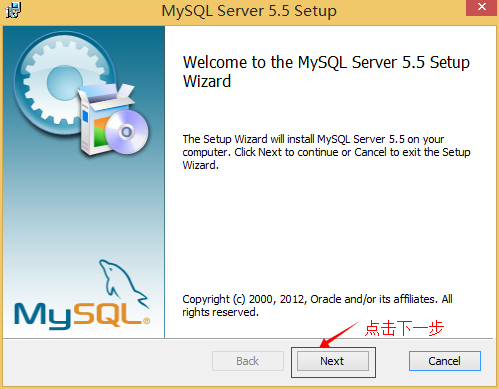

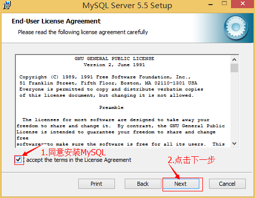

２、选择安装类型，有“Typical（默认）”、“Complete（完全）”、“Custom（用户自定义）”三个选项，选择“Custom”，按“next”键继续。

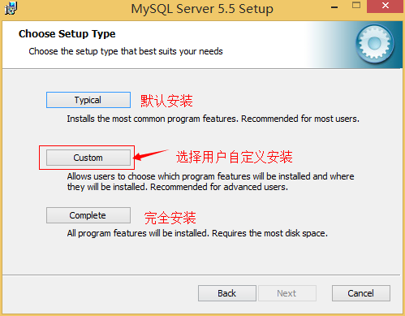

３、点选“Browse”，手动指定安装目录。

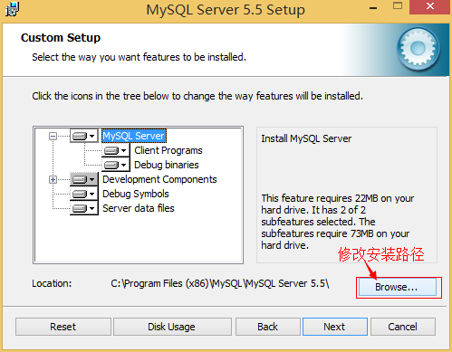

４、填上安装目录，我的是“F:\\Server\\MySQL\\MySQL Server
5.0”，也建议不要放在与操作系统同一分区，这样可以防止系统备份还原的时候，数据被清空。按“OK”继续。

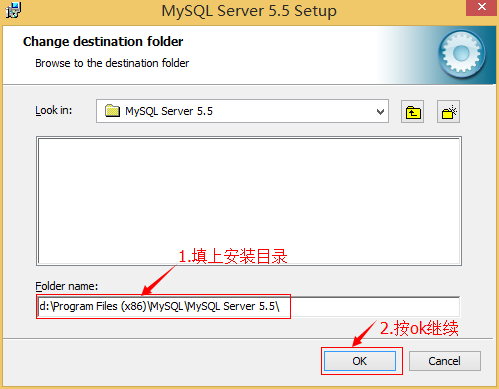

确认一下先前的设置，如果有误，按“Back”返回重做。按“Install”开始安装。

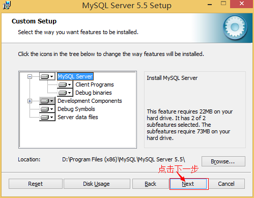

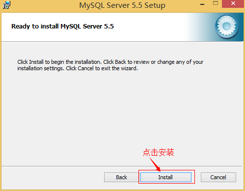

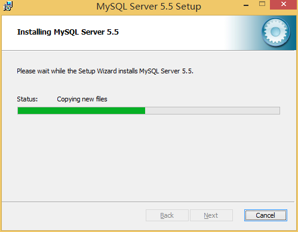

５、正在安装中，请稍候，直到出现下面的界面, 则完成MYSQL的安装

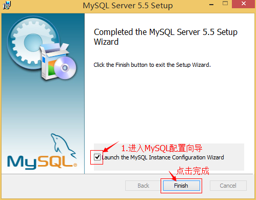

**二、MYSQL的配置**

１、安装完成了，出现如下界面将进入mysql配置向导。

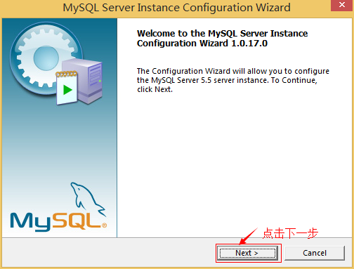

２、选择配置方式，“Detailed Configuration（手动精确配置）”、“Standard
Configuration（标准配置）”，我们选择“Detailed Configuration”，方便熟悉配置过程。

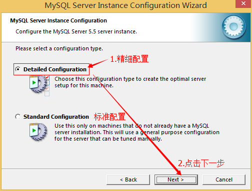

３、选择服务器类型，“Developer
Machine（开发测试类，mysql占用很少资源）”、“Server
Machine（服务器类型，mysql占用较多资源）”、“Dedicated MySQL Server
Machine（专门的数据库服务器，mysql占用所有可用资源）”

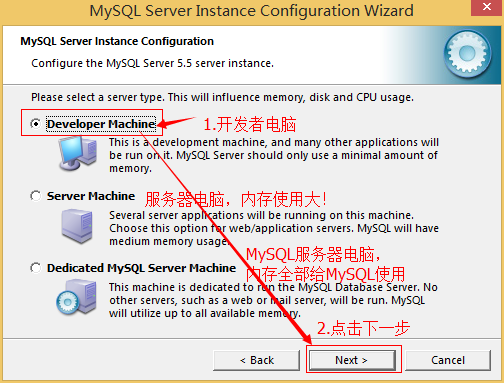

４、选择mysql数据库的大致用途，“Multifunctional
Database（通用多功能型，好）”、“Transactional Database
Only（服务器类型，专注于事务处理，一般）”、“Non-Transactional Database
Only（非事务处理型，较简单，主要做一些监控、记数用，对MyISAM数据类型的支持仅限于non-transactional），按“Next”继续。

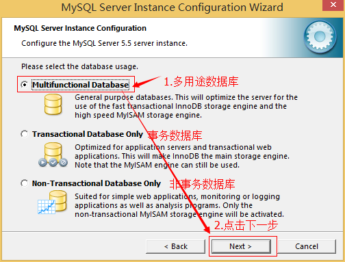

５、选择网站并发连接数，同时连接的数目，“Decision
Support(DSS)/OLAP（20个左右）”、“Online Transaction
Processing(OLTP)（500个左右）”、“Manual Setting（手动设置，自己输一个数）”。

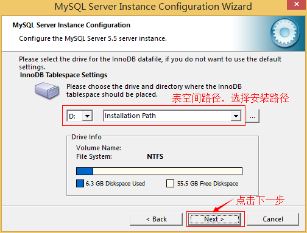

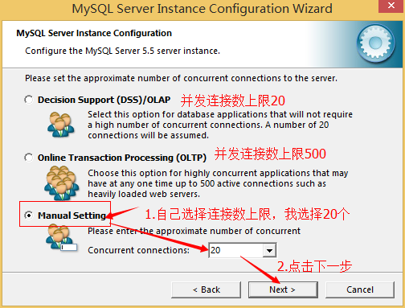

６、是否启用TCP/IP连接，设定端口，如果不启用，就只能在自己的机器上访问mysql数据库了，在这个页面上，您还可以选择“启用标准模式”（Enable
Strict
Mode），这样MySQL就不会允许细小的语法错误。如果是新手，建议您取消标准模式以减少麻烦。但熟悉MySQL以后，尽量使用标准模式，因为它可以降低有害数据进入数据库的可能性。按“Next”继续

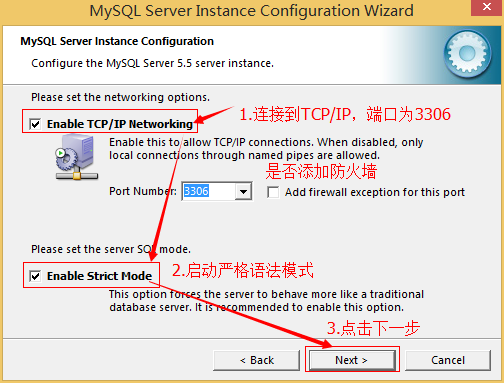

７、就是对mysql默认数据库语言编码进行设置（重要），一般选UTF-8，按 “Next”继续。

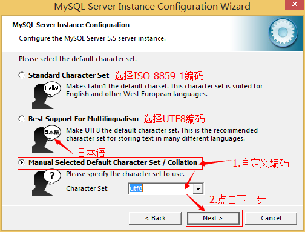

８、选择是否将mysql安装为windows服务，还可以指定Service
Name（服务标识名称），是否将mysql的bin目录加入到Windows
PATH（加入后，就可以直接使用bin下的文件，而不用指出目录名，比如连接，“mysql.exe
-uusername
-ppassword;”就可以了，不用指出mysql.exe的完整地址，很方便），我这里全部打上了勾，Service
Name不变。按“Next”继续。

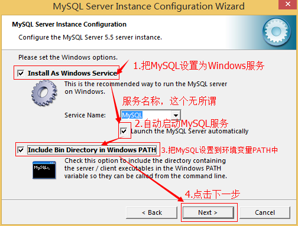

９、询问是否要修改默认root用户（超级管理）的密码。“Enable root access from
remote
machines（是否允许root用户在其它的机器上登陆，如果要安全，就不要勾上，如果要方便，就勾上它）”。最后“Create
An Anonymous
Account（新建一个匿名用户，匿名用户可以连接数据库，不能操作数据，包括查询）”，一般就不用勾了，设置完毕，按“Next”继续。

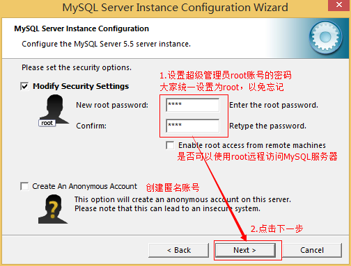

１０、确认设置无误，按“Execute”使设置生效，即完成MYSQL的安装和配置。

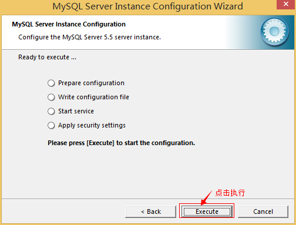

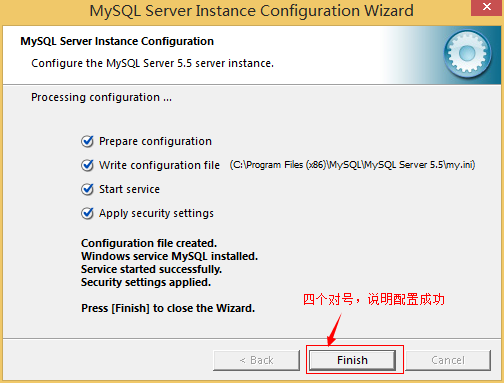

**注意：设置完毕，按“Finish”后有一个比较常见的错误，就是不能“Start
service”，一般出现在以前有安装mysql的服务器上，解决的办法，先保证以前安装的mysql服务器彻底卸载掉了；不行的话，检查是否按上面一步所说，之前的密码是否有修改，照上面的操作；如果依然不行，将mysql安装目录下的data文件夹备份，然后删除，在安装完成后，将安装生成的
data文件夹删除，备份的data文件夹移回来，再重启mysql服务就可以了，这种情况下，可能需要将数据库检查一下，然后修复一次，防止数据出错。**

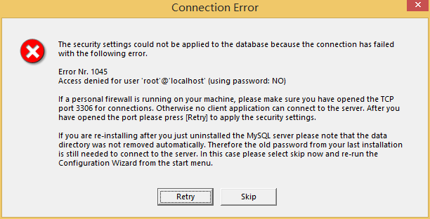

**解决方法：**

**1, 卸载MySQL**

**2, Windows Xp系统删除目录 C:\\Documents and Settings\\All Users\\Application
Data\\**

**windows 7\\8\\10操作系统删除目录C:\\ProgramData\\MySQL**

**3、重新安装就可以了**

