# 数据库安装配置

## 一、数据库概述

数据库（DataBase，DB）：指长期保存在计算机的存储设备上，按照一定规则组织起来，可以被各种用户或应用共享的数据集合。

数据库管理系统（DataBase Management
System，DBMS）：指一种操作和管理数据库的大型软件，用于建立、使用和维护数据库，对数据库进行统一管理和控制，以保证数据库的安全性和完整性。用户通过数据库管理系统访问数据库中的数据。

数据库软件应该为**数据库管理系统**，数据库是通过数据库管理系统创建和操作的。

数据库：存储、维护和管理数据的集合。

## **二、数据库的安装与配置**

    安装

         参照图解

         一路下一步

    卸载

        1.停止mysql服务   net stop mysql     启动mysql服务  net start mysql

        2.卸载mysql

        3.找到mysql 安装目录下的 my.ini   datadir="C:/ProgramData/MySQL/MySQL
Server 5.5/Data/"

    运行

         安装成功了打开cmd  --\> mysql -uroot -p你的密码

        修改mysql root用户密码

```sql
   1) 停止mysql服务 运行输入services.msc 停止mysql服务

               或者 cmd -->  net stop mysql

   2) 在cmd下 输入 mysqld --skip-grant-tables 启动服务器 光标不动
      （不要关闭该窗口）

   3) 新打开cmd 输入mysql -u root -p 不需要密码

           use mysql;

           update user set password=password('abc') WHERE User='root';

   4. 关闭两个cmd窗口 在任务管理器结束mysqld 进程

      理页面 重启mysql 服务

           密码修改完成
```

    配置

        参照图解

        到选择字符集时停

## **三、sql概述**

SQL：Structure Query Language。（结构化查询语言）

SQL被美国国家标准局（ANSI）确定为关系型数据库语言的美国标准，后来被国际化标准组织（ISO）采纳为关系数据库语言的国际标准。

各数据库厂商都支持ISO的SQL标准。**普通话**

各数据库厂商在标准的基础上做了自己的扩展。**方言**

## **四、Sql的分类**

1.            DDL（Data DefinitionLanguage）：数据定义语言，用来定义数据库对象：库、表、列等；

2.            DML（Data ManipulationLanguage）：数据操作语言，用来定义数据库记录（数据）；

3.            DCL（Data ControlLanguage）：数据控制语言，用来定义访问权限和安全级别；
4.            DQL（Data QueryLanguage）：数据查询语言，用来查询记录（数据）。

注意：sql语句以**;**结尾

### **4.1 DDL:操作数据库、表、列等**

使用的关键字：**CREATE、 ALTER、 DROP**

#### 4.1.1操作数据库

  创建

```sql
Create database mydb1;
Create database mydb2 character set gbk;
Create database mydb3 character set gbk COLLATE gbk_chinese_ci;
```

查询

查看当前数据库服务器中的所有数据库

```sql
Show databases;
```

查看前面创建的mydb2数据库的定义信息

```sql
Show  create  database mydb2;
```

删除前面创建的mydb3数据库

```sql
Drop database mydb3;
```

修改查看服务器中的数据库，并把mydb2的字符集修改为utf8;

```sql
 alter database mydb2 character set utf8;
```

 删除    

```sql
Drop database mydb3;
```

 其他：

查看当前使用的数据库

```sql
Select database();
```

               切换数据库

```sql
Use mydb2;
```

#### 4.1.2操作数据表

```sql
语法：
create table 表名(
    字段1 字段类型,
    字段2 字段类型,
     ...
    字段n 字段类型
);
```

   常用数据类型：

```sql
  int：整型
  double：浮点型，例如double(5,2)表示最多5位，其中必须有2位小数，即最大值为999.99；
  char：固定长度字符串类型；    char(10)     'aaa       '  占10位
  varchar：可变长度字符串类型； varchar(10)  'aaa'  
  text：字符串类型；
  blob：字节类型；
  date：日期类型，格式为：yyyy-MM-dd；
  time：时间类型，格式为：hh:mm:ss
  timestamp：时间戳类型 yyyy-MM-dd hh:mm:ss  会自动赋值
  datetime:日期时间类型 yyyy-MM-dd hh:mm:ss       
```

当前数据库中的所有表

```sql
SHOW TABLES;
```

查看表的字段信息

```sql
DESC employee;
```

在上面员工表的基本上增加一个image列。

```sql
ALTER TABLE employee ADD image blob;
```

修改job列，使其长度为60。

```sql
ALTER TABLE employee MODIFY job varchar(60);
```

删除image列,一次只能删一列。

```sql
ALTER TABLE employee DROP image;
```

表名改为user。

```sql
RENAME TABLE employee TO user;
```

查看表格的创建细节

```sql
SHOW CREATE TABLE user;
```

修改表的字符集为gbk

```sql
ALTER TABLE user CHARACTER SET gbk;
```

列名name修改为username

```sql
ALTER TABLE user CHANGE name username varchar(100);
```

删除表

```sql
DROP TABLE user ;
```

### 4.2 DML操作(重要)

查询表中的所有数据

```sql
SELECT * FROM 表名;
```

DML是对表中的数据进行增、删、改的操作。不要与DDL混淆了。

```sql
INSERT 、UPDATE、 DELETE
```

小知识：

在mysql中，字符串类型和日期类型都要用单引号括起来。

空值：null

#### 4.2.1插入操作：INSERT:

```sql
语法： INSERT INTO 表名（列名1，列名2 ...）VALUES(列值1，列值2...);
```

注意：列名与列值的类型、个数、顺序要一一对应。

可以把列名当做java中的形参，把列值当做实参。

参不要超出列定义的长度。

如果插入空值，请使用null

插入的日期和字符一样，都使用引号括起来。

练习 ：

```sql
create table emp(

id int,

name varchar(100),

gender varchar(10),

birthday date,

salary float(10,2),

entry_date date,

resume text

);

INSERT INTO emp(id,name,gender,birthday,salary,entry_date,resume)

VALUES(1,'zhangsan','female','1990-5-10',10000,'2015-5-5','good girl');

INSERT INTO emp(id,name,gender,birthday,salary,entry_date,resume)

VALUES(2,'lisi','male','1995-5-10',10000,'2015-5-5','good boy');

INSERT INTO emp(id,name,gender,birthday,salary,entry_date,resume)

VALUES(3,'你好','male','1995-5-10',10000,'2015-5-5','good boy');
```

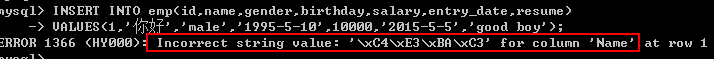

小知识：

查看数据库编码的具体信息

```sql
Show variables like 'character%';
```

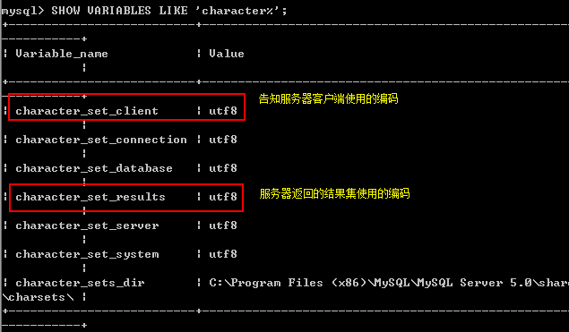

临时更改客户端和服务器结果集的编码

```sql
Set character_set_client=gbk;
Set character_set_results=gbk;
```

#### 4.2.2 修改操作 UPDATE:

语法：UPDATE 表名 SET 列名1=列值1，列名2=列值2 。。。 WHERE 列名=值**

练习：

将所有员工薪水修改为5000元。

```sql
UPDATE emp SET salary=5000
```

将姓名为’zs’的员工薪水修改为3000元。

```sql
UPDATE emp SET salary=3000 WHERE name=’ zhangsan’;
```

将姓名为’aaa’的员工薪水修改为4000元,gender改为ccc。

```sql
 UPDATE emp SET salary=4000,gender='female' WHERE name='lisi';
```

将wu的薪水在原有基础上增加1000元。

```sql
 UPDATE emp SET salary=salary+1000 WHERE name='wu';   
```

#### 4.2.3 删除操作 DELETE:

语法 ： DELETE 表名 【WHERE 列名=值】

练习 ：

删除表中名称为’zs’的记录。

```sql
DELETE FROM emp WHERE name='wu'
```

删除表中所有记录。

```sql
DELETE FROM emp;
```

使用truncate删除表中记录。

```sql
TRUNCATE TABLE emp;
```

DELETE 删除表中的数据，表结构还在;删除后的数据可以找回

TRUNCATE 删除是把表直接DROP掉，然后再创建一个同样的新表。

删除的数据不能找回。执行速度比DELETE快。

### 4.3 DQL操作

DQL数据查询语言 （重要）

数据库执行DQL语句不会对数据进行改变，而是让数据库发送结果集给客户端。

查询返回的结果集是一张虚拟表。

查询关键字：SELECT

语法： SELECT 列名 FROM表名

```sql
【WHERE --> BROUP BY -->HAVING--> ORDER BY】
```

语法：

```sql
SELECT selection_list /*要查询的列名称*/
FROM table_list  /*要查询的表名称*/ 
WHERE condition /*行条件*/
GROUP BY grouping_columns /*对结果分组*/
HAVING condition /*分组后的行条件*/
ORDER BY sorting_columns/*对结果分组*/
LIMIT offset_start, row_count /*结果限定*/
```

创建名：

学生表：stu

| **字段名称** | **字段类型** | **说明** |
| ------------ | ------------ | -------- |
| **sid**      | char(6)      | 学生学号 |
| **sname**    | varchar(50)  | 学生姓名 |
| **age**      | int          | 学生年龄 |
| **gender**   | varchar(50)  | 学生性别 |

```sql
CREATE TABLE stu ( sid  CHAR(6),         
                  sname  VARCHAR(50),       
                  age   INT,        
                  gender  VARCHAR(50) 
                 );
                 
                 
CREATE TABLE `stu` (
  `sid` char(6) DEFAULT NULL,
  `sname` varchar(50) DEFAULT NULL,
  `age` int(11) DEFAULT NULL,
  `gender` varchar(50) DEFAULT NULL
) ENGINE=InnoDB DEFAULT CHARSET=utf8;               
```

```sql
INSERT INTO stu VALUES('S_1001', 'liuYi', 35, 'male'); INSERT INTO stu VALUES('S_1002', 'chenEr', 15, 'female'); INSERT INTO stu VALUES('S_1003', 'zhangSan', 95, 'male'); INSERT INTO stu VALUES('S_1004', 'liSi', 65, 'female'); INSERT INTO stu VALUES('S_1005', 'wangWu', 55, 'male'); INSERT INTO stu VALUES('S_1006', 'zhaoLiu', 75, 'female'); INSERT INTO stu VALUES('S_1007', 'sunQi', 25, 'male'); INSERT INTO stu VALUES('S_1008', 'zhouBa', 45, 'female'); INSERT INTO stu VALUES('S_1009', 'wuJiu', 85, 'male'); INSERT INTO stu VALUES('S_1010', 'zhengShi', 5, 'female'); INSERT INTO stu VALUES('S_1011', 'xxx', NULL, NULL);
```

雇员表：emp

| **字段名称** | **字段类型** | **说明** |
| ------------ | ------------ | -------- |
| **empno**    | int          | 员工编号 |
| **ename**    | varchar(50)  | 员工姓名 |
| **job**      | varchar(50)  | 员工工作 |
| **mgr**      | int          | 领导编号 |
| **hiredate** | date         | 入职日期 |
| **sal**      | decimal(7,2) | 月薪     |
| **comm**     | decimal(7,2) | 奖金     |

```sql
CREATE TABLE emp( 
                 empno   INT,       
                 ename    VARCHAR(50),        
                 job   VARCHAR(50),       
                 mgr  INT,        
                 hiredate    DATE,         
                 sal   DECIMAL(7,2),       
                 comm   decimal(7,2),        
                 deptno INT 
       ) ;
CREATE TABLE `emp` (
  `empno` int(11) NOT NULL,
  `ename` varchar(50) DEFAULT NULL,
  `job` varchar(50) DEFAULT NULL,
  `mgr` int(11) DEFAULT NULL,
  `hiredate` date DEFAULT NULL,
  `sal` decimal(10,0) DEFAULT NULL,
  `comm` decimal(60,0) DEFAULT NULL,
  `deptno` int(10) DEFAULT NULL,
  PRIMARY KEY (`empno`)
) ENGINE=InnoDB DEFAULT CHARSET=utf8;
```

```sql
INSERT INTO emp values(7369,'SMITH','CLERK',7902,'1980-12-17',800,NULL,20); INSERT INTO emp values(7499,'ALLEN','SALESMAN',7698,'1981-02-20',1600,300,30); INSERT INTO emp values(7521,'WARD','SALESMAN',7698,'1981-02-22',1250,500,30); INSERT INTO emp values(7566,'JONES','MANAGER',7839,'1981-04-02',2975,NULL,20); INSERT INTO emp values(7654,'MARTIN','SALESMAN',7698,'1981-09-28',1250,1400,30); INSERT INTO emp values(7698,'BLAKE','MANAGER',7839,'1981-05-01',2850,NULL,30); INSERT INTO emp values(7782,'CLARK','MANAGER',7839,'1981-06-09',2450,NULL,10); INSERT INTO emp values(7788,'SCOTT','ANALYST',7566,'1987-04-19',3000,NULL,20); INSERT INTO emp values(7839,'KING','PRESIDENT',NULL,'1981-11-17',5000,NULL,10); INSERT INTO emp values(7844,'TURNER','SALESMAN',7698,'1981-09-08',1500,0,30); INSERT INTO emp values(7876,'ADAMS','CLERK',7788,'1987-05-23',1100,NULL,20); INSERT INTO emp values(7900,'JAMES','CLERK',7698,'1981-12-03',950,NULL,30); INSERT INTO emp values(7902,'FORD','ANALYST',7566,'1981-12-03',3000,NULL,20); INSERT INTO emp values(7934,'MILLER','CLERK',7782,'1982-01-23',1300,NULL,10);
```

部分表：dept

| **字段名称** | **字段类型** | **说明**     |
| ------------ | ------------ | ------------ |
| **deptno**   | int          | 部分编码     |
| **dname**    | varchar(50)  | 部分名称     |
| **loc**      | varchar(50)  | 部分所在地点 |

```sql
CREATE TABLE dept(deptno  INT,        
                  dname   varchar(14),       
                  loc     varchar(13)
                  );
CREATE TABLE `dept` (
  `deptno` int(11) NOT NULL,
  `dname` varchar(50) DEFAULT NULL,
  `loc` varchar(50) DEFAULT NULL,
  PRIMARY KEY (`deptno`)
) ENGINE=InnoDB DEFAULT CHARSET=utf8;                  
```

```sql
INSERT INTO dept values(10, 'ACCOUNTING', 'NEW YORK'); INSERT INTO dept values(20, 'RESEARCH', 'DALLAS'); INSERT INTO dept values(30, 'SALES', 'CHICAGO'); INSERT INTO dept values(40, 'OPERATIONS', 'BOSTON');
```

#### 4.3.1基础查询

##### 4.3.1.1　查询所有列

```sql
SELECT * FROM stu;
```

##### 4.3.1.2　查询指定列

```sql
SELECT sid, sname, age FROM stu;
```

#### 4.3.2条件查询

##### 4.3.2.1条件查询介绍

条件查询就是在查询时给出WHERE子句，在WHERE子句中可以使用如下运算符及关键字：

```sql
=、!=、<>、<、<=、>、>=；
BETWEEN…AND；
IN(set)；
IS NULL； 
AND；
OR；
NOT；
```

##### 4.3.2.2　查询性别为女，并且年龄小于50的记录

```sql
SELECT * FROM stu
WHERE gender='female' AND age<50;
```

##### 2.3　查询学号为S_1001，或者姓名为liSi的记录

```sql
SELECT * FROM stu
WHERE sid ='S_1001' OR sname='liSi';
```

##### 2.4　查询学号为S_1001，S_1002，S_1003的记录

```sql
SELECT * FROM stu
WHERE sid IN ('S_1001','S_1002','S_1003');
```

##### 2.5　查询学号不是S_1001，S_1002，S_1003的记录

```sql
SELECT
	*
FROM
	stu
WHERE
	sid NOT IN ('S_1001', 'S_1002', 'S_1003');
```

##### 2.6　查询年龄为null的记录

```sql
SELECT * FROM stu
WHERE age IS NULL;
```

##### 2.7　查询年龄在20到40之间的学生记录

```sql
SELECT *

FROM stu

WHERE age>=20 AND age<=40;
```

或者

```sql
SELECT *

FROM stu

WHERE age BETWEEN 20 AND 40;
```

##### 2.8　查询性别非男的学生记录

```sql
SELECT *

FROM stu

WHERE gender!='male';
```

或者

```sql
SELECT *
FROM stu
WHERE gender <>'male';
```

或者

```sql
SELECT *

FROM stu

WHERE NOT gender='male';
```

##### 2.9　查询姓名不为null的学生记录

```sql
SELECT *
FROM stu
WHERE NOT sname IS NULL;
```

或者

```sql
SELECT *
FROM stu
WHERE sname IS NOT NULL;
```

#### 3.模糊查询

当想查询姓名中包含a字母的学生时就需要使用模糊查询了。模糊查询需要使用关键字LIKE。

通配符:

\_ 任意一个字母

    %：任意0\~n个字母

 '张%'

##### 3.1　查询姓名由5个字母构成的学生记录

```sql
SELECT
	*
FROM
	stu
WHERE
	sname LIKE '_____'
```

模糊查询必须使用LIKE关键字。其中 “_”匹配任意一个字母，5个“_”表示5个任意字母。

##### 3.2　查询姓名由5个字母构成，并且第5个字母为“i”的学生记录

```sql
SELECT *

FROM stu

WHERE sname LIKE '____i';
```

##### 3.3　查询姓名以“z”开头的学生记录

```sql
SELECT *

FROM stu

WHERE sname LIKE 'z%';
```

其中“%”匹配0\~n个任何字母。

##### 3.4　查询姓名中第2个字母为“i”的学生记录

```sql
SELECT *

FROM stu

WHERE sname LIKE '_i%';
```

##### 3.5　查询姓名中包含“a”字母的学生记录

```sql
SELECT *
FROM stu
WHERE sname LIKE '%a%';
```

#### 4.字段控制查询

##### 4.1　去除重复记录

去除重复记录（两行或两行以上记录中系列的上的数据都相同），例如emp表中sal字段就存在相同的记录。当只查询emp表的sal字段时，那么会出现重复记录，那么想去除重复记录，需要使用DISTINCT：

```sql
SELECT DISTINCT sal FROM emp;
```

##### 4.2　查看雇员的月薪与佣金之和

　　因为sal和comm两列的类型都是数值类型，所以可以做加运算。如果sal或comm中有一个字段不是数值类型，那么会出错。

```sql
SELECT *,sal+comm FROM emp;
```

comm列有很多记录的值为NULL，因为任何东西与NULL相加结果还是NULL，所以结算结果可能会出现NULL。下面使用了把NULL转换成数值0的函数IFNULL：

```sql
SELECT *,sal+IFNULL(comm,0) FROM emp;
```

##### 4.3　给列名添加别名

在上面查询中出现列名为sal+IFNULL(comm,0)，这很不美观，现在我们给这一列给出一个别名，为total：

```sql
SELECT *, sal+IFNULL(comm,0) AS total FROM emp;
```

给列起别名时，是可以省略AS关键字的：

```sql
SELECT *,sal+IFNULL(comm,0)  total FROM emp
```

#### 5.排序

##### 5.1.查询所有学生记录，按年龄升序排序

```sql
SELECT *
FROM stu
ORDER BY sage ASC;
```

或者

```sql
SELECT *

FROM stu

ORDER BY sage;
```

##### 5.2　查询所有学生记录，按年龄降序排序

```sql
SELECT *

FROM stu

ORDER BY age DESC;
```

##### 5.3　查询所有雇员，按月薪降序排序，如果月薪相同时，按编号升序排序

```sql
SELECT * FROM emp

ORDER BY sal DESC,empno ASC;
```

#### 6.聚合函数  sum avg max min count

聚合函数是用来做纵向运算的函数：

COUNT()：统计指定列不为NULL的记录行数；

MAX()：计算指定列的最大值，如果指定列是字符串类型，那么使用字符串排序运算；

MIN()：计算指定列的最小值，如果指定列是字符串类型，那么使用字符串排序运算；

SUM()：计算指定列的数值和，如果指定列类型不是数值类型，那么计算结果为0；

AVG()：计算指定列的平均值，如果指定列类型不是数值类型，那么计算结果为0；

##### 6.1　COUNT

当需要纵向统计时可以使用COUNT()。

查询emp表中记录数：

```sql
SELECT COUNT(*) AS cnt FROM emp;
```

查询emp表中有佣金的人数：

```sql
SELECT COUNT(comm) cnt FROM emp;
```

注意，因为count()函数中给出的是comm列，那么只统计comm列非NULL的行数。

查询emp表中月薪大于2500的人数：

```sql
SELECT COUNT(*) FROM emp

WHERE sal > 2500;
```

统计月薪与佣金之和大于2500元的人数：

```sql
SELECT COUNT(*) AS cnt FROM emp WHERE sal+IFNULL(comm,0) > 2500;
```

查询有佣金的人数，以及有领导的人数：

```sql
SELECT COUNT(comm), COUNT(mgr) FROM emp;
```

##### 6.2　SUM和AVG

当需要纵向求和时使用sum()函数。

查询所有雇员月薪和：

```sql
SELECT SUM(sal) FROM emp;
```

查询所有雇员月薪和，以及所有雇员佣金和：

```sql
SELECT SUM(sal), SUM(comm) FROM emp;
```

查询所有雇员月薪+佣金和：

```sql
SELECT SUM(sal+IFNULL(comm,0)) FROM emp;
```

统计所有员工平均工资：

```sql
SELECT AVG(sal) FROM emp;
```

##### 6.3　MAX和MIN

查询最高工资和最低工资：

```sql
SELECT MAX(sal), MIN(sal) FROM emp;
```

#### **7.分组查询**

当需要分组查询时需要使用GROUP
BY子句，例如查询每个部门的工资和，这说明要使用部分来分组。

注：凡和聚合函数同时出现的列名，则一定要写在group by 之后

##### 7.1　分组查询

查询每个部门的部门编号和每个部门的工资和：

```sql
SELECT deptno, SUM(sal)

FROM emp

GROUP BY deptno;
```

查询每个部门的部门编号以及每个部门的人数：

```sql
SELECT deptno,COUNT(*)

FROM emp

GROUP BY deptno;
```

查询每个部门的部门编号以及每个部门工资大于1500的人数：

```sql
SELECT deptno,COUNT(*)

FROM emp

WHERE sal>1500

GROUP BY deptno;
```

##### 7.2　HAVING子句

查询工资总和大于9000的部门编号以及工资和：

```sql
SELECT deptno, SUM(sal)

FROM emp

GROUP BY deptno

HAVING SUM(sal) > 9000;
```

    注：having与where的区别:

        1.having是在分组后对数据进行过滤.

          where是在分组前对数据进行过滤

​        2.having后面可以使用分组函数(统计函数)

          where后面不可以使用分组函数。

WHERE是对分组前记录的条件，如果某行记录没有满足WHERE子句的条件，那么这行记录不会参加分组；而HAVING是对分组后数据的约束。

#### **8.LIMIT**

LIMIT用来限定查询结果的起始行，以及总行数。

##### 8.1.查询5行记录，起始行从0开始

```sql
SELECT * FROM emp LIMIT 0, 5;
```

注意，起始行从0开始，即第一行开始！

##### 8.2.查询10行记录，起始行从3开始

```sql
SELECT * FROM emp LIMIT 3, 10;
```

##### 8.3.分页查询

如果一页记录为10条，希望查看第3页记录应该怎么查呢？

第一页记录起始行为0，一共查询10行；

第二页记录起始行为10，一共查询10行；

第三页记录起始行为20，一共查询10行；

##### 8.3.分页查询

    查询语句书写顺序：

```sql
select – from- where- group by- having- order by-limit
```

    查询语句执行顺序：

```sql
from - where -group by - having - select - order by-limit
```

## 五.数据的完整性

作用：保证用户输入的数据保存到数据库中是正确的。

确保数据的完整性 = 在创建表时给表中添加约束

完整性的分类：

实体完整性:

域完整性:

引用完整性:

**1、实体完整性**

实体：即表中的一行(一条记录)代表一个实体（entity）

实体完整性的作用：标识每一行数据不重复。

**约束类型： 主键约束（primary key）  唯一约束(unique) 
自动增长列(auto_increment)**

**1.1主键约束（primary key）**

注：每个表中要有一个主键。

特点：数据唯一，且不能为null

例：

第一种添加方式：

```sql
CREATE TABLE student(

id int primary key,

name varchar(50)

);
```

第二种添加方式：此种方式优势在于，可以创建联合主键

```sql
CREATE TABLE student(

id int,

name varchar(50),

primary key(id)

);

CREATE TABLE student(

classid int,

stuid int,

name varchar(50),

primary key(classid，stuid)

);
```

第三种添加方式：

```sql
CREATE TABLE student(

id int,

name varchar(50)

);

ALTER TABLE student  ADD  PRIMARY  KEY (id);
```

**1.2唯一约束(unique)：**

特点：数据不能重复。

```sql
CREATE TABLE student(

Id int primary key,

Name varchar(50) unique

);
```

**1.3自动增长列(auto_increment) **

**sqlserver数据库 (identity)  oracle数据库( sequence)**

给主键添加自动增长的数值，列只能是整数类型

```sql
CREATE TABLE student(

Id int primary key auto_increment,

Name varchar(50)

);

INSERT INTO student(name) values(‘tom’);
```

**域完整性**

域完整性的作用：限制此单元格的数据正确，不对照此列的其它单元格比较

域代表当前单元格

域完整性约束：数据类型 非空约束（not null） 默认值约束(default) 

check约束（mysql不支持）check(sex='男' or  sex='女')

**1.1 数据类型:（数值类型、日期类型、字符串类型）**

**1.2 非空约束：not null**

```sql
CREATE TABLE student(

Id int pirmary key,

Name varchar(50) not null,

Sex varchar(10)

);

INSERT INTO student values(1,’tom’,null);
```

**1.3 默认值约束 default**

```sql
CREATE TABLE student(

Id int pirmary key,

Name varchar(50) not null,

Sex varchar(10) default ‘男’

);

insert into student1 values(1,'tom','女');

insert into student1 values(2,'jerry',default);
```

**引用完整性（参照完整性）**

外键约束：FOREIGN KEY

例：

```sql
CREATE TABLE student(

sid int pirmary key,

name varchar(50) not null,

sex varchar(10) default ‘男’

);

create table score(

    id int,

    score int,

    sid int , -- 外键列的数据类型一定要与主键的类型一致

    CONSTRAINT fk_score_sid foreign key (sid) references student(id)

);
```

第二种添加外键方式。

```sql
ALTER TABLE score1 ADD CONSTRAINT fk_stu_score FOREIGN KEY(sid) REFERENCES
stu(id);
```

**4、　表与表之间的关系**

一对一：例如t_person表和t_card表，即人和身份证。这种情况需要找出主从关系，即谁是主表，谁是从表。人可以没有身份证，但身份证必须要有人才行，所以人是主表，而身份证是从表。设计从表可以有两种方案：

在t_card表中添加外键列（相对t_user表），并且给外键添加唯一约束；

给t_card表的主键添加外键约束（相对t_user表），即t_card表的主键也是外键。

一对多（多对一）：最为常见的就是一对多！一对多和多对一，这是从哪个角度去看得出来的。t_user和t_section的关系，从t_user来看就是一对多，而从t_section的角度来看就是多对一！这种情况都是在多方创建外键！

多对多：例如t_stu和t_teacher表，即一个学生可以有多个老师，而一个老师也可以有多个学生。这种情况通常需要创建中间表来处理多对多关系。例如再创建一张表t_stu_tea表，给出两个外键，一个相对t_stu表的外键，另一个相对t_teacher表的外键。

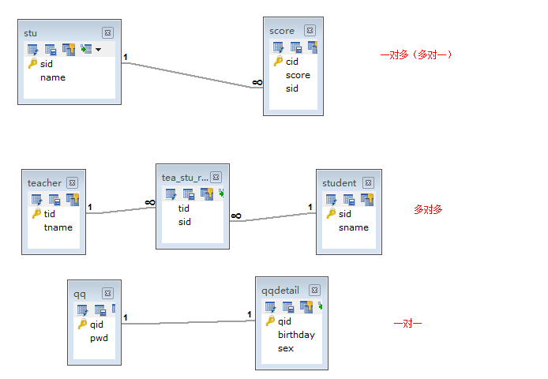

## **六、多表查询（重要）**

```sql
多表查询有如下几种：
合并结果集；UNION 、  UNION ALL
连接查询
内连接  [INNER] JOIN  ON
外连接  OUTER JOIN ON
左外连接 LEFT [OUTER] JOIN
右外连接 RIGHT [OUTER] JOIN
全外连接（MySQL不支持）FULL JOIN
自然连接  NATURAL JOIN
子查询
```

### **1.合并结果集**

作用：合并结果集就是把两个select语句的查询结果合并到一起！

合并结果集有两种方式：

```sql
UNION：去除重复记录，例如：SELECT * FROM t1 UNION SELECT * FROM t2；
UNION ALL：不去除重复记录，例如：SELECT * FROM t1 UNION ALL SELECT * FROM t2。
```

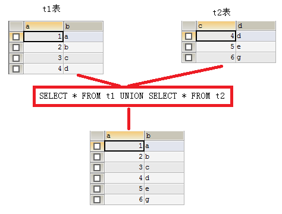

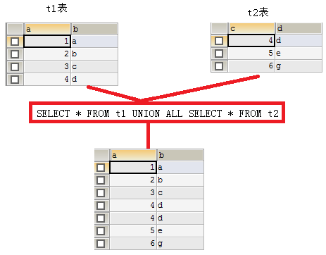

**要求：被合并的两个结果：列数、列类型必须相同。**

### **2.连接查询 （非常重要）**

连接查询就是求出多个表的乘积，例如t1连接t2，那么查询出的结果就是t1\*t2。

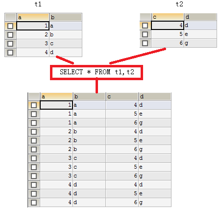

连接查询会产生笛卡尔积，假设集合A={a,b}，集合B={0,1,2}，则两个集合的笛卡尔积为{(a,0),(a,1),(a,2),(b,0),(b,1),(b,2)}。可以扩展到多个集合的情况。

那么多表查询产生这样的结果并不是我们想要的，那么怎么去除重复的，不想要的记录呢，当然是通过条件过滤。通常要查询的多个表之间都存在关联关系，那么就通过关联关系去除笛卡尔积。

你能想像到emp和dept表连接查询的结果么？emp一共14行记录，dept表一共4行记录，那么连接后查询出的结果是56行记录。

也就你只是想在查询emp表的同时，把每个员工的所在部门信息显示出来，那么就需要使用主外键来去除无用信息了。

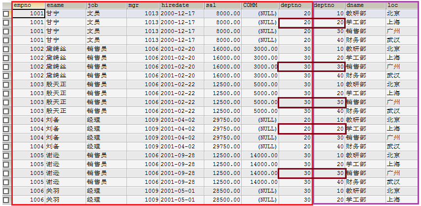

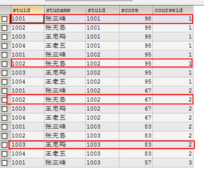

　　**使用主外键关系做为条件来去除无用信息**

```sql
SELECT * FROM emp,dept WHERE emp.deptno=dept.deptno;
```


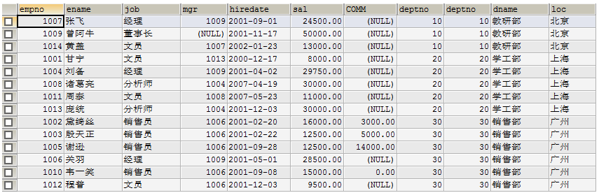

上面查询结果会把两张表的所有列都查询出来，也许你不需要那么多列，这时就可以指定要查询的列了。

```sql
SELECT emp.ename,emp.sal,emp.comm,dept.dname FROM emp,dept WHERE emp.deptno=dept.deptno;
```


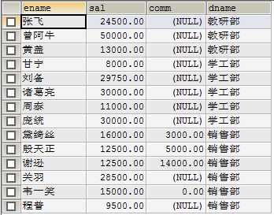

还可以为表指定别名，然后在引用列时使用别名即可。

```sql
SELECT e.ename,e.sal,e.comm,d.dname FROM emp AS e,dept AS d WHERE e.deptno=d.deptno;
```

#### 2.1.内连接

上面的连接语句就是内连接，但它不是SQL标准中的查询方式，可以理解为方言！SQL标准的内连接为：

```sql
SELECT * FROM emp e INNER JOIN dept d ON e.deptno=d.deptno;
```


内连接的特点：查询结果必须满足条件。例如我们向emp表中插入一条记录：


　　其中deptno为50，而在dept表中只有10、20、30、40部门，那么上面的查询结果中就不会出现“张三”这条记录，因为它不能满足e.deptno=d.deptno这个条件。

#### 2.2.外连接（左连接、右连接）

外连接的特点：查询出的结果存在不满足条件的可能。

左连接：

```sql
SELECT * FROM emp e LEFT OUTER JOIN dept d ON e.deptno=d.deptno;
```


左连接是先查询出左表（即以左表为主），然后查询右表，右表中满足条件的显示出来，不满足条件的显示NULL。

这么说你可能不太明白，我们还是用上面的例子来说明。其中emp表中“张三”这条记录中，部门编号为50，而dept表中不存在部门编号为50的记录，所以“张三”这条记录，不能满足e.deptno=d.deptno这条件。但在左连接中，因为emp表是左表，所以左表中的记录都会查询出来，即“张三”这条记录也会查出，但相应的右表部分显示NULL。

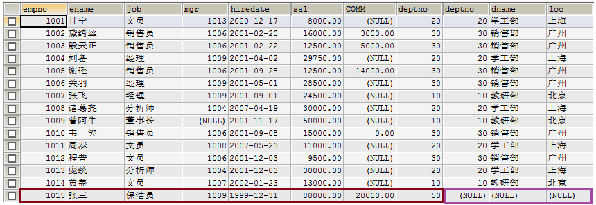

#### 2.3.右连接

右连接就是先把右表中所有记录都查询出来，然后左表满足条件的显示，不满足显示NULL。例如在dept表中的40部门并不存在员工，但在右连接中，如果dept表为右表，那么还是会查出40部门，但相应的员工信息为NULL。

```sql
SELECT * FROM emp e RIGHT OUTER JOIN dept d ON e.deptno=d.deptno;
```


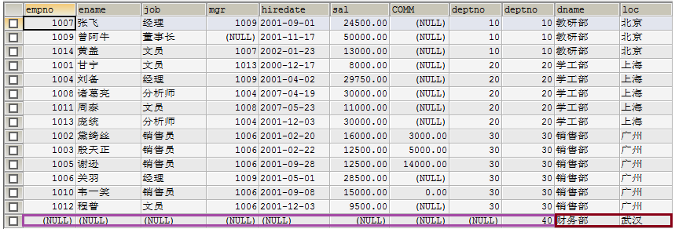

**连接查询心得**：

连接不限与两张表，连接查询也可以是三张、四张，甚至N张表的连接查询。通常连接查询不可能需要整个笛卡尔积，而只是需要其中一部分，那么这时就需要使用条件来去除不需要的记录。这个条件大多数情况下都是使用主外键关系去除。

两张表的连接查询一定有一个主外键关系，三张表的连接查询就一定有两个主外键关系，所以在大家不是很熟悉连接查询时，首先要学会去除无用笛卡尔积，那么就是用主外键关系作为条件来处理。如果两张表的查询，那么至少有一个主外键条件，三张表连接至少有两个主外键条件*。*

### **3.自然连接**

大家也都知道，连接查询会产生无用笛卡尔积，我们通常使用主外键关系等式来去除它。而自然连接无需你去给出主外键等式，它会自动找到这一等式：

两张连接的表中名称和类型完全一致的列作为条件，例如emp和dept表都存在deptno列，并且类型一致，所以会被自然连接找到！

当然自然连接还有其他的查找条件的方式，但其他方式都可能存在问题！

```sql
SELECT * FROM emp NATURAL JOIN dept; SELECT * FROM emp NATURAL LEFT JOIN dept; SELECT * FROM emp NATURAL RIGHT JOIN dept;
```

### **4.子查询（非常重要）**

一个select语句中包含另一个完整的select语句。

子查询就是嵌套查询，即SELECT中包含SELECT，如果一条语句中存在两个，或两个以上SELECT，那么就是子查询语句了。

子查询出现的位置：

where后，作为条为被查询的一条件的一部分；

from后，作表；

当子查询出现在where后作为条件时，还可以使用如下关键字：

any

all

子查询结果集的形式：

单行单列（用于条件）

单行多列（用于条件）

多行单列（用于条件）

多行多列（用于表）

练习：

#### 1.**工资高于JONES的员工。**

分析：

查询条件：工资\>JONES工资，其中JONES工资需要一条子查询。

第一步：查询JONES的工资

```sql
 SELECT sal FROM emp WHERE ename='JONES' 
```

第二步：查询高于甘宁工资的员工

```sql
 SELECT* FROM emp WHERE sal > (${第一步}) 
```

结果：

```sql
SELECT * FROM emp WHERE sal > (SELECT sal FROM emp WHERE ename='JONES') 
```

#### **2、查询与SCOTT同一个部门的员工。**

子查询作为条件

子查询形式为单行单列

```sql
SELECT *  FROM  emp WHERE deptno=(SELECT  deptno FROM emp WHERE ename='SCOTT')
```

#### **3、工资高于30号部门所有人的员工信息**

分析：

```sql
SELECT * FROM emp WHERE sal>(

SELECT MAX(sal) FROM emp WHERE deptno=30);
```

查询条件：工资高于30部门所有人工资，其中30部门所有人工资是子查询。高于所有需要使用all关键字。

第一步：查询30部门所有人工资

```sql
SELECT sal FROM emp WHERE deptno=30; 
```

第二步：查询高于30部门所有人工资的员工信息

```sql
 SELECT * FROM emp WHERE sal > ALL (${第一步}) 
```

结果：

```sql
SELECT * FROM emp WHERE sal > ALL (SELECT sal FROM emp WHERE deptno=30) 
```


子查询作为条件

子查询形式为多行单列（当子查询结果集形式为多行单列时可以使用ALL或ANY关键字）

#### **4、查询工作和工资与MARTIN（马丁）完全相同的员工信息**

分析：

查询条件：工作和工资与MARTIN完全相同，这是子查询

第一步：查询出MARTIN的工作和工资

```sql
SELECT job,sal FROM emp WHERE ename='MARTIN' 
```

第二步：查询出与MARTIN工作和工资相同的人

```sql
SELECT * FROM emp WHERE (job,sal) IN (${第一步}) 
```

结果：

```sql
 SELECT * FROM emp WHERE (job,sal) IN (SELECT job,sal FROM emp WHERE ename='MARTIN') 
```

#### **5、有2个以上直接下属的员工信息**

```sql
SELECT * FROM emp WHERE empno IN(

SELECT mgr FROM emp GROUP BY mgr HAVING COUNT(mgr)>=2);
```

子查询作为条件

子查询形式为单行多列

#### **6、查询员工编号为7788的员工名称、员工工资、部门名称、部门地址**

分析：（无需子查询）

查询列：员工名称、员工工资、部门名称、部门地址

查询表：emp和dept，分析得出，不需要外连接（外连接的特性：某一行（或某些行）记录上会出现一半有值，一半为NULL值）

条件：员工编号为7788

第一步：去除多表，只查一张表，这里去除部门表，只查员工表

```sql
 SELECT ename, sal FROM emp e WHERE empno=7788
```


第二步：让第一步与dept做内连接查询，添加主外键条件去除无用笛卡尔积

```sql
SELECT e.ename, e.sal, d.dname, d.loc FROM emp e, dept d WHERE e.deptno=d.deptno AND empno=7788
```


第二步中的dept表表示所有行所有列的一张完整的表，这里可以把dept替换成所有行，但只有dname和loc列的表，这需要子查询。

第三步：查询dept表中dname和loc两列，因为deptno会被作为条件，用来去除无用笛卡尔积，所以需要查询它。

```sql
 SELECT dname,loc,deptno FROM dept;
```


第四步：替换第二步中的dept

```sql
 SELECT e.ename, e.sal, d.dname, d.loc FROM emp e, (SELECT dname,loc,deptno FROM dept) d WHERE e.deptno=d.deptno AND e.empno=7788
```


子查询作为表

子查询形式为多行多列

#### **7、自连接:自己连接自己，起别名**

求7369员工编号、姓名、经理编号和经理姓名

```sql
SELECT e1.empno , e1.ename,e2.mgr,e2.ename
FROM emp e1, emp e2
WHERE e1.mgr = e2.empno AND e1.empno = 7369;
```

练习：

 求各个部门薪水最高的员工所有信息

```sql
 select e.* from emp e,

(select max(sal) maxsal,deptno from emp

group by deptno) a

where e.deptno = a.deptno

and e.sal =a.maxsal
```

## **七、MySQL中的函数**

常用函数

### 1.数据函数

```sql
 SELECT ABS(-8);  /*绝对值*/
 SELECT CEILING(9.4); /*向上取整*/
 SELECT FLOOR(9.4);   /*向下取整*/
 SELECT RAND();  /*随机数,返回一个0-1之间的随机数*/
 SELECT SIGN(0); /*符号函数: 负数返回-1,正数返回1,0返回0*/
```


### 2.字符串函数

```sql
 SELECT CHAR_LENGTH('坚持就能成功'); /*返回字符串包含的字符数*/
 SELECT CONCAT('我','爱','程序');  /*合并字符串,参数可以有多个*/
 SELECT INSERT('我爱编程helloworld',1,2,'超级热爱');  /*替换字符串,从某个位置开始替换某个长度*/
 SELECT LOWER('df'); /*小写*/
 SELECT UPPER('zf'); /*大写*/
 SELECT LEFT('hello,world',5);   /*从左边截取*/
 SELECT RIGHT('hello,world',5);  /*从右边截取*/
 SELECT REPLACE('坚持就能成功','坚持','努力');  /*替换字符串*/
 SELECT SUBSTR('坚持就能成功',4,6); /*截取字符串,开始和长度*/
 SELECT REVERSE('坚持就能成功'); /*反转
```

 -- 查询姓周的同学,改成邹

```sql
 SELECT REPLACE(studentname,'周','邹') AS 新名字
 FROM student WHERE studentname LIKE '周%';
```

### 3.日期和时间函数

```sql
 SELECT CURRENT_DATE();   /*获取当前日期*/
 SELECT CURDATE();   /*获取当前日期*/
 SELECT NOW();   /*获取当前日期和时间*/
 SELECT LOCALTIME();   /*获取当前日期和时间*/
 SELECT SYSDATE();   /*获取当前日期和时间*/
```

### 4.获取年月日,时分秒

```sql
 SELECT YEAR(NOW());
 SELECT MONTH(NOW());
 SELECT DAY(NOW());
 SELECT HOUR(NOW());
 SELECT MINUTE(NOW());
 SELECT SECOND(NOW());
```

### 5.系统信息函数

```sql
 SELECT VERSION();  /*版本*/
 SELECT USER();     /*用户*/
```


## 八.索引

### 1.索引的作用

- 提高查询速度

- 确保数据的唯一性

- 可以加速表和表之间的连接 , 实现表与表之间的参照完整性

- 使用分组和排序子句进行数据检索时 , 可以显著减少分组和排序的时间

- 全文检索字段进行搜索优化.

### 2.分类

- 主键索引 (Primary Key)
- 唯一索引 (Unique)
- 常规索引 (Index)
- 全文索引 (FullText)

主键 : 某一个属性组能唯一标识一条记录

特点 :

- 最常见的索引类型
- 确保数据记录的唯一性
- 确定特定数据记录在数据库中的位置

> 唯一索引

作用 : 避免同一个表中某数据列中的值重复

与主键索引的区别

- 主键索引只能有一个
- 唯一索引可能有多个

```sql
CREATE TABLE `Grade`(
  `GradeID` INT(11) AUTO_INCREMENT PRIMARYKEY,
  `GradeName` VARCHAR(32) NOT NULL UNIQUE
   -- 或 UNIQUE KEY `GradeID` (`GradeID`)
)
```

> 常规索引

作用 : 快速定位特定数据

注意 :

- index 和 key 关键字都可以设置常规索引
- 应加在查询找条件的字段
- 不宜添加太多常规索引,影响数据的插入,删除和修改操作

```sql
CREATE TABLE `result`(
   -- 省略一些代码
  INDEX/KEY `ind` (`studentNo`,`subjectNo`) -- 创建表时添加
)
-- 创建后添加
ALTER TABLE `result` ADD INDEX `ind`(`studentNo`,`subjectNo`);
```

> 全文索引

百度搜索：全文索引

作用 : 快速定位特定数据

注意 :

- 只能用于MyISAM类型的数据表
- 只能用于CHAR , VARCHAR , TEXT数据列类型
- 适合大型数据集

```sql
/*
#方法一：创建表时
  　　CREATE TABLE 表名 (
               字段名1 数据类型 [完整性约束条件…],
               字段名2 数据类型 [完整性约束条件…],
               [UNIQUE | FULLTEXT | SPATIAL ]   INDEX | KEY
               [索引名] (字段名[(长度)] [ASC |DESC])
               );

#方法二：CREATE在已存在的表上创建索引
       CREATE [UNIQUE | FULLTEXT | SPATIAL ] INDEX 索引名
                    ON 表名 (字段名[(长度)] [ASC |DESC]) ;

#方法三：ALTER TABLE在已存在的表上创建索引
       ALTER TABLE 表名 ADD [UNIQUE | FULLTEXT | SPATIAL ] INDEX
                            索引名 (字段名[(长度)] [ASC |DESC])                                                     
#删除索引：DROP INDEX 索引名 ON 表名字;
#删除主键索引: ALTER TABLE 表名 DROP PRIMARY KEY;

#显示索引信息: SHOW INDEX FROM student;
*/
/*增加全文索引*/
ALTER TABLE `school`.`student` ADD FULLTEXT INDEX `studentname` (`StudentName`);
/*EXPLAIN : 分析SQL语句执行性能*/
EXPLAIN SELECT * FROM student WHERE studentno='1000';

/*使用全文索引*/
-- 全文搜索通过 MATCH() 函数完成。
-- 搜索字符串作为 against() 的参数被给定。搜索以忽略字母大小写的方式执行。对于表中的每个记录行，MATCH() 返回一个相关性值。即，在搜索字符串与记录行在 MATCH() 列表中指定的列的文本之间的相似性尺度。
EXPLAIN SELECT *FROM student WHERE MATCH(studentname) AGAINST('love');
/*
开始之前，先说一下全文索引的版本、存储引擎、数据类型的支持情况
MySQL 5.6 以前的版本，只有 MyISAM 存储引擎支持全文索引；
MySQL 5.6 及以后的版本，MyISAM 和 InnoDB 存储引擎均支持全文索引;
只有字段的数据类型为 char、varchar、text 及其系列才可以建全文索引。
测试或使用全文索引时，要先看一下自己的 MySQL 版本、存储引擎和数据类型是否支持全文索引。
*/
```

拓展：测试索引

```sql
CREATE TABLE `app_user` (
`id` bigint(20) unsigned NOT NULL AUTO_INCREMENT,
`name` varchar(50) DEFAULT '' COMMENT '用户昵称',
`email` varchar(50) NOT NULL COMMENT '用户邮箱',
`phone` varchar(20) DEFAULT '' COMMENT '手机号',
`gender` tinyint(4) unsigned DEFAULT '0' COMMENT '性别（0:男；1：女）',
`password` varchar(100) NOT NULL COMMENT '密码',
`age` tinyint(4) DEFAULT '0' COMMENT '年龄',
`create_time` datetime DEFAULT NUll,
`update_time` timestamp DEFAULT NUll,
PRIMARY KEY (`id`)
) ENGINE=InnoDB DEFAULT CHARSET=utf8mb4 COMMENT='app用户表'
```

批量插入数据：100w

```sql
DROP FUNCTION IF EXISTS mock_data;
DELIMITER $$
CREATE FUNCTION mock_data()
RETURNS INT
BEGIN
DECLARE num INT DEFAULT 1000000;
DECLARE i INT DEFAULT 0;
WHILE i < num DO
  INSERT INTO app_user(`name`, `email`, `phone`, `gender`, `password`, `age`)
   VALUES(CONCAT('用户', i), '24736743@qq.com', CONCAT('18', FLOOR(RAND()*(999999999-100000000)+100000000)),FLOOR(RAND()*2),UUID(), FLOOR(RAND()*100));
  SET i = i + 1;
END WHILE;
RETURN i;
END;
SELECT mock_data();
```

### 3.**索引效率测试**

无索引

```sql
SELECT * FROM app_user WHERE name = '用户9999'; -- 查看耗时
SELECT * FROM app_user WHERE name = '用户9999';
SELECT * FROM app_user WHERE name = '用户9999';

mysql> EXPLAIN SELECT * FROM app_user WHERE name = '用户9999'\G
*************************** 1. row ***************************
          id: 1
select_type: SIMPLE
       table: app_user
  partitions: NULL
        type: ALL
possible_keys: NULL
        key: NULL
    key_len: NULL
        ref: NULL
        rows: 992759
    filtered: 10.00
      Extra: Using where
1 row in set, 1 warning (0.00 sec)

```

创建索引

```sql
CREATE INDEX idx_app_user_name ON app_user(name);
```

测试普通索引

```sql
mysql> EXPLAIN SELECT * FROM app_user WHERE name = '用户9999'\G
*************************** 1. row ***************************
          id: 1
select_type: SIMPLE
       table: app_user
  partitions: NULL
        type: ref
possible_keys: idx_app_user_name
        key: idx_app_user_name
    key_len: 203
        ref: const
        rows: 1
    filtered: 100.00
      Extra: NULL
1 row in set, 1 warning (0.00 sec)

mysql> SELECT * FROM app_user WHERE name = '用户9999';
1 row in set (0.00 sec)

mysql> SELECT * FROM app_user WHERE name = '用户9999';
1 row in set (0.00 sec)

mysql> SELECT * FROM app_user WHERE name = '用户9999';
1 row in set (0.00 sec)
```

> 索引准则

- 索引不是越多越好
- 不要对经常变动的数据加索引
- 小数据量的表建议不要加索引
- 索引一般应加在查找条件的字段

索引的数据结构

```sql
-- 我们可以在创建上述索引的时候，为其指定索引类型，分两类
hash类型的索引：查询单条快，范围查询慢
btree类型的索引：b+树，层数越多，数据量指数级增长（我们就用它，因为innodb默认支持它）

-- 不同的存储引擎支持的索引类型也不一样
InnoDB 支持事务，支持行级别锁定，支持 B-tree、Full-text 等索引，不支持 Hash 索引；
MyISAM 不支持事务，支持表级别锁定，支持 B-tree、Full-text 等索引，不支持 Hash 索引；
Memory 不支持事务，支持表级别锁定，支持 B-tree、Hash 等索引，不支持 Full-text 索引；
NDB 支持事务，支持行级别锁定，支持 Hash 索引，不支持 B-tree、Full-text 等索引；
Archive 不支持事务，支持表级别锁定，不支持 B-tree、Hash、Full-text 等索引；
```

## **九、MySQL数据库的备份与恢复**

### **1.生成SQL脚本  导出数据**

在控制台使用mysqldump命令可以用来生成指定数据库的脚本文本，但要注意，脚本文本中只包含数据库的内容，而不会存在创建数据库的语句！所以在恢复数据时，还需要自已手动创建一个数据库之后再去恢复数据。

| mysqldump –u用户名 –p密码 数据库名\>生成的脚本文件路径 |
| ------------------------------------------------------ |


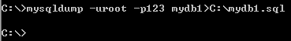

现在可以在C盘下找到mydb1.sql文件了！

注意，mysqldump命令是在Windows控制台下执行，无需登录mysql！！！

### **2.执行SQL脚本 恢复数据**

**前提：必须先创建数据库名**

**执行SQL脚本需要登录mysql**，然后进入指定数据库，才可以执行SQL脚本！！！

执行SQL脚本不只是用来恢复数据库，也可以在平时编写SQL脚本，然后使用执行SQL
脚本来操作数据库！大家都知道，在黑屏下编写SQL语句时，就算发现了错误，可能也不能修改了。所以我建议大家使用脚本文件来编写SQL代码，然后执行之！

| SOURCE C:\\mydb1.sql |
| -------------------- |


　　注意，在执行脚本时需要先行核查当前数据库中的表是否与脚本文件中的语句有冲突！例如在脚本文件中存在create
table a的语句，而当前数据库中已经存在了a表，那么就会出错！

还可以通过下面的方式来执行脚本文件：

mysql -uroot -p123 mydb1\<c:\\mydb1.sql

| mysql –u用户名 –p密码 数据库\<要执行脚本文件路径 |
| ------------------------------------------------ |


**这种方式无需登录mysql！**

**注意：在CMD下 命令不能加;**
