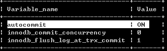
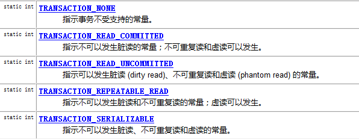

## 事务管理-JDBC

-   事务的概述:

什么是事务:事务指的是逻辑上的一组操作,组成这组操作的各个单元要么全都成功,要么全都失败.

事务作用：保证在一个事务中多次操作要么全都成功,要么全都失败.

-   MYSQL中的事务管理：

创建一个表：账户表.

```sql
create database web13
use web13;
create table account(
id int primary key auto_increment,
name varchar(20),
money double
);
insert into account values (null,'守义',10000);
insert into account values (null,'凤儿',10000);
insert into account values (null,'如花',10000);
```

进行事务的管理：

MYSQL中可以有两种方式进行事务的管理：MYSQL数据库默认事务是自动提交的.写一条SQL语句,事务就已经提交了.Oracle数据库事务不自动提交.手动执行commit;

一种：手动开启事务的方式：

```sql
start transaction;
update account set money=money-1000 where name='守义';
update account set money=money+1000 where name='凤儿';
commit;或者rollback;
```

二种：设置MYSQL中的自动提交的参数：

```sql
show variables like '%commit%';
```



设置自动提交的参数为OFF:

```sql
set autocommit = 0; -- 0:OFF 1:ON
```

#### JDBC进行事务管理

Connection：

\* 事务管理的API：


#### 步骤分析：

-   步骤一：设计页面三个文本框.

-   步骤二：提交到Servlet

    -   接收参数：

    -   封装参数：

    -   调用业务层处理数据

    -   页面跳转

### 代码实现：

```java
DAO：

public class AccountDao {

/*
 付款的方法
@param name
@param money
@throws SQLException
*/
public void outMoney(String name,double money) throws SQLException{
Connection conn = null;
PreparedStatement pstmt = null;
try{
// 获得连接:
conn = JDBCUtils.getConnection();
// 编写一个SQL:
String sql = "update account set money = money-? where name=?";
// 预编译SQL:
pstmt = conn.prepareStatement(sql);
// 设置参数:
pstmt.setDouble(1, money);
pstmt.setString(2, name);
// 执行SQL：
pstmt.executeUpdate();
}catch(Exception e){
e.printStackTrace();
}finally{
pstmt.close();
conn.close();
}
}
/*
 收款的方法
@param name
@param money
@throws SQLException
*/

public void inMoney(String name,double money) throws SQLException{

Connection conn = null;

PreparedStatement pstmt = null;

try{

// 获得连接:

conn = JDBCUtils.getConnection();

// 编写一个SQL:

String sql = "update account set money = money+? where name=?";

// 预编译SQL:

pstmt = conn.prepareStatement(sql);

// 设置参数:

pstmt.setDouble(1, money);

pstmt.setString(2, name);

// 执行SQL：

pstmt.executeUpdate();

}catch(Exception e){

e.printStackTrace();

}finally{

pstmt.close();

conn.close();

}
}
}
AccountDao dao = new AccountDao();
Connection conn=null;
try {
//0.开启事务
conn = JdbcUtils.getConnection();
conn.setAutoCommit(false);
//1.转出
dao.accountOut(conn,fromUser,money);
int i=1/0;
//2.转入
dao.accountIn(conn,toUser,money);
//3.事务提交
conn.commit();
JdbcUtils.closeConn(conn);
} catch (Exception e) {
e.printStackTrace();
//事务回滚
conn.rollback();
JdbcUtils.closeConn(conn);
throw e;
}
}
```

通过两种Service编写完成事务的管理:

\* 一种向下传递Connection：

\* 二种将Connection绑定到当前的线程中：


#### 1.1事务的特性：

事务有四大特性:

- 原子性：强调事务的不可分割.

- 一致性：事务的执行的前后,数据的完整性保持一致.

- 隔离性：一个事务在执行的过程中,不应该受到其他事务的干扰.

-  持久性：事务一旦结束,数据就持久到数据库中.


#### 1.2如果不考虑事务的隔离性,引发一些安全性问题:

- 读问题：三类

- 脏读 ：一个事务读到了另一个事务未提交的数据.

- 不可重复读
  一个事务读到了另一个事务已经提交(update)的数据.引发一个事务中的多次查询结果不一致.
- 虚读/幻读
  一个事务读到了另一个事务已经提交的（insert）数据.导致多次查询的结果不一致

#### 1.3解决读问题：

设置事务的隔离级别:

-  read uncommitted :脏读，不可重复读，虚读都可能发生.

-  read committed :避免脏读,但是不可重复读和虚读有可能发生.

-  repeatable read :避免脏读和不可重复读,但是虚读有可能发生的.

-  serializable :避免脏读,不可重复读和虚读.(串行化的-不可能出现事务并发访问)


安全性:serializable \> repeatable read \> read committed \> read uncommitted

效率 :serializable\< repeatable read \< read committed \< read uncommitted

MYSQL :repeatable read

Oracle :read committed

#### 1.4演示脏读的发生

步骤一：分别开启两个窗口A,B:

步骤二：分别查询两个窗口的隔离级别：

```sql
select @@tx_isolation
```

步骤三：设置A窗口的隔离级别为read uncommitted

```sql
 set session transaction isolation level read uncommitted;
```

步骤四：在两个窗口中分别开启事务：

```sql
start transaction;
```

步骤五：在B窗口中转账操作：

```sql
update account set money = money - 1000 where name='守义';

update account set money = money + 1000 where name='凤儿';
```

 在B窗口中没有提交事务的！！！

步骤六：在A窗口中进行查询：

 已经转账成功!!!(脏读:一个事务中读到了另一个事务未提交的数据)

#### 1.5演示避免脏读，不可重复读发生

- 步骤一：分别开启两个窗口A,B:

- 步骤二：分别查询两个窗口的隔离级别：


```sql
select @@tx_isolation
```

- 步骤三：设置A窗口的隔离级别为read committed;


```sql
 set session transaction isolation level read committed;
```

- 步骤四：在两个窗口中分别开启事务：


```sql
start transaction;
```

- 步骤五：在B窗口中完成转账的操作：


```sql
update account set money = money - 1000 where name='守义';

update account set money = money + 1000 where name='凤儿';
```

 在B窗口中没有提交事务！！！

- 步骤六：在A窗口中进行查询：


没有转账的结果！！！（已经避免了脏读）

- 步骤七：在B窗口中提交事务！！！


 commit;

步骤八：在A窗口中进行查询：
转账成功！！！（不可重复读：一个事务读到了另一个事务已经提交的update的数据，导致一次事务中多次查询结果不一致.）

#### 1.6演示避免不可重复读：

步骤一：分别开启两个窗口A,B:

步骤二：分别查询两个窗口的隔离级别：

```sql
 select @@tx_isolation
```

步骤三：设置A窗口的隔离级别为repeatable read;

```sql
set session transaction isolation level repeatable read;
```

步骤四：在两个窗口中分别开始事务：

```sql
 start transaction;
```

步骤五：在B窗口中完成转账的操作：

```sql
update account set money = money - 1000 where name='守义';

update account set money = money + 1000 where name='凤儿';
```

 在B窗口没有提交事务！！！

步骤六：在A窗口中进行查询：

 没有转账成功！！！（已经避免脏读）

步骤七：在B窗口提交事务！！！

commit;

步骤八：在A窗口进行查询：

 转账没有成功！！（避免不可重复读）

步骤九：在A窗口中结束事务,再重新查询.

#### 1.7演示隔离级别为serializable

步骤一：分别开启两个窗口A,B:

步骤二：分别查询两个窗口的隔离级别：

```sql
 select @@tx_isolation
```

步骤三：设置A窗口的隔离级别为serializable;

```sql
 set session transaction isolation level serializable;
```

步骤四：在两个窗口中分别开启事务：

```sql
 start transaction;
```

步骤五：在B窗口中完成一个insert操作:

```sql
insert into account values (null,'芙蓉',10000);
```

事务没有提交！！

步骤六：在A窗口中进行查找：

没有任何结果！！！（不可以事务并发执行的）

步骤七：在B窗口中结束事务！

#### 1.8.JDBC的隔离级别的设置：（了解）

Connection中的方法：


Connection中提供了隔离级别的常量：



#### 使用DBUtils的进行事务的管理：

```java
QueryRunner：

/* 构造：

QueryRunner();

QueryRunner(DataSource ds);

*/ 方法：

T query(String sql,ResultSetHanlder\<T\> rsh,Object... params);

T query(Connection conn,String sql,ResultSetHanlder\<T\> rsh,Object... params);

int update(String sql,Object... params);

int update(Connection conn,String sql,Object... params);


```

方法分类：

没有事务：

```java
QueryRunner(DataSource ds);

T query(String sql,ResultSetHanlder\<T\> rsh,Object... params);

int update(String sql,Object... params);
```

有事务：

```java
QueryRunner();

T query(Connection conn,String sql,ResultSetHanlder<T> rsh,Object... params);

int update(Connection conn,String sql,Object... params);
```

