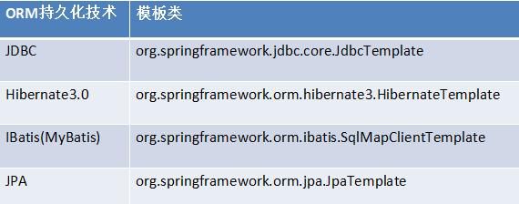
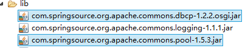
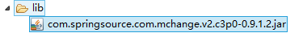
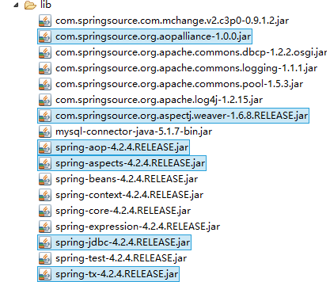
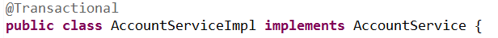

## Spring_day01
1.  相关知识点

    1.  Spring使用AspectJ进行AOP的开发:注解的方式

        1.  引入相关的jar包:

- spring的传统AOP的开发的包


```
spring-aop-4.2.4.RELEASE.jar
com.springsource.org.aopalliance-1.0.0.jar
- aspectJ的开发包:
com.springsource.org.aspectj.weaver-1.6.8.RELEASE.jar
spring-aspects-4.2.4.RELEASE.jar
```


#### 引入Spring的配置文件

引入AOP约束:

```xml
<beans xmlns="http://www.springframework.org/schema/beans"
xmlns:xsi="http://www.w3.org/2001/XMLSchema-instance"
xmlns:aop="http://www.springframework.org/schema/aop" xsi:schemaLocation="
http://www.springframework.org/schema/beanshttp://www.springframework.org/schema/beans/spring-beans.xsd
http://www.springframework.org/schema/aophttp://www.springframework.org/schema/aop/spring-aop.xsd">
</beans>
```

#### 编写目标类:

```java
public class ProductDao {
public void save(){
System.out.println("保存商品...");
}
public void update(){
System.out.println("修改商品...");
}
public void delete(){
System.out.println("删除商品...");

}
public void find(){
System.out.println("查询商品...");
}
}
```

#### 配置目标类：

目标类

```
<bean id="productDao" class="com.pp.spring.demo4.ProductDao"></bean>
```

#### 开启aop注解的自动代理:

```
<aop:aspectj-autoproxy/>
```

#### AspectJ的AOP的注解:

@Aspect:定义切面类的注解通知类型:
@Before :前置通知
@AfterReturing :后置通知
@Around :环绕通知
@After :最终通知
@AfterThrowing :异常抛出通知.
@Pointcut:定义切入点的注解

#### 编写切面类:

```java
@Aspect
public class MyAspectAnno {
@Before("MyAspectAnno.pointcut1()")
public void before(){
System.out.println("前置通知===========");
}
@Pointcut("execution(* com.pp.spring.demo4.ProductDao.save(..))")
private void pointcut1(){}
}
```

#### 配置切面:

 配置切面类

```
<bean id="myAspectAnno" class="com.pp.spring.demo4.MyAspectAnno"></bean>
```

#### 其他通知的注解:

```java
@Aspect
public class MyAspectAnno {
@Before("MyAspectAnno.pointcut1()")
public void before(){
System.out.println("前置通知===========");
}
@AfterReturning("MyAspectAnno.pointcut2()")
public void afterReturning(){
System.out.println("后置通知===========");
}
@Around("MyAspectAnno.pointcut3()")
public Object around(ProceedingJoinPoint joinPoint) throws Throwable{
System.out.println("环绕前通知==========");
Object obj = joinPoint.proceed();
System.out.println("环绕后通知==========");
return obj;
}

@AfterThrowing("MyAspectAnno.pointcut4()")
public void afterThrowing(){
System.out.println("异常抛出通知========");
}
@After("MyAspectAnno.pointcut4()")
public void after(){
System.out.println("最终通知==========");
}

@Pointcut("execution(* com.pp.spring.demo4.ProductDao.save(..))")
private void pointcut1(){}
@Pointcut("execution(* com.pp.spring.demo4.ProductDao.update(..))")
private void pointcut2(){}
@Pointcut("execution(* com.pp.spring.demo4.ProductDao.delete(..))")
private void pointcut3(){}
@Pointcut("execution(* com.pp.spring.demo4.ProductDao.find(..))")
private void pointcut4(){}

}

```

案例二：Spring的事务管理完成转账的案例
--------------------------------------

1.  案例需求:

    1.  需求描述:

完成一个转账的功能,需要进行事务的管理，使用Spring的事务管理的方式完成.

1.  相关知识点

    1.  Spring的JDBC的模板:

        1.  Spring提供了很多持久层技术的模板类简化编程:



#### 创建数据库和表:

#### 引入相关开发包:

Spring的基本的开发包需要引入的:6个.

```xml
<dependencies>
<dependency>
<groupId>junit</groupId>
<artifactId>junit</artifactId>
<version>4.12</version>
</dependency>
<dependency>
<groupId>org.springframework</groupId>
<artifactId>spring-core</artifactId>
<version>4.3.5.RELEASE</version>
</dependency>
<dependency>
<groupId>org.springframework</groupId>
<artifactId>spring-context</artifactId>
<version>4.3.5.RELEASE</version>
</dependency>
<dependency>
<groupId>org.springframework</groupId>
<artifactId>spring-aop</artifactId>
<version>4.3.5.RELEASE</version>
</dependency>
<dependency>
<groupId>org.aspectj
<artifactId>aspectjweaver</
<version>1.8.9</version
</dependency>
<dependency>
<groupId>org.springframework</groupId>
<artifactId>spring-test</artifactId>
<version>4.3.5.RELEASE</version>
</dependency>
<dependency>
<groupId>org.springframework</groupId>
<artifactId>spring-jdbc</artifactId>
<version>4.3.5.RELEASE</version>
</dependency>
<dependency>
<groupId>mysql</groupId>
<artifactId>mysql-connector-java</artifactId>
<version>5.1.40</version>
</dependency>
</dependencies>

```

#### 创建一个测试类:

```
@Test
// JDBC模板的基本使用：
public void demo1(){
DriverManagerDataSource dataSource = new DriverManagerDataSource();
dataSource.setDriverClassName("com.mysql.jdbc.Driver");
dataSource.setUrl("jdbc:mysql:///spring_day03");
dataSource.setUsername("root");
dataSource.setPassword("123");
JdbcTemplate jdbcTemplate = new JdbcTemplate(dataSource);
jdbcTemplate.update("insert into account values (null,?,?)", "会希",10000d);
}

```

1.  将连接池的配置交给Spring管理:

    1.  Spring内置的连接池的配置：

【引入Spring的配置文件】

【配置内置连接池】

\<!-- 配置Spring的内置连接池 --\>

```xml
<bean id="dataSource"
class="org.springframework.jdbc.datasource.DriverManagerDataSource">
<property name="driverClassName" value="com.mysql.jdbc.Driver"/>
<property name="url" value="jdbc:mysql:///spring_day02"/>
<property name="username" value="root"/>
<property name="password" value="123"/>
</bean>
```

【将模板配置到Spring中】

\<!-- 配置JDBC模板 --\>

```xml
<bean id="jdbcTemplate" class="org.springframework.jdbc.core.JdbcTemplate">
<property name="dataSource" ref="dataSource"/>
</bean>
```

【编写测试类】

 引入spring-aop.jar

```java
@RunWith(SpringJUnit4ClassRunner.class)
@ContextConfiguration("classpath:applicationContext.xml")
public class SpringDemo2 {
@Resource(name="jdbcTemplate")
private JdbcTemplate jdbcTemplate;
@Test
public void demo1(){
jdbcTemplate.update("insert into account values (null,?,?)", "凤姐",10000d);
}
}

```

#### Spring中配置DBCP连接池:

【引入dbcp连接池的jar包】



【配置连接池】

\<!-- 配置DBCP连接池 --\>

```xml
<bean id="dataSource"
class="org.apache.commons.dbcp.BasicDataSource">
<property name="driverClassName" value="com.mysql.jdbc.Driver"/>
<property name="url" value="jdbc:mysql:///spring_day02"/>
<property name="username" value="root"/>
<property name="password" value="123"/>
</bean>
```

#### 配置c3p0连接池:

【引入相应的jar包】

[com.springsource.com.mchange.v2.c3p0-0.9.1.2.jar](http://com.springsource.com.mchange.v2.c3p0-0.9.1.2.jar)



【配置连接池】

\<!-- 配置C3P0连接池 --\>

```xml
<bean id="dataSource
class="com.mchange.v2.c3p0.ComboPooledDataSource">
<property name="driverClass" value="com.mysql.jdbc.Driver"/>
<property name="jdbcUrl" value="jdbc:mysql:///spring_day02"/>
<property name="user" value="root"/>
<property name="password" value="123"/>
</bean>
```
```
1. JDBC模板的CRUD的操作：
   1. JDBC模板CRUD的操作:
@RunWith(SpringJUnit4ClassRunner.class)
@ContextConfiguration("classpath:applicationContext.xml")
public class SpringDemo3 {
@Resource(name="jdbcTemplate")
private JdbcTemplate jdbcTemplate;
@Test
// 插入操作
public void demo1(){
jdbcTemplate.update("insert into account values (null,?,?)", "冠希",10000d);
}
@Test
// 修改操作
public void demo2(){
jdbcTemplate.update("update account set name=?,money =? where id = ?",
"思雨",10000d,5);
}
@Test
// 删除操作
public void demo3(){
jdbcTemplate.update("delete from account where id = ?", 5);
}
@Test
// 查询一条记录
public void demo4(){
Account account = jdbcTemplate.queryForObject("select * from account where id =
?", new MyRowMapper(), 1);
System.out.println(account);
}
@Test
//查询所有记录
public void demo5(){
List<Account> list = jdbcTemplate.query("select * from account", new
MyRowMapper());
for (Account account : list) {
System.out.println(account);
}
}
class MyRowMapper implements RowMapper<Account>{
@Override
public Account mapRow(ResultSet rs, int rowNum) throws SQLException {
Account account = new Account();
account.setId(rs.getInt("id"));
account.setName(rs.getString("name"));
account.setMoney(rs.getDouble("money"));
return account;
}
}
}
```

1.  事务的回顾:

    1.  什么是事务:

事务逻辑上的一组操作,组成这组操作的各个逻辑单元,要么一起成功,要么一起失败.

#### 事务特性:

原子性 :强调事务的不可分割.

一致性 :事务的执行的前后数据的完整性保持一致.

隔离性 :一个事务执行的过程中,不应该受到其他事务的干扰

持久性 :事务一旦结束,数据就持久到数据库

#### 如果不考虑隔离性引发安全性问题:

脏读 :一个事务读到了另一个事务的未提交的数据

不可重复读
:一个事务读到了另一个事务已经提交的update的数据导致多次查询结果不一致.

虚读 :一个事务读到了另一个事务已经提交的insert的数据导致多次查询结果不一致.

#### 解决读问题:设置事务隔离级别

未提交读 :脏读，不可重复读，虚读都有可能发生

已提交读 :避免脏读。但是不可重复读和虚读有可能发生

可重复读 :避免脏读和不可重复读.但是虚读有可能发生.

串行化的 :避免以上所有读问题.

1.  Spring进行事务管理一组API

    1.  PlatformTransactionManager:平台事务管理器.

真正管理事务的对象

org.springframework.jdbc.datasource.DataSourceTransactionManager 使用Spring
JDBC或iBatis 进行持久化数据时使用

org.springframework.orm.hibernate3.HibernateTransactionManager
使用Hibernate版本进行持久化数据时使用

#### TransactionDefinition:事务定义信息

事务定义信息:

-   隔离级别

-   传播行为

-   超时信息

-   是否只读

    1.  TransactionStatus:事务的状态

记录事务的状态

#### Spring的这组接口是如何进行事务管理：

平台事务管理根据事务定义的信息进行事务的管理,事务管理的过程中产生一些状态,将这些状态记录到TransactionStatus里面

#### 事务的传播行为

PROPAGION_XXX :事务的传播行为

\* 保证同一个事务中

PROPAGATION_REQUIRED 支持当前事务，如果不存在 就新建一个(默认)

PROPAGATION_SUPPORTS 支持当前事务，如果不存在，就不使用事务

PROPAGATION_MANDATORY 支持当前事务，如果不存在，抛出异常

-   保证没有在同一个事务中

PROPAGATION_REQUIRES_NEW 如果有事务存在，挂起当前事务，创建一个新的事务

PROPAGATION_NOT_SUPPORTED 以非事务方式运行，如果有事务存在，挂起当前事务

PROPAGATION_NEVER 以非事务方式运行，如果有事务存在，抛出异常

PROPAGATION_NESTED 如果当前事务存在，则嵌套事务执行

1.  案例代码

    1.  搭建转账的环境:

        1.  创建业务层和DAO的类

```java
public interface AccountService {
public void transfer(String from,String to,Double money);
}
public class AccountServiceImpl implements AccountService {
// 业务层注入DAO:
private AccountDao accountDao;
public void setAccountDao(AccountDao accountDao) {
this.accountDao = accountDao;
}
@Override
/**
* from:转出的账号
* to:转入的账号
* money：转账金额
*/
public void transfer(String from, String to, Double money) {
accountDao.outMoney(from, money);
accountDao.inMoney(to, money);
}
}
public interface AccountDao {
public void outMoney(String from,Double money);
public void inMoney(String to,Double money);
}
public class AccountDaoImpl extends JdbcDaoSupport implements AccountDao {
@Override
public void outMoney(String from, Double money) {
this.getJdbcTemplate().update("update account set money = money - ? where name =
?", money,from);
}
@Override
public void inMoney(String to, Double money) {
this.getJdbcTemplate().update("update account set money = money + ? where name =
?", money,to);
}
}
```

#### 配置业务层和DAO

```xml
<!-- 配置业务层的类 -->
<bean id="accountService" class="com.pp.transaction.demo1.AccountServiceImpl">
<property name="accountDao" ref="accountDao"/>
</bean>
<!-- 配置DAO的类 -->
<bean id="accountDao" class="com.pp.transaction.demo1.AccountDaoImpl">
<property name="dataSource" ref="dataSource"/>
</bean>
```

#### 编写测试类

```java
@RunWith(SpringJUnit4ClassRunner.class)
@ContextConfiguration("classpath:applicationContext2.xml")
public class SpringDemo4 {
@Resource(name="accountService")
private AccountService accountService;
@Test
// 转账的测试:
public void demo1(){
accountService.transfer("会希", "凤姐", 1000d);

}
}
```

### Spring的编程式事务(了解)

手动编写代码完成事务的管理:

#### 配置事务管理器

\<!-- 配置事务管理器 --\>

```xml
<bean id="transactionManager"
class="org.springframework.jdbc.datasource.DataSourceTransactionManager">
<property name="dataSource" ref="dataSource"/>
</bean>
```

#### 配置事务管理的模板

\<!-- 配置事务管理模板 --\>

```xml
<bean id="transactionTemplate"
class="org.springframework.transaction.support.TransactionTemplate">
<property name="transactionManager" ref="transactionManager"/>
</bean>
```

#### 需要在业务层注入事务管理模板

\<!-- 配置业务层的类 --\>

```xml
<bean id="accountService" class="com.pp.transaction.demo1.AccountServiceImpl">
<property name="accountDao" ref="accountDao"/>
<!-- 注入事务管理模板 -->
<property name="transactionTemplate" ref="transactionTemplate"/>
</bean>
```

#### 手动编写代码实现事务管理

```java
public void transfer(final String from, final String to, final Double money) {
transactionTemplate.execute(new TransactionCallbackWithoutResult() {
@Override
protected void doInTransactionWithoutResult(TransactionStatus status) {
accountDao.outMoney(from, money);
int d = 1 / 0;
accountDao.inMoney(to, money);
}
});
}
```

### Spring的声明式事务管理XML方式(\*\*\*\*\*)：思想就是AOP.

不需要进行手动编写代码，通过一段配置完成事务管理
#### 引入AOP开发的包
aop联盟.jar
Spring-aop.jar
aspectJ.jar
spring-aspects.jar
#### 恢复转账环境
#### 配置事务管理器

```xml
<!-- 事务管理器 -->
<bean id="transactionManager"
class="org.springframework.jdbc.datasource.DataSourceTransactionManager">
<property name="dataSource" ref="dataSource"/>
</bean>

```

#### 配置事务的通知

\<!-- 配置事务的增强 --\>

```xml
<tx:advice id="txAdvice" transaction-manager="transactionManager">
<tx:attributes>
<!--
isolation="DEFAULT" 隔离级别
propagation="REQUIRED" 传播行为
read-only="false" 只读
timeout="-1" 过期时间
rollback-for="" -Exception
no-rollback-for="" +Exception
-->
<tx:method name="transfer" propagation="REQUIRED"/>
</tx:attributes>
</tx:advice>
```

#### 配置aop事务

```xml
<aop:config>
<aop:pointcut expression="execution(*
com.pp.transaction.demo2.AccountServiceImpl.transfer(..))" id="pointcut1"/>
<aop:advisor advice-ref="txAdvice" pointcut-ref="pointcut1"/>
</aop:config>
```

1.  Spring的声明式事务的注解方式: (\*\*\*\*\*)

    1.  引入jar包:



#### 恢复转账环境:

#### 配置事务管理器:

\<!-- 配置事务管理器 --\>

```xml
<bean id="transactionManager"
class="org.springframework.jdbc.datasource.DataSourceTransactionManager">
<property name="dataSource" ref="dataSource"/>
</bean>
```

#### 开启事务管理的注解:

\<!-- 开启注解事务管理 --\>

```xml
<tx:annotation-driven transaction-manager="transactionManager"/>
```

#### 在使用事务的类上添加一个注解：@Transactional


