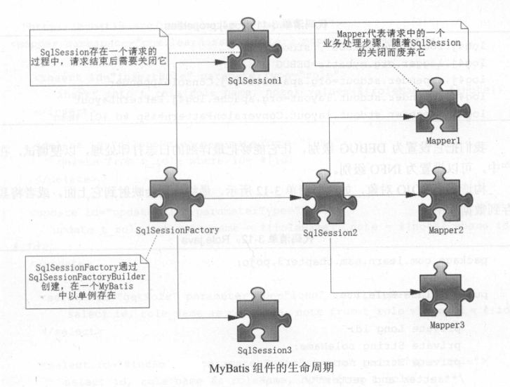

## MyBatis的生命周期

MyBatis的生命周期
----------------------------------------------------------------

### MyBatis的生命周期

　　所谓的生命周期就是第一个对象应该存活的时间，比如一些对象一次用完后就要关闭，使它们被Java虚拟机（JVM）销毁，以避免继续占用资源，所以我们会根据每一个组件的作用去确定其生命。

#### （一）、SqlSessionFactoryBuilder

　　SqlSessionFactoryBuilder的作用就是在于创建SqlSessionFactory，创建成功后，SqlSessionFactoryBuilder就失去了作用，所以它只能存在于创建SqlSessionFactory的方法中，而不要让其长期存在。

#### （二）、SqlSessionFactory

　　SqlSessionFactory可以被认为是一个数据库连接池，它的作用是创建SqlSession接口对象。因为MyBatis的本质就是Java对数据库的操作，所以SqlSessionFactory的生命周期在于于整个MyBatis的应用之中，所以一旦创建了SqlSessionFactory的生命周期就等同于MyBatis的应用周期。

　　由于SqlSessionFactory是一个对数据库的连接池，所以它占据着数据库的连接资源。如果创建多个SqlSessionFactory，那么就存在多个数据库连接池，这样不利于对数据资源的控制，也会导致连接资源被消耗光，出现系统宕机等情况，所以尽量避免发生这样的情况。因此在一般的应用中我们往往希望SqlSessionfactory作为一个单例，让它在应用中补共享。

#### （三）、SqlSession

　　如果说SqlSessionFactory相当于数据库连接池，那么SqlSession就相当于一个数据库连接（Connection对象），你可以在一个事务里面执行多条SQL,然后通过它的commit、rollback等方法，提交或者回滚事务。所以它应该存活在一个业务请求中，处理完整个请求后，应该关闭这条连接，让它归还给SqlSessionFactory，否则数据库资源就很快被消耗精光，系统应付瘫痪，所以用try...catch...fanally语句来保证其正确关闭。

#### （四）、Mapper

　　Mapper是一个接口，它由SqlSession所创建，所以它的最大生命周期至多和SqlSession保持一致，尽管它很好用，但是由于SqlSession关闭，它的数据库连接资源也会消失，所以它的生命周期应该小于等于SqlSession的生命周期。Mapper代表是一个请求中的业务处理，所以它应该在一个请求中，一旦处理完了相关的业务，就应该废弃它。

　　MyBatis的生命周期图

