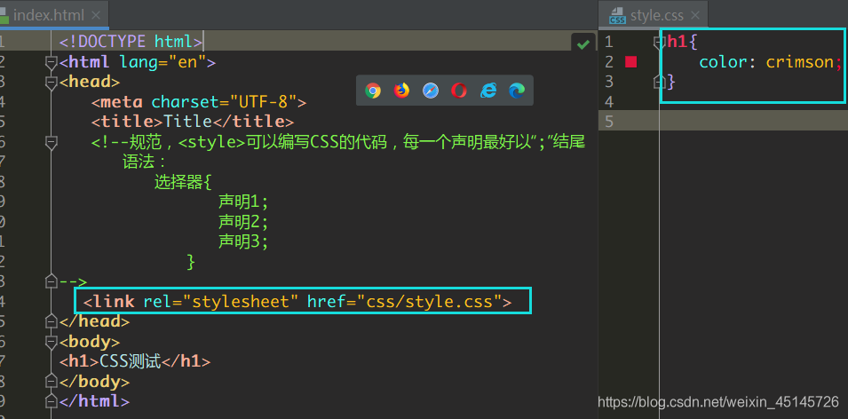
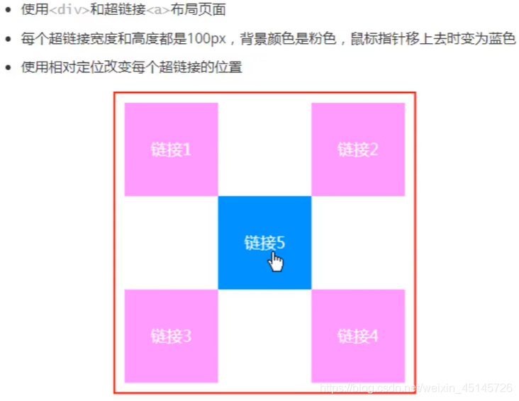
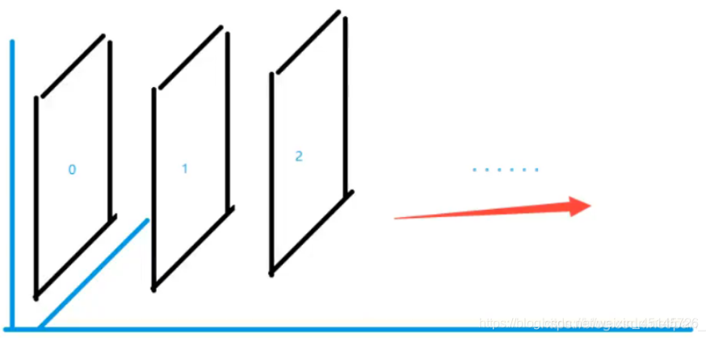
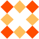
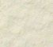
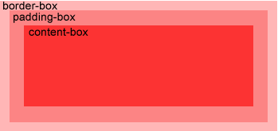
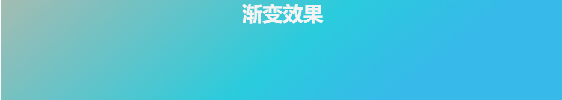
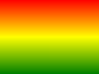
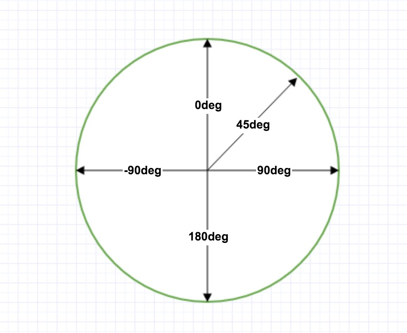

# CSS3

1.css是什么

2.CSS怎么用（快速入门）

3.CSS选择器（重点 + 难点）

4.美化页面（文字、阴影、超链接、列表、渐变…）

5.盒子模型

6.浮动

7.定位

8.网页动画（特效）

## 1.什么是CSS

### 1.1、什么是CSS

Cascading Style Sheet 层叠样式表
CSS：表现（美化网页）
字体，颜色，边距，高度，宽度，背景图片，网页定位，网页浮动

### 1.2、发展史

CSS1.0
CSS2.0：DIV（块）+CSS，HTML与CSS结构分离的思想，网页变得简单，SEO
CSS2.1：浮动，定位
CSS3.0：圆角、阴影、动画…浏览器兼容性~

```html
<!DOCTYPE html>
<html lang="en">
<head>
    <meta charset="UTF-8">
    <title>Title</title>
    <!--规范，<style>可以编写CSS的代码，每一个声明最好以“;”结尾
        语法：
            选择器{
                    声明1;
                    声明2;
                    声明3;
                }	-->
    <style>
        h1{
            color: crimson;
        }
    </style>
</head>
<body>
    <h1>CSS测试</h1>
</body>
</html>
```



## 2、快速入门

### 2.1.2、CSS的优势：

1、内容和表现分离；
2、网页结构表现统一，可以实现复用
3、样式十分的丰富
4、建议使用独立于html的css文件
5、利用SEO，容易被搜索引擎收录！

### 2.1.3、CSS的3种常用导入方式

```html
<!DOCTYPE html>
<html lang="en">
<head>
    <meta charset="UTF-8">
    <title>Title</title>
    
    <style><!--内部样式-->
        h1{
            color: green;
        }
    </style>

    <!--外部样式-->
    <link rel="stylesheet" href="css/style.css" />
</head>
<body>

<!--优先级：就近原则 行内样式 > 内部样式 > 外部样式-->
<!--行内样式：在标签元素中，编写一个style属性，编写样式即可-->
<h1 style="color: red">这是标签</h1>
</body>
</html>
```

拓展：外部样式两种方法

- 链接式
  html

```html
<!--外部样式-->
<link rel="stylesheet" href="css/style.css" />
```

- 导入式
  @import是CSS2.1特有的！

```html
<!--导入式-->
<style>
    @import url("css/style.css");
</style>
```

### 2.2选择器

> 作用：选择页面上的某一个后者某一类元素

#### 2.2.1、基本选择器

##### 1、标签选择器

 **选择一类标签**

 格式： **标签 { }**

```html
<head>
    <meta charset="UTF-8">
    <title>Title</title>
    <style>
        h1{
            color: orange;
            background: blue;
            border-radius: 10px;
        }
        h3{
            color: orange;
            background: blue;
            border-radius: 10px;
        }
        p{
            font-size: 80px;
        }
    </style>
</head>
<body>
<h1>标签选择器</h1>
<p>我爱学习</p>
<h3>学习JAVA</h3>
</body>
```

##### 2、类选择器class

 **选择所有class一致的标签，跨标签**

 格式： **.类名{}**

```html
<head>
    <meta charset="UTF-8">
    <title>Title</title>
    <style>
        /*类选择器的格式 .class的名称{}
            好处：可以多个标签归类，是同一个class，可以复用*/
        .demo1{
            color: blue;
        }
        .demo2{
            color: red;
        }
        .demo3{
            color: aqua;
        }a
    </style>
</head>
<body>
<h1 class = "demo1">类选择器：demo1</h1>
<h1 class="demo2">类选择器：demo2</h1>
<h1 class="demo3">类选择器：demo3</h1>
<p class="demo3">p标签</p>
</body>
```

##### 3、id 选择器

 **全局唯一**

 格式： **#id名{}**

```html
<head>
    <meta charset="UTF-8">
    <title>Title</title>
    <style>
        /*id选择器：id必须保证全局唯一
            #id名称{}
            不遵循就近原则，优先级是固定的
            id选择器 > class类选择器  >  标签选择器
        */
        #demo1{
            color: red;
        }
        .demo2{
            color: green;
        }
        #demo2{
            color: orange;
        }
        h1{
            color: blue;
        }
    </style>
</head>
<body>
    <h1 id="demo1" class="demo2">id选择器：demo1</h1>
    <h1 class="demo2" id = "demo2">id选择器：demo2</h1>
    <h1 class="demo2">id选择器：demo3</h1>
    <h1 >id选择器：demo4</h1>
    <h1>id选择器：demo5</h1>
</body>
```

**优先级：id > class > 标签**

#### 2.2.2、高级选择器

##### 1. 层次选择器

- 后代选择器：在某个元素的后面

```css
/*后代选择器*/
<style>
body p{
	background:red;
}
</style>
```

- 子选择器，一代

```css
/*子选择器*/
<style>
body>p{
	background:orange;
}
</style>
```

- 相邻的兄弟选择器 同辈

```css
/*相邻兄弟选择器：只选择一个，相邻（向下）*/
<style>
.active+p{
background: red
}
</style>
<body>
	<p class="active">p1<p>
	<p>p2</p>
</body>
```

- 通用选择器

```css
<style>
/*通用兄弟选择器，当前选中元素的向下的所有兄弟元素*/
	.active~p{
	background:red;
}
</style>
<body>
	<p class="active">p1<p>
	<p>p2</p>
</body>
```

##### 2.结构伪类选择器

伪类

```html
 <style>
        ul li:first-child{/*ul的第一个子元素*/
            background: aqua;
        }
        ul li:last-child{/*ul的最后一个子元素*/
            background: blue;
        }
        /*选中p1：定位到父元素，选择当前的第一个元素
            选择当前p元素 的父级元素，选中父级元素的第一个，并且是当前元素才生效！*/
        p:nth-child(1){
            background: orange;
        }
        p:nth-of-type(2){/*选中父元素下的，第2个p元素*/
            background: red;
        }
        a:hover{
            color: green;
        }
    </style>
</head>
<body>
    <a href="">123</a>
    <p>p1</p>
    <p>p2</p>
    <p>p3</p>
    <h3>h3</h3>
    <ul>
        <li>1li1</li>
        <li>1li2</li>
        <li>1li3</li>
    </ul>
    <ul>
        <li>2li1</li>
        <li>2li2</li>
        <li>2li3</li>
    </ul>
    <a href="www.baidu.com">百度</a>
</body>
```

##### 3.属性选择器（常用）

id + class结合

```html
<head>
    <meta charset="UTF-8">
    <title>Title</title>
    <style>
        .demo a{
            float: left;
            display: block;
            height: 50px;
            width: 50px;
            border-radius: 10px;
            background: aquamarine;
            text-align: center;
            color: gray;
            text-decoration: none;
            margin-right: 5px;
            /*line-height:50px;*/
            font: bold 20px/50px Arial;
        }
        /*属性名，属性名=属性值（正则）
         = 表示绝对等于
         *= 表示包含
         ^= 表示以...开头
         $= 表示以...结尾
         存在id属性的元素
            a[]{}
         */
        a[id]{
            background: yellow;
        }
        a[id=first]{/*id=first的元素*/
            background: green;
        }
        
        a[class*="links"]{/*class 中有links的元素*/
            background: bisque;
        }

        a[href^=http]{/*选中href中以http开头的元素*/
            background: aquamarine;
        }
        a[href$=pdf]{/*选中href中以http开头的元素*/
            background: aquamarine;
        }
    </style>
</head>
<body>
    <p class="demo">
        <a href="http:www.baidu.com" class="links item first" id="first">1</a>
        <a href="" class="links item active" target="_blank " title="test">2</a>
        <a href="images/123.html" class="links item">3</a>
        <a href="images/1.png" class="links item">4</a>
        <a href="images/1.jpg" class="links item">5</a>
        <a href="abc" class="links item">6</a>
        <a href="/a.pdf" class="links item">7</a>
        <a href="/abc.pdf" class="links item">8</a>
        <a href="abc.doc" class="links item">9</a>
        <a href="abcd.doc" class="links item last">10</a>
    </p>
</body>
```

## 3、字体列表渐变

### 3.1、为什么要美化网页

1. 有效的传递页面信息
2. 美化网页，页面漂亮才能吸引客户
3. 凸显页面的主题
4. 提高用户的体验

**span标签**：重点要突出的字，使用span标签套起来

```html
<head>
    <meta charset="UTF-8">
    <title>Title</title>
    <style>
        #title1{
            font-size: 50px;
        }
    </style>
</head>
<body>
学习语言<span id="title1">JAVA</span>
</body>
```

### 3.2、字体样式

- font-family：字体
- font-size：字体大小
- font-weight：字体粗细
- color：字体颜色

```html
<head>
    <meta charset="UTF-8">
    <title>Title</title>
    <style>
        body{
            font-family:"Arial Black",楷体;
            color: red;
        }
        h1{
            font-size: 50px;
        }
        .p1{
            font-weight: 600;
            color: gray;
        }
    </style>
</head>
<body>
    <h1>标题</h1>
    <p>正文11111</p>
    <p class="p1">正文2222222</p>
    <p>i love study java</p>
</body>
```

常用写法：

```css
font-weight:bolder;/*也可以填px，但不能超过900,相当于bloder*/
/*常用写法：*/
font:oblique bloder 12px "楷体"

```

### 3.3、文本样式

1. 颜色–>color:agb / rgba()
2. 文本对齐方式–>text-align：center
3. 首行缩进–>text-indent：2em
4. 行高–>line-height：300px；
5. 下划线–>text-decoration

```css
text-decoration:underline/*下划线*/
text-decoration:line-through/*中划线*/
text-decoration:overline/*上划线*/
text-decoration:none/*超链接去下划线*/
```

1. 图片、文字水平对齐

```css
img,span{vetical-align:middle}
```

### 3.4、文本，阴影和超链接伪类

```css
<style>
	a{/*超链接有默认的颜色*/
		text-decoration:none;
		color:#000000;
	}
	a:hover{/*鼠标悬浮的状态*/
		color:orange;
	}
	a:active{/*鼠标按住未释放的状态*/
		color:green
	}
	a:visited{/*点击之后的状态*/
		color:red
	}
	a:link{
            background: bisque;
        }
</style>
```

阴影：

```css
/*	第一个参数：表示水平偏移
	第二个参数：表示垂直偏移
	第三个参数：表示模糊半径
	第四个参数：表示颜色
*/
text-shadow:5px 5px 5px 颜色
```

### 3.6、列表ul li

主页index.html代码：

```html
<!DOCTYPE html>
<html lang="en">
<head>
    <meta charset="UTF-8">
    <title>Title</title>
    <link href="css/style.css" rel="stylesheet" type="text/css">
</head>
<body>
<div id="nav">
    <h2 class="title">全部商品分类</h2>
    <ul>
        <li>
            <a href="#">图书</a>
            <a href="#">音像</a>
            <a href="#">数字商品</a>
        </li>
        <li>
            <a href="#">家用电器</a>
            <a href="#">手机</a>
            <a href="#">数码</a>
        </li>
        <li>
            <a href="#">电脑</a>
            <a href="#">办公</a>
        </li>
        <li>
            <a href="#">家居</a>
            <a href="#">家装</a>
            <a href="#">厨具</a>
        </li>
        <li>
            <a href="#">服饰鞋帽</a>
            <a href="#">个性化妆</a>
        </li>
        <li>
            <a href="#">礼品箱包</a>
            <a href="#">钟表</a>
            <a href="#">珠宝</a>
        </li>
        <li>
            <a href="#">食品饮料</a>
            <a href="#">保健食品</a>
        </li>
        <li>
            <a href="#">彩票</a>
            <a href="#">旅行</a>
            <a href="#">充值</a>
            <a href="#">票务</a>
        </li>
    </ul>
</div>
</body>
</html>

```

css代码：

```css
#nav{
    width: 300px;
    background: antiquewhite;
}
.title{
    font-size: 18px;
    font-weight: bold;
    text-indent: 1em;/*缩进*/
    line-height: 35px;
    background: red;
}
/*ul li*/
/*
list-style:
    non 去掉实心圆
    circle 空心圆
    square 正方形
*/
/*ul{!*nav替换效果*!
    background: antiquewhite;
}*/
ul li{
    height: 30px;
    list-style: none;
    text-indent: 1em;
}
a{
    text-decoration: none;
    font-size: 14px;
    color: black;
 }
a:hover{
    color: burlywood;
    text-decoration: underline;
}

```

### 3.7、背景

1. 背景颜色：background
2. 背景图片

```html
background-image:url("");/*默认是全部平铺的*/
background-repeat:repeat-x/*水平平铺*/
background-repeat:repeat-y/*垂直平铺*/
background-repeat:no-repeat/*不平铺*/
```

## 4、盒子模型

### 4.1什么是盒子模型


margin：外边距
padding：内边距
border：边框


### 4.3、外边距----妙用：居中

margin-left/right/top/bottom–>表示四边，可分别设置，也可以同时设置如下

```css
margin:0 0 0 0/*分别表示上、右、下、左；从上开始顺时针*/
/*例1：居中*/
margin:0 auto /*auto表示左右自动*/
/*例2：*/
margin:4px/*表示上、右、下、左都为4px*/
/*例3*/
margin:10px 20px 30px/*表示上为10px，左右为20px，下为30px*/

```

盒子的计算方式：
margin+border+padding+内容的大小

总结：
body总有一个默认的外边距 margin:0
常见操作：初始化

## 5、浮动

### 5.1标准文档流

块级元素：独占一行 h1~h6 、p、div、 列表…
行内元素：不独占一行 span、a、img、strong

注： 行内元素可以包含在块级元素中，反之则不可以

### 5.2、display（重要）

block：块元素
inline：行内元素
inline-block：是块元素，但是可以内联，在一行
这也是一种实现行内元素排列的方式，但是我们很多情况用float

none：消失

```html
<!DOCTYPE html>
<html lang="en">
<head>
    <meta charset="UTF-8">
    <title>Title</title>
    <!--block 块元素
        inline 行内元素
        inline-block 是块元素，但是可以内联 ，在一行
    -->
    <style>
        div{
            width: 100px;
            height: 100px;
            border: 1px solid red;
            display: inline-block;
        }
        span{
            width: 100px;
            height: 100px;
            border: 1px solid red;
            display: inline-block;
        }
    </style>
</head>
<body>
<div>div块元素</div>
<span>span行内元素</span>
</body>
</html>

```

### 5.3、float：left/right左右浮动

#### 元素怎样浮动

元素的水平方向浮动，意味着元素只能左右移动而不能上下移动。

一个浮动元素会尽量向左或向右移动，直到它的外边缘碰到包含框或另一个浮动框的边框为止。

浮动元素之后的元素将围绕它。

浮动元素之前的元素将不会受到影响。

如果图像是右浮动，下面的文本流将环绕在它左边：

```html
<!DOCTYPE html>
<html>
<head>
<meta charset="utf-8"> 
<title></title>
<style>
img 
{
	float:right;
}
</style>
</head>

<body>
<p>在下面的段落中，我们添加了一个 <b>float:right</b> 的图片。导致图片将会浮动在段落的右边。</p>
<p>

这是一些文本。这是一些文本。这是一些文本。
这是一些文本。这是一些文本。这是一些文本。
这是一些文本。这是一些文本。这是一些文本。
这是一些文本。这是一些文本。这是一些文本。
这是一些文本。这是一些文本。这是一些文本。
这是一些文本。这是一些文本。这是一些文本。
这是一些文本。这是一些文本。这是一些文本。
这是一些文本。这是一些文本。这是一些文本。
这是一些文本。这是一些文本。这是一些文本。
这是一些文本。这是一些文本。这是一些文本。
</p>
</body>
</html>
```

#### 彼此相邻的浮动元素

如果你把几个浮动的元素放到一起，如果有空间的话，它们将彼此相邻。

在这里，我们对图片廊使用 float 属性：

```html
<!DOCTYPE html>
<html>
<head>
<meta charset="utf-8"> 
<title></title> 
<style>
.thumbnail 
{
	float:left;
	width:110px;
	height:90px;
	margin:5px;
}
</style>
</head>

<body>
<h3>图片库</h3>
<p>试着调整窗口,看看当图片没有足够的空间会发生什么。</p>


</body>
</html>
```


#### 清除浮动 - 使用 clear

元素浮动之后，周围的元素会重新排列，为了避免这种情况，使用 clear 属性。

clear 属性指定元素两侧不能出现浮动元素。clear：both

使用 clear 属性往文本中添加图片廊：

```html
<!DOCTYPE html>
<html>
<head>
<meta charset="utf-8"> 
<title></title> 
<style>
.thumbnail 
{
	float:left;
	width:110px;
	height:90px;
	margin:5px;
}
.text_line
{
	clear:both;
	margin-bottom:2px;
}
</style>
</head>

<body>
<h3>图片库</h3>
<p>试着调整窗口,看看当图片没有足够的空间会发生什么。.</p>


<h3 class="text_line">第二行</h3>


</body>
</html>
```


### 5.4、overflow

#### CSS Overflow

CSS overflow 属性可以控制内容溢出元素框时在对应的元素区间内添加滚动条。

overflow属性有以下值：

| 值      | 描述                                                     |
| :------ | :------------------------------------------------------- |
| visible | 默认值。内容不会被修剪，会呈现在元素框之外。             |
| hidden  | 内容会被修剪，并且其余内容是不可见的。                   |
| scroll  | 内容会被修剪，但是浏览器会显示滚动条以便查看其余的内容。 |
| auto    | 如果内容被修剪，则浏览器会显示滚动条以便查看其余的内容。 |
| inherit | 规定应该从父元素继承 overflow 属性的值。                 |

**注意:**overflow 属性只工作于指定高度的块元素上。

**注意:** 在 OS X Lion ( Mac 系统) 系统上，滚动条默认是隐藏的，使用的时候才会显示 (设置 "overflow:scroll" 也是一样的)。

```html
<!DOCTYPE html>
<html>
<head>
<meta charset="utf-8">
<title></title>
<style>
#overflowTest {
    background: #4CAF50;
    color: white;
    padding: 15px;
    width: 80%;
    height: 100px;
    overflow: scroll;
    border: 1px solid #ccc;
}
</style>
</head>
<body>

<div id="overflowTest">
<p>这里的文本内容是可以滚动的，滚动条方向是垂直方向。</p>
<p>这里的文本内容是可以滚动的，滚动条方向是垂直方向。</p>
<p>这里的文本内容是可以滚动的，滚动条方向是垂直方向。</p>
<p>这里的文本内容是可以滚动的，滚动条方向是垂直方向。</p>
<p>这里的文本内容是可以滚动的，滚动条方向是垂直方向。</p>
<p>这里的文本内容是可以滚动的，滚动条方向是垂直方向。</p>
</div>

</body>
</html>
```

#### overflow: visible

默认情况下，overflow 的值为 visible， 意思是内容溢出元素框：

这里的文本内容会溢出元素框。

这里的文本内容会溢出元素框。

这里的文本内容会溢出元素框。

这里的文本内容会溢出元素框。

这里的文本内容会溢出元素框。

这里的文本内容会溢出元素框。

这里的文本内容会溢出元素框。

```html
<!DOCTYPE html>
<html>
<head>
<meta charset="utf-8">
<title></title>
<style>
div {
    background-color: #eee;
    width: 200px;
    height: 50px;
    border: 1px dotted black;
    overflow: visible;
}
</style>
</head>
<body>

<div id="overflowTest">
<p>这里的文本内容会溢出元素框。</p>
<p>这里的文本内容会溢出元素框。</p>
<p>这里的文本内容会溢出元素框。</p>
</div>

</body>
</html>
```

clear：
right：右侧不允许有浮动元素
left：左侧不允许有浮动元素
both：两侧不允许有浮动元素
none：

解决塌陷问题方案：
方案一：增加父级元素的高度；
方案二：增加一个空的div标签，清除浮动

```css
<div class = "clear"></div>
<style>
	.clear{
		clear:both;
		margin:0;
		padding:0;
}
</style>
```

方案三：在父级元素中增加一个overflow属性

```css
overflow:hidden/*隐藏超出部分*/
overflow：scoll/*滚动*/
```

方案四：父类添加一个伪类:after

```css
#father:after{
	content:'';
	display:block;
	clear:both;
}
```

小结：

1. 浮动元素增加空div----> 简单、代码尽量避免空div
2. 设置父元素的高度-----> 简单，但是元素假设有了固定的高度，可能就会超出范围
3. overflow----> 简单，下拉的一些场景避免使用
4. 父类添加一个伪类:after（推荐）----> 写法稍微复杂，但是没有副作用，**推荐使用**

### 5.5、display与float对比

1. display：方向不可以控制
2. float：浮动起来的话会脱离标准文档流，所以要解决父级边框塌陷的问题。

## 6、定位

### 6.1、相对定位

相对定位：**positon：relstive；**
相对于原来的位置，进行指定的偏移，相对定位的话，它仍然在标准文档流中！原来的位置会被保留

```css
top:-20px;/*向上偏移20px*/
left:20px;/*向右偏移20px*/
bottom:10px;/*向上偏移10px*/
right:20px;/*向左偏移20px*/
1234
```

代码：

```html
<!DOCTYPE html>
<html lang="en">
<head>
    <meta charset="UTF-8">
    <title>相对定位</title>
    <!--相对定位
            相对于自己原来的位置进行偏移
    -->
    <style>
        body{
            padding: 20px;
        }
        div{
            margin: 10px;
            padding: 5px;
            font-size: 12px;
            line-height: 25px;
        }
        #father{
            border: #ffa538 1px solid;
            padding: 0;
        }
        #first{
            border: #b3ff38 1px solid;
            background-color: #ffa538;
            position: relative;/*相对定位：上下左右*/
            top: -20px;/*向上偏移20px*/
            left: 20px;/*向右偏移20px*/
        }
        #second{
            border: #427b11 1px solid;
            background-color: #66c77f;
        }
        #third{
            background-color: #b3ff38;
            border: #38d7ff 1px solid;
            position: relative;
            bottom: 10px;/*向上偏移10px*/
        }
    </style>
</head>
<body>
<div id="father">
    <div id="first">第一个盒子</div>
    <div id="second">第二个盒子</div>
    <div id="third">第三个盒子</div>
</div>
</body>
</html>

```

练习：

实现代码：

```html
<style>
        #box{
            height: 300px;
            width: 300px;
            border: 2px red solid;
            padding: 10px;
        }
        a{
            height: 100px;
            width: 100px;
            background-color: #ee73b7;
            color: white;
            text-align: center;
            text-decoration: none;
            line-height: 100px;/*设置行距100px*/
            display: block;/*设置方块*/
        }
        a:hover{
            background: #4158D0;
        }
        .a2{
            position: relative;
            left: 200px;
            top: -100px;
        }
        .a4{
            position: relative;
            left: 200px;
            top: -100px;
        }
        .a5{
            position: relative;
            left: 100px;
            top: -300px;
        }
    </style>
</head>
<body>
<div id="box">
    <div class="a1"><a href="" >连接1</a></div>
    <div class="a2"><a href="" >连接2</a></div>
    <div class="a3"><a href="" >连接3</a></div>
    <div class="a4"><a href="" >连接4</a></div>
    <div class="a5"><a href="" >连接5</a></div>
</div>
</body>

```

### 6.2、绝对定位-absolute和固定定位-fixed

定位：基于xxx定位，上下左右~
1、没有父级元素定位的前提下，相对于浏览器定位
2、假设父级元素存在定位，我们通常会相对于父级元素进行偏移
3、在父级元素范围内移动
总结：相对一父级或浏览器的位置，进行指定的偏移，绝对定位的话，它不在标准文档流中，原来的位置不会被保留

```html
<head>
    <meta charset="UTF-8">
    <title>Title</title>
    <style>
        body{
            height: 1000px;
        }
        div:nth-of-type(1){
            width: 100px;
            height: 100px;
            background-color: red;
            position: absolute;/*absolute 绝对定位*/
            right: 0;
            bottom: 0;
        }
        div:nth-of-type(2){
            width: 50px;
            height: 50px;
            background-color: #b3ff38;
            position: fixed;/*fixed 固定定位*/
            right: 0;
            bottom: 0;
        }
    </style>
</head>
<body>
<div>div1</div>
<div>div2</div>
</body>

```

### 6.3、z-index



图层-z-index：默认是0，最高无限~999

index.html代码：

```html
<!DOCTYPE html>
<html lang="en">
<head>
    <meta charset="UTF-8">
    <title>Title</title>
    <link rel="stylesheet" href="css/style.css" type="text/css">
    <style></style>
</head>
<body>
<div id="content">
    <ul>
        <li></li>
        <li class="tipText">学习微服务，找狂神</li>
        <li class="tipBg"></li>
        <li>时间：2099-01-01</li>
        <li>地点：月球一号基地</li>
    </ul>
</div>
</body>
</html>

```

css代码：

```css
#content{
    width: 380px;
    padding: 0px;
    margin: 0px;
    overflow: hidden;
    font-size: 12px;
    line-height: 25px;
    border: 1px solid yellow;
}
ul,li{
    padding: 0px;
    margin: 0px;
    list-style: none;
}
/*父级元素相对定位*/
#content ul{
    position: relative;
}
.tipText,.tipBg{
    position: absolute;
    width: 380px;
    height: 25px;
    top:216px
}
.tipText{
    color: white;
    z-index: 999;
}
.tipBg{
    background: orange;
    opacity: 0.5;/*背景透明度*/
    filter: alpha(opacity=50);
}
```

## 7、CSS3 边框

### CSS3 边框

用 CSS3，你可以创建圆角边框，添加阴影框，并作为边界的形象而不使用设计程序，如 Photoshop。

在本章中，您将了解以下的边框属性：

- border-radius
- box-shadow
- border-image

------

### CSS3 圆角

在 CSS2 中添加圆角棘手。我们不得不在每个角落使用不同的图像。

在 CSS3 中，很容易创建圆角。

在 CSS3 中 border-radius 属性被用于创建圆角：

这是圆角边框！

```html
<!DOCTYPE html>
<html>
<head>
<meta charset="utf-8"> 
<title></title> 
<style> 
div
{
	border:2px solid #a1a1a1;
	padding:10px 40px; 
	background:#dddddd;
	width:300px;
	border-radius:25px;
}
</style>
</head>
<body>

<div>border-radius 属性允许您为元素添加圆角边框！ </div>

</body>
</html>
```

### CSS3 border-radius 属性

使用 CSS3 border-radius 属性，你可以给任何元素制作 "圆角"。

```html
<!DOCTYPE html>
<html>
<head>
<meta charset="utf-8"> 
<title></title> 
<style> 
#rcorners1 {
    border-radius: 25px;
    background: #8AC007;
    padding: 20px; 
    width: 200px;
    height: 150px;    
}

#rcorners2 {
    border-radius: 25px;
    border: 2px solid #8AC007;
    padding: 20px; 
    width: 200px;
    height: 150px;    
}

#rcorners3 {
    border-radius: 25px;
    background: url(/images/paper.gif);
    background-position: left top;
    background-repeat: repeat;
    padding: 20px; 
    width: 200px;
    height: 150px;    
}
</style>
</head>
<body>

<p> border-radius 属性允许向元素添加圆角。</p>
<p>指定背景颜色元素的圆角:</p>
<p id="rcorners1">圆角</p>
<p>指定边框元素的圆角:</p>
<p id="rcorners2">圆角</p>
<p>指定背景图片元素的圆角:</p>
<p id="rcorners3">圆角</p>

</body>
</html>
```

### CSS3 border-radius - 指定每个圆角

如果你在 border-radius 属性中只指定一个值，那么将生成 4 个 圆角。

但是，如果你要在四个角上一一指定，可以使用以下规则：

- **四个值:** 第一个值为左上角，第二个值为右上角，第三个值为右下角，第四个值为左下角。
- **三个值:** 第一个值为左上角, 第二个值为右上角和左下角，第三个值为右下角
- **两个值:** 第一个值为左上角与右下角，第二个值为右上角与左下角
- **一个值：** 四个圆角值相同

```html
<!DOCTYPE html>
<html>
<head>
<meta charset="utf-8"> 
<title></title> 
<style> 
#rcorners4 {
    border-radius: 15px 50px 30px 5px;
    background: #8AC007;
    padding: 20px; 
    width: 200px;
    height: 150px; 
}

#rcorners5 {
    border-radius: 15px 50px 30px;
    background: #8AC007;
    padding: 20px; 
    width: 200px;
    height: 150px; 
}

#rcorners6 {
    border-radius: 15px 50px;
    background: #8AC007;
    padding: 20px; 
    width: 200px;
    height: 150px; 
} 
</style>
</head>
<body>

<p>四个值 - border-radius: 15px 50px 30px 5px:</p>
<p id="rcorners4"></p>

<p>三个值 - border-radius: 15px 50px 30px:</p>
<p id="rcorners5"></p>

<p>两个值 - border-radius: 15px 50px:</p>
<p id="rcorners6"></p>

</body>
</html>
```

### CSS3 盒阴影

CSS3 中的 box-shadow 属性被用来添加阴影:

```html
<!DOCTYPE html>
<html>
<head>
<meta charset="utf-8"> 
<title></title> 
<style> 
div
{
	width:300px;
	height:100px;
	background-color:yellow;
	box-shadow: 10px 10px 5px #888888;
}
</style>
</head>
<body>
<div></div>
</body>
</html>
```

### CSS3 边界图片

有了 CSS3 的 border-image 属性，你可以使用图像创建一个边框：

border-image 属性允许你指定一个图片作为边框！ 用于创建上文边框的原始图像：



在 div 中使用图片创建边框:

```html
<!DOCTYPE html>
<html>
<head>
<meta charset="utf-8"> 
<title></title> 
<style> 
div
{
	border:15px solid transparent;
	width:250px;
	padding:10px 20px;
}
#round
{
	-webkit-border-image:url(border.png) 30 30 round; /* Safari 5 and older */
	-o-border-image:url(border.png) 30 30 round; /* Opera */
	border-image:url(border.png) 30 30 round;
}
#stretch
{
	-webkit-border-image:url(border.png) 30 30 stretch; /* Safari 5 and older */
	-o-border-image:url(border.png) 30 30 stretch; /* Opera */
	border-image:url(border.png) 30 30 stretch;
}
</style>
</head>
<body>
<p><b>注意: </b> Internet Explorer 不支持 border-image 属性。</p>
<p> border-image 属性用于设置图片的边框。</p>
<div id="round">这里，图像平铺（重复）来填充该区域。</div>
<br>
<div id="stretch">这里，图像被拉伸以填充该区域。</div>
<p>这是我们使用的图片素材：</p>

</body>
</html>
```

## 8、CSS3 背景

CSS3 中包含几个新的背景属性，提供更大背景元素控制。

在本章您将了解以下背景属性：

- background-image
- background-size
- background-origin
- background-clip

```html
<!DOCTYPE html>
<html>
<head>
<meta charset="utf-8"> 
<title></title> 
<style>
#example1 {
    background-image: url(img_flwr.gif), url(paper.gif);
    background-position: right bottom, left top;
    background-repeat: no-repeat, repeat;
    padding: 15px;
}
</style>
</head>
<body>

<div id="example1">
<h1>h1</h1>
<p>p</p>
<p>p</p>
</div>

</body>
</html>
```



### CSS3 background-size 属性

background-size指定背景图像的大小。CSS3以前，背景图像大小由图像的实际大小决定。

CSS3中可以指定背景图片，让我们重新在不同的环境中指定背景图片的大小。您可以指定像素或百分比大小。

你指定的大小是相对于父元素的宽度和高度的百分比的大小。

```html
<!DOCTYPE html>
<html>
<head>
<meta charset="utf-8"> 
<title></title> 
<style> 
body
{
	background:url(/try/demo_source/img_flwr.gif);
	background-size:80px 60px;
	background-repeat:no-repeat;
	padding-top:40px;
}
</style>
</head>
<body>
<p>
Lorem ipsum，中文又称“乱数假文”， 是指一篇常用于排版设计领域的拉丁文文章 ，主要的目的为测试文章或文字在不同字型、版型下看起来的效果。
</p>

<p>原始图片: </p>

</body>
</html>
```

伸展背景图像完全填充内容区域：

```css
div
{
    background:url(img_flwr.gif);
    background-size:100% 100%;
    background-repeat:no-repeat;
}
```

### CSS3 的 background-origin 属性

background-origin 属性指定了背景图像的位置区域。

content-box, padding-box,和 border-box区域内可以放置背景图像。



```html
<!DOCTYPE html>
<html>
<head>
<meta charset="utf-8"> 
<title>s</title>
<style> 
div
{
	border:1px solid black;
	padding:35px;
	background-image:url('smiley.gif');
	background-repeat:no-repeat;
	background-position:left;
}
#div1
{
	background-origin:border-box;
}
#div2
{
	background-origin:content-box;
}
</style>
</head>
<body>

<p>背景图像边界框的相对位置：</p>
<div id="div1">
Lorem ipsum dolor sit amet, consectetuer adipiscing elit, sed diam nonummy nibh euismod tincidunt ut laoreet dolore magna aliquam erat volutpat. Ut wisi enim ad minim veniam, quis nostrud exerci tation ullamcorper suscipit lobortis nisl ut aliquip ex ea commodo consequat.
</div>

<p>背景图像的相对位置的内容框：</p>
<div id="div2">
Lorem ipsum dolor sit amet, consectetuer adipiscing elit, sed diam nonummy nibh euismod tincidunt ut laoreet dolore magna aliquam erat volutpat. Ut wisi enim ad minim veniam, quis nostrud exerci tation ullamcorper suscipit lobortis nisl ut aliquip ex ea commodo consequat.
</div>

</body>
</html>
```

## CSS3 渐变（Gradients）



CSS3 渐变（gradients）可以让你在两个或多个指定的颜色之间显示平稳的过渡。

以前，你必须使用图像来实现这些效果。但是，通过使用 CSS3 渐变（gradients），你可以减少下载的时间和宽带的使用。此外，渐变效果的元素在放大时看起来效果更好，因为渐变（gradient）是由浏览器生成的。

CSS3 定义了两种类型的渐变（gradients）：

- **线性渐变（Linear Gradients）- 向下/向上/向左/向右/对角方向**
- **径向渐变（Radial Gradients）- 由它们的中心定义**

### CSS3 线性渐变

为了创建一个线性渐变，你必须至少定义两种颜色节点。颜色节点即你想要呈现平稳过渡的颜色。同时，你也可以设置一个起点和一个方向（或一个角度）。

**线性渐变的实例：**



### 语法

```
background-image: linear-gradient(direction, color-stop1, color-stop2, ...);
```

### **线性渐变 - 从上到下（默认情况下）**

下面的实例演示了从顶部开始的线性渐变。起点是红色，慢慢过渡到蓝色：

```html
<!DOCTYPE html>
<html>
<head>
<meta charset="utf-8"> 
<title></title> 
<style>
#grad1 {
    height: 200px;
	background-color: red; /* 浏览器不支持时显示 */
    background-image: linear-gradient(#e66465, #9198e5);
}
</style>
</head>
<body>

<h3>线性渐变 - 从上到下</h3>
<p>从顶部开始的线性渐变。起点是红色，慢慢过渡到蓝色：</p>

<div id="grad1"></div>

<p><strong>注意：</strong> Internet Explorer 9 及之前的版本不支持渐变。</p>

</body>
</html>
```

### **线性渐变 - 从左到右**

下面的实例演示了从左边开始的线性渐变。起点是红色，慢慢过渡到黄色：

```html
<!DOCTYPE html>
<html>
<head>
<meta charset="utf-8"> 
<title></title> 
<style>
#grad1 {
    height: 200px;
    background-color: red; /* 不支持线性的时候显示 */
    background-image: linear-gradient(to right, red , yellow);
}
</style>
</head>
<body>

<h3>线性渐变 - 从左到右</h3>
<p>从左边开始的线性渐变。起点是红色，慢慢过渡到黄色：</p>

<div id="grad1"></div>

<p><strong>注意：</strong> Internet Explorer 8 及之前的版本不支持渐变。</p>

</body>
</html>
```

**线性渐变 - 对角**

你可以通过指定水平和垂直的起始位置来制作一个对角渐变。

下面的实例演示了从左上角开始（到右下角）的线性渐变。起点是红色，慢慢过渡到黄色：

```html
<!DOCTYPE html>
<html>
<head>
<meta charset="utf-8"> 
<title></title> 
<style>
#grad1 {
    height: 200px;
    background-color: red; /* 不支持线性的时候显示 */
    background-image: linear-gradient(to bottom right, red , yellow);
}
</style>
</head>
<body>

<h3>线性渐变 - 对角</h3>
<p>从左上角开始（到右下角）的线性渐变。起点是红色，慢慢过渡到黄色：</p>

<div id="grad1"></div>

<p><strong>注意：</strong> Internet Explorer 8 及之前的版本不支持渐变。</p>

</body>
</html>
```

### 使用角度

如果你想要在渐变的方向上做更多的控制，你可以定义一个角度，而不用预定义方向（to bottom、to top、to right、to left、to bottom right，等等）。

### 语法

```
background-image: linear-gradient(angle, color-stop1, color-stop2);
```

角度是指水平线和渐变线之间的角度，逆时针方向计算。换句话说，0deg 将创建一个从下到上的渐变，90deg 将创建一个从左到右的渐变。



但是，请注意很多浏览器（Chrome、Safari、firefox等）的使用了旧的标准，即 0deg 将创建一个从左到右的渐变，90deg 将创建一个从下到上的渐变。换算公式 **90 - x = y** 其中 x 为标准角度，y为非标准角度。

下面的实例演示了如何在线性渐变上使用角度：

```
<!DOCTYPE html>
<html>
<head>
<meta charset="utf-8"> 
<title></title> 
<style>
#grad1 {
  height: 100px;
  background-color: red; /* 浏览器不支持的时候显示 */
  background-image: linear-gradient(0deg, red, yellow); 
}

#grad2 {
  height: 100px;
  background-color: red; /* 浏览器不支持的时候显示 */
  background-image: linear-gradient(90deg, red, yellow); 
}

#grad3 {
  height: 100px;
  background-color: red; /* 浏览器不支持的时候显示 */
  background-image: linear-gradient(180deg, red, yellow); 
}

#grad4 {
  height: 100px;
  background-color: red; /* 浏览器不支持的时候显示 */
  background-image: linear-gradient(-90deg, red, yellow); 
}
</style>
</head>
<body>

<h3>线性渐变 - 使用不同的角度</h3>

<div id="grad1" style="text-align:center;">0deg</div><br>
<div id="grad2" style="text-align:center;">90deg</div><br>
<div id="grad3" style="text-align:center;">180deg</div><br>
<div id="grad4" style="text-align:center;">-90deg</div>

<p><strong>注意：</strong> Internet Explorer 9 及之前的版本不支持渐变。</p>

</body>
</html>
```

