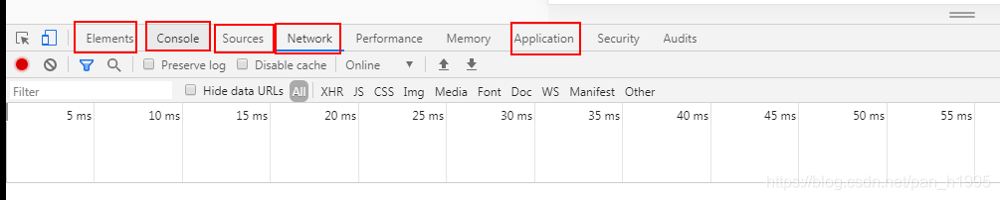
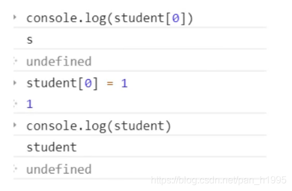
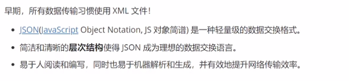
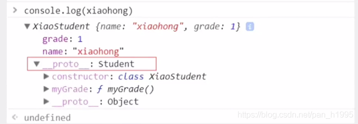
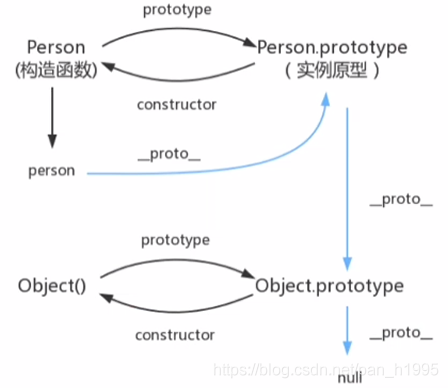
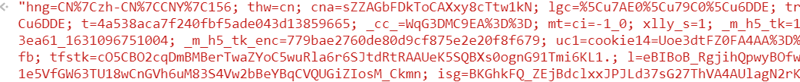
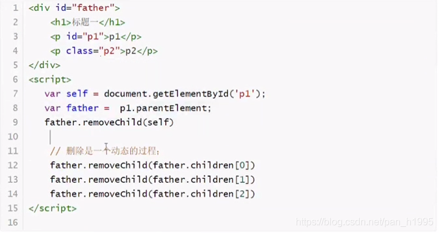
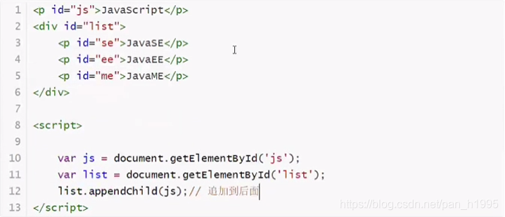
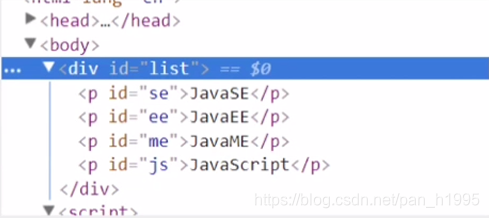

# JavaScript学习笔记

## 0、前端知识体系

想要成为真正的“互联网Java全栈工程师”还有很长的一段路要走，其中前端是绕不开的一门必修课。本阶段课程的主要目的就是带领Java后台程序员认识前端、了解前端、掌握前端，为实现成为“互联网Java全栈工程师”再向前迈进一步。

## 0.1、前端三要素

HTML（结构）：超文本标记语言（Hyper Text Markup Language），决定网页的结构和内容
CSS（表现）：层叠样式表（Cascading Style Sheets），设定网页的表现样式。
JavaScript（行为）：是一种弱类型脚本语言，其源码不需经过编译，而是由浏览器解释运行，用于控制网页的行为

## 0.2、结构层（HTML）

太简单，略

## 0.3、表现层（CSS）

CSS层叠样式表是一门标记语言，并不是编程语言，因此不可以自定义变量，不可以引用等，换句话说就是不具备任何语法支持，它主要缺陷如下：

语法不够强大，比如无法嵌套书写，导致模块化开发中需要书写很多重复的选择器；
没有变量和合理的样式复用机制，使得逻辑上相关的属性值必须以字面量的形式重复输出，导致难以维护；
这就导致了我们在工作中无端增加了许多工作量。为了解决这个问题，前端开发人员会使用一种称之为【CSS预处理器】的工具,提供CSS缺失的样式层复用机制、减少冗余代码，提高样式代码的可维护性。大大的提高了前端在样式上的开发效率。

### 什么是CSS预处理器

CSS预处理器定义了一种新的语言，其基本思想是，用一种专门的编程语言，为CSS增加了一些编程的特性，将CSS作为目标生成文件，然后开发者就只需要使用这种语言进行CSS的编码工作。转化成通俗易懂的话来说就是“用一种专门的编程语言，进行Web页面样式设计，再通过编译器转化为正常的CSS文件，以供项目使用”。

### 常用的CSS预处理器有哪些

- SASS：基于Ruby ，通过服务端处理，功能强大。解析效率高。需要学习Ruby语言，上手难度高于LESS。
- LESS：基于NodeJS，通过客户端处理，使用简单。功能比SASS简单，解析效率也低于SASS，但在实际开发中足够了，所以如果我们后台人员如果需要的话，建议使用LESS。

## 0.4、行为层（JavaScript）

JavaScript一门弱类型脚本语言，其源代码在发往客户端运行之前不需要经过编译，而是将文本格式的字符代码发送给浏览器，由浏览器解释运行。

### JavaScript框架

- JQuery：大家熟知的JavaScript库，优点就是简化了DOM操作，缺点就是DOM操作太频繁，影响前端性能；在前端眼里使用它仅仅是为了兼容IE6，7，8；
- Angular：Google收购的前端框架，由一群Java程序员开发，其特点是将后台的MVC模式搬到了前端并增加了模块化开发的理念，与微软合作，采用了TypeScript语法开发；对后台程序员友好，对前端程序员不太友好；最大的缺点是版本迭代不合理（如1代–>2 代，除了名字，基本就是两个东西；截止发表博客时已推出了Angular6）
- React：Facebook 出品，一款高性能的JS前端框架；特点是提出了新概念 【虚拟DOM】用于减少真实 DOM 操作，在内存中模拟 DOM操作，有效的提升了前端渲染效率；缺点是使用复杂，因为需要额外学习一门【JSX】语言；
- Vue：一款渐进式 JavaScript 框架，所谓渐进式就是逐步实现新特性的意思，如实现模块化开发、路由、状态管理等新特性。其特点是综合了 Angular（模块化）和React(虚拟 DOM) 的优点；
- Axios：前端通信框架；因为 Vue 的边界很明确，就是为了处理 DOM，所以并不具备通信能力，此时就需要额外使用一个通信框架与服务器交互；当然也可以直接选择使用jQuery 提供的AJAX 通信功能
  

## UI框架

- Ant-Design：阿里巴巴出品，基于React的UI框架
- ElementUI、iview、ice：饿了么出品，基于Vue的UI框架
- BootStrap：Teitter推出的一个用于前端开发的开源工具包
- AmazeUI：又叫“妹子UI”，一款HTML5跨屏前端框架

## JavaScript构建工具

- Babel：JS编译工具，主要用于浏览器不支持的ES新特性，比如用于编译TypeScript
- WebPack：模块打包器，主要作用就是打包、压缩、合并及按序加载

> 注：以上知识点已将WebApp开发所需技能全部梳理完毕

## 0.5、三端同一

### 混合开发（Hybrid App）

主要目的是实现一套代码三端统一（PC、Android：.apk、iOS：.ipa）并能够调用到设备底层硬件（如：传感器、GPS、摄像头等），打包方式主要有以下两种：

1. 云打包：HBuild -> HBuildX，DCloud 出品；API Cloud
2. 本地打包： Cordova（前身是 PhoneGap）
   

### 微信小程序

详见微信官网，这里就是介绍一个方便微信小程序UI开发的框架：WeUI

## 1、什么是Javascript

### 1.1、概述

javaScript是一门世界上最流行的脚本语言
Java，JavaScript
10天一个合格的后端人员，必须精通JavaScript     

### 1.2、历史

见百度


## 2、快速入门

### 2.1、引入JavaScript

#### 1、内部标签

```html
<script> 
	//....
</script>
123
```

#### 2、外部引入

hj.js

```js
alert("hello,world");
```

test.html

```js
<!--外部引入
        注意：script必须成对出现
    -->
    <script src="js/hj.js"></script>

    <!--不用显示定义type，也默认就是javaScript-->
    <script type="text/javascript"></script>
```

测试代码

```html
<!DOCTYPE html>
<html lang="en">
<head>
    <meta charset="UTF-8">
    <title>Title</title>
    <!--script标签内，写Javascript代码-->
    <!--<script>
        alert("hello,world");
    </script>-->

    <!--外部引入
        注意：script必须成对出现
    -->
    <script src="js/hj.js"></script>

    <!--不用显示定义type，也默认就是javaScript-->
    <script type="text/javascript"></script>
</head>
<body>


<!--这里也可以存放-->
</body>
</html>

```

### 2.2、基本语法入门

```js
<!DOCTYPE html>
<html lang="en">
<head>
    <meta charset="UTF-8">
    <title>Title</title>

    <!--JavaScript严格区分大小写-->
    <script>
        // 1. 定义变量   变量类型 变量名 = 变量值
        var score = 1 ;
        //alert(num)
        // 2. 条件控制

        if (score > 60 && score < 70){
            alert("60~70");
        }else if(score > 70 && score < 80){
            alert("70~80");
        }else{
            alert("other")
        }
    </script>
</head>
<body>

</body>
</html>
```

浏览器必备调试须知：



## 2.3、数据类型

数值，文本，图形，音频，视频

变量

```javascript
var a
```

number
js不区分小数和整数，Number

```javascript
123//整数123
123.1//浮点数123.1
1.123e3//科学计数法
-99//负数
NaN	//not a number
Infinity // 表示无限大
```

字符串
‘abc’ “abc”

布尔值
true，false

逻辑运算

```javascript
&& 两个都为真，结果为真

|| 一个为真，结果为真

! 	真即假，假即真
```

比较运算符 ！！！重要！

```javascript
=
1，"1"
== 等于（类型不一样，值一样，也会判断为true）
=== 绝对等于（类型一样，值一样，结果为true）
```

这是一个JS的缺陷，坚持不要使用 == 比较
须知：

- NaN === NaN，这个与所有的数值都不相等，包括自己
- 只能通过isNaN（NaN）来判断这个数是否是NaN

浮点数问题

```javascript
console.log((1/3) === (1-2/3))

```

尽量避免使用浮点数进行运算，存在精度问题！

```javascript
Math.abs(1/3-(1-2/3))<0.00000001
```

null 和 undefined

- null 空
- undefined 未定义

数组
Java的数组必须是相同类型的对象~，JS中不需要这样

```js

//保证代码的可读性，尽量使用[]
var arr = [1,2,3,4,5,'hello',null,true];
//第二种定义方法
new Array(1,2,3,4,5,'hello');
```

取数字下标：如果越界了，就会 报undefined

```javascript
undefined
```

对象
对象是大括号，数组是中括号

> 每个属性之间使用逗号隔开，最后一个属性不需要逗号

```js
// Person person = new Person(1,2,3,4,5);

var person = {
	name:'Tom',
	age:3,
	tags:['js','java','web','...']
}
```

取对象值

```javascript
person.name
> "Tom"
person.age
> 3
```

```js
<!DOCTYPE html>
<html lang="en">
<head>
    <meta charset="UTF-8">
    <title>Title</title>
    <!--
    前提：IDEA需要设置支持ES6语法
        'use strict';严格检查模式，预防JavaScript的随意性导致产生的一些问题
        必须写在JavaScript的第一行！
        局部变量建议都使用let去定义~
    -->
    <script>
        'use strict';
        //全局变量
         let i=1
        //ES6 let
    </script>
</head>
<body>

</body>
</html>

```

# 3、数据类型

## 3.1、字符串

#### 1、正常字符串我们使用 单引号，或者双引号包裹

"" ''

#### 2、注意转义字符 \

```
\'
\n
\t
\u4e2d    \u##### Unicode字符

\x41	Ascall字符

```

#### 3、多行字符串编写

```javascript
//tab 上面 esc下面
        var msg =
            `hello
            world
            你好呀
            nihao
            `
```

#### 4、模板字符串

```javascript
//tab 上面 esc下面
let name = 'Tom';
let age = 3;
var msg = `你好，${name}`
```

#### 5、字符串长度

```javascript
str.length
```

#### 6、字符串的可变性，不可变



#### 7、大小写转换

```javascript
//注意，这里是方法，不是属性了
'student'.toUpperCase();
'student'.toLowerCase();
```

#### 8、'student'.indexof(‘t’)

```js
'student'.indexof(‘t’)
//1
```


#### 9、substring，从0开始

```js
'student'.substring(1)//从第一个字符串截取到最后一个字符串
//"tudent"
'student'.substring(1,3)//[1,3)
//"tu"
```

## 3.2、数组

Array可以包含任意的数据类型

```javascript
var arr = [1,2,3,4,5,6];//通过下标取值和赋值
```

#### 1、长度

```javascript
arr.length
```

注意：假如给arr.lennth赋值，数组大小就会发生变化~，如果赋值过小，元素就会丢失

#### 2、indexOf，通过元素获得下标索引

```javascript
arr.indexOf(2)
```

字符串的"1"和数字 1 是不同的

#### 3、slice（）

```js
arr.slice(0,2)
//[1,2]
```

截取Array的一部分，返回的一个新数组，类似于String中substring

#### 4、push()，pop()尾部

```js
//push：压入到尾部
arr=[1,2,3,4]
arr.push(5)
//[1, 2, 3, 4, 5]
//pop：弹出尾部的一个元素
arr.pop()
//[1, 2, 3, 4]
```

#### **5、unshift(),shift() 头部**

```javascript
arr=[1,2,3,4]
//unshift：压入到头部
arr.unshift(5)
//[5, 1, 2, 3, 4]
shift：弹出头部的一个元素
// [1, 2, 3, 4]
```

#### 6、排序sort()

```javascript
var arr=["B","C","A"]
arr.sort()
["A","B","C"]
```

#### 7、元素反转reverse()

```javascript
var arr=["A","B","C"]
arr.reverse()
["C","B","A"]
```

#### 8、concat()

```js
var arr=["C","B","A"]
arr.concat([1,2,3])
//输出结果
//(6) ["C", "B", "A", 1, 2, 3]
//arr
["C", "B", "A"]
```


注意：concat()并没有修改数组，只是会返回一个新的数组

#### 9、连接符join

打印拼接数组，使用特定的字符串连接

```js
var arr=["C","B","A"]
arr.join('-')
//结果
"C-B-A"
```


#### 10、多维数组

```js
var arr=[[1,2],[3,4],["5","6"]]
arr[1][1]
//结果为4
```

数组：存储数据（如何存，如何取，方法都可以自己实现！）

## 3.3、对象

若干个键值对  shift  +enter

```js
var 对象名 = {
	属性名：属性值，
	属性名：属性值，
	属性名：属性值
}
//定义了一个person对象，它有四个属性
var person = {
	name:"zz",
	age:3,
	email:"916939772@QQ.com",
	score:66
}
```

Js中对象，{…}表示一个对象，建制对描述属性xxx：xxx，多个属性之间用逗号隔开，最后一个属性不加逗号！
JavaScript中的所有的键都是字符串，值是任意对象！

#### 1、对象赋值

```js
person.name="xx"
//xx
person.name
//xx
```

#### 2、使用一个不存在的对象属性，不会报错！undefined

```js
person.nn
//undefined
```

#### 3、动态的删减属性，通过delete删除对象的属性

```js
delete person.name
//true
//person
```

#### 4、动态的添加，直接给新的属性添加值即可

```js
person.aa="aa"
```

#### 5、判断属性值是否在这个对象中！xxx in xxx

```js
'age' in person
//true
'toString' in person
//true
```

#### 6、判断一个属性是否是这个对象自身拥有的 hasOwnProperty()

```js
person.hasOwnProperty('toString')
//false
person.hasOwnProperty('age')
//true
```

## 3.4、流程控制

if判断

```js
var age=3;
if(age>3){
    alert("hh")
}else if(age<5){
    alert("ww")     
}else{
    alert("zzz")
}
```

while循环，避免程序死循环

```js
while(age<100){
   age=age+1
   console.log(age) 
}
do{
    age=age+1;
    console.log(age)
}while(age<100)
for循环
```

```js
for(let i=0;i<100;i++){
  console.log(i)
}
```


forEach循环

> ES5.1特性

```js
var  age=[1,2,3,4,5]
age.forEach(function(value){console.log(value)})
//
```

for …in-------下标

```js
for(var num in age){
    if(age.hasOwnProperty(num)){
        console.log("存在")
        console.log(age[num])
       }
}
```

## 3.5、Map和Set

> ES6的新特性~

Map

```js
var map=new Map([['tom',100],['jack',90]])
var name=map.get('tom')
map.set('admin',123456)
map.delete('tom')
```


Set：无序不重复的集合

```js
var set=new Set()
set.add(2)
set.delete(1)
console.log(set.has(3))
```


## 3.6、iterator

> es6新特性

作业：使用iterator来遍历迭代我们Map，Set！
遍历数组

```js
var  arr=[1,2,3,4,5]
for(var x of arr){console.log(x)}
```

遍历Map

```js
var map=new Map([['tom',100],['jack',90]])
for(let x of map){
    console.log(x)
}
```

遍历set

```js
var set=new Set([5,6,7]);
for(let x of set){
    console.log(x)
}
```


# 4、函数

## 4.1、定义函数

> 定义方式一

绝对值函数

```js
function abs(x){

    if(x>=0){
        return x;
    }else{
        return -x;
    }
}
```

一旦执行到return代表函数结束，返回结果！
如果没有执行return，函数执行完也会返回结果，结果就是undefined

> 定义方式二
>
> ```js
> var abs= function abs(x){
> 
>     if(x>=0){
>         return x;
>     }else{
>         return -x;
>     }
> }
> ```
>
>function(x){…}这是一个匿名函数。但是可以吧结果赋值给abs，通过abs就可以调用函数！
> 方式一和方式二等价！

> 调用函数

```javascript
abs(10)//10
abs(-10) //10
12
```

参数问题：javaScript可以传任意个参数，也可以不传递参数~
参数进来是否存在问题？
假设不存在参数，如何规避？

```js
var abs= function abs(x){

    if(typeof x!=='number'){
     throw 'Not aNumber'
    }

    if(x>=0){
        return x;
    }else{
        return -x;
    }
}
```


> arguments

arguments是一个JS免费赠送的关键字；
代表，传递进来的所有参数，是一个数组！

```js
var  abs=function abs(x){

    for(var i=0;i<arguments.length;i++){
       console.log(arguments[i])
    }

    if(x>=0){
        return x;
    }else{
        return -x;
    }
}
```


问题：arguments包含所有的参数，我们有时候想使用多余的参数来进行附加操作。需要排除已有参数~

> rest

以前：

```js
if(arguments.length>2){
    for(var i=2;i<arguments.length;i++){
    }
}
```

ES6引入的新特性，获取除了已经定义的参数之外的所有参数~…

```js
function aaa(a,b, ...rest){
   console.log(a)
}
```

rest参数只能写在最后面，必须用…标识。

## 4.2、变量的作用域

在javascript中，var定义变量实际是有作用域的。
假设在函数体重声明，则在函数体外不可以使用~（闭包）

```js
function qj(){
     var x=1;
     x=x+1;
}
x=x+1;  //x is not  defined
```

如果两个函数使用了相同的变量名，只要在函数内部就不冲突

```js
function aj1(){
    var x=1;
    x=x+1
}

function aj2(){
    var x='a';
    x=x+1
}

```


内部函数可以访问外部函数的成员，反之则不行

```js
function aj1(){
    var x=1;
    x=x+1
    function aj2(){
        
        y=x+1
    }
}

```

假设，内部函数变量和外部函数变量，重名！

```js
function aj1(){
    var x=1;
  
    function aj2(){
        var x='a'
        console.log("inner"+x)
    }
    console.log('outer'+x)

    aj2()
}
```

假设在JavaScript中，函数查找变量从自身函数开始~， 由“内”向“外”查找，假设外部存在这个同名的函数变量，则内部函数会屏蔽外部函数的变量。

> 提升变量的作用域

```js
function aj(){
  var x='x'+y;
  console.log(x)
  var y='y';

}
```

结果：x undefined
说明：js执行引擎，自动提升了y的声明，但是不会提升变量y的赋值；

```js
function aj(){
  var y;
  var x="x"+y  
  console.log(x)
  y='y';

}
```


这个是在javascript建立之初就存在的特性。 养成规范：所有 的变量定义都放在函数的头部，不要乱放，便于代码维护；

```js
function  aj(){
    var x=1;
    y=x+1;
}

```

> 全局变量  

```js
x=1;
fuction f(){
    console.log(x)
}
f()
console.log(x)
```

全局对象window

```js
var x='xxx'
alert(x)
alert(window.x)
```

alert() 这个函数本身也是一个window的变量；

```js
var x='xxx'
window.alert(x);
```

javascript实际上只有一个全局作用域，任何变量（函数也可以视为变量)，假设没有在函数作用范围内找到，就会向外查找，如果在全局作用域都没有找到，就会报错 Refrence

> 规范

由于我们的所有变量都会绑定到window上，。如果不同的js文件，使用了相同的全局变量，就会产生冲突—>如何减少这样的冲突？

```js
var zhang={}//全局变量
zhang.name='zs';
zhang.add=function(a,b){
  return a+b;
}
```

把自己的代码全部放入自己定义的唯一空间名字中，降低全局命名冲突问题~
jQuery中就是使用的该方法：jQuery.name，简便写法：**$()**

> 局部作用域

```js
function aa(){
for (var i=0;i<100;i++){
console.log(i)

}
console.log(i)

}
```

ES6的let关键字，解决了局部作用域冲突的问题！

```js
function aa(){
for (let i=0;i<100;i++){
console.log(i)

}
console.log(i+1)

}
```


建议大家都用let去定义局部作用域的变量；

> 常量

在ES6之前，怎么定义常量：只有用全部大写字母命名的变量就是常量；建议不要修改这样的值。

```js
var pi='3.14';
console.log(pi);
pi='123'  //可以改变
console.log(pi)
```


在ES6引入了常量关键字 const

```js
const pi='3.14';
console.log(pi);
pi='123'  //不能改变
console.log(pi)
```

## 4.3、方法

> 定义方法

方法就是把函数放在对象的里面，对象只有两个东西：属性和方法

```js
var  zhang={

name:'zs',
bir:200,
tt:function(){
  var now=new Date().getFullYear();
  return now-this.bir

}

}
zhang.name
zhang.tt()
```

this.代表什么？拆开上main的代码看看

```js
function getage(){

var now=new  Date().getFullYear();
return  now-this.bir;

}

var zhang={
      name:'zs',
      bir:300,
      age:getage 

}

undefined
zhang.age()
1721
getage()
NaN
```

this是无法指向的，是默认指向调用它的那个对象的；

> apply

在js中可以控制this指向

```js
function getage(){

var now=new  Date().getFullYear();
return  now-this.bir;

}

var zhang={
      name:'zs',
      bir:300,
      age:getage 

}
var  xiao={

     name:"ming",
     bir:45,
     age:getage


}

//undefined
getage.apply(xiao,[])
1976
```


# 5、内部对象

> 标准对象

```js
typeof 123
"number"
typeof '123'
"string"
typeof  'true'
"string"
typeof  true
"boolean"
typeof NaN
"number"
typeof []
"object"
typeof {}
"object"
typeof Math.abs
"function"
```


## 5.1、Date

**基本使用**

```js
var now=new Date()
undefined
now
Fri Sep 24 2021 16:06:09 GMT+0800 (中国标准时间)
now.getFullYear()
2021
now.getMonth()
8
now.getDay()
5
now.getTime()
1632470769200
```

转换

```js
now=new Date(1632470769200)
Fri Sep 24 2021 16:06:09 GMT+0800 (中国标准时间)
now.toLocaleDateString()
"2021/9/24"
now.toLocaleString()
"2021/9/24 下午4:06:09"
```

## 5.2、JSON

> JSON是什么


在javascript中，一切皆为对象，任何js支持的类型都可以用JSON表示
格式

- 对象都用{}
- 数组都用[]
- 所有的键值对 都是用key:value


JSON字符串和js对象转化

```js
var user={
 name:'zs',
 age:3,
 sex:'男' 

}

undefined
var jsonuser=JSON.stringify(user)
undefined
jsonuser
"{\"name\":\"zs\",\"age\":3,\"sex\":\"男\"}"
var obj=JSON.parse('{"name":"zs","age":3,"sex":"男"}')
undefined
obj
{name: "zs", age: 3, sex: "男"}
```


## 5.3、AJAX

- 原生的js写法 xhr异步请求
- jQuery封装好的方法$(#name).ajax("")
- axios请求

# 6、面向对象编程

> 原型对象
> javascript、java、c#------面向对象；但是javascript有些区别！

- 类：模板
- 对象：具体实例

在javascript中，需要大家转换一下思维方式！
原型：

```js
var Student={

 name:'zs',
 age:3,
 run:function(){
 console.log(this.name+"run....")
}

};
 var ming={
 name:'ming'
}

//undefined
ming.__proto__
{constructor: ƒ, __defineGetter__: ƒ, __defineSetter__: ƒ, hasOwnProperty: ƒ, __lookupGetter__: ƒ, …}constructor: ƒ Object()hasOwnProperty: ƒ hasOwnProperty()isPrototypeOf: ƒ isPrototypeOf()propertyIsEnumerable: ƒ propertyIsEnumerable()toLocaleString: ƒ toLocaleString()toString: ƒ toString()valueOf: ƒ valueOf()__defineGetter__: ƒ __defineGetter__()__defineSetter__: ƒ __defineSetter__()__lookupGetter__: ƒ __lookupGetter__()__lookupSetter__: ƒ __lookupSetter__()get __proto__: ƒ __proto__()set __proto__: ƒ __proto__()

ming.__proto__=Student

{name: "zs", age: 3, run: ƒ}
function Student(name){
  this.name=name;
}
undefined
Student.prototype.hello=function(){}
ƒ (){}
Student.prototype.hello=function(){
 alert('hello')
}
ƒ (){
 alert('hello')
}
```


> class集继承

class关键字，是在ES6引入的
1、定义一个类、属性、方法

```js
class Student{

 constructor(name){

  this.name=name
}


}
undefined
class Student{

 constructor(name){

  this.name=name
}
 hello(){

 alert('hello')
}


}
undefined
var ming=new Student('ming')
undefined
ming.hello()
```


2、继承

```js
<script>
	//ES6之后========================
	//定义一个学生的类
	class Student{
		constructor(name){
			this.name = name;
		}
		hello(){
			alert('hello');
		}
}

	class XiaoStudent extends Student{
		constructor(name,grade){
			super(name);
			this.grade = grade;
		}
		myGrade(){
			alert('我是一名小学生');
		}
	}

	var xiaoming = new Student("xiaoming");
	var xiaohong = new XiaoStudent("xiaohong",1);
</script>

```

本质：查看对象原型


> 原型链

*proto*:


# 7、操作BOM对象（重点）

> 浏览器介绍

javascript和浏览器关系？
BOM：浏览器对象模型

- IE6~11
- Chrome
- Safari
- FireFox
- Opera

三方

- QQ浏览器
- 360浏览器

> window

window代表浏览器窗口

```js
window.alert(1)
window.innerHeight
window.innerWidth
window.outerHeight
window.outerWidth
```

> screen

代表屏幕尺寸

```js
screen.width
screen.height
```

> location(重要)

location代表当前页面的URL信息

```js
location.host
location.href
location.protocol
location.reload()
location.assign
```

> document（内容DOM）

document代表当前的页面，HTML DOM文档树

```js
document.title
"百度"
document.title='你好'
"你好"
```

获取具体的文档树节点

```html
<dl>
    <dt>javase</dt>
    <dd>java</dd>
    <dd>javaee</dd>
</dl>
<script>
var dl=document.getElementById('app')

</script>
```


获取cookie

```js
document.cookie
```


服务器端可以设置cookie为httpOnly

> history（不建议使用 ）

history代表浏览器的历史记录

```js
history.back()  //后退
history.forward() //前进
```

# 8、操作DOM对象（重点）

DOM：文档对象模型

> 核心

浏览器网页就是一个Dom树形结构！

- 更新：更新Dom节点
- 遍历Dom节点：得到Dom节点
- 删除：删除一个Dom节点
- 添加：添加一个新的节点

要操作一个Dom节点，就必须要先获得这个Dom节点

> 获得Dom节点
>
> ```js
> var h1=document.getElementByTagName('h1')
> var p1=document.getElementById('p1')
> var p2=document.getElementsByClassName('p2')
> var father=document.getElementById('father')
> var childrens=father.children;
> ```
>
>
> 这是原生代码，之后我们尽量都使用jQuery();

> 更新节点

```js
<div id="id1"> 
</div>
<script>
    var id1=document.getElementById('id1')
</script>    
```

操作文本

```js
id1.innerText='456'  //修改文本的值 
id1.innerHTML='<strong>123</strong>'  //解析HTML文本标签
```

操作css

```js
id1.style.color='yellow';
id1.style.fontSize='20px';
id1.style.padding='2em';
```

> 删除节点

删除节点的步骤：先获取父节点，再通过父节点删除自己

注意：删除多个节点的时候，children是在时刻变化的，删除节点的时候一定要注意。

> 插入节点

我们获得了某个Dom节点，假设这个dom节点是空的，我们通过innerHTML就可以增加一个元素了，但是这个Dom节点已经存在元素了，我们就不能这么干了！会产生覆盖

追加



> 创建一个新的标签

```js
<script>
	var js = document.getElementById('js');//已经存在的节点
    var list = document.getElementById('list');
    //通过JS创建一个新的节点
    var newP = document.creatElement('p');//创建一个p标签
    newP.id = 'newP';
    newP.innerText = 'Hello,';
    //创建一个标签节点
    var myScript = document.creatElement('script');
    myScript.setAttribute('type','text/javascript');
    
    //可以创建一个style标签
    var myStyle = document.creatElement('style');//创建了一个空style标签
    myStyle.setAttribute('type','text/css');
    myStyle.innerHTML = 'body{background-color:chartreuse;}';//设置标签内容
    
    document.getElementByTagName('head')[0].appendChild(myStyle);
</script>

```

insertBefore

```js
var ee = document.getElementById('ee');
var js = document.getElementById('js');
var list = document.getElementById('list');
//要包含的节点.insertBefore(newNode,targetNode)
list.insertBefore(js,ee);

```

# 9、操作表单

> 表单是什么？form-----DOM树

- 文本框----text
- 下拉框----select
- 单选框----radio
- 多选框----checkbox
- 隐藏域----hidden
- 密码框----password
- …

表单的目的提交信息

> 获得要提交的信息

```html
<body>
    <form action = "post">
        <p>
            <span>用户名：</span><input type="text" id = "username" />
        </p>
        <!--多选框的值就是定义好的value-->
        <p>
            <span>性别：</span>
            <input type = "radio" name = "sex" value = "man" id = "boy"/>男
            	<input type = "radio" name = "sex" value = "woman" id = "girl"/>女
        </p>
    </form>
    <script>
    	var input_text = document.getElementById("username");
        var boy_radio = document.getElementById("boy");
        var girl_radio = document.getElementById("girl");
        //得到输入框的值
        input_text.value 
        //修改输入框的值
        input_text.value  = "value";
        
        //对于单选框，多选框等等固定的值，boy_radio.value只能取到当前的值
        boy_radio.checked;//查看返回的结果，是否为true，如果为true，则被选中。
        girl_radio.checked = true;//赋值
        
    </script>
</body>

```

提交表单。md5加密密码，表单优化

```html
<!DOCTYPE html>
<html lang = "en">
    <head>
        <meta charset = "UTF-8">
        <title>Title</title>
        <!--MD5加密工具类-->
        <script src = "https://cdn.bootcss.com/blueimp-md5/2.10.0/js/md5.min.js">
        	
        </script>
    </head>
    <body>
        <!--表达绑定提交事件
			οnsubmit= 绑定一个提交检测的函数，true，false
			将这个结果返回给表单，使用onsubmit接收
		-->
        <form action = "https://www.baidu.com" method = "post" onsubmit = "return aaa()">
            <p>
            	<span>用户名：</span><input type="text" id = "username" name = "username"/>
        	</p>
            <p>
            	<span>密码：</span><input type="password" id = "password" />
        	</p>
            <input type = "hidden" id = "md5-password" name = "password"> 
            
            <!--绑定事件 onclick 被点击-->
            <button type = "submit">提交</button>
            
        </form>
        
        <script>
        	function aaa(){
                alert(1);
                var username = document.getElementById("username");
                var pwd = document.getElementById("password");
                var md5pwd = document.getElementById("md5-password");
                //pwd.value = md5(pwd,value);
                md5pwd.value = mad5(pwd.value);
                //可以校验判断表单内容，true就是通过提交，false就是阻止提交
                return false;
                
            }
        </script>
        
    </body>
</html>

```

