# 微服务进阶

前面我们了解了微服务的一套解决方案，但是它是基于Netflix的解决方案，实际上我们发现，很多框架都已经停止维护了，来看看目前我们所认识到的SpringCloud各大组件的维护情况：

* **注册中心：** Eureka（属于*Netflix*，2.x版本不再开源，1.x版本仍在更新）
* **服务调用：** Ribbon（属于*Netflix*，停止更新，已经彻底被移除）、SpringCloud Loadbalancer（属于*SpringCloud*官方，目前的默认方案）
* **服务降级：** Hystrix（属于*Netflix*，停止更新，已经彻底被移除）
* **路由网关：** Zuul（属于*Netflix*，停止更新，已经彻底被移除）、Gateway（属于*SpringCloud*官方，推荐方案）
* **配置中心：** Config（属于*SpringCloud*官方）

可见，我们之前使用的整套解决方案中，超过半数的组件都已经处于不可用状态，并且部分组件都是SpringCloud官方出手提供框架进行解决，因此，寻找一套更好的解决方案势在必行，也就引出了我们本章的主角：**SpringCloud Alibaba**

阿里巴巴作为业界的互联网大厂，给出了一套全新的解决方案，官方网站（中文）：https://spring-cloud-alibaba-group.github.io/github-pages/2021/zh-cn/index.html

> Spring Cloud Alibaba 致力于提供微服务开发的一站式解决方案。此项目包含开发分布式应用服务的必需组件，方便开发者通过 Spring Cloud 编程模型轻松使用这些组件来开发分布式应用服务。
>
> 依托 Spring Cloud Alibaba，您只需要添加一些注解和少量配置，就可以将 Spring Cloud 应用接入阿里分布式应用解决方案，通过阿里中间件来迅速搭建分布式应用系统。

目前 Spring Cloud Alibaba 提供了如下功能:

1. **服务限流降级**：支持 WebServlet、WebFlux, OpenFeign、RestTemplate、Dubbo 限流降级功能的接入，可以在运行时通过控制台实时修改限流降级规则，还支持查看限流降级 Metrics 监控。
2. **服务注册与发现**：适配 Spring Cloud 服务注册与发现标准，默认集成了 Ribbon 的支持。
3. **分布式配置管理**：支持分布式系统中的外部化配置，配置更改时自动刷新。
4. **Rpc服务**：扩展 Spring Cloud 客户端 RestTemplate 和 OpenFeign，支持调用 Dubbo RPC 服务
5. **消息驱动能力**：基于 Spring Cloud Stream 为微服务应用构建消息驱动能力。
6. **分布式事务**：使用 @GlobalTransactional 注解， 高效并且对业务零侵入地解决分布式事务问题。
7. **阿里云对象存储**：阿里云提供的海量、安全、低成本、高可靠的云存储服务。支持在任何应用、任何时间、任何地点存储和访问任意类型的数据。
8. **分布式任务调度**：提供秒级、精准、高可靠、高可用的定时（基于 Cron 表达式）任务调度服务。同时提供分布式的任务执行模型，如网格任务。网格任务支持海量子任务均匀分配到所有 Worker（schedulerx-client）上执行。
9. **阿里云短信服务**：覆盖全球的短信服务，友好、高效、智能的互联化通讯能力，帮助企业迅速搭建客户触达通道。

可以看到，SpringCloudAlibaba实际上是对我们的SpringCloud组件增强功能，是SpringCloud的增强框架，可以兼容SpringCloud原生组件和SpringCloudAlibaba的组件。

开始学习之前，把我们之前打包好的拆分项目解压，我们将基于它进行讲解。

***


## Nacos 更加全能的注册中心

Nacos（**Na**ming **Co**nfiguration **S**ervice）是一款阿里巴巴开源的服务注册与发现、配置管理的组件，相当于是Eureka+Config的组合形态。

### 安装与部署

Nacos服务器是独立安装部署的，因此我们需要下载最新的Nacos服务端程序，下载地址：https://github.com/alibaba/nacos，连不上可以到视频下方云盘中下载。

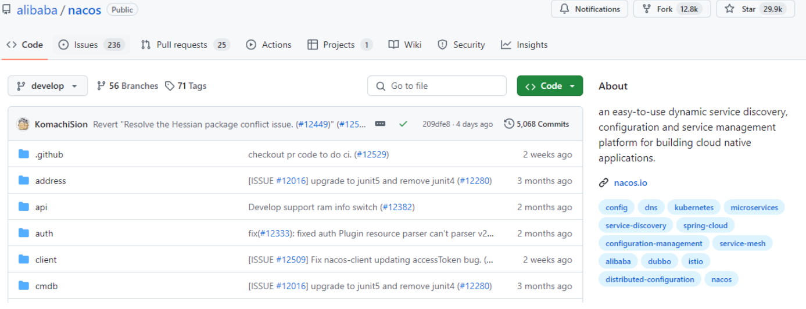

接着我们将文件进行解压，得到以下内容：

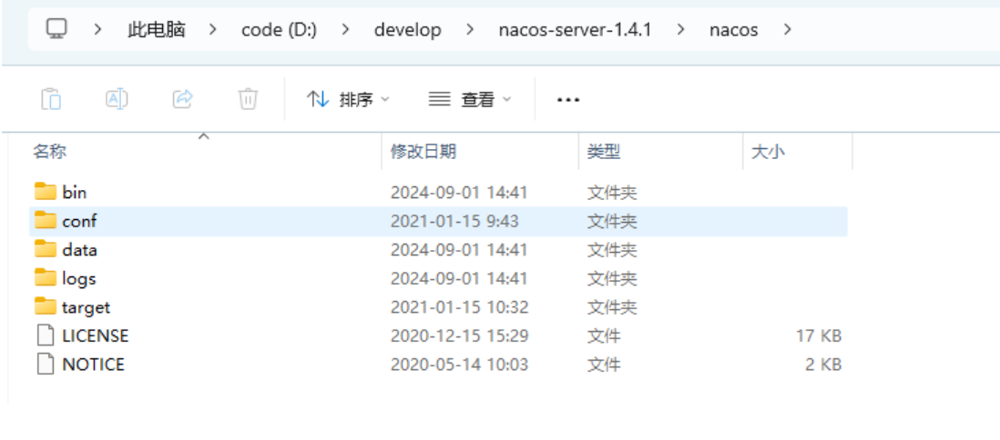


修改一下文件的配置

```shell
rem if nacos startup mode is standalone
if %MODE% == "standalone" (
    echo "nacos is starting with standalone"
	  set "NACOS_OPTS=-Dnacos.standalone=true"
    set "NACOS_JVM_OPTS=-Xms512m -Xmx512m -Xmn256m"
)
```

用户名密码都是nacos


我们直接将其拖入到项目文件夹下，便于我们一会在IDEA内部启动，接着添加运行配置：

其中`-m standalone`表示单节点模式，Mac和Linux下记得将解释器设定为`/bin/bash`，由于Nacos在Mac/Linux默认是后台启动模式，我们修改一下它的bash文件，让它变成前台启动，这样IDEA关闭了Nacos就自动关闭了，否则开发环境下很容易忘记关：

```bash
# 注释掉 nohup $JAVA ${JAVA_OPT} nacos.nacos >> ${BASE_DIR}/logs/start.out 2>&1 &
# 替换成下面的
$JAVA ${JAVA_OPT} nacos.nacos
```

接着我们点击启动：

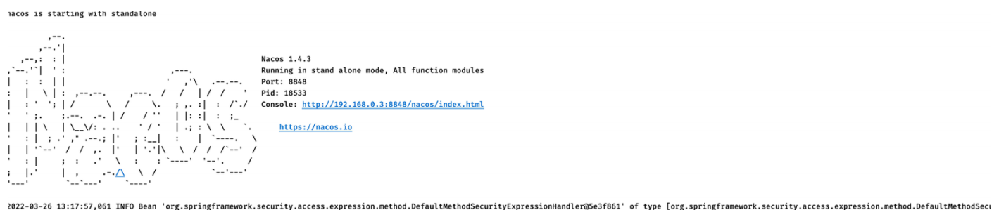

OK，启动成功，可以看到它的管理页面地址也是给我们贴出来了： http://localhost:8848/nacos/index.html，访问这个地址：

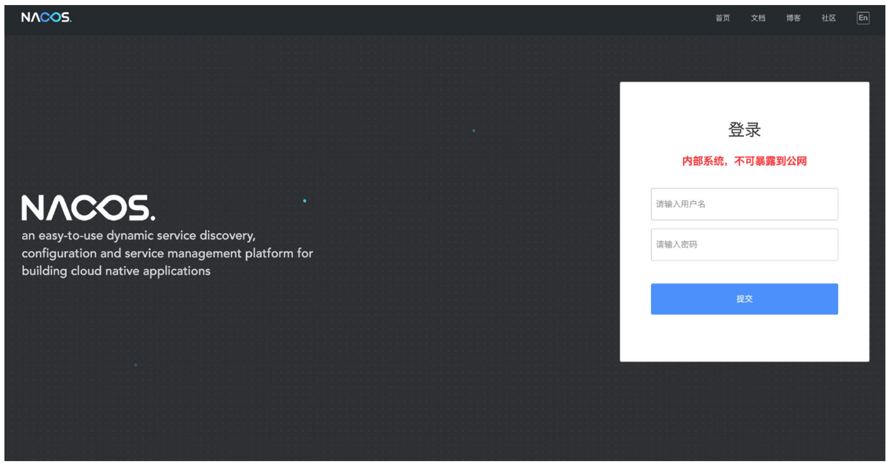

默认的用户名和管理员密码都是`nacos`，直接登陆即可，可以看到进入管理页面之后功能也是相当丰富：

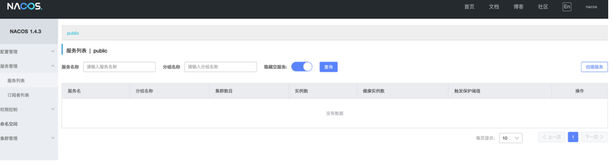

至此，Nacos的安装与部署完成。

nacos可以用作注册中心,和配置中心

注册中心:微服务可以注册到nacos上

配置中心:我们可以去nacos上拿取配置信息

### 服务注册与发现

现在我们要实现基于Nacos的服务注册与发现，那么就需要导入SpringCloudAlibaba相关的依赖，我们在父工程将依赖进行管理：

```xml
   <properties>

        <java.version>1.8</java.version>
        <project.build.sourceEncoding>UTF-8</project.build.sourceEncoding>
        <project.reporting.outputEncoding>UTF-</project.reporting.outputEncoding>
        <spring-cloud.version>Greenwich.RELEASE</spring-cloud.version>
        <spring-cloud-alibaba.version>2.1.1.RELEASE</spring-cloud-alibaba.version>

    </properties>

    <dependencyManagement>

        <dependencies>

            <dependency>
                <groupId>org.springframework.cloud</groupId>
                <artifactId>spring-cloud-dependencies</artifactId>
                <version>${spring-cloud.version}</version>
                <type>pom</type>
                <scope>import</scope>
            </dependency>
            <dependency>
                <groupId>com.alibaba.cloud</groupId>
                <artifactId>spring-cloud-alibaba-dependencies</artifactId>
                <version>${spring-cloud-alibaba.version}</version>
                <type>pom</type>
                <scope>import</scope>
            </dependency>

        </dependencies>
    </dependencyManagement>
```

接着我们就可以在子项目中添加服务发现依赖了，比如我们以图书服务为例：

```xml
<dependency>
    <groupId>com.alibaba.cloud</groupId>
    <artifactId>spring-cloud-starter-alibaba-nacos-discovery</artifactId>
</dependency>
```

```yaml
server:
  port: 8071
spring:
  application:
    name: userservice
  cloud:
    nacos:
      discovery:
        server-addr: localhost:8848
```

我们通过把nacos作为配置中心也作为注册中心启动

他会从nacos里面去自动获取配置信息  加上自己的配置

bootstarp.yml

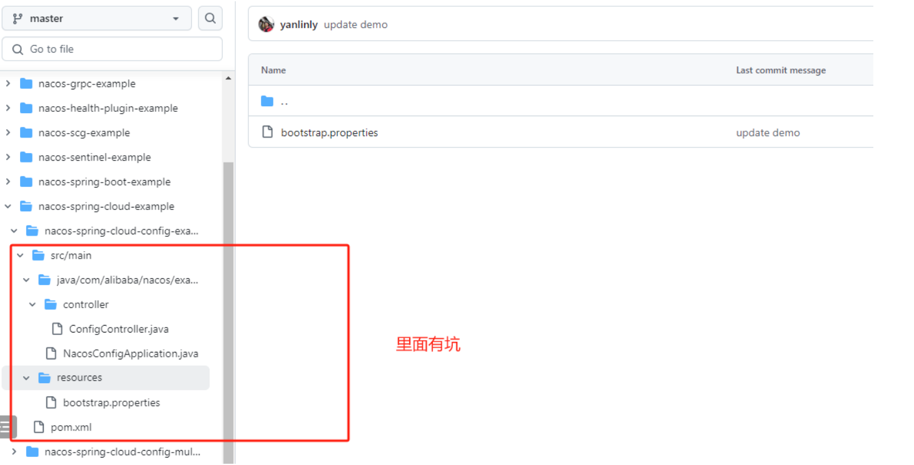

接着启动我们的用户服务，可以在Nacos的服务列表中找到：

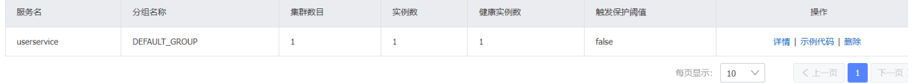
## nacos作为配置中心


```xml
 <dependency>
            <groupId>com.alibaba.cloud</groupId>
            <artifactId>spring-cloud-starter-alibaba-nacos-config</artifactId>
</dependency>
```

项目启动的时候必须是bootstarp.yml


```yml
spring:
  application:
    # 服务名称和配置文件保持一致
    name: orderservice
  profiles:
    # 环境也是和配置文件保持一致
    active: dev
  cloud:
    nacos:
      config:
        # 配置文件后缀名
        file-extension: yml
        # 配置中心服务器地址，也就是Nacos地址
        server-addr: localhost:8848
```

nacos配置


```yml
server:
  port: 8091
  tomcat:
    max-threads: 10
spring:
  application:
    name: orderservice
  datasource:
    driver-class-name: com.mysql.cj.jdbc.Driver
    url: jdbc:mysql:///shop?serverTimezone=UTC
    username: root
    password: root
  jpa:
    properties:
      hibernate:
        hbm2ddl:
          auto: update
        dialect: org.hibernate.dialect.MySQL5InnoDBDialect

  cloud:
    nacos:
      discovery:
        server-addr: 127.0.0.1:8848
    sentinel:
      filter:
        enabled: false
      transport:
        port: 9999  #跟控制台交流的端口
        dashboard: localhost:8080
service-product: # 调用的提供者的名称

  ribbon:
    NFLoadBalancerRuleClassName: com.netflix.loadbalancer.RandomRule

```

需要自己去数据库中创建一个数据库

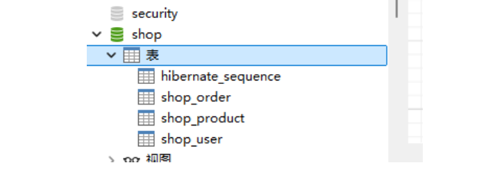


nacos作为注册中心


```xml
 <dependency>
            <groupId>org.springframework.cloud</groupId>
            <artifactId>spring-cloud-starter-openfeign</artifactId>
</dependency>
```

负载均衡 按照服务名进行远程访问

1.启动类上加上@EnableFeignClients

2.我们需要写一个自己的client实现服务访问

新建一个client接口

```java
@FeignClient("productservice")
```

```java
@FeignClient("productservice")
public interface ProductClient {
    @GetMapping("/product/{pid}")
    Product queryItemByIds(@PathVariable("pid") Integer pid);
}
```

为了方便我们测试

启动两个商品服务  一个订单服务

学习微服务 安装工程师   启动工程师

raft算法


## sentinel

```yml
server:
  port: 8091
  tomcat:
    max-threads: 10
    accept-count: 50 # 最大排队等待数量
    max-connections: 100 # 允许的最大连接  
spring:
  application:
    name: orderservice
  datasource:
    driver-class-name: com.mysql.cj.jdbc.Driver
    url: jdbc:mysql:///shop?serverTimezone=UTC
    username: root
    password: root
  jpa:
    properties:
      hibernate:
        hbm2ddl:
          auto: update
        dialect: org.hibernate.dialect.MySQL5InnoDBDialect

  cloud:
    nacos:
      discovery:
        server-addr: 127.0.0.1:8848
    sentinel:
      filter:
        enabled: false
      transport:
        port: 9999  #跟控制台交流的端口
        dashboard: localhost:8090
service-product: # 调用的提供者的名称

  ribbon:
    NFLoadBalancerRuleClassName: com.netflix.loadbalancer.RandomRule
feign:
  sentinel:
    enabled: true # 开启feign对sentinel的支持
```

http://localhost:8091/order/message1


‌**[JMeter](https://www.baidu.com/s?sa=re_dqa_generate&wd=JMeter&rsv_pq=9fb2fff00020d554&oq=jmeter线程参数含义&rsv_t=fe20MRcziJQc5BYuDKnHPnsLvylW2o/qiTLe2ar6H10zm1R/+KjO0ReQfGY&tn=baidu&ie=utf-8)线程参数主要包括线程数、[Ramp-Up Period](https://www.baidu.com/s?sa=re_dqa_generate&wd=Ramp-Up Period&rsv_pq=9fb2fff00020d554&oq=jmeter线程参数含义&rsv_t=fe20MRcziJQc5BYuDKnHPnsLvylW2o/qiTLe2ar6H10zm1R/+KjO0ReQfGY&tn=baidu&ie=utf-8)（准备时长）、循环次数、[Delay Thread creation until needed](https://www.baidu.com/s?sa=re_dqa_generate&wd=Delay Thread creation until needed&rsv_pq=9fb2fff00020d554&oq=jmeter线程参数含义&rsv_t=fe20MRcziJQc5BYuDKnHPnsLvylW2o/qiTLe2ar6H10zm1R/+KjO0ReQfGY&tn=baidu&ie=utf-8)（延迟线程创建）、[调度器配置](https://www.baidu.com/s?sa=re_dqa_generate&wd=调度器配置&rsv_pq=9fb2fff00020d554&oq=jmeter线程参数含义&rsv_t=fe20MRcziJQc5BYuDKnHPnsLvylW2o/qiTLe2ar6H10zm1R/+KjO0ReQfGY&tn=baidu&ie=utf-8)等。**‌

1.  

   ‌**线程数**‌：表示模拟的用户数量，即JMeter将创建的虚拟用户数。每个虚拟用户占用一个线程，用于模拟并发用户发送请求。

2.  

   ‌**Ramp-Up Period（准备时长）**‌：设置所有线程启动所需的总时间。例如，如果线程数为200，准备时长为10秒，那么JMeter将在10秒内启动所有200个线程。这有助于控制并发的强度，避免所有用户同时产生，从而更好地模拟实际用户行为。

3.  

   ‌**循环次数**‌：定义每个线程发送请求的次数。如果线程数为200，循环次数为10，那么每个线程将发送10次请求。如果设置为“永远”，则线程会一直发送请求，直到测试被手动停止。

4.  

   ‌**Delay Thread creation until needed**‌：如果勾选此选项，线程将在需要时才创建，而不是在测试开始时一次性创建。这有助于进一步控制资源的使用和测试的启动速度。

5.  

   ‌**调度器配置**‌：包括[持续时间](https://www.baidu.com/s?sa=re_dqa_generate&wd=持续时间&rsv_pq=9fb2fff00020d554&oq=jmeter线程参数含义&rsv_t=fe20MRcziJQc5BYuDKnHPnsLvylW2o/qiTLe2ar6H10zm1R/+KjO0ReQfGY&tn=baidu&ie=utf-8)和[启动延迟](https://www.baidu.com/s?sa=re_dqa_generate&wd=启动延迟&rsv_pq=9fb2fff00020d554&oq=jmeter线程参数含义&rsv_t=fe20MRcziJQc5BYuDKnHPnsLvylW2o/qiTLe2ar6H10zm1R/+KjO0ReQfGY&tn=baidu&ie=utf-8)，用于设置测试计划的执行时间和启动延迟。调度器配置需要与“Forever”循环次数结合使用，以确保测试按照预定的时间开始和结束。

这些参数的设置对于模拟不同场景下的用户行为至关重要，通过调整这些参数，可以更好地测试系统的性能和稳定性‌

sentinel  启动命令  java  -server -Xms64m -Xmx256m  -Dserver.port=8090 -Dcsp.sentinel.dashboard.server=localhost:8090  -Dproject.name=sentinel-dashboard -jar /work/sentinel-dashboard-1.7.1.jar 

```
java  -server -Xms64m -Xmx256m  -Dserver.port=8090 -Dcsp.sentinel.dashboard.server=localhost:8090  -Dproject.name=sentinel-dashboard -jar sentinel-dashboard-1.8.1.jar
```


feign:

  sentinel:

​    enabled: true # 开启feign对sentinel的支持

线程隔离

```java
  @RequestMapping("/orderlist")
    public Order getProuctOrder(){
        Order order = new Order();
        order.setOid(1l);
        Order getorder = orderService.getorder(order);
        Product product = productClient.queryItemByIds(1);
        return   getorder;
    }

```

```java

    @Override
    public Order getorder(Order order) {
        return orderDao.findById(order.getOid()).get();
    }


```

```java
 @GetMapping("/product/{pid}")
    public Product product(@PathVariable("pid") Integer pid) throws InterruptedException {
        Product product =productService.findByPid(pid);
        Thread.sleep(500);
        log.info("查到商品"+ JSON.toJSONString(product));
        return product;
    }
```

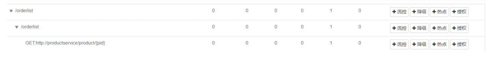

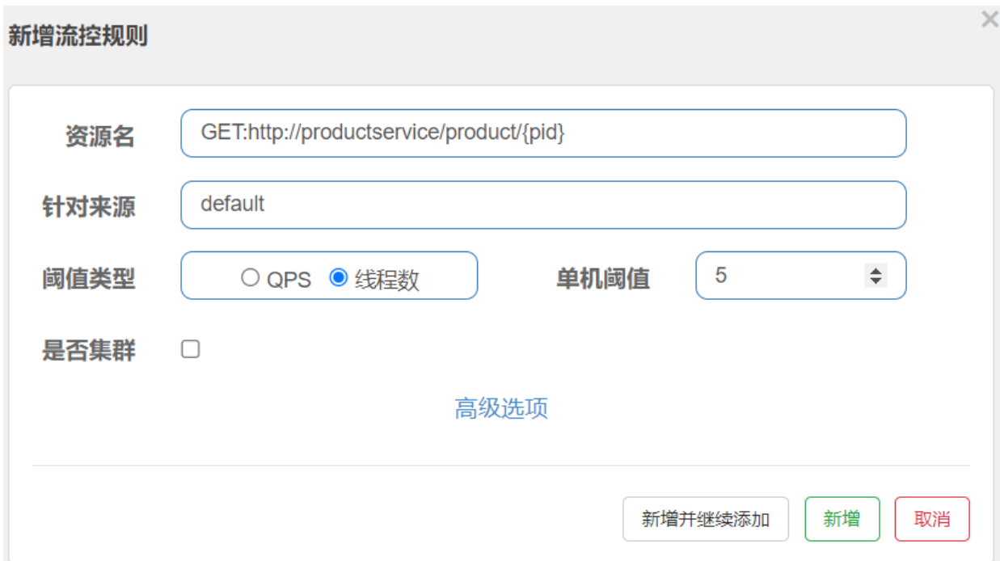


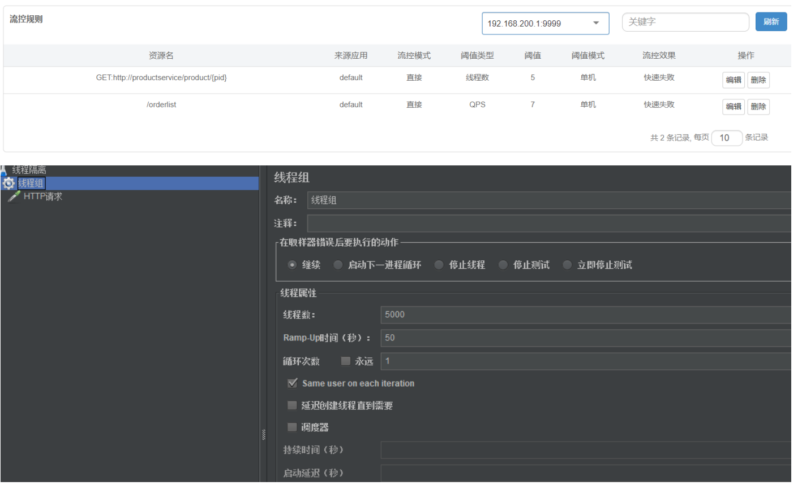

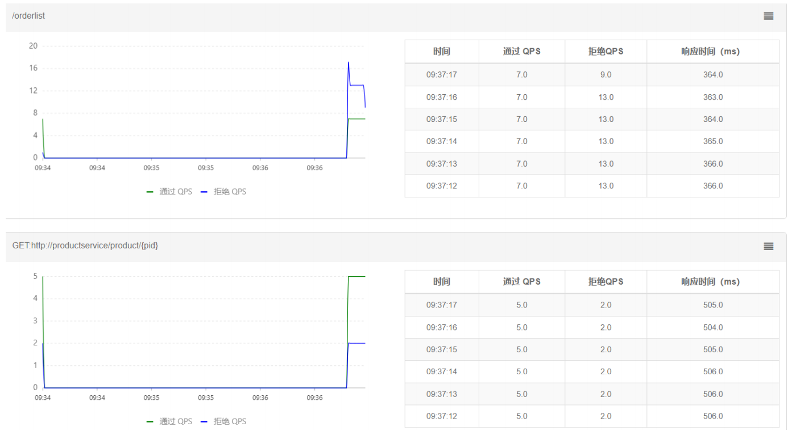

整个过程分为三个状态：

* 关闭：熔断器不工作，所有请求全部该干嘛干嘛。
* 打开：熔断器工作，所有请求一律降级处理。
* 半开：尝试进行一下下正常流程，要是还不行继续保持打开状态，否则关闭。

那么我们来看看Sentinel中如何进行熔断和降级操作，打开管理页面，我们可以自由新增熔断规则：

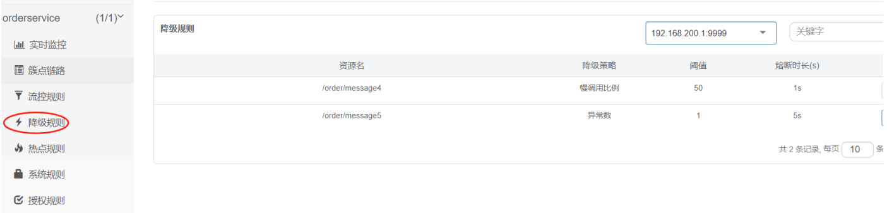

其中，熔断策略有三种模式：

1. **慢调用比例：** 如果出现那种半天都处理不完的调用，有可能就是服务出现故障，导致卡顿，这个选项是按照最大响应时间（RT）进行判定，如果一次请求的处理时间超过了指定的RT，那么就被判定为`慢调用`，在一个统计时长内，如果请求数目大于最小请求数目，并且被判定为`慢调用`的请求比例已经超过阈值，将触发熔断。经过熔断时长之后，将会进入到半开状态进行试探（这里和Hystrix一致）

   然后修改一下接口的执行，我们模拟一下慢调用：

   ```java
     @RequestMapping("/order/message4")
       public String message4() throws InterruptedException {
           Thread.sleep(1000);
           // orderServiceImpl2.message();
           return null;
      }
   ```

   重启，然后我们创建一个新的熔断规则：

   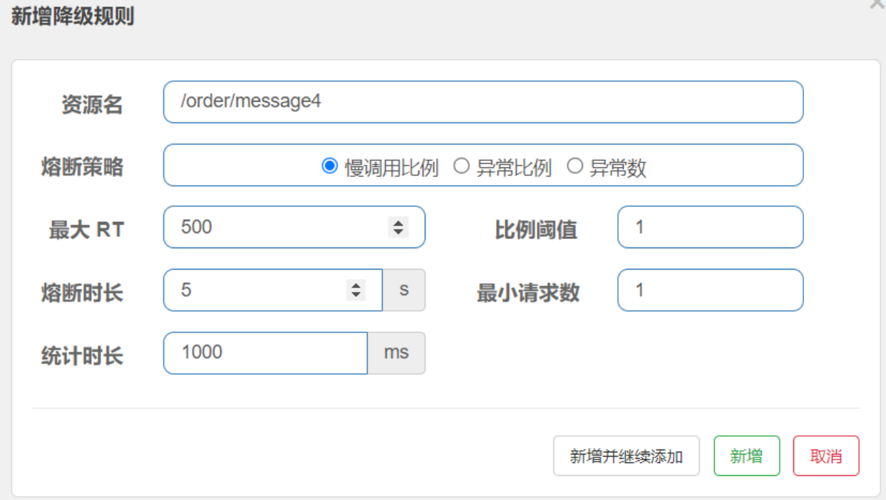

   可以看到，超时直接触发了熔断，进入到阻止页面：

   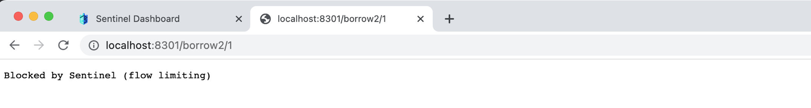

2. **异常比例：** 这个与慢调用比例类似，不过这里判断的是出现异常的次数，与上面一样，我们也来进行一些小测试：

   ```java
     @RequestMapping("/order/message5")
       public String message5()  {
           throw new RuntimeException();
       }
   ```

   启动服务器，接着添加我们的熔断规则：

   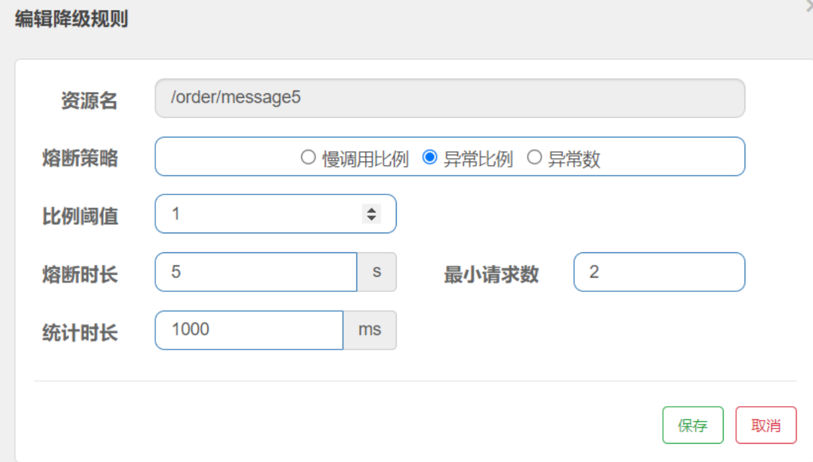

   现在我们进行访问，会发现后台疯狂报错，然后就熔断了：

   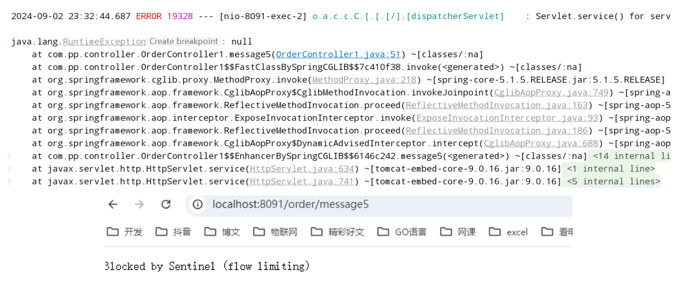

3. **异常数：** 这个和上面的唯一区别就是，只要达到指定的异常数量，就熔断，这里我们修改一下熔断规则：

   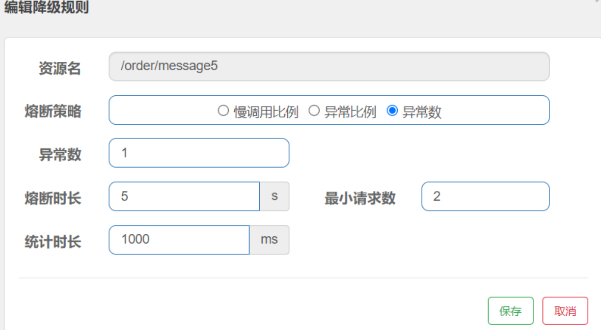

   现在我们再次不断访问此接口，可以发现，效果跟之前其实是差不多的，只是判断的策略稍微不同罢了：

   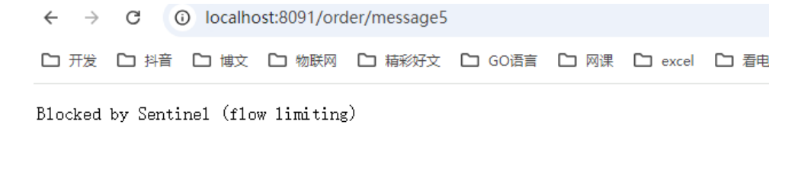

## 微服务CAP原则

经过前面的学习，我们对SpringCloud Netflix以及SpringCloud官方整个生态下的组件认识也差不多了，入门教学就到此为止，下一章将开启真正精彩的正片部分，本章的最后我们还是来了解一些理论上的知识。

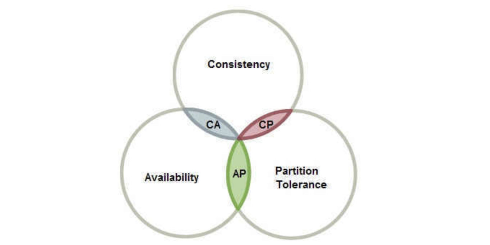

> CAP原则又称CAP定理，指的是在一个分布式系统中，存在Consistency（一致性）、Availability（可用性）、Partition tolerance（分区容错性），三者不可同时保证，最多只能保证其中的两者。   
>
> 一致性（C）：在分布式系统中的所有数据备份，在同一时刻都是同样的值（所有的节点无论何时访问都能拿到最新的值）
>
> 可用性（A）：系统中非故障节点收到的每个请求都必须得到响应（比如我们之前使用的服务降级和熔断，其实就是一种维持可用性的措施，虽然服务返回的是没有什么意义的数据，但是不至于用户的请求会被服务器忽略）
>
> 分区容错性（P）：一个分布式系统里面，节点之间组成的网络本来应该是连通的，然而可能因为一些故障（比如网络丢包等，这是很难避免的），使得有些节点之间不连通了，整个网络就分成了几块区域，数据就散布在了这些不连通的区域中（这样就可能出现某些被分区节点存放的数据访问失败，我们需要来容忍这些不可靠的情况）

总的来说，数据存放的节点数越多，分区容忍性就越高，但是要复制更新的次数就越多，一致性就越难保证。同时为了保证一致性，更新所有节点数据所需要的时间就越长，那么可用性就会降低。

所以说，只能存在以下三种方案：

### AC 可用性+一致性

要同时保证可用性和一致性，代表着某个节点数据更新之后，需要立即将结果通知给其他节点，并且要尽可能的快，这样才能及时响应保证可用性，这就对网络的稳定性要求非常高，但是实际情况下，网络很容易出现丢包等情况，并不是一个可靠的传输，如果需要避免这种问题，就只能将节点全部放在一起，但是这显然违背了分布式系统的概念，所以对于我们的分布式系统来说，很难接受。

### CP 一致性+分区容错性

为了保证一致性，那么就得将某个节点的最新数据发送给其他节点，并且需要等到所有节点都得到数据才能进行响应，同时有了分区容错性，那么代表我们可以容忍网络的不可靠问题，所以就算网络出现卡顿，那么也必须等待所有节点完成数据同步，才能进行响应，因此就会导致服务在一段时间内完全失效，所以可用性是无法得到保证的。

### AP 可用性+分区容错性

既然CP可能会导致一段时间内服务得不到任何响应，那么要保证可用性，就只能放弃节点之间数据的高度统一，也就是说可以在数据不统一的情况下，进行响应，因此就无法保证一致性了。虽然这样会导致拿不到最新的数据，但是只要数据同步操作在后台继续运行，一定能够在某一时刻完成所有节点数据的同步，那么就能实现**最终一致性**，所以AP实际上是最能接受的一种方案。

# seata的部署和集成


# 一、部署Seata的tc-server


## 1.下载

首先我们要下载seata-server包，地址在[http](http://seata.io/zh-cn/blog/download.html)[://seata.io/zh-cn/blog/download](http://seata.io/zh-cn/blog/download.html)[.](http://seata.io/zh-cn/blog/download.html)[html](http://seata.io/zh-cn/blog/download.html) 

当然，课前资料也准备好了：


## 2.解压

在非中文目录解压缩这个zip包，其目录结构如下：


## 3.修改配置

修改conf目录下的registry.conf文件：

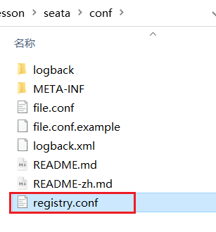

内容如下：

```properties
registry {
  # tc服务的注册中心类，这里选择nacos，也可以是eureka、zookeeper等
  type = "nacos"

  nacos {
    # seata tc 服务注册到 nacos的服务名称，可以自定义
    application = "seata-tc-server"
    serverAddr = "127.0.0.1:8848"
    group = "DEFAULT_GROUP"
    namespace = ""
    cluster = "SH"
    username = "nacos"
    password = "nacos"
  }
}

config {
  # 读取tc服务端的配置文件的方式，这里是从nacos配置中心读取，这样如果tc是集群，可以共享配置
  type = "nacos"
  # 配置nacos地址等信息
  nacos {
    serverAddr = "127.0.0.1:8848"
    namespace = ""
    group = "SEATA_GROUP"
    username = "nacos"
    password = "nacos"
    dataId = "seataServer.properties"
  }
}
```


## 4.在nacos添加配置

特别注意，为了让tc服务的集群可以共享配置，我们选择了nacos作为统一配置中心。因此服务端配置文件seataServer.properties文件需要在nacos中配好。

格式如下：


配置内容如下：

```properties
# 数据存储方式，db代表数据库
store.mode=db
store.db.datasource=druid
store.db.dbType=mysql
store.db.driverClassName=com.mysql.jdbc.Driver
store.db.url=jdbc:mysql://127.0.0.1:3306/seata?useUnicode=true&rewriteBatchedStatements=true
store.db.user=root
store.db.password=123
store.db.minConn=5
store.db.maxConn=30
store.db.globalTable=global_table
store.db.branchTable=branch_table
store.db.queryLimit=100
store.db.lockTable=lock_table
store.db.maxWait=5000
# 事务、日志等配置
server.recovery.committingRetryPeriod=1000
server.recovery.asynCommittingRetryPeriod=1000
server.recovery.rollbackingRetryPeriod=1000
server.recovery.timeoutRetryPeriod=1000
server.maxCommitRetryTimeout=-1
server.maxRollbackRetryTimeout=-1
server.rollbackRetryTimeoutUnlockEnable=false
server.undo.logSaveDays=7
server.undo.logDeletePeriod=86400000

# 客户端与服务端传输方式
transport.serialization=seata
transport.compressor=none
# 关闭metrics功能，提高性能
metrics.enabled=false
metrics.registryType=compact
metrics.exporterList=prometheus
metrics.exporterPrometheusPort=9898
```


==其中的数据库地址、用户名、密码都需要修改成你自己的数据库信息。==


## 5.创建数据库表

特别注意：tc服务在管理分布式事务时，需要记录事务相关数据到数据库中，你需要提前创建好这些表。

新建一个名为seata的数据库，运行课前资料提供的sql文件：

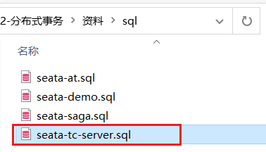

这些表主要记录全局事务、分支事务、全局锁信息：

```mysql
SET NAMES utf8mb4;
SET FOREIGN_KEY_CHECKS = 0;

-- ----------------------------
-- 分支事务表
-- ----------------------------
DROP TABLE IF EXISTS `branch_table`;
CREATE TABLE `branch_table`  (
  `branch_id` bigint(20) NOT NULL,
  `xid` varchar(128) CHARACTER SET utf8 COLLATE utf8_general_ci NOT NULL,
  `transaction_id` bigint(20) NULL DEFAULT NULL,
  `resource_group_id` varchar(32) CHARACTER SET utf8 COLLATE utf8_general_ci NULL DEFAULT NULL,
  `resource_id` varchar(256) CHARACTER SET utf8 COLLATE utf8_general_ci NULL DEFAULT NULL,
  `branch_type` varchar(8) CHARACTER SET utf8 COLLATE utf8_general_ci NULL DEFAULT NULL,
  `status` tinyint(4) NULL DEFAULT NULL,
  `client_id` varchar(64) CHARACTER SET utf8 COLLATE utf8_general_ci NULL DEFAULT NULL,
  `application_data` varchar(2000) CHARACTER SET utf8 COLLATE utf8_general_ci NULL DEFAULT NULL,
  `gmt_create` datetime(6) NULL DEFAULT NULL,
  `gmt_modified` datetime(6) NULL DEFAULT NULL,
  PRIMARY KEY (`branch_id`) USING BTREE,
  INDEX `idx_xid`(`xid`) USING BTREE
) ENGINE = InnoDB CHARACTER SET = utf8 COLLATE = utf8_general_ci ROW_FORMAT = Compact;

-- ----------------------------
-- 全局事务表
-- ----------------------------
DROP TABLE IF EXISTS `global_table`;
CREATE TABLE `global_table`  (
  `xid` varchar(128) CHARACTER SET utf8 COLLATE utf8_general_ci NOT NULL,
  `transaction_id` bigint(20) NULL DEFAULT NULL,
  `status` tinyint(4) NOT NULL,
  `application_id` varchar(32) CHARACTER SET utf8 COLLATE utf8_general_ci NULL DEFAULT NULL,
  `transaction_service_group` varchar(32) CHARACTER SET utf8 COLLATE utf8_general_ci NULL DEFAULT NULL,
  `transaction_name` varchar(128) CHARACTER SET utf8 COLLATE utf8_general_ci NULL DEFAULT NULL,
  `timeout` int(11) NULL DEFAULT NULL,
  `begin_time` bigint(20) NULL DEFAULT NULL,
  `application_data` varchar(2000) CHARACTER SET utf8 COLLATE utf8_general_ci NULL DEFAULT NULL,
  `gmt_create` datetime NULL DEFAULT NULL,
  `gmt_modified` datetime NULL DEFAULT NULL,
  PRIMARY KEY (`xid`) USING BTREE,
  INDEX `idx_gmt_modified_status`(`gmt_modified`, `status`) USING BTREE,
  INDEX `idx_transaction_id`(`transaction_id`) USING BTREE
) ENGINE = InnoDB CHARACTER SET = utf8 COLLATE = utf8_general_ci ROW_FORMAT = Compact;

SET FOREIGN_KEY_CHECKS = 1;
```


## 6.启动TC服务

进入bin目录，运行其中的seata-server.bat即可：


启动成功后，seata-server应该已经注册到nacos注册中心了。


打开浏览器，访问nacos地址：http://localhost:8848，然后进入服务列表页面，可以看到seata-tc-server的信息：

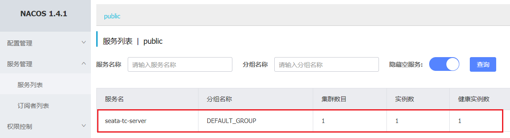


# 二、微服务集成seata

## 1.引入依赖

首先，我们需要在微服务中引入seata依赖：

```xml
<dependency>
    <groupId>com.alibaba.cloud</groupId>
    <artifactId>spring-cloud-starter-alibaba-seata</artifactId>
    <exclusions>
        <!--版本较低，1.3.0，因此排除-->
        <exclusion>
            <artifactId>seata-spring-boot-starter</artifactId>
            <groupId>io.seata</groupId>
        </exclusion>
    </exclusions>
</dependency>
<!--seata starter 采用1.4.2版本-->
<dependency>
    <groupId>io.seata</groupId>
    <artifactId>seata-spring-boot-starter</artifactId>
    <version>${seata.version}</version>
</dependency>
```


## 2.修改配置文件

需要修改application.yml文件，添加一些配置：

```yaml
seata:
  registry: # TC服务注册中心的配置，微服务根据这些信息去注册中心获取tc服务地址
    # 参考tc服务自己的registry.conf中的配置
    type: nacos
    nacos: # tc
      server-addr: 127.0.0.1:8848
      namespace: ""
      group: DEFAULT_GROUP
      application: seata-tc-server # tc服务在nacos中的服务名称
      cluster: SH
  tx-service-group: seata-demo # 事务组，根据这个获取tc服务的cluster名称
  service:
    vgroup-mapping: # 事务组与TC服务cluster的映射关系
      seata-demo: SH
```


# 三、TC服务的高可用和异地容灾

## 1.模拟异地容灾的TC集群

计划启动两台seata的tc服务节点：

| 节点名称 | ip地址    | 端口号 | 集群名称 |
| -------- | --------- | ------ | -------- |
| seata    | 127.0.0.1 | 8091   | SH       |
| seata2   | 127.0.0.1 | 8092   | HZ       |

之前我们已经启动了一台seata服务，端口是8091，集群名为SH。

现在，将seata目录复制一份，起名为seata2

修改seata2/conf/registry.conf内容如下：

```nginx
registry {
  # tc服务的注册中心类，这里选择nacos，也可以是eureka、zookeeper等
  type = "nacos"

  nacos {
    # seata tc 服务注册到 nacos的服务名称，可以自定义
    application = "seata-tc-server"
    serverAddr = "127.0.0.1:8848"
    group = "DEFAULT_GROUP"
    namespace = ""
    cluster = "HZ"
    username = "nacos"
    password = "nacos"
  }
}

config {
  # 读取tc服务端的配置文件的方式，这里是从nacos配置中心读取，这样如果tc是集群，可以共享配置
  type = "nacos"
  # 配置nacos地址等信息
  nacos {
    serverAddr = "127.0.0.1:8848"
    namespace = ""
    group = "SEATA_GROUP"
    username = "nacos"
    password = "nacos"
    dataId = "seataServer.properties"
  }
}
```


进入seata2/bin目录，然后运行命令：

```powershell
seata-server.bat -p 8092
```


打开nacos控制台，查看服务列表：

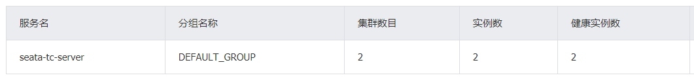

点进详情查看：

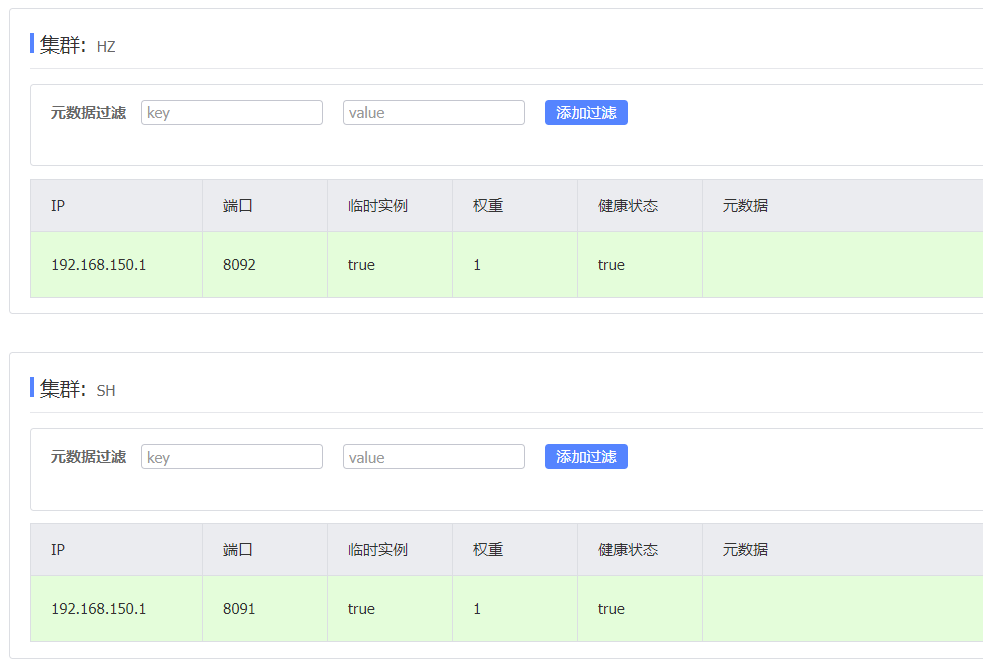


## 2.将事务组映射配置到nacos

接下来，我们需要将tx-service-group与cluster的映射关系都配置到nacos配置中心。

新建一个配置：

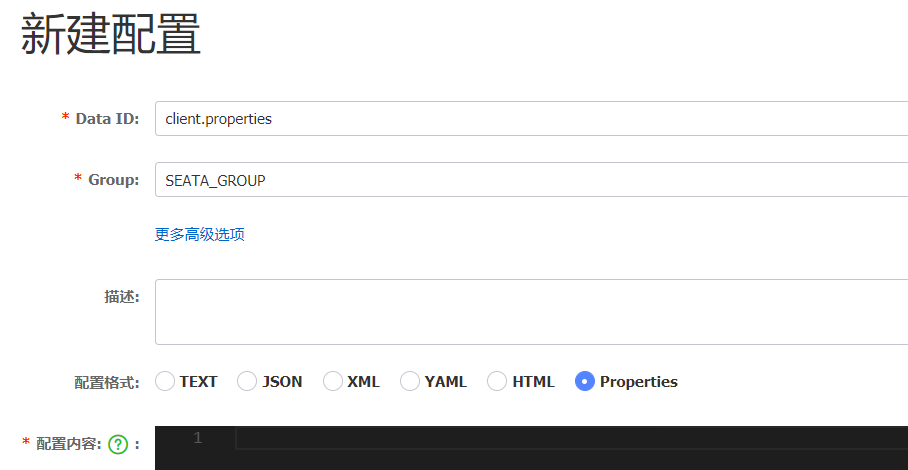

配置的内容如下：

```properties
# 事务组映射关系
service.vgroupMapping.seata-demo=SH

service.enableDegrade=false
service.disableGlobalTransaction=false
# 与TC服务的通信配置
transport.type=TCP
transport.server=NIO
transport.heartbeat=true
transport.enableClientBatchSendRequest=false
transport.threadFactory.bossThreadPrefix=NettyBoss
transport.threadFactory.workerThreadPrefix=NettyServerNIOWorker
transport.threadFactory.serverExecutorThreadPrefix=NettyServerBizHandler
transport.threadFactory.shareBossWorker=false
transport.threadFactory.clientSelectorThreadPrefix=NettyClientSelector
transport.threadFactory.clientSelectorThreadSize=1
transport.threadFactory.clientWorkerThreadPrefix=NettyClientWorkerThread
transport.threadFactory.bossThreadSize=1
transport.threadFactory.workerThreadSize=default
transport.shutdown.wait=3
# RM配置
client.rm.asyncCommitBufferLimit=10000
client.rm.lock.retryInterval=10
client.rm.lock.retryTimes=30
client.rm.lock.retryPolicyBranchRollbackOnConflict=true
client.rm.reportRetryCount=5
client.rm.tableMetaCheckEnable=false
client.rm.tableMetaCheckerInterval=60000
client.rm.sqlParserType=druid
client.rm.reportSuccessEnable=false
client.rm.sagaBranchRegisterEnable=false
# TM配置
client.tm.commitRetryCount=5
client.tm.rollbackRetryCount=5
client.tm.defaultGlobalTransactionTimeout=60000
client.tm.degradeCheck=false
client.tm.degradeCheckAllowTimes=10
client.tm.degradeCheckPeriod=2000

# undo日志配置
client.undo.dataValidation=true
client.undo.logSerialization=jackson
client.undo.onlyCareUpdateColumns=true
client.undo.logTable=undo_log
client.undo.compress.enable=true
client.undo.compress.type=zip
client.undo.compress.threshold=64k
client.log.exceptionRate=100
```

## 3.微服务读取nacos配置

接下来，需要修改每一个微服务的application.yml文件，让微服务读取nacos中的client.properties文件：

```yaml
seata:
  config:
    type: nacos
    nacos:
      server-addr: 127.0.0.1:8848
      username: nacos
      password: nacos
      group: SEATA_GROUP
      data-id: client.properties
```


重启微服务，现在微服务到底是连接tc的SH集群，还是tc的HZ集群，都统一由nacos的client.properties来决定了。


# Seata 是什么?

Seata 是一款开源的分布式事务解决方案，致力于提供高性能和简单易用的分布式事务服务。Seata 将为用户提供了 AT、TCC、SAGA 和 XA 事务模式，为用户打造一站式的分布式解决方案。 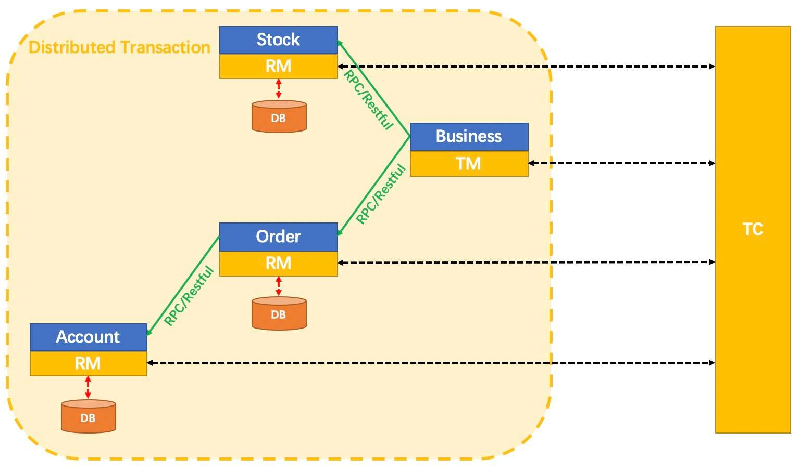

## AT 模式

## 前提

- 基于支持本地 ACID 事务的关系型数据库。
- Java 应用，通过 JDBC 访问数据库。

## 整体机制

两阶段提交协议的演变：

- 一阶段：业务数据和回滚日志记录在同一个本地事务中提交，释放本地锁和连接资源。
- 二阶段：
  - 提交异步化，非常快速地完成。
  - 回滚通过一阶段的回滚日志进行反向补偿。

## 写隔离

- 一阶段本地事务提交前，需要确保先拿到 **全局锁** 。
- 拿不到 **全局锁** ，不能提交本地事务。
- 拿 **全局锁** 的尝试被限制在一定范围内，超出范围将放弃，并回滚本地事务，释放本地锁。

以一个示例来说明：

两个全局事务 tx1 和 tx2，分别对 a 表的 m 字段进行更新操作，m 的初始值 1000。

tx1 先开始，开启本地事务，拿到本地锁，更新操作 m = 1000 - 100 = 900。本地事务提交前，先拿到该记录的 **全局锁** ，本地提交释放本地锁。 tx2 后开始，开启本地事务，拿到本地锁，更新操作 m = 900 - 100 = 800。本地事务提交前，尝试拿该记录的 **全局锁** ，tx1 全局提交前，该记录的全局锁被 tx1 持有，tx2 需要重试等待 **全局锁** 。

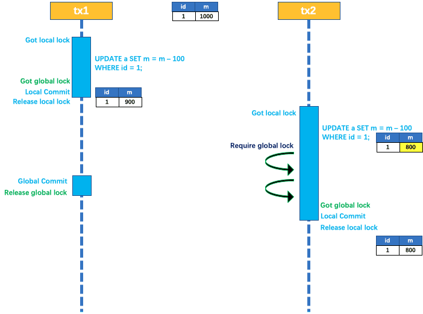

tx1 二阶段全局提交，释放 **全局锁** 。tx2 拿到 **全局锁** 提交本地事务。

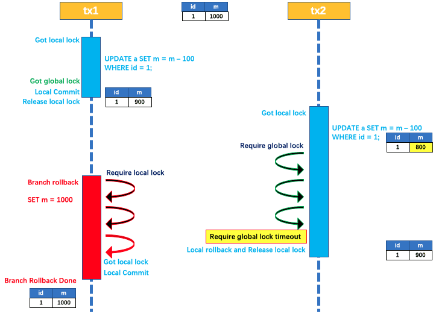

如果 tx1 的二阶段全局回滚，则 tx1 需要重新获取该数据的本地锁，进行反向补偿的更新操作，实现分支的回滚。

此时，如果 tx2 仍在等待该数据的 **全局锁**，同时持有本地锁，则 tx1 的分支回滚会失败。分支的回滚会一直重试，直到 tx2 的 **全局锁** 等锁超时，放弃 **全局锁** 并回滚本地事务释放本地锁，tx1 的分支回滚最终成功。

因为整个过程 **全局锁** 在 tx1 结束前一直是被 tx1 持有的，所以不会发生 **脏写** 的问题。

## 读隔离

在数据库本地事务隔离级别 **读已提交（Read Committed）** 或以上的基础上，Seata（AT 模式）的默认全局隔离级别是 **读未提交（Read Uncommitted）** 。

如果应用在特定场景下，必需要求全局的 **读已提交** ，目前 Seata 的方式是通过 SELECT FOR UPDATE 语句的代理。

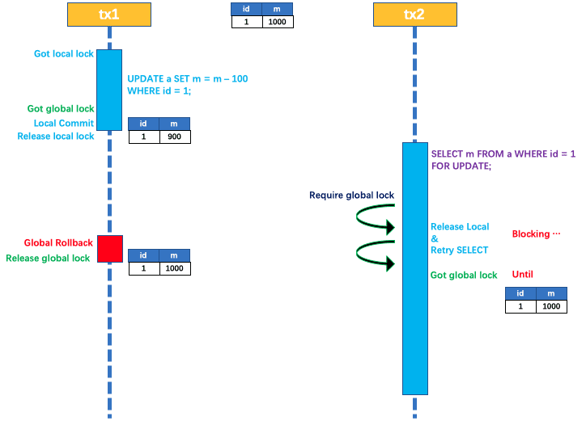

SELECT FOR UPDATE 语句的执行会申请 **全局锁** ，如果 **全局锁** 被其他事务持有，则释放本地锁（回滚 SELECT FOR UPDATE 语句的本地执行）并重试。这个过程中，查询是被 block 住的，直到 **全局锁** 拿到，即读取的相关数据是 **已提交** 的，才返回。

出于总体性能上的考虑，Seata 目前的方案并没有对所有 SELECT 语句都进行代理，仅针对 FOR UPDATE 的 SELECT 语句。

## 工作机制

以一个示例来说明整个 AT 分支的工作过程。

业务表：`product`

| Field | Type         | Key  |
| ----- | ------------ | ---- |
| id    | bigint(20)   | PRI  |
| name  | varchar(100) |      |
| since | varchar(100) |      |

AT 分支事务的业务逻辑：

```sql
update product set name = 'GTS' where name = 'TXC';
```


## 一阶段

过程：

1. 解析 SQL：得到 SQL 的类型（UPDATE），表（product），条件（where name = 'TXC'）等相关的信息。
2. 查询前镜像：根据解析得到的条件信息，生成查询语句，定位数据。

```sql
select id, name, since from product where name = 'TXC';
```


得到前镜像：

| id   | name | since |
| ---- | ---- | ----- |
| 1    | TXC  | 2014  |

1. 执行业务 SQL：更新这条记录的 name 为 'GTS'。
2. 查询后镜像：根据前镜像的结果，通过 **主键** 定位数据。

```sql
select id, name, since from product where id = 1;
```


得到后镜像：

| id   | name | since |
| ---- | ---- | ----- |
| 1    | GTS  | 2014  |

1. 插入回滚日志：把前后镜像数据以及业务 SQL 相关的信息组成一条回滚日志记录，插入到 `UNDO_LOG` 表中。

```json
{
	"branchId": 641789253,
	"undoItems": [{
		"afterImage": {
			"rows": [{
				"fields": [{
					"name": "id",
					"type": 4,
					"value": 1
				}, {
					"name": "name",
					"type": 12,
					"value": "GTS"
				}, {
					"name": "since",
					"type": 12,
					"value": "2014"
				}]
			}],
			"tableName": "product"
		},
		"beforeImage": {
			"rows": [{
				"fields": [{
					"name": "id",
					"type": 4,
					"value": 1
				}, {
					"name": "name",
					"type": 12,
					"value": "TXC"
				}, {
					"name": "since",
					"type": 12,
					"value": "2014"
				}]
			}],
			"tableName": "product"
		},
		"sqlType": "UPDATE"
	}],
	"xid": "xid:xxx"
}
```


1. 提交前，向 TC 注册分支：申请 `product` 表中，主键值等于 1 的记录的 **全局锁** 。
2. 本地事务提交：业务数据的更新和前面步骤中生成的 UNDO LOG 一并提交。
3. 将本地事务提交的结果上报给 TC。

## 二阶段-回滚

1. 收到 TC 的分支回滚请求，开启一个本地事务，执行如下操作。
2. 通过 XID 和 Branch ID 查找到相应的 UNDO LOG 记录。
3. 数据校验：拿 UNDO LOG 中的后镜与当前数据进行比较，如果有不同，说明数据被当前全局事务之外的动作做了修改。这种情况，需要根据配置策略来做处理，详细的说明在另外的文档中介绍。
4. 根据 UNDO LOG 中的前镜像和业务 SQL 的相关信息生成并执行回滚的语句：

```sql
update product set name = 'TXC' where id = 1;
```


1. 提交本地事务。并把本地事务的执行结果（即分支事务回滚的结果）上报给 TC。

## 二阶段-提交

1. 收到 TC 的分支提交请求，把请求放入一个异步任务的队列中，马上返回提交成功的结果给 TC。
2. 异步任务阶段的分支提交请求将异步和批量地删除相应 UNDO LOG 记录。

## 附录

## 回滚日志表

UNDO_LOG Table：不同数据库在类型上会略有差别。

以 MySQL 为例：

| Field         | Type         |
| ------------- | ------------ |
| branch_id     | bigint PK    |
| xid           | varchar(100) |
| context       | varchar(128) |
| rollback_info | longblob     |
| log_status    | tinyint      |
| log_created   | datetime     |
| log_modified  | datetime     |

```sql
-- 注意此处0.7.0+ 增加字段 context
CREATE TABLE `undo_log` (
  `id` bigint(20) NOT NULL AUTO_INCREMENT,
  `branch_id` bigint(20) NOT NULL,
  `xid` varchar(100) NOT NULL,
  `context` varchar(128) NOT NULL,
  `rollback_info` longblob NOT NULL,
  `log_status` int(11) NOT NULL,
  `log_created` datetime NOT NULL,
  `log_modified` datetime NOT NULL,
  PRIMARY KEY (`id`),
  UNIQUE KEY `ux_undo_log` (`xid`,`branch_id`)
) ENGINE=InnoDB AUTO_INCREMENT=1 DEFAULT CHARSET=utf8;
```


```java
@GlobalTransactional
    public Long create(Order order) {
        // 创建订单
        orderMapper.insert(order);
        try {
            // 扣用户余额
            accountClient.deduct(order.getUserId(), order.getMoney());
            // 扣库存
            storageClient.deduct(order.getCommodityCode(), order.getCount());

        } catch (FeignException e) {
            log.error("下单失败，原因:{}", e.contentUTF8(), e);
            throw new RuntimeException(e.contentUTF8(), e);
        }
        return order.getId();
    }
```


## Seata XA 模式

## 概述

XA 模式是从 1.2 版本支持的事务模式。XA 规范 是 X/Open 组织定义的分布式事务处理（DTP，Distributed Transaction Processing）标准。Seata XA 模式是利用事务资源（数据库、消息服务等）对 XA 协议的支持，以 XA 协议的机制来管理分支事务的一种事务模式。

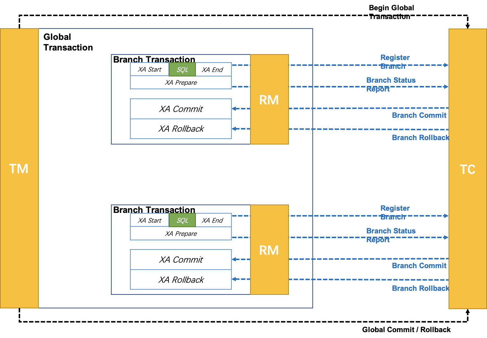

本文中，我们将重点介绍 Seata XA 模式的使用，如果您对于 XA 模式原理感兴趣，还请阅读对应于本篇文章的[开发者指南](https://seata.apache.org/zh-cn/docs/dev/mode/xa-mode)。

### 优势

与 Seata 支持的其它事务模式不同，XA 协议要求事务资源本身提供对规范和协议的支持，所以事务资源（如数据库）可以保障从任意视角对数据的访问有效隔离，满足全局数据一致性。此外的一些优势还包括：

1. 业务无侵入：和 AT 一样，XA 模式将是业务无侵入的，不给应用设计和开发带来额外负担。
2. 数据库的支持广泛：XA 协议被主流关系型数据库广泛支持，不需要额外的适配即可使用。

### 缺点

XA prepare 后，分支事务进入阻塞阶段，收到 XA commit 或 XA rollback 前必须阻塞等待。事务资源长时间得不到释放，锁定周期长，而且在应用层上面无法干预，性能差。

### 适用场景

适用于想要迁移到 Seata 平台基于 XA 协议的老应用，使用 XA 模式将更平滑，还有 AT 模式未适配的数据库应用。

## 整体机制

- 执行阶段：
  - 可回滚：业务 SQL 操作放在 XA 分支中进行，由资源对 XA 协议的支持来保证 *可回滚*
  - 持久化：XA 分支完成后，执行 XA prepare，同样，由资源对 XA 协议的支持来保证 *持久化*（即，之后任何意外都不会造成无法回滚的情况）
- 完成阶段：
  - 分支提交：执行 XA 分支的 commit
  - 分支回滚：执行 XA 分支的 rollback

## 基本使用

XA 模式使用起来与 AT 模式基本一致，用法上的唯一区别在于数据源代理的替换：使用 `DataSourceProxyXA` 来替代 `DataSourceProxy`。

```java
public class DataSourceProxy {
    @Bean("dataSourceProxy")
    public DataSource dataSource(DruidDataSource druidDataSource) {
        // DataSourceProxyXA for XA mode
        return new DataSourceProxyXA(druidDataSource);
        // DataSourceProxy for AT mode
        // return new DataSourceProxy(druidDataSource);
    }
}
```

## TCC 模式

回顾总览中的描述：一个分布式的全局事务，整体是 **两阶段提交** 的模型。全局事务是由若干分支事务组成的，分支事务要满足 **两阶段提交** 的模型要求，即需要每个分支事务都具备自己的：

- 一阶段 prepare 行为
- 二阶段 commit 或 rollback 行为

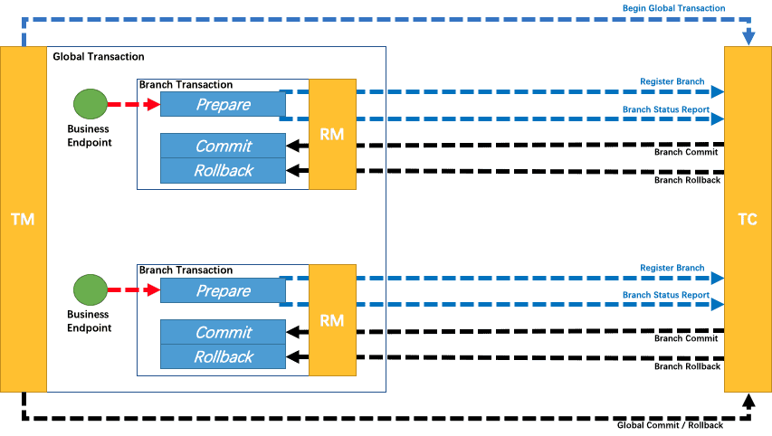

根据两阶段行为模式的不同，我们将分支事务划分为 **Automatic (Branch) Transaction Mode** 和 **Manual (Branch) Transaction Mode**.

AT 模式基于 **支持本地 ACID 事务** 的 **关系型数据库**：

- 一阶段 prepare 行为：在本地事务中，一并提交业务数据更新和相应回滚日志记录。
- 二阶段 commit 行为：马上成功结束，**自动** 异步批量清理回滚日志。
- 二阶段 rollback 行为：通过回滚日志，**自动** 生成补偿操作，完成数据回滚。

相应的，TCC 模式，不依赖于底层数据资源的事务支持：

- 一阶段 prepare 行为：调用 **自定义** 的 prepare 逻辑。
- 二阶段 commit 行为：调用 **自定义** 的 commit 逻辑。
- 二阶段 rollback 行为：调用 **自定义** 的 rollback 逻辑。

所谓 TCC 模式，是指支持把 **自定义** 的分支事务纳入到全局事务的管理中。


```java
@LocalTCC
public interface AccountTCCService {

    @TwoPhaseBusinessAction(name = "deduct", commitMethod = "confirm", rollbackMethod = "cancel")
    void deduct(@BusinessActionContextParameter(paramName = "userId") String userId,
                @BusinessActionContextParameter(paramName = "money")int money);

    boolean confirm(BusinessActionContext ctx);

    boolean cancel(BusinessActionContext ctx);
}

```


## Saga 模式

Saga模式是SEATA提供的长事务解决方案，在Saga模式中，业务流程中每个参与者都提交本地事务，当出现某一个参与者失败则补偿前面已经成功的参与者，一阶段正向服务和二阶段补偿服务都由业务开发实现。

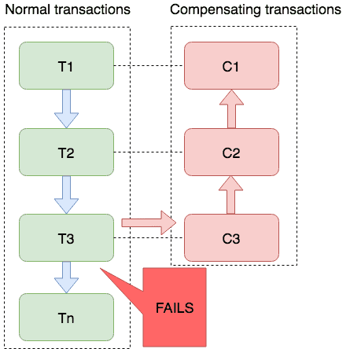

理论基础：Hector & Kenneth 发表论⽂ Sagas （1987）

## 适用场景：

- 业务流程长、业务流程多
- 参与者包含其它公司或遗留系统服务，无法提供 TCC 模式要求的三个接口

## 优势：

- 一阶段提交本地事务，无锁，高性能
- 事件驱动架构，参与者可异步执行，高吞吐
- 补偿服务易于实现

## 缺点：

- 不保证隔离性

传统自研公司 (能解决问题) 外包公司    互联网自研公司    追求 性能  新  

git平台 给你账号   给你代码权限     根据业务复杂度不同   半个月       2-3    弄通业务逻辑

写的代码     领导  看一下的代码风格和思路      git进行代码提交

测试-------灰度发布          半夜三点左右  


