## 一、什么是Locust

Locust 是一个开源的、基于 Python 的分布式负载测试工具，用于测试网站、Web 应用程序和API的性能和可扩展性。它通过模拟大量并发用户访问目标系统，帮助开发者和测试人员识别系统在高负载下的表现和潜在瓶颈。

Python之locust官方文档：https://docs.locust.io/

## 二、Locust 架构组成

纯 Python 编写：Locust 使用 Python 编写测试用例，灵活且易于维护。
HTTP 请求：它是基于 requests 库发送 HTTP 请求。
协程运行：locust是使用协成运行的，用更低的成本实现更多的并发。并且是基于gevent实现的。
分布式支持：支持分布式，支持更多的压力测试
Web UI：内置了 Web UI，可通过浏览器进行控制和监控。
插件扩展：我们可以用第三方的插件，进行扩展。
结论：如果你使用 Python 进行接口测试（尤其是使用 requests 进行接口测试的），那么就优先考虑使用 Locust 进行接口性能测试，因为更方便。

## 三、实战 Demo

我实现的demo是从0到1的。所以是从接口测试用例，转变成性能测试用例的一个过程。请注意看下面的内容。

准备一个可调用的接口
如果有可调用的接口，那么可以忽略这一步。

安装 Flask：

```python
pip install flask
编写并运行以下代码，创建一个简单的登录接口：
```

```python
from flask import Flask, make_response

app = Flask(__name__)

@app.route('/', methods=['GET', 'POST'])
def run():
    res = {
        'code': 0,
        'msg': "OK",
        'data': {
            'test': '测试页面'
        }
    }
    return make_response(res)

if __name__ == '__main__':
    app.run(host='0.0.0.0', port=8080, debug=False, threaded=True)
```

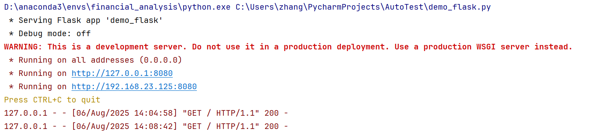
运行后，将生成一个可访问的接口。下面我们将会用这个接口去进行接口性能测试。

编写一个接口测试用例
使用 requests 调用刚才创建的接口，并编写一个简单的测试用例：

```python
import requests

def test_request():
    resp = requests.get(url="http://127.0.0.1:8080/")
    print(resp.json())
    assert resp.status_code == 200

if __name__ == '__main__':
    test_request()
```

运行
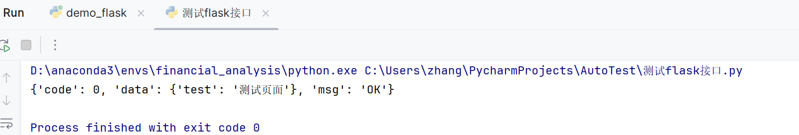
运行测试用例，如果没有报错，说明接口正常。

编写一个性能测试用例
为了更好的演示和理解，所以我们准备将上面的接口测试用例，转换成locust的性能测试用例，如下：

首先，通过 pip 安装 Locust：

```
pip install locust
```

将上述测试用例转换为 Locust 的性能测试用例如下：

```python
import locust

class MyUser(locust.HttpUser):  # 1、在类中继承locust.HttpUser的子类，也就是创建这个子类

    # 4、添加locust给我们提供的函数between，里面1和2的值代表着每个task间隔1到2秒
    wait_time = locust.between(1, 2)

    @locust.task  # 2、添加一个装饰器，表明这是性能测试用例
    def test_request(self):
        resp = self.client.get(url="http://127.0.0.1:8080/")  # 3、使用self.client去发送请求
        print(resp.json())
        assert resp.status_code == 200
```


转变步骤说明：

1. 创建一个类，继承 locust.HttpUser。

2. 使用 @locust.task 装饰器标识性能测试用例。
3. 使用 self.client.get或者post 发送请求。
4. 设置 wait_time = locust.between(1, 2) 添加locust给我们提供的函数between，里面1和2的值代表着每个task间隔1到2秒，相当于每个测试用例的间隔

执行性能测试用例代码
执行性能测试用例，有两种执行方式：

1、通过 Web UI 执行（GUI模式）
通过webUI来执行主要就是简洁方便，可以出具绘制图表来展示。但webUI也有一个小弊端，那就是制作的图表会浪费一些性能，因为制作图表的时候会实时获取数据，这也是浪费性能的原因。

在终端运行 Locust 命令：

```
locust -f 用例名称.py
```

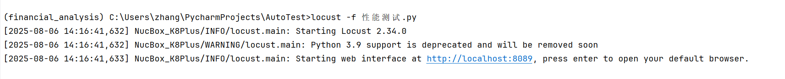

2、打开浏览器访问 Web UI（通常为 http://0.0.0.0:8089）。

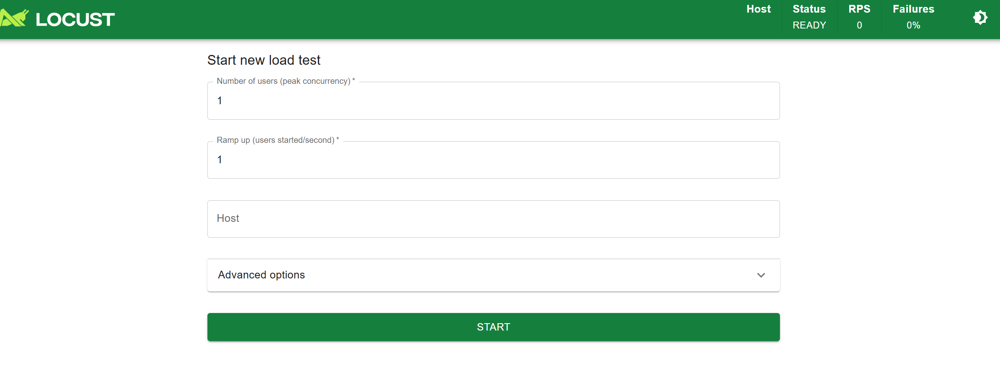

配置测试参数：

1. Number of users (peak concurrency)：模拟的并发用户数，例如 1000。

2. Ramp up (users spawned/second)：用户启动速率。比如：我们选择了1000个用户，如果我们这里填写10，也就代表着每秒有10个用户在调用 。
3. Host：做过接口测试的同学都知道，就是填写接口的url。但是我们在性能测试用例中已经写了URL，那么这个就无所谓了。写不写都可以，所以我们就随便写个1（写1的原因是因为这个为空的话会报错，也算是一个bug）
4. Run time：测试运行时间，例如 120s 表示运行2分钟。如果要一直运行那就不写。


我们可以在 STATISTICS里面看到测试结果。

### 性能测试结果分析

（1）请求总数与失败数：
总请求数为 29293，失败请求数为 18071，失败率较高，为62%。这表明接口在高负载下的稳定性较差，需要开发去调查失败的原因。
（2）响应时间：
中位数响应时间为 70 ms，平均响应时间为 802.74 ms。中位数响应时间相对较低，说明大部分请求的响应时间较快，但平均响应时间较高，可能是因为有少数请求的响应时间过长导致的。
95% 和 99% 的响应时间分别为 6300 ms 和 8900 ms，表明有 5% 和 1% 的请求响应时间超过了这些阈值，可能影响用户体验。
（3）最小值与最大值：
最小响应时间为 2 ms，最大响应时间为 10134 ms，最大响应时间的差异较大，说明在某些情况下，接口的响应时间会非常慢。
（4）数据大小与吞吐量：
平均数据大小为 24.9 字节，当前每秒请求数 (RPS) 为 300.1，当前故障数为 300.1。吞吐量表现良好，但由于高失败率，实际可用的吞吐量是受到影响的。

### 性能参数

性能参数	描述
Type	请求类型，如Get/Post
Name	请求路径
Requests	当前请求数量
Failes	请求失败数量
Median	中间值毫秒，一半的服务器响应低于该值，还有一半高于该值
95%	95%的请求响应时间
Average	平均值，单位毫秒，所有请求平均响应时间
Min	请求的服务器最小响应时间
Max	请求的服务器最大响应时间
Average size	单个请求大小，字节
RPS	每秒能处理的请求数目

运行测试后，可以在 CHARTS 页面查看实时数据。

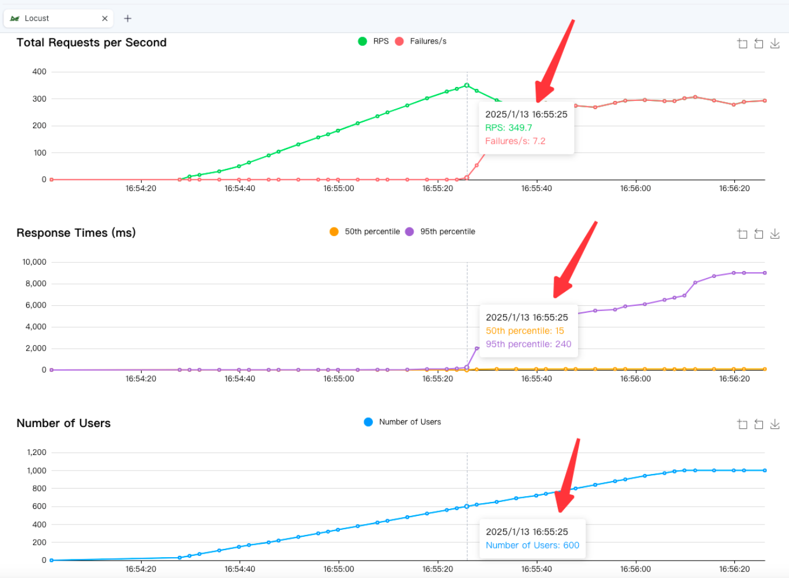

RPS（吞吐量）：349.7
最大用户数：600

结论：通过这个数据我们可以看到，如果每秒有600用户去访问我们的接口。那么我们的服务器是承载不了的，也就是说我们可以让600人同时在线。但是我们无法让349.7个用户，不能在同一时间都得到结果。

异常信息：测试接口拒绝连接，表明服务器崩溃。

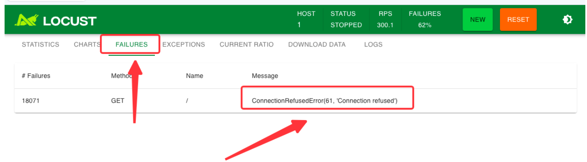

#### 1、代码异常

这代表接口用例执行失败抛出的异常。我们可以在后台看到，也可以在webUI内看到。

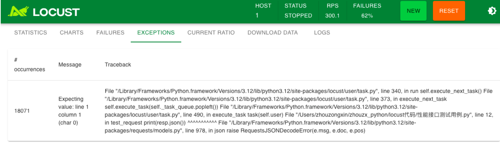

#### 2、通过命令行执行（非GUI模式）

使用命令行来执行，就不会有页面和图表出现。所以会充分利用性能来进行测试接口。

常用的启动命令+参数

```
locust -f 性能测试.py --headless -u 1000 -r 10 --host=1 --run-time 5s
```

locust -f 性能接口测试用例.py：启动命令
--headless：无头参数，非GUI模式
-u 1000：代表1000个用户
-r 10：代表每秒10个用户递增
--host=1：就是填写的url，因为我们代码内置了，所以就随便写个1（为什么写1，是因为不写会报错）
-t或者--run-time 120s：就是运行的时长，运行120秒

启动之后的结果如下（我改成了5秒直接看结果）：

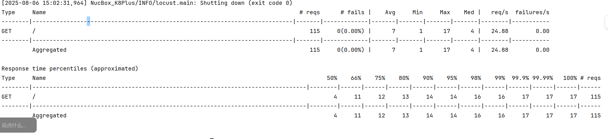

### 工具对比

工具	区别
JMeter	需要在 UI 界面上通过选择组件来“编写”脚本，模拟的负载是线程绑定的，意味着每个用户需要一个单独的线程。单台负载机可模拟的负载数有限。
Locust	通过编写简单易读的代码完成测试脚本，基于事件驱动，同样配置下，单台负载机可模拟的负载数远超 JMeter。

## 一、主流性能测试工具对比

| 工具       | 是否收费 | 语言   | 并发机制  | 单机并发能力 | 场景压测 | 分布式 |
| ---------- | -------- | ------ | --------- | ------------ | -------- | ------ |
| Locust     | 免费     | Python | 协程      | 高           | 支持     | 支持   |
| Jmeter     | 免费     | Java   | 线程      | 低           | 支持     | 支持   |
| Loadrunner | 收费     | C      | 进程/线程 | 低           | 支持     | 支持   |

## 二、 Locust性能测试工具介绍

简介
Locust是一款易于使用的分布式负载测试工具，一个locust节点就可以在一个进程中支持数千并发用户，基于事件，通过gevent使用轻量级执行单元。

线程和协程的区别
一个线程可包含多个协程
线程和进程是同步机制，协程是异步
线程的切换由操作系统调度，协程由用户自己进行调度
协程相较于线程更加轻量，资源消耗更低
为什么选择Locust？
基于协程，低成本实现更多并发
有第三方插件，易于扩展
支持分布式、高并发能力

## 三、创建一个登陆接口

如果有接口的用户可以忽略这一步

```python
from flask import Flask, make_response, request

app = Flask(__name__)

@app.route('/login', methods=['GET', 'POST'])
def login():
    # 尝试从GET请求中获取参数
    username = request.args.get('username', type=str)
    password = request.args.get('password', type=int)

    # 如果GET请求中没有参数，则尝试从POST请求中获取参数
    if username is None or password is None:
        username = request.form.get('username', type=str)
        password = request.form.get('password', type=int)

    # 验证用户名和密码
    if username == 'admin' and password == 123:
        response_data = {
            'code': 0,
            'msg': "OK",
            'data': {
                'test': f"{request.method.lower()}请求测试页面"
            }
        }
    else:
        response_data = {
            'code': 999,
            'data': f"无效的用户名或密码: {username} {password}"
        }

    return make_response(response_data)

if __name__ == '__main__':
    app.run(host='0.0.0.0', port=8080, debug=False, threaded=True)
```

当启动后我们可以看到一个url，这就我们要测试demo的接口。

通过运行，我们可以整理出一个接口文档如下：

flask接口文档

1. URL: http://127.0.0.1:8080
2. 接口路径: /login
3. 请求方法: GET 或 POST

请求参数

| 参数名   | 类型   | 必填 | 描述             |
| -------- | ------ | ---- | ---------------- |
| username | string | 是   | 用户名           |
| password | int    | 是   | 密码（整数类型） |

响应参数

| 参数名 | 类型   | 描述                                     |
| ------ | ------ | ---------------------------------------- |
| code   | int    | 响应状态码，0表示成功，999表示失败       |
| msg    | string | 响应消息，成功时为"OK"，失败时为错误信息 |
| data   | object | 成功时包含测试页面信息，失败时为错误描述 |

响应示例
get/post成功响应示例:

```json
{
    "code": 0,
    "msg": "OK",
    "data": {
        "test": "get请求测试页面"  # 或者"post请求测试页面"
    }
}
```

失败响应示例:

```json
{
    "code": 999,
    "data": "无效的用户名或密码: admin 123"
}
```

## 四、测试多个接口性能

### 4.1 导入必要模块

```
from locust import HttpUser, task, between
```

- HttpUser：Locust的核心类，用于模拟用户行为。
- task：装饰器，用于标记测试任务。
- between：用于定义任务之间的等待时间。

### 4.2 接口测试demo

```python
from locust import HttpUser, task, between
class MyUser(HttpUser):  # 1、在类中继承locust.HttpUser的子类，也就是创建这个子类
    # 添加locust给我们提供的函数between，里面1和2的值代表着每个task间隔1到2秒
    wait_time = between(1, 2)
    @task(1)  # 权重为1
    def test_login_get(self):
        resp = self.client.get('http://127.0.0.1:8080/login?username=admin&password=123')
        print(resp.json())
        assert resp.status_code == 200

    @task(2)  # 权重为2，执行频率更高
    def test_login_post(self):
        resp = self.client.post("http://127.0.0.1:8080/login", data={"username": "admin", "password": "123"})
        print(resp.json())
        assert resp.status_code == 200
```
- HttpUser：Locust的核心类，用于模拟用户行为。

- task：装饰器，用于标记测试任务。

- between：用于定义任务之间的等待时间。

- @task(1)：定义了一个权重为1的任务，权重决定了任务的执行频率。

- test_login_get：任务名称，这里模拟了一个GET请求，进行登录操作。

- self.client.get(…)：发送HTTP GET请求。

- assert resp.status_code == 200：断言响应状态码为200，确保请求成功。


同样，test_login_post任务的权重为2，意味着它的执行频率是test_login_get的两倍。这种权重设置可以准确模拟不同用户行为的真实分布。

### 4.3 启动测试用例

我们在控制台输入命令

```
locust -f 性能测试2.py --host=http://127.0.0.1:8080/
```

这样我们就得到了一个GUI的性能测试地址，我们打开链接

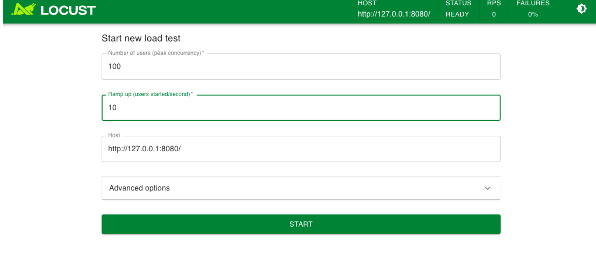

我们选择100个用户并发，每秒递增10个然后进行启动。

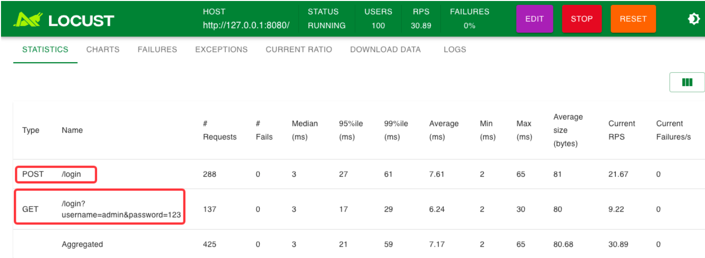

这样我们就能看到在一个性能测试的页面里面，有多个接口在进行测试。并且我们设置的@task(2) 的接口数量是远超与@task(1) 的。

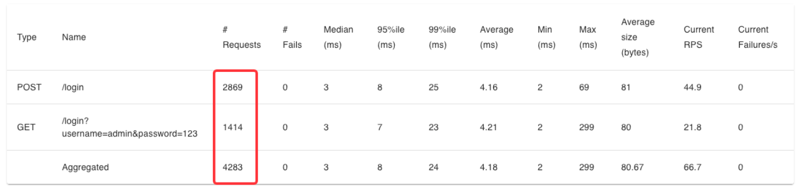

这就是我们要讲的，如何进行多接口压测。

## 五、深入解析Locust核心参数

为了充分发挥Locust的性能，我们需要深入理解其核心参数及其作用。以下是Locust中常用的一些关键参数及其详细解释。

### 5.1 用户类参数

#### 5.1.1 HttpUser与User

- HttpUser：适用于需要发送HTTP请求的性能测试场景，内置了self.client用于发送请求。
- User：基本用户类，不自带self.client，适用于非HTTP协议的测试。

根据具体需求选择合适的用户类，可以提高测试的灵活性和效率。

#### 5.1.2 tasks

```
tasks = {task1: weight1, task2: weight2, ...}
```

tasks属性定义了用户在测试过程中可以执行的多个任务及其权重。权重决定了任务被执行的概率和频率。例如：

```
tasks = {test_login_get: 1, test_login_post: 2}
```

表示test_login_post的执行频率是test_login_get的两倍。

#### 5.1.3 wait_time

```
wait_time = between(min_wait, max_wait)
```

wait_time设置了用户在执行两个任务之间的等待时间。Locust提供了多种等待时间函数：

- between(min, max)：在min和max秒之间随机等待。

- constant(seconds)：固定等待指定秒数。
- constant_pacing(seconds)：确保每个任务之间的间隔至少为指定秒数。

我们合理设置等待时间，可以更真实地模拟用户行为，避免过度负载。

### 5.2 命令行参数

Locust提供了丰富的命令行参数，用于灵活配置测试。

#### 5.2.1 -f / --locustfile

指定Locust的测试脚本文件。默认情况下，Locust会寻找locustfile.py。

```
locust -f 测试代码.py
```

#### 5.2.2 -u / --users

定义模拟的总用户数。例如，-u 100表示有100个并发用户。

```
locust  -f 测试代码.py -u 100
```

#### 5.2.3 -r / --spawn-rate

定义用户生成的速率，即每秒生成多少用户。例如，-r 10表示每秒生成10个用户。

```
locust  -f 测试代码.py -r 10
```

#### 5.2.4 --headless

以无头模式运行，不启动Web界面，适合自动化脚本和持续集成。

```
locust  -f 测试代码.py --headless -u 100 -r 10
```

#### 5.2.5 --run-time

定义测试的持续时间。例如，--run-time 1h表示测试持续1小时。

```
locust  -f 测试代码.py --headless -u 100 -r 10 --run-time 1h
```

#### 5.2.6 --csv

将测试结果保存为CSV文件，便于后续分析。

```
locust -f 测试代码.py -u 100 -r 10 --csv=performance_test
```

生成的文件将包括performance_test_stats.csv、performance_test_failures.csv等，详细记录了请求的响应时间、失败率等关键指标。

### 5.3 SLAs（服务水平协议）

服务水平协议（SLAs）是定义预期性能标准的重要工具。Locust支持特定指标设定SLAs和自动监控和警报。

```python
from locust import constant, HttpUser, task, between, events

class MyUser(HttpUser):
    wait_time = between(1, 2)

    @task
    def test_login_post(self):
        resp = self.client.post("http://127.0.0.1:8080/login", data={"username": "admin", "password": "123"})
        assert resp.status_code == 200
        # 设定响应时间不超过500ms
        if resp.elapsed.total_seconds() > 0.5:
            events.request_failure.fire(
                request_type="POST",
                name="test_login_post",
                response_time=resp.elapsed.total_seconds(),
                exception="Response time exceeded SLA"
            )
```

通过设定SLAs，就可以确保代码在规定的性能范围内运行，一旦超出，系统会自动记录失败事件，帮助你及时发现和解决问题。

springboot集成---docker k8s    进行自动化测试